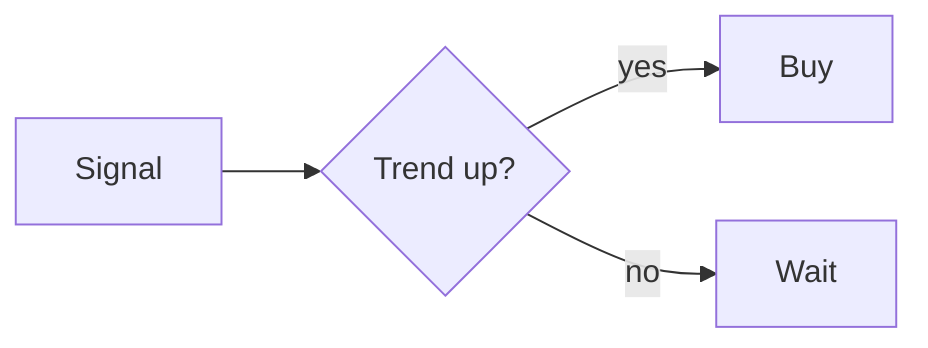

# Authoring spec — Quant Education (three-audiences)

Every article lives in `app/content/<category>/<slug>/` as **three markdown files**:

| File | Audience | Voice |
|------|----------|-------|
| `kid.md` | An **11-year-old**. | Playful, concrete, story-first. A comic strip carries the idea. |
| `standard.md` | A motivated adult / undergrad. | The real article, clarified, with charts + diagrams. |
| `quant.md` | **Jim Simons level** — a PhD quant. | Rigorous, measure-theoretic where relevant, derivations + references. |

All three teach the **same core idea** at very different altitudes. Keep the math faithful.

## Special blocks (rendered by `renderer.py`)

Use normal Markdown + LaTeX (`$inline$`, `$$display$$`) freely. Four fenced blocks are special:

### 1. Comic strip (kid tier — REQUIRED, 4–10 panels)
````
```comic
{
  "title": "The $100 Lemonade Stand",
  "panels": [
    {"emoji": "🍋", "caption": "You have $100 to run a lemonade stand.", "bubble": "Let's go!"},
    {"emoji": "💸", "caption": "You spend ALL of it on lemons. One rainy day = broke."},
    {"emoji": "🧠", "caption": "Smart move: risk only a few dollars per day."}
  ]
}
```
````
- 4–10 panels. `emoji` (1 big emoji), `caption` (one short sentence), optional `bubble` (a few words).
- Must be valid JSON. Tell a **story** that lands the concept.

### 2. Mermaid diagrams (any tier)
````

````
Optional `height`: ```` ```mermaid height=520 ````. Great for decision trees, flows, timelines, probability trees.

### 3. Charts (standard + quant tiers) — call the shared catalog
````
```chart
kelly_curve(p=0.6, b=1)
```
````
Only names from `charts.py::CHARTS` are allowed (literal args only). **Available charts:**
- Probability: `normal_vs_fat_tail(nu=2)`, `binomial_pmf(n=10,p=0.55)`, `poisson_pmf(lam=3)`, `pareto_pdf(alpha=1.5)`, `frequentist_convergence()`, `bayes_update(prior=(0.5,0.5),likelihood=(0.5,0.7),labels=("Bag 1","Bag 2"))`, `beta_update(prior_a=2,prior_b=2,heads=8,tails=2)`
- Sizing/Kelly: `kelly_curve(p,b)`, `kelly_wealth_paths(p,b)`, `portfolio_heat(risks=(1,1.5,0.8,1.2,2))`
- Trend: `ema_crossover(fast=50,slow=200)`, `trend_equity_curve()`, `win_loss_hist()`, `diversification_smoothing()`
- Economics: `pe_vs_forward_return()`, `price_value_convergence()`, `affordability_gap()`
- ML: `overfitting_curve()`, `walk_forward_cv()`, `confusion_matrix_demo()`
- ESG: `esg_rating_divergence()`, `esg_aum_growth()`

If you need a diagram not in this list, use **mermaid** or **ascii** instead. Don't invent chart names.

### 4. ASCII diagrams (any tier)
````
```ascii
 price
   |        /\      <- exit on trailing stop
   |   ____/  \___
   |  /
   +-------------------> time
```
````

## Content rules
- **kid.md**: ≥1 comic (the centerpiece). Everyday analogies (allowance, video games, pizza, weather). No jargon without a plain-word gloss. ~250–450 words around the comic. May add ONE simple mermaid or ascii. No heavy formulas.
- **standard.md**: keep/clarify the source article's substance. Add **2–4 charts**, **1–2 mermaid** diagrams, and where useful an ascii sketch. Keep LaTeX the source had. End with a short "Key takeaways" list.
- **quant.md**: go deep. Formal definitions, at least one **derivation/proof**, estimators, assumptions & where they break (e.g. fat tails vs. Gaussian, i.i.d. failures, look-ahead bias), and a short **References / further reading** list (Kelly 1956, Thorp, Merton, López de Prado, Marks memos, etc.). Use charts (esp. `*_wealth_paths`, `normal_vs_fat_tail`, `overfitting_curve`) and mermaid where they clarify. Rigor over length, but typically the richest of the three.
- Start each file with a single `#` H1 title. Do NOT include marketing copy. Keep the Acadia tone educational.
- This is educational content, not investment advice.
