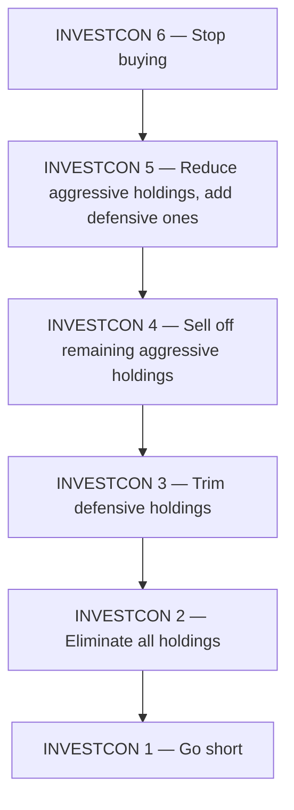

# The Calculus of Value

This is a summary of Howard Marks' memo *The Calculus of Value* (Oaktree Capital, August 13, 2025), which updates his earlier *On Bubble Watch* (January 2025). Marks lays out a disciplined, rule-governed way to think about the relationship between what you **pay** for an asset and what it is actually **worth**.

## Price is not value

Marks starts by separating two ideas that are easy to conflate:

- **Value** — what an asset is actually worth at a point in time. It has no single objective number, but Marks anchors it in **fundamentals**: current and future earning power, the quality of management, and the strength of the balance sheet.
- **Price** — the amount a buyer is willing to pay to own it right now.

The chain runs **fundamentals → earning power → value**. Tangible assets (buildings, inventory) and intangible ones (reputation, know-how) combine into a company whose earning power is usually greater than the sum of its parts. Value flows from that earning power.

The relationship between price and value has a name: **valuation**.

## Where price comes from: sentiment and the discount rate

Marks recalls the business-school rule that the right price for an asset is the **discounted present value of its future cash flows** — an asset is worth what its future earnings are worth today, once you adjust for time and risk.

In practice, though, the discount rate people apply is governed less by cold arithmetic and more by **investor sentiment** — the subjective mood about what those future earnings are really worth. When investors are broadly optimistic, they discount the future gently, and prices rise. When the mood turns negative, they discount harshly, and prices fall. Sentiment, not fundamentals, drives price in the short run.

## Value as a magnet

Marks' central image: **value exerts a magnetic pull on price.**

- If price sits **above** value, future price movements tend to be lower — the asset is expensive.
- If price sits **below** value, future movements tend to be higher — the asset is cheap.

A price that runs astronomically above value is a **bubble**; a dramatic collapse below value is a **crash**. Over the long run it is reasonable to expect price and value to **converge** — but Marks warns explicitly against betting that convergence will happen *soon*. Sentiment is not rational, and it can stay stretched far longer than you can stay solvent.

```chart
price_value_convergence()
```

The green line is intrinsic value drifting up with fundamentals; the blue line is price, pushed around by sentiment. Red zones are over-valuation (bubbles), green zones under-valuation (bargains). Price wanders, but the magnet keeps pulling it back.

## The two sources of return

Returns, Marks notes, come from two places:

1. **A change in fundamentals** — the business genuinely earns more (real growth).
2. **A change in valuation** — the asset simply becomes more (or less) popular, so the multiple people pay expands or contracts.

Growth (1) is durable. Re-rating (2) is borrowed from sentiment and can be handed back. Marks summarizes the discipline by saying a good investment is one where "the price is right for what the value turns out to be" (Marks, 2025).

## Measuring valuation: the P/E ratio

How do equity investors judge whether today's price is fair? The workhorse gauge is the **price-to-earnings (P/E) ratio** — share price divided by earnings per share. It can be computed for a single stock, a basket, or an ETF, and compared across assets to flag whether something looks rich, cheap, or fair.

For context, Marks points out that the **S&P 500's P/E was around 23** late in 2024 — historically well above average. A high starting multiple is precisely what makes him cautious, because valuation has a probabilistic, predictive link to future returns:

> **High valuation today tends to presage low returns tomorrow — and vice versa.**

```chart
pe_vs_forward_return()
```

Each dot is a starting valuation paired with the annual return over the following decade. The downward best-fit line captures the empirical regularity: buy when multiples are high and you inherit weak forward returns; buy when they are low and you inherit strong ones. The effect is a tendency across many observations, **not** a short-term timing signal.

## The INVESTCON readiness ladder

Marks closes with a framework he calls **INVESTCON** — modeled on the military's DEFCON alert levels. It maps a market's perceived threat level to an escalating set of defensive actions. Lower numbers mean higher danger and more drastic moves.



The point is not a mechanical trigger but a **graduated posture**: the richer valuations get, the further down the ladder (toward lower numbers) a cautious investor should move.

## Key takeaways

- **Price ≠ value.** Value is anchored in fundamentals and earning power; price is set by what buyers will pay today.
- **Sentiment drives short-term price** by moving the effective discount rate — optimism inflates prices, fear deflates them.
- **Value is a magnet.** Price oscillates around value and tends to converge over the long run — but not on a schedule you can rely on.
- **Returns split** into fundamental growth (durable) and valuation re-rating (borrowed from sentiment).
- **The P/E ratio gauges valuation.** The S&P 500 near 23 is historically rich, and high starting multiples statistically presage lower forward returns.
- **INVESTCON** offers a graduated defensive posture that escalates as valuations stretch.
- This is educational content summarizing Marks' memo, not investment advice.
