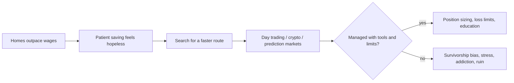

# Day Trading and the Affordability Crisis

## Introduction

Housing has drifted out of reach for a generation, and that squeeze is quietly reshaping how young people invest. With homeownership feeling increasingly unattainable, many millennials and Gen Z are drawn toward high-risk strategies — day trading, cryptocurrency, and prediction markets — as alternative routes to financial security. This article looks at *why* that shift is happening, the real double-edged nature of it, and what a responsible response looks like. It is educational, not investment advice.

> **Source**: This discussion is prompted by a Boston Globe opinion piece (December 2025) observing that young people priced out of homes are turning to crypto and day trading. The framing below is our own; we paraphrase rather than reproduce the original.

## The affordability squeeze

For decades, home prices have compounded faster than wages. A stylized picture of the two indices makes the divergence obvious:

```chart
affordability_gap()
```

When the two lines pull apart like this, the lived consequence is arithmetic:

- Down payments require years — sometimes decades — of aggressive saving.
- Mortgage payments consume an unsustainable share of income in many metros.
- The old advice ("save 20% for a down payment, invest conservatively, be patient") stops feeling like a plan and starts feeling like a closed door.

If steady saving no longer visibly closes the gap, the *expected payoff* of patience drops — and higher-variance bets start to look rational by comparison. That is the psychological engine behind the shift.

## Why day trading, crypto, and prediction markets appeal

These three look different but scratch the same itch:

- **Low barriers.** Zero-commission apps let anyone start with a few hundred dollars.
- **Speed.** The dream of quick gains stands in stark contrast to decades of slow saving.
- **Gamified, social, 24/7.** Crypto never closes; prediction markets (Polymarket, Kalshi, PredictIt) turn opinions into positions; forums supply camaraderie and a sense of edge.
- **Cultural fit.** Digital-native assets for a digital-native generation, plus skepticism toward traditional institutions.

The causal chain is worth drawing out, because the last step is the important one:



## The double-edged sword

### The optimistic case

There is a genuine upside, and pretending otherwise is dishonest:

- **Financial literacy.** Skin in the game forces people to learn about markets, risk, and economics.
- **Real success stories exist.** They are rare, but they are real and can be life-changing.
- **Access when other doors are shut.** For some, it is the only visible on-ramp to risk-taking and wealth.

### The real risks

The downside is larger and less visible, which is exactly what makes it dangerous:

1. **Survivorship bias.** Winners post screenshots; losers go quiet. The *visible* track record is wildly better than the *actual* one.
2. **Competing against professionals.** A retail trader on a phone is on the other side of institutional desks, market makers, and algorithms with faster data and lower costs.
3. **Psychological toll.** Volatility manufactures stress and anxiety, which in turn drives worse decisions — revenge trading, oversizing, chasing.
4. **Addiction potential.** Fast feedback loops and intermittent rewards are the same design that makes slot machines compulsive. Trading can tip from investing into a behavioral addiction.
5. **Opportunity cost.** Capital and attention spent on negative-expectation bets is capital not compounding in something stable.

The honest summary: the same volatility that makes a life-changing win *possible* makes a devastating loss *probable*. For most retail day traders, the net expected outcome after fees and taxes is negative — a point the quant tier makes precisely.

## A responsible path: the barbell

If someone chooses to speculate anyway, the goal is to *survive* it. A **barbell** structure — a large safe core plus a small, strictly capped speculative sleeve — keeps a bad outcome in the speculative sleeve from touching the essentials.

```ascii
  BARBELL ALLOCATION
  [========== 70-80% STABLE CORE ==========]----[== 20-30% SPECULATIVE ==]
   index funds, cash, bonds                       crypto, day trades, bets
   compounding, low-drama, rarely lost            small, capped, "can lose it all"
```

Three disciplines make the barbell actually work:

- **Position sizing.** Cap the loss on any single trade at a small fraction (often 1–2%) of the speculative sleeve — see the *Position Sizing* article. Sizing, not stock-picking, is what keeps a bad streak from becoming a knockout.
- **Loss limits.** Set a maximum you will lose per day/week/month, and stop when you hit it. Decide it in advance, when you are calm.
- **Ring-fence the essentials.** Keep an emergency fund and never speculate with rent, tuition, or debt-payment money. The speculative sleeve should be money whose total loss changes nothing important.

Tools — position-size calculators, portfolio-heat monitors, backtests, automated stops — help *only* if they are used to impose discipline rather than to amplify conviction. Technology can quantify risk and buffer emotion, but it cannot eliminate uncertainty, replace discipline, or predict the future.

## Key takeaways

- The housing affordability gap lowers the perceived payoff of patient saving, nudging young people toward high-variance strategies.
- Day trading, crypto, and prediction markets share one appeal (fast, accessible, social) and one hazard (odds stacked against retail).
- Survivorship bias makes these strategies look far more successful than they are; addiction risk and psychological toll are underrated.
- A barbell — a large stable core plus a small, capped speculative sleeve — lets you participate without betting your future.
- Position sizing, pre-set loss limits, and a ring-fenced emergency fund are the difference between speculation and ruin.
- This is educational material, not investment advice.
