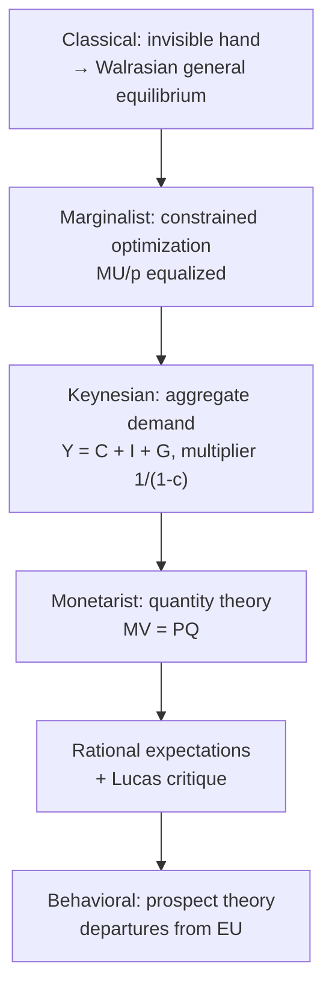

# The History of Economic Thought: A Comparison of Analytic Cores

The schools of economic thought are usually told as a narrative of personalities and crises. It is more instructive to strip each to its **formal core** — the object it optimizes, the equilibrium concept it invokes, and the assumption that, when it fails, hands the next school its opening. Read this way, the history is a sequence of increasingly explicit models of how agents form expectations and clear markets.





## 1. The invisible hand as general equilibrium

Smith's "invisible hand" (1776) is a literary claim; its rigorous content is the theory of **competitive general equilibrium** completed by Walras (1874) and Arrow–Debreu (1954). Let there be $\ell$ goods and agents with excess-demand function $z(p): \mathbb{R}^\ell_{++} \to \mathbb{R}^\ell$. A **Walrasian equilibrium** is a price vector $p^\star$ at which every agent maximizes utility subject to their budget and all markets clear:

$$z(p^\star) = 0.$$

Two structural facts organize the whole classical worldview:

- **Walras's law:** $p \cdot z(p) = 0$ for all $p$ (budget constraints bind agent-by-agent), so only $\ell - 1$ markets are independent and prices are determined up to normalization.
- **Existence** follows from a fixed-point argument (Brouwer/Kakutani) applied to the price-adjustment map on the simplex, given continuity and Walras's law.

The normative payload — the reason "self-interest promotes the general welfare" is more than rhetoric — is the **First Welfare Theorem**: every competitive equilibrium is Pareto efficient. The **Second Welfare Theorem** adds that any Pareto-efficient allocation is supportable as an equilibrium under suitable lump-sum transfers, cleanly separating efficiency from distribution. Say's Law (supply creates its own demand) is the classical assertion that $z(p)=0$ is reached quickly, so involuntary unemployment is disequilibrium that arbitrage erases. Marx's critique attacks the *distribution* the model treats as given: with a labor theory of value, equilibrium prices conceal extraction of **surplus value**, and the "efficient" allocation is not welfare-neutral.

## 2. Marginalism as constrained optimization

The 1870s revolution (Jevons, Menger, Walras; systematized by Marshall, 1890) recast value as a **first-order condition**. The consumer solves

$$\max_{x} \; U(x) \quad \text{s.t.} \quad p \cdot x = m, \qquad \mathcal{L} = U(x) - \lambda\,(p\cdot x - m),$$

with stationarity $\partial U/\partial x_i = \lambda p_i$ for every good, i.e. the **equimarginal principle**

$$\frac{MU_1}{p_1} = \frac{MU_2}{p_2} = \cdots = \lambda, \qquad \text{equivalently} \quad MRS_{ij} = \frac{MU_i}{MU_j} = \frac{p_i}{p_j}.$$

The multiplier $\lambda$ is the shadow price of the budget — the marginal utility of wealth. Firms mirror this: under perfect competition profit maximization gives $MC = MR = p$. Value is thus *marginal*, resolving the water–diamond paradox: price tracks marginal, not total, utility. Aggregating these individual optima produces the market-clearing intersection.


```chart
supply_demand()
```


## 3. Keynesian aggregate demand and the multiplier

Keynes (1936) denied that $z(p)=0$ is reached promptly. If nominal wages and prices are sticky, output — not just price — adjusts, and the economy can rest at a **demand-determined** equilibrium below full employment. Take a closed economy with output identity

$$Y = C + I + G, \qquad C = a + c\,Y, \quad c \equiv \text{MPC} \in (0,1),$$

where $c$ is the marginal propensity to consume. Substituting the consumption function and solving:

$$Y = a + cY + I + G \;\Longrightarrow\; Y(1 - c) = a + I + G \;\Longrightarrow\; Y = \frac{a + I + G}{1 - c}.$$

Differentiating with respect to autonomous spending gives the **multiplier**:

$$\frac{\partial Y}{\partial G} = \frac{1}{1 - c} = \frac{1}{1 - \text{MPC}} > 1 \;\Longrightarrow\; \Delta Y = \frac{1}{1 - \text{MPC}}\,\Delta G.$$

The same result appears round-by-round, which is the economic intuition: an injection $\Delta G$ becomes income, of which a fraction $c$ is re-spent, then $c^2$, and so on —

$$\Delta Y = \Delta G\,(1 + c + c^2 + \cdots) = \Delta G \sum_{n=0}^{\infty} c^n = \frac{\Delta G}{1 - c},$$

the geometric series converging precisely because $|c| < 1$. With proportional taxation $T = tY$ so that $C = a + c(Y - T)$, the multiplier shrinks to $1/[\,1 - c(1-t)\,]$ — taxes leak spending out of the circular flow. This is the analytic basis for countercyclical fiscal policy: near a demand-driven trough, $\partial Y/\partial G$ is large.


```chart
business_cycle()
```


## 4. Monetarism and the quantity theory

Friedman's monetarism formalizes inflation through the **equation of exchange**,

$$M V = P Q,$$

with $M$ money stock, $V$ velocity, $P$ the price level, $Q$ real output. As written it is an identity (it *defines* $V \equiv PQ/M$); it becomes a *theory* under two behavioral assumptions — $V$ is stable (a function of institutions, not of $M$) and $Q$ is pinned down by real supply-side factors. Log-differentiating in time,

$$\ln M + \ln V = \ln P + \ln Q \;\Longrightarrow\; \frac{\dot M}{M} + \frac{\dot V}{V} = \frac{\dot P}{P} + \frac{\dot Q}{Q},$$

and with $\dot V/V \approx 0$ the inflation rate is

$$\pi = \frac{\dot P}{P} \approx \frac{\dot M}{M} - \frac{\dot Q}{Q}.$$

Hence "inflation is always and everywhere a monetary phenomenon": sustained $\pi$ requires money growth outpacing real growth.


```chart
money_supply_inflation()
```


Friedman's second contribution is the **expectations-augmented Phillips curve** and the **natural rate** $u^\star$:

$$\pi = \pi^e - \beta\,(u - u^\star) + \varepsilon, \qquad \beta > 0.$$

Only the *surprise* $\pi - \pi^e$ moves unemployment away from $u^\star$. Once expectations adjust ($\pi^e \to \pi$), the long-run Phillips curve is vertical at $u^\star$, so there is no permanent inflation–unemployment tradeoff to exploit. His policy conclusion — a fixed money-growth **rule** rather than discretion — follows directly: discretionary fine-tuning injects the very surprises that destabilize.

## 5. Rational expectations and the Lucas critique

Friedman's $\pi^e$ was adaptive. Muth (1961) and Lucas closed the model by making expectations **rational** — equal to the model's own conditional expectation given the information set $\mathcal{I}_t$:

$$\pi^e_t = \mathbb{E}[\pi_t \mid \mathcal{I}_t], \qquad \pi_t = \mathbb{E}[\pi_t \mid \mathcal{I}_t] + \eta_t, \quad \mathbb{E}[\eta_t \mid \mathcal{I}_t] = 0,$$

i.e. agents make no *systematic* forecast errors. The immediate consequence is **policy-ineffectiveness**: if agents anticipate the systematic component of monetary policy, only unanticipated money $\eta_t$ has real effects, and a predictable rule cannot buy a lower average $u$.

The deeper methodological blow is the **Lucas critique (1976)**. Reduced-form parameters estimated from historical data — say, a Phillips slope — are **not structural**; they are convolutions of agents' optimal decision rules with the *policy regime* in force during the sample. Schematically, if optimal behavior is a rule $d(\theta;\,\mathcal{P})$ depending on deep preferences $\theta$ and the policy rule $\mathcal{P}$, then an econometric relationship fitted under $\mathcal{P}_0$ captures $d(\theta;\mathcal{P}_0)$. Using it to forecast the effect of switching to $\mathcal{P}_1$ is invalid, because the "parameters" move when $\mathcal{P}$ moves:

$$\frac{\partial\,(\text{estimated relation})}{\partial \mathcal{P}} \neq 0.$$

This is why policy evaluation demands **microfounded**, expectations-consistent models (the DSGE program) rather than the large Keynesian systems of the 1960s — it invalidates exactly the fixed tradeoffs those systems were used to exploit.

## 6. Behavioral departures from rationality

Every school above is built on an optimizing agent maximizing $\mathbb{E}[u]$. Kahneman and Tversky (1979) showed the axioms fail systematically. **Prospect theory** replaces expected utility

$$U = \sum_i p_i\, u(x_i) \qquad\longrightarrow\qquad V = \sum_i \pi(p_i)\, v(x_i - r),$$

with three empirically-forced modifications:

- **Reference dependence:** value $v$ is defined over *changes* relative to a reference point $r$, not final wealth.
- **Loss aversion and diminishing sensitivity:** $v$ is concave for gains, convex for losses, with a kink at the origin, $-v(-x) > v(x)$ and $\lambda \equiv v'(0^-)/v'(0^+) \approx 2.25$ — losses hurt roughly twice as much as equal gains please.
- **Probability weighting:** $\pi(p) \neq p$ overweights small probabilities and underweights moderate-to-large ones, generating simultaneous demand for lottery tickets and insurance.

These violate the independence axiom (the Allais paradox) and predict the endowment effect, the disposition effect, framing reversals, and anchoring. Behaviorally, Keynes's "animal spirits" become a specification of $r$, $\lambda$, and $\pi(\cdot)$ rather than a residual — and the rational-agent bedrock under general equilibrium, marginalism, monetarism, and rational expectations acquires an empirical asterisk.

## 7. Synthesis: which assumption breaks where

| School | Optimized object / core equation | Breaks when |
|---|---|---|
| Classical / GE | $z(p^\star)=0$, welfare theorems | prices/wages sticky; $z=0$ reached slowly (Depression) |
| Marginalist | $MU_i/p_i = \lambda$ | preferences unstable or reference-dependent |
| Keynesian | $Y=(a+I+G)/(1-c)$, multiplier $1/(1-c)$ | supply shocks / stagflation; Lucas critique |
| Monetarist | $MV=PQ$, vertical long-run Phillips | $V$ unstable (money-demand shifts) |
| Rational exp. | $\pi^e=\mathbb{E}[\pi\mid\mathcal{I}]$ | bounded rationality, learning frictions |
| Behavioral | $V=\sum\pi(p_i)v(x_i-r)$ | needs the others for aggregate structure |

Modern macro is an explicit **synthesis**: a neoclassical/marginalist microfounded core, nominal rigidities that revive the short-run Keynesian multiplier, a monetary-policy rule disciplined by rational expectations and the Lucas critique, and a growing behavioral layer on expectation formation. No single core survives every crisis; each is the linearization that the next regime shift exposes.

## References & further reading

- Smith, A. (1776). *An Inquiry into the Nature and Causes of the Wealth of Nations.*
- Marx, K. (1867). *Das Kapital, Vol. I.*
- Walras, L. (1874). *Éléments d'économie politique pure*; Marshall, A. (1890). *Principles of Economics.*
- Hayek, F. A. (1945). *The Use of Knowledge in Society.* American Economic Review.
- Arrow, K. J. & Debreu, G. (1954). *Existence of an Equilibrium for a Competitive Economy.* Econometrica.
- Keynes, J. M. (1936). *The General Theory of Employment, Interest and Money.*
- Muth, J. F. (1961). *Rational Expectations and the Theory of Price Movements.* Econometrica.
- Friedman, M. (1968). *The Role of Monetary Policy.* American Economic Review; Friedman & Schwartz (1963). *A Monetary History of the United States.*
- Lucas, R. E. (1976). *Econometric Policy Evaluation: A Critique.* Carnegie-Rochester Conf. Series.
- Kahneman, D. & Tversky, A. (1979). *Prospect Theory: An Analysis of Decision under Risk.* Econometrica.
