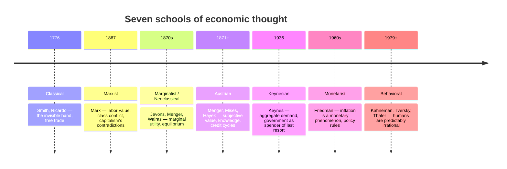
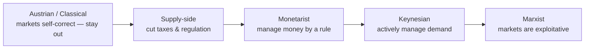

# The History of Economic Thought

## Introduction

For as long as there have been markets, economists have argued over the same handful of questions: How do economies grow? Why do recessions happen? And what — if anything — should the government do about it? Each major **school of thought** emerged as a response to the failures of the one before it and to the crises of its own era. Learning them in order is the fastest way to understand why today's policy debates sound the way they do: almost every argument on the news is a descendant of one of these traditions.

The through-line is a single spectrum — how much you trust **free markets** to sort themselves out versus how much you want the **government to intervene**.





## 1. Classical economics — the invisible hand

The story starts in **1776**, when **Adam Smith** published *The Wealth of Nations*, usually treated as the founding document of modern economics. Smith — along with **David Ricardo**, **John Stuart Mill**, and **Thomas Malthus** — built a framework around one radical idea: free markets guided by self-interest and competition allocate resources more efficiently than any central authority could.

Individuals chasing their own gain, Smith argued, unintentionally promote the welfare of society as a whole, as if led by an **invisible hand**. Prices, wages, and interest rates adjust naturally to balance supply and demand, so markets tend toward equilibrium *without* government steering.

A consequence: classical economists saw unemployment as temporary. If joblessness rose, wages would fall, firms would hire, and full employment would return. This connected to **Say's Law** — production creates enough income to buy what's produced — implying a general glut is unlikely. Ricardo extended the logic to trade with **comparative advantage**: nations gain from specializing and trading even if one is better at making *everything*. That argument still anchors the case for free trade today.

**View of government:** stay out of the way. The market self-corrects.

## 2. Marxist economics — the critique from the left

Writing a century later, **Karl Marx** (*Das Kapital*, 1867) accepted much of the classical machinery but drew the opposite conclusion. In his **labor theory of value**, the worth of a good comes from the labor embodied in it; profit arises because workers are paid less than the value they produce, a gap he called **surplus value**. He predicted capitalism would swing through ever-deeper crises, concentrate ownership, and provoke **class conflict** between owners of capital and labor.

Marx's forecasts of capitalism's collapse did not play out as written, but his emphasis on inequality, power, and instability left a permanent mark — and his framing still shapes debates about who captures the gains from growth.

**View of government:** the state ultimately reflects class power; markets are exploitative, not self-correcting.

## 3. The marginalist (neoclassical) revolution

In the **1870s**, three economists working independently — **William Stanley Jevons**, **Carl Menger**, and **Léon Walras** — triggered the **marginalist revolution**. Value, they showed, isn't about total usefulness or embodied labor; it's set at the **margin**. Water is vital yet cheap because the *next* glass is abundant; diamonds are useless yet dear because the *next* one is scarce.

This reframed economics as **optimization**: consumers maximize utility and firms maximize profit, and prices emerge where the marginal benefit of one more unit meets its marginal cost. That is exactly where supply and demand cross.


```chart
supply_demand()
```


**Alfred Marshall** later fused supply and demand into the scissors diagram every student now learns, and Walras formalized **general equilibrium** — the idea that *all* markets can clear at once. This "neoclassical" toolkit remains the core of mainstream microeconomics.

**View of government:** mostly hands-off, but with room to correct specific market failures (monopoly, externalities).

## 4. The Austrian school — knowledge and the credit cycle

Sharing marginalist roots (Menger again) but distrustful of its mathematics, the **Austrian school** — **Ludwig von Mises** and **Friedrich Hayek** — stressed that value is **subjective** and that the economy's most important information is *dispersed* among millions of people. In Hayek's famous argument, no central planner can gather what markets discover through prices, so central planning is doomed to fail.

Austrians also blamed booms and busts on **artificially cheap credit**: when central banks push interest rates too low, they lure businesses into investments that can't be sustained, and the bust is the painful correction.

**View of government:** deeply skeptical — intervention distorts the price signals the economy runs on.

## 5. Keynesian economics — demand and the multiplier

The **Great Depression** broke the classical story. U.S. unemployment hit **25%** and *stayed* there for years even as wages and prices fell. Markets were supposed to self-correct; they didn't.

In **1936**, **John Maynard Keynes** answered with *The General Theory of Employment, Interest and Money*. His central claim: **aggregate demand** — total spending — determines output and employment in the short run. When households and firms lose confidence and cut spending *at the same time*, nothing automatically forces them back. Falling incomes cut demand further, and the economy can settle into a long slump.


```chart
business_cycle()
```


Keynes's prescription: when private demand collapses, the government should act as a **spender of last resort**. Deficit spending and tax cuts inject demand directly, and the **multiplier effect** amplifies it — one dollar of spending becomes someone's income, part of which they spend again. He also coined **"animal spirits"** for the moods and confidence that drive real decisions. Keynesianism was the dominant policy framework across the West from the 1940s into the 1970s, and it still governs how governments respond to recessions.

**View of government:** an active manager of demand; deficit spending in downturns is a feature, not a bug.

## 6. Monetarism — inflation is always monetary

In the **1970s**, **stagflation** — high inflation *and* high unemployment together — embarrassed simple Keynesian models. **Milton Friedman** had been building the alternative for years: **monetarism**. Its core claim is that **inflation is a monetary phenomenon** — sustained inflation comes from the money supply growing faster than output.


```chart
money_supply_inflation()
```


Friedman argued that many booms and busts trace back to central banks mismanaging the money supply, and he favored a **rules-based** approach: grow the money supply at a steady, predictable rate rather than fiddling constantly. He also introduced the **natural rate of unemployment** — pushing joblessness permanently below it just accelerates inflation without lasting gains. Monetarism's influence peaked when Fed chairman **Paul Volcker** sharply slowed money growth in the early 1980s, triggering back-to-back recessions but breaking inflation that had neared 12%.

**View of government:** limited but real — manage money by a stable rule, not by discretion.

## 7. Supply-side economics — incentives and the Laffer Curve

Emerging alongside monetarism in the late 1970s, **supply-side economics** shared the skepticism of Keynes but located the real constraint on growth in **high taxes and heavy regulation**. Lower the barriers — cut marginal tax rates, deregulate, free up trade — and people work, save, and invest more, expanding aggregate *supply*. Economist **Arthur Laffer** popularized the **Laffer Curve**: beyond some tax rate, raising rates *reduces* revenue by discouraging activity, so cuts could in principle pay for themselves. These ideas shaped **Reagan's** 1980s tax cuts. Most economists accept that incentives matter, but the strong claim that tax cuts fully self-finance is not well supported by the evidence.

**View of government:** get out of the way of producers; low taxes and light regulation drive growth.

## 8. Behavioral economics — the return of the human

Every school above assumes people are broadly **rational**. Starting in **1979**, psychologists **Daniel Kahneman** and **Amos Tversky** — later joined by **Richard Thaler** — showed they systematically aren't. People feel losses about twice as strongly as equivalent gains (**loss aversion**), overweight small probabilities, anchor on irrelevant numbers, and follow the crowd. Behavioral economics doesn't replace the others so much as add a corrective lens: it explains bubbles, panics, and the "animal spirits" Keynes only named.

**View of government:** a role for gentle **"nudges"** that steer predictable mistakes toward better outcomes.

## Comparing the schools

The sharpest divide is the **role of government**. It's easiest to see as a spectrum.





A few clean contrasts:

- **Where growth comes from.** Classicals, Austrians, and supply-siders locate growth on the **supply side** — free markets, incentives, productive capacity. Keynesians emphasize the **demand side**. Monetarists say long-run growth needs a **stable monetary environment**.
- **Short run vs. long run.** Classicals are long-run optimists: markets always eventually clear. Keynes shot back, *"In the long run, we are all dead,"* insisting short-run failures are costly and need action *now*.
- **Are people rational?** Every classical-through-monetarist school assumes yes; behavioral economics says predictably no.


```ascii
  MORE FREE MARKET  <───────────────────────────────►  MORE INTERVENTION
   Austrian   Classical   Supply-side   Monetarist   Keynesian   Marxist
```


## Which theory is right?

Each contributed something durable, and each has limits. Classical economics built trade and price theory but couldn't explain the Depression. Keynesianism explained recessions but stumbled on 1970s inflation. Monetarism restored the primacy of price stability, but strict money-supply targeting proved hard to run. Supply-side correctly flagged incentives but oversold self-financing tax cuts. Marxism spotlighted inequality and instability but mispredicted capitalism's path. Behavioral economics grounded the others in real psychology.

**Modern macroeconomics is a synthesis.** Central banks obsess over inflation and credibility (monetarism), governments deploy fiscal stimulus in deep recessions (Keynes), the microeconomic core stays neoclassical (marginalism), and policymakers keep arguing about taxes and incentives (supply-side) — now with a behavioral asterisk on the assumption that anyone is fully rational.

## Key takeaways

- The schools form a **chronological conversation**: each answered the previous one's failure and its own era's crisis.
- The deepest fault line is the **role of government** — from Austrian "stay out" to Marxist "markets exploit," with monetarists and Keynesians in between.
- **Supply-side vs. demand-side** is the second axis: classicals, Austrians, and supply-siders back supply; Keynesians back demand; monetarists back stable money.
- **Classical/marginalist optimism** ("markets clear in the long run") clashes with **Keynesian urgency** ("the short run is where we live").
- **Behavioral economics** reintroduced the human, explaining the bubbles and panics the rational models glossed over.
- Today's policy is a **blend**, not a single doctrine — which is exactly why the debates never fully end.
