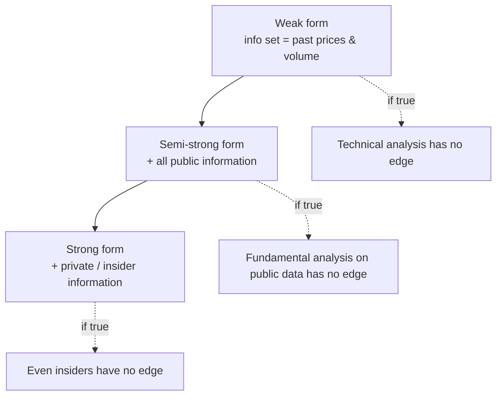
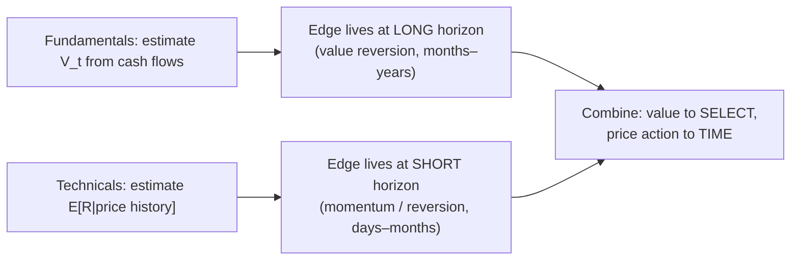

# Fundamental vs. Technical Analysis: Two Estimators of Price

Both schools are, formally, attempts to forecast the same object — the future price path of an asset — but they condition on **different information sets** and rest on **different economic assumptions**. Fundamental analysis estimates a latent *intrinsic value* from cash-flow primitives; technical analysis estimates a *conditional expectation of returns* from the price history itself. The efficient-market hypothesis (EMH) is the pivot that decides which, if either, can carry an edge.

## 1. Fundamentals as valuation: intrinsic value from cash flows

Let $\mathcal{F}_t^{\text{all}}$ denote all information (fundamental, macro, sentiment) available at time $t$. Fundamental analysis posits a value functional

$$V_t = \sum_{k=1}^{\infty} \frac{\mathbb{E}\!\left[\text{FCF}_{t+k}\mid \mathcal{F}_t^{\text{all}}\right]}{(1+r)^{k}},$$

the present value of expected free cash flows discounted at the risk-adjusted rate $r$. This is the discounted-cash-flow (DCF) model; multiples (P/E, EV/EBITDA, P/B) are compressed proxies for it. Under a constant growth rate $g < r$ (the Gordon model),

$$V_t = \sum_{k=1}^{\infty} \frac{\text{FCF}_{t}(1+g)^{k}}{(1+r)^{k}} = \text{FCF}_{t}\,\frac{1+g}{r-g},\qquad\text{equivalently}\qquad \frac{P}{E}\Big|_{\text{fair}} = \frac{1}{r-g}.$$

So a "high multiple" is not automatically expensive: it is the market pricing in a small $r-g$, i.e. high growth or low risk. The forward discounting is what the DCF bars below make concrete — distant cash flows collapse toward the present.


```chart
dcf_discounting(r=0.10, g=0.05)
```


The fundamental *thesis* is a mean-reversion claim about the pricing error $\varepsilon_t = P_t - V_t$: prices deviate but $\varepsilon_t \to 0$ over some (unknown) horizon. Value is a slow-moving magnet; price wanders around it.


```chart
price_value_convergence()
```


## 2. Technicals as time-series signal extraction

Technical analysis discards $\mathcal{F}_t^{\text{all}}$ and conditions only on the price/volume history $\mathcal{F}_t^{P} = \sigma(P_s, \text{Vol}_s : s \le t)$. A technical rule is a measurable function $S_t = g(\mathcal{F}_t^{P})$ that predicts sign or magnitude of the next return $R_{t+1}$. Two canonical structures:

- **Momentum / trend following.** Bet on positive autocorrelation of returns: $\text{Corr}(R_{t+1}, R_t) > 0$, or more generally that a moving-average filter $\text{MA}_{\text{fast}} - \text{MA}_{\text{slow}}$ has predictive sign. This is a positive-feedback prior.
- **Mean reversion.** Bet on negative autocorrelation: an Ornstein–Uhlenbeck or AR(1) view $R_{t+1} = -\kappa (P_t - \bar P) + u_{t+1}$, $\kappa > 0$. Bollinger bands operationalize this — a $\pm 2\sigma$ envelope flags statistically stretched excursions expected to revert.


```chart
bollinger_bands()
```


Both are statements about the **autocovariance structure** of returns. That is exactly the object the weak form of the EMH claims is uninformative.

## 3. The EMH taxonomy and what each form kills

Fama (1970) partitions market efficiency by the information set that prices already impound:



The implications map cleanly onto the two schools:

| EMH form | Information priced in | What it nullifies |
|----------|----------------------|-------------------|
| **Weak** | Past prices, volume | **Technical** analysis (edge from price history) |
| **Semi-strong** | + all public info | **Fundamental** analysis on public filings |
| **Strong** | + private info | Even insider trading |

### Derivation: weak-form efficiency ⇒ no technical edge

Model the price as a discounted martingale under the physical measure with required return $r$. Weak-form efficiency asserts the **fair-game** property: with $X_{t+1} = R_{t+1} - r$ the excess return,

$$\mathbb{E}\!\left[X_{t+1}\mid \mathcal{F}_t^{P}\right] = 0.$$

Take any technical trading rule that scales exposure by a bounded, $\mathcal{F}_t^{P}$-measurable signal $S_t = g(\mathcal{F}_t^{P})$. Its expected excess return is, by the tower property,

$$\mathbb{E}\!\left[S_t\,X_{t+1}\right] = \mathbb{E}\!\left[\,\mathbb{E}\!\left[S_t X_{t+1}\mid \mathcal{F}_t^{P}\right]\right] = \mathbb{E}\!\left[S_t\,\underbrace{\mathbb{E}\!\left[X_{t+1}\mid \mathcal{F}_t^{P}\right]}_{=\,0}\right] = 0.$$

No function of the past price path earns a positive expected excess return: under weak-form efficiency every technical rule has zero conditional edge, gross of costs, and strictly negative net of transaction costs. Momentum and mean-reversion both require the fair-game equality to *fail* — i.e. $\mathbb{E}[X_{t+1}\mid \mathcal{F}_t^{P}] \neq 0$.

### The joint-hypothesis problem

Fama's crucial caveat: efficiency is never testable alone. Any test of $\mathbb{E}[X_{t+1}\mid\mathcal{F}_t]=0$ presupposes a model of the equilibrium required return $r$ (CAPM, a factor model, a consumption-based SDF). A rejected null could mean the market is inefficient **or** that the assumed asset-pricing model is wrong. Every claimed "anomaly" is thus a joint statement about efficiency *and* a risk model — which is why factor construction and abnormal-return detection are inseparable.

## 4. The evidence: anomalies as factors

Empirically, both schools have documented, persistent effects that violate the strong version of the martingale null — usually reinterpreted as either risk premia or behavioral mispricings:

- **Momentum (a technical effect, academically respectable).** Jegadeesh & Titman (1993) show that buying past 3–12 month winners and shorting losers earns significant abnormal returns over the subsequent 3–12 months — direct evidence of positive return autocorrelation at the cross-sectional level, contradicting naive weak-form efficiency. Momentum survives as one of the most robust factors across asset classes and decades.
- **Value (the fundamental effect).** The descendants of Graham & Dodd's cheapness criterion appear as the HML factor: high book-to-market (and low-P/E) stocks historically outperform. The stylized negative relation between starting valuation and subsequent long-run return is the aggregate version of the same idea.


```chart
pe_vs_forward_return()
```


- **Chart patterns, tested rigorously.** Lo, Mamaysky & Wang (2000) apply nonparametric kernel regression to automatically detect classic technical patterns (head-and-shoulders, tops/bottoms) on decades of U.S. equities and find several carry *marginal, statistically detectable* incremental information — modest, but non-zero, which is a genuine (if weak) crack in the strong form of the weak form.

The synthesis: **momentum and reversal give technicals a foothold at short-to-intermediate horizons; value gives fundamentals a foothold at long horizons.** They are, in the factor-model view, distinct and often *negatively correlated* return sources — which is precisely why practitioners combine them.

## 5. Synthesis: where each edge survives

Reconcile the two via horizon and information:



- Fundamentals concentrate their bet on the sign and eventual decay of the pricing error $\varepsilon_t = P_t - V_t$; they are silent on *when* it closes, and can suffer arbitrarily long dislocations (the "market can stay irrational longer than you can stay solvent" risk).
- Technicals concentrate on the short-horizon conditional mean of returns; they are silent on *whether the level is justified*, and misfire when the autocovariance structure breaks (regime shifts, low signal-to-noise, crowded trades).
- The models fail in different states of the world, so a portfolio that screens on value and executes on trend/timing diversifies across two distinct failure modes — the rigorous rationale for the industry's "combine both" default.

## References & further reading

- Fama, E. F. (1970). *Efficient Capital Markets: A Review of Theory and Empirical Work.* Journal of Finance, 25(2). (EMH taxonomy; joint-hypothesis problem.)
- Graham, B. & Dodd, D. (1934). *Security Analysis.* (Foundational fundamental / value analysis; margin of safety.)
- Jegadeesh, N. & Titman, S. (1993). *Returns to Buying Winners and Selling Losers.* Journal of Finance, 48(1). (Cross-sectional momentum.)
- Lo, A. W., Mamaysky, H. & Wang, J. (2000). *Foundations of Technical Analysis.* Journal of Finance, 55(4). (Nonparametric test of chart patterns.)
- Williams, J. B. (1938). *The Theory of Investment Value.* (Origin of the dividend-discount / DCF valuation.)
- Fama, E. F. & French, K. R. (1993). *Common Risk Factors in the Returns on Stocks and Bonds.* (Value/HML as a factor.)
