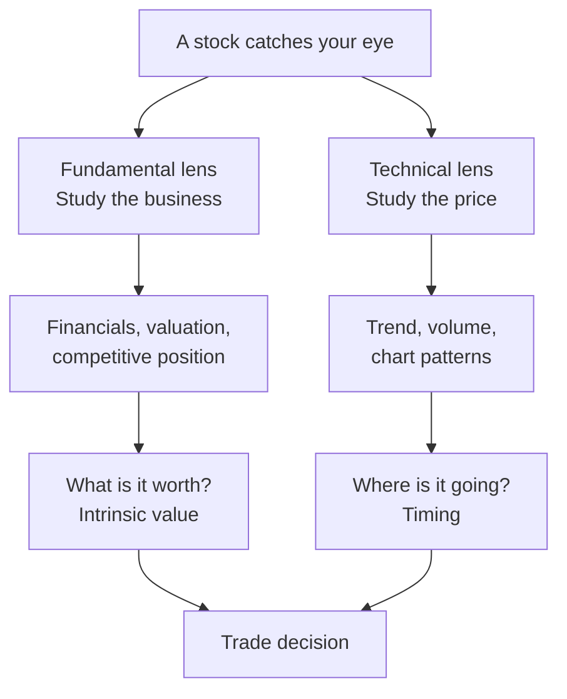

# Fundamental vs. Technical Analysis

Fundamental analysis and technical analysis are the two most common frameworks investors use to evaluate stocks. The core difference is what each believes drives prices. Fundamental analysis asks **"Is this company worth buying?"** Technical analysis asks **"When is the best time to buy or sell?"** They answer different questions, on different time horizons, using entirely different tools.





## Fundamental Analysis

Fundamental analysis estimates a company's **intrinsic value** by examining its financial health, competitive position, and growth prospects, then compares that value to the market price to judge whether the stock is over- or undervalued.

Practitioners typically examine:

- **Financial statements** — revenue, earnings, margins, debt, and cash flow from the income statement, balance sheet, and cash-flow statement.
- **Valuation ratios** — price-to-earnings (P/E), price-to-book (P/B), enterprise value-to-EBITDA (EV/EBITDA), and discounted cash flow (DCF) models.
- **Business fundamentals** — competitive advantages ("moats"), management quality, industry trends, and the regulatory environment.
- **Macroeconomic factors** — interest rates, inflation, GDP growth, and consumer spending, and how they affect the company's sector.

### Core belief

Every company has an intrinsic value set by its underlying business performance. Prices can wander away from that value in the short run, but the belief is that they revert toward it over time. Because a market can take a while to recognize a mispricing, fundamental analysis operates on a **long horizon — months to years**. Benjamin Graham and Warren Buffett built their philosophies on this idea: buy assets for less than they are worth.

One robust empirical anchor for the "valuation matters" claim: the price you pay predicts the return you earn. Historically, a high starting P/E has been followed by lower long-run returns, and a low starting P/E by higher ones.


```chart
pe_vs_forward_return()
```


### Example

Company A trades at \$40 per share. After studying its financials, competitive position, and future earnings, an investor estimates intrinsic value at \$60 per share. Because price (\$40) is below estimated value (\$60), the stock looks **undervalued**. Buying it is a bet that price will eventually converge toward value, producing a positive return.

### Strengths and weaknesses

| Strengths | Weaknesses |
|-----------|------------|
| Identifies long-term opportunities | Time-consuming, research-intensive |
| Builds real understanding of the business | Value estimates hinge on assumptions |
| Less swayed by short-term volatility | Price can stay dislocated for a long time |
| Suited to value investing and long-term holding | Says nothing about *timing* |

## Technical Analysis

Technical analysis assumes all publicly available information is *already* reflected in the price. Rather than studying the company, it studies **historical price and volume** to find patterns that hint at future behavior.

Practitioners typically examine:

- **Price charts** — candlestick, line, and bar charts to visualize price action over time.
- **Volume** — moves confirmed by high trading volume are considered more meaningful than moves on thin volume.
- **Indicators** — moving averages, the Relative Strength Index (RSI), and Moving Average Convergence Divergence (MACD) to quantify momentum and trend strength. Bands like the one below flag when price stretches unusually far from its recent average.


```chart
bollinger_bands()
```


### Core beliefs

Technical analysis rests on three principles:

1. **Price discounts everything.** All known information — fundamentals, news, sentiment — is already in the price, so there's no need to analyze it separately.
2. **Price moves in trends.** Once a trend (up, down, or sideways) is established, it is more likely to continue than to reverse immediately.
3. **History tends to repeat.** Investor psychology is fairly consistent, so recognizable chart patterns tend to produce similar outcomes.

Because it reads timing rather than value, technical analysis is most common among traders with **short horizons — minutes to several weeks**.

### Example

A stock has bounced between \$95 and \$100 several times over six months. One day it rises above \$100 on unusually high volume. A technician reads this as a **breakout**: buying pressure is building and the stock may keep rising.

### Strengths and weaknesses

| Strengths | Weaknesses |
|-----------|------------|
| Pinpoints entry and exit timing | Ignores the company's financial strength |
| Useful for short-term trading | Patterns are not always reliable |
| Produces objective, rules-based signals | Two analysts can read one chart differently |
| Works on any liquid asset | Prone to false signals in choppy markets |

## Which approach should you use?

Both have real pros and cons because they serve different purposes. Fundamental analysis suits long-term investors hunting for companies trading below intrinsic value. Technical analysis suits shorter-term traders seeking to profit from price movements and trends.

Most professionals **combine them**. A portfolio manager might use fundamentals to find an undervalued company with strong prospects, then use technicals to choose a favorable entry and exit. Fundamentals answer *what* to buy; technicals answer *when*.


```ascii
  FUNDAMENTALS  ->  screens for WHAT to own   (undervalued, strong business)
        |
        v
  TECHNICALS    ->  times the WHEN            (entry, exit, trend confirmation)
        |
        v
     a trade you can defend on both value AND timing
```


## Key takeaways

- Fundamental analysis studies the **business** to estimate intrinsic value; technical analysis studies **price and volume** to time trades.
- They answer different questions: *what to buy* (fundamentals) vs. *when to buy or sell* (technicals).
- Horizons differ: fundamentals run months-to-years; technicals run minutes-to-weeks.
- Fundamental value has empirical support (starting valuation predicts long-run return); technical signals excel at timing but can misfire in volatile markets.
- Most professionals blend the two — value to choose the position, price action to time it.
