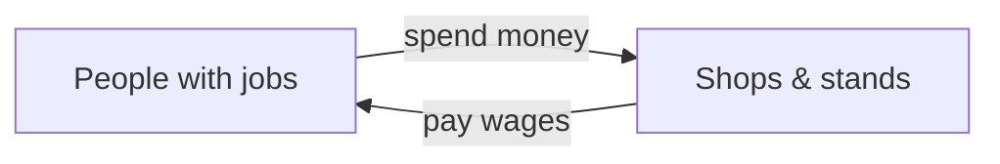

# The Whole Town's Lemonade Money 🍋🏙️

You run a lemonade stand on Maple Street. You already know your own little world: buy lemons, sell cups, count your coins at the end of the day.

But zoom **way** out. Your stand is just one dot on a whole map. The next street has a pizza shop. Down the block there's a barber, a toy store, and a hundred people who go to work each morning. **All of that together — every job, every price, every dollar spent — is called the *economy*.** Studying the whole town at once (not just your stand) is called **macroeconomics**. "Macro" just means *big-picture*.


```comic
{
  "title": "One Stand, One Whole Town",
  "panels": [
    {"emoji": "🍋", "caption": "You run a lemonade stand on Maple Street.", "bubble": "Fresh lemonade!"},
    {"emoji": "🏙️", "caption": "But look around — the whole town has stands, shops, and jobs. All of it together is 'the economy.'"},
    {"emoji": "💵", "caption": "When people have jobs, they have money to spend — on lemonade, pizza, everything.", "bubble": "I'll take two!"},
    {"emoji": "🧮", "caption": "Add up EVERYTHING the town makes and sells in a year. That giant total is called GDP."},
    {"emoji": "🎢", "caption": "Some years are busy, some are slow. Up, down, up, down — the business cycle."},
    {"emoji": "🏦", "caption": "When it gets slow, the town banker makes borrowing cheaper and the mayor builds a park. More jobs, more spending."},
    {"emoji": "🌊", "caption": "When the town does well, most stands do well. Your little stand rides the big wave.", "bubble": "Best summer ever!"}
  ]
}
```


## The town's giant scoreboard: GDP

Imagine adding up *everything* the whole town made and sold this year — every cup of lemonade, every pizza, every haircut. That one huge number is called **GDP** (Gross Domestic Product). It's the town's scoreboard for "how much did we make?" A bigger GDP usually means more jobs and more money going around.

## Prices that creep up: inflation

Have you noticed candy that used to cost \$1 now costs \$1.25? When prices *all over town* slowly creep up, that's **inflation**. A little bit is normal. Too much means your allowance buys less than it used to.

## Jobs: who's working?

If almost everyone who wants a job has one, the town is doing great — people earn money and spend it (some of it on lemonade!). When lots of people *can't* find work, that's called **unemployment**, and stands everywhere sell less.

## Good years and slow years

The economy doesn't grow in a straight line. It goes up during good times (a **boom**) and dips during slow times (a **slump** or *recession*), over and over. That wobble is the **business cycle**.





When the town hits a slow stretch, two grown-ups help out: the **mayor** (who can spend money on things like parks and roads, giving people jobs) and the **town banker / central bank** (who can make borrowing cheaper so people buy and build more). Those two helpers are what grown-ups call **fiscal policy** (the mayor's spending) and **monetary policy** (the banker's interest rates).

The big lesson: your lemonade stand isn't alone. When the *whole town* does well, most stands ride the wave up together. 🌊🏆
