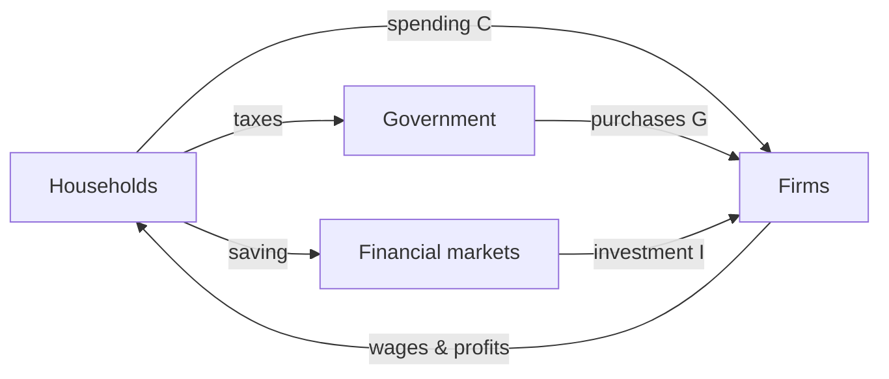
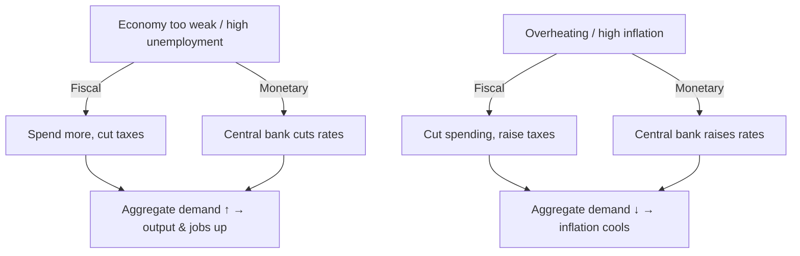

# Introduction to Macroeconomics

## Introduction

Macroeconomics is the study of how the **entire economy** behaves as a whole — how nations produce wealth, why prices rise and fall, what drives unemployment, and how government policy shapes growth and stability. Where microeconomics zooms into one household or one firm, macro zooms out to the whole town at once.

This matters far beyond academia. Macro conditions set interest rates, wages, hiring, inflation, and the mood of financial markets. Traders and investors watch a calendar of macro releases — GDP, the jobs report, the inflation print, central-bank meetings — because those numbers move bonds, currencies, and stocks in seconds.

The whole system is a loop: households sell their labor to firms, firms pay wages back to households, and government and financial markets sit in the middle redirecting some of the flow.





## Gross Domestic Product

**Gross Domestic Product (GDP)** is the total monetary value of all *final* goods and services produced within a country's borders in a given period. It is the single most widely used gauge of an economy's size and health.

GDP can be measured three equivalent ways: the **output approach** (what is produced), the **income approach** (wages, profits, and rent earned), and — most commonly — the **expenditure approach**, which sums total spending:

$$Y = C + I + G + NX$$

- $Y$ = output or GDP
- $C$ = consumption (households)
- $I$ = investment (firms building capacity, plus housing)
- $G$ = government purchases
- $NX$ = net exports (exports − imports)

Two accounting rules keep this honest. First, only **final** goods count: the flour a baker buys is an *intermediate good* baked into the price of the cake, so counting both would double-count. Second, GDP measures production **inside a country's borders** regardless of who owns the resources — which distinguishes it from **Gross National Product (GNP)**, the output produced by a country's *residents* wherever they operate.

## Aggregate Demand and Aggregate Supply

**Aggregate demand (AD)** is total demand for all goods and services at a given price level — the same $C + I + G + NX$, now read as spending desired at each price. The AD curve slopes **downward**: a lower price level raises the real quantity demanded.

**Aggregate supply (AS)** is total output producers are willing to make at each price level. In the **short run** the AS curve slopes **upward** (higher prices let firms expand output); in the **long run** output is capped by productive capacity, so the long-run AS curve is **vertical at potential GDP**.

Macroeconomic **equilibrium** sits where AD and AS intersect — a stable pairing of output and the price level. Booms and recessions are departures from it; over time, adjustments in prices, wages, and production push the economy toward a new equilibrium.


```ascii
 Price
 level |          AS (short run, up)
       |         /
       |        /
   P*  |-------X          X = equilibrium (P*, Y*)
       |      / \
       |     /   \
       |    /     AD (down)
       +------------------→ Real output Y
                Y*
```


The same supply-and-demand logic governs a single market. The **law of demand** says a higher price reduces quantity demanded; the **law of supply** says higher prices coax out more production; the market clears where the curves cross. Shifts move both price and quantity: a rightward **demand** shift (higher income, stronger preferences) raises both price and quantity, while a rightward **supply** shift (better technology, cheaper inputs) raises quantity but lowers price.


```chart
supply_demand()
```


## Inflation

**Inflation** is a sustained rise in the general price level, tracked by indices like the **Consumer Price Index (CPI)** or the **GDP deflator**. In the United States the Federal Reserve targets roughly **2%** per year: moderate inflation greases spending and investment and keeps the economy safely away from *deflation* (a corrosive general fall in prices).

Over long horizons, inflation is closely tied to how fast the money supply grows relative to output — print money much faster than the economy produces goods, and prices tend to follow.


```chart
money_supply_inflation()
```


## Unemployment

The **unemployment rate** is the share of the labor force actively seeking work but unable to find it. Economists split it into four types:

- **Frictional** — short-term, workers transitioning between jobs.
- **Structural** — workers' skills do not match the jobs on offer.
- **Seasonal** — predictable seasonal swings in labor demand.
- **Cyclical** — driven by the business cycle; it rises in recessions.

The **natural rate** of unemployment (frictional + structural, with the cyclical part at zero) is usually estimated around **4–5%** in the US. You never reach 0% — some churn is healthy.

## The Business Cycle

Economies do not grow in a straight line; they oscillate between **expansions** (output up, unemployment down) and **contractions** or **recessions** (output down, unemployment up) around a rising long-run trend. These recurring swings are the **business cycle**.


```chart
business_cycle()
```


## Fiscal vs. Monetary Policy

Two sets of levers steer aggregate demand:

- **Fiscal policy** — the *government's* spending ($G$) and taxes ($T$). Spending more or cutting taxes stimulates demand; the reverse cools it.
- **Monetary policy** — the *central bank's* control of interest rates and the money supply. Cutting rates makes borrowing cheaper and spurs demand; raising rates restrains it and fights inflation.





## Why Traders Watch Macro

Every macro number is a repricing event. A hot inflation print raises the odds the central bank hikes rates, which lifts bond yields, can strengthen the currency, and often pressures stocks. A weak jobs report can do the opposite. Because policy responds to data and markets respond to expected policy, macro releases are among the highest-volatility moments of the trading calendar. You don't have to forecast the economy perfectly — but you do have to know which way each surprise tends to push prices.

## Key Takeaways

- **GDP** ($Y = C + I + G + NX$) is the headline scoreboard; only *final* goods produced *within borders* count.
- **AD/AS** intersect at equilibrium; short-run AS slopes up, long-run AS is vertical at potential output.
- **Inflation** (CPI, GDP deflator) is targeted near 2%; over the long run it tracks money growth relative to output.
- **Unemployment** comes in four flavors; a **natural rate** of ~4–5% is normal, not a failure.
- The **business cycle** swings between expansion and recession around trend.
- **Fiscal** (spending & taxes) and **monetary** (interest rates & money supply) policy both work by shifting aggregate demand.
- Traders watch macro because each release reprices rate expectations — and rates move everything.

*Educational content, not investment advice.*
