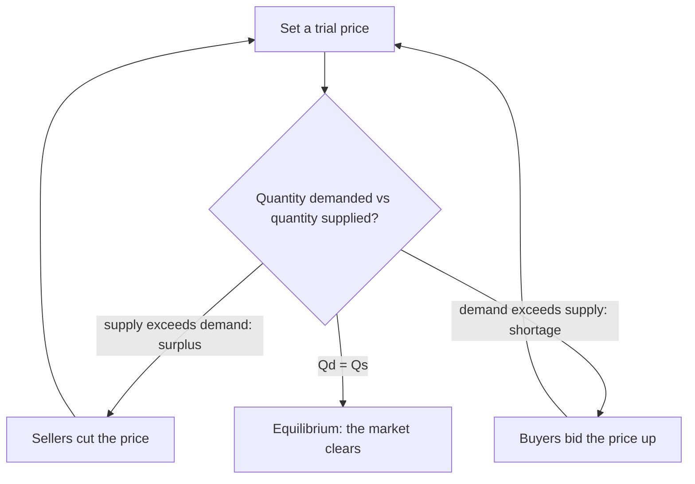
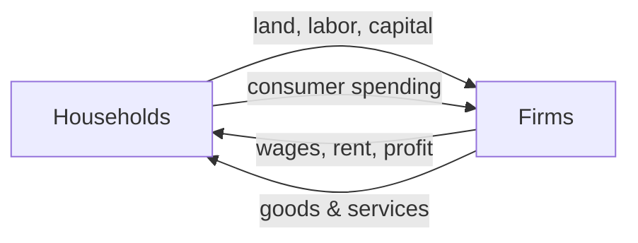

# Introduction to Microeconomics

## What microeconomics is about

Microeconomics studies how individual decision makers — consumers, households, and firms — allocate **scarce** resources. Time, money, and materials are all limited, so every actor must choose what to buy, what to produce, and at what price to transact.

It is the foundation of all economic analysis. Every macro outcome — GDP, inflation, employment, growth — is the *sum* of millions of micro-level choices. Understand the micro mechanics and you can explain why prices move, why firms enter or exit a market, how consumers respond to incentives, and why a policy might succeed or backfire.

The single most important mechanism is how a price finds its **equilibrium** — the value at which the quantity buyers want equals the quantity sellers offer.


```chart
supply_demand()
```


The **demand** curve slopes down (cheaper goods sell more); the **supply** curve slopes up (higher prices coax out more production). They cross at the market-clearing price. If demand rises (the dashed line), the whole curve shifts right and equilibrium moves to a higher price and quantity. Price does the balancing automatically:





## Utility and marginal utility

**Utility** is a measure of the satisfaction a consumer gets from a good. Because satisfaction is subjective and can't be metered directly, economists usually treat utility as **ordinal** — bundles are ranked from more to less preferred rather than assigned exact "happiness units."

**Marginal utility (MU)** is the extra satisfaction from one more unit, holding everything else fixed. The **Law of Diminishing Marginal Utility** says MU falls as you consume more: the first slice of pizza beats the fifth. This is the workhorse assumption behind almost every result below.


```ascii
  satisfaction from ONE more unit (MU)
   high |  █
        |  █  █
        |  █  █  █
        |  █  █  █  █  █
    low |  █  █  █  █  █  █
        +--------------------------> units consumed
         1st 2nd 3rd 4th 5th 6th   (each adds less than the last)
```


## Indifference curves and the MRS

An **indifference curve** joins all bundles of two goods that give the consumer the *same* utility — they are, literally, indifferent between them. These curves:

- slope downward,
- are convex to the origin,
- never intersect,
- and represent higher utility the farther they sit from the origin.

The **Marginal Rate of Substitution (MRS)** is the rate at which a consumer will swap one good for another while staying equally satisfied:

$$\text{MRS} = -\frac{\Delta Y}{\Delta X} = \frac{MU_x}{MU_y}$$

The MRS *declines* as you move along a convex curve: once a good becomes relatively abundant, you'll give up less of the other good to get still more of it — diminishing marginal utility showing up geometrically.

## Budget constraint and consumer optimization

A **budget constraint** is every bundle a consumer can afford at given prices and income $m$:

$$P_x\, Q_x + P_y\, Q_y = m$$

Its slope is the negative price ratio, $-\tfrac{P_x}{P_y}$. Income changes shift the line in or out; a change in one price rotates it.

The consumer's goal is to reach the highest attainable indifference curve while staying on or inside the budget line. That happens where the curve is **tangent** to the line — where the personal trade-off equals the market trade-off:

$$\text{MRS} = \frac{MU_x}{MU_y} = \frac{P_x}{P_y}$$

Equivalently, the last dollar spent on each good buys the same marginal utility, $MU_x/P_x = MU_y/P_y$. Any other bundle either wastes budget or lowers utility.

**Worked example.** A student has \$40 for books (\$8 each) and coffees (\$5 each). Affordable bundles include 5 books & 0 coffees, 0 books & 8 coffees, or anything costing \$40 or less. The budget slope is

$$-\frac{P_x}{P_y} = -\frac{8}{5} = -1.6,$$

so each additional book costs 1.6 coffees. The optimum is the bundle where the student's MRS between books and coffee equals that 1.6 — his personal valuation matching the market's.

## Elasticity

**Elasticity** measures responsiveness: the percentage change in one variable per 1% change in another.

- **Elastic** demand (elasticity magnitude > 1): quantity moves a lot when price does — typical of luxuries and easily-substituted goods.
- **Inelastic** demand (magnitude < 1): quantity barely budges — typical of necessities.

Price elasticity of demand is the most common:

$$\varepsilon = \frac{\%\ \Delta\, \text{quantity demanded}}{\%\ \Delta\, \text{price}}$$

If gasoline's price rises 10% and quantity demanded falls 5%:

$$\varepsilon = \frac{-5\%}{+10\%} = -0.5.$$

The magnitude is below 1, so gasoline demand is relatively **inelastic** — drivers can't cut back much in the short run. Economists also track income elasticity, cross-price elasticity, and the price elasticity of supply. Elasticity is what tells a seller whether raising the price will raise or shrink total revenue.

## Opportunity cost and comparative advantage

**Opportunity cost** is the value of the next-best alternative you give up. A student who studies 3 hours instead of working forgoes 3 hours of wages — that forgone pay *is* the cost of studying, whether or not anyone invoices it. Because resources are scarce, every choice carries one.

**Comparative advantage** exists when a producer can make a good at a *lower opportunity cost* than someone else. The surprising result: even a producer who is worse at *everything* (no absolute advantage) still has a comparative advantage in something, and specialization plus trade raises total output for everyone. This is the engine behind why individuals, firms, and nations specialize and exchange.

## Surplus, and how markets get graded

- **Consumer surplus**: the gap between what a buyer was *willing* to pay and what they *actually* paid.
- **Producer surplus**: the gap between the price a seller receives and the minimum they'd accept.

Their sum is the total gain from voluntary exchange. A market that maximizes total surplus is called **efficient** — it squeezes out the most combined benefit for society.

## Market structures

How much competition a market has shapes prices, output, and profit:

- **Perfect competition** — many buyers and sellers, identical products, firms are price *takers*.
- **Monopoly** — one dominant firm with real control over price and output.
- **Monopolistic competition** — many firms selling *differentiated* products, so each has limited pricing power.
- **Oligopoly** — a few large firms whose choices hinge on rivals' reactions.

## From micro to macro: the circular flow

Individual decisions knit together into a self-sustaining system. Households supply land, labor, and capital to firms and receive wages, rent, and profit; firms turn those inputs into goods that households buy back with that income.





Add government and the foreign sector and you get **injections** (spending, investment, exports) and **leakages** (taxes, savings, imports). Every utility-maximizing purchase (micro) reappears as consumer expenditure (macro); every profit-maximizing wage (micro) reappears as labor income (macro). Microeconomics is the bridge.

## Prices in the real world

The same forces show up everywhere: scarcity meeting demand pushes prices apart from incomes over long horizons — the reason housing feels increasingly out of reach when home prices outrun wages.


```chart
affordability_gap()
```


Airlines run **dynamic pricing** as seats fill; streaming services offer **tiers** to capture different willingness to pay; restaurants re-price as costs and tastes shift; workers weigh tuition against future earnings before enrolling. Each is a trade-off under scarcity — the micro toolkit in daily use.

## Key takeaways

- Scarcity forces choice; microeconomics is the study of those individual choices and the prices they produce.
- A price settles at **equilibrium**, where quantity demanded equals quantity supplied; surpluses push it down, shortages push it up.
- **Diminishing marginal utility** underlies convex indifference curves and downward-sloping demand.
- The consumer optimum is the tangency **MRS = $P_x/P_y$** — personal trade-off equals market trade-off.
- **Elasticity** measures responsiveness and decides whether a price hike grows or shrinks revenue.
- **Opportunity cost** prices every choice; **comparative advantage** makes specialization and trade worthwhile even for the more efficient producer.
- Consumer + producer **surplus** measure the gains from exchange; efficient markets maximize the total.

*This is educational material, not investment or financial advice.*
