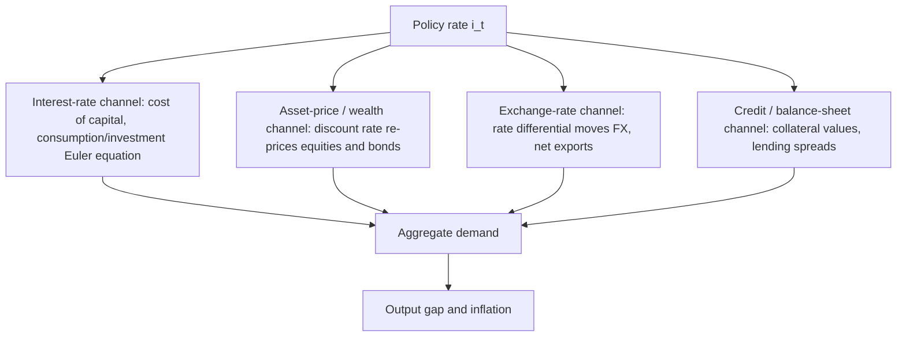

# Monetary Economics: Identities, Rules, and Transmission

Monetary economics can be built up from a handful of accounting **identities** that become **theories** once you attach behavioral assumptions. This tier develops three cornerstones — the quantity theory, the money multiplier, and the Taylor rule — derives each, and then traces how the policy rate propagates and where the framework fails (the zero lower bound).

## 1. The quantity theory of money

Start from the **equation of exchange**, an identity:

$$M V \equiv P Q,$$

where $M$ is the money stock, $V$ its income velocity, $P$ the price level, and $Q$ real output (equivalently $Y$). It is true *by construction* if velocity is defined residually as $V \equiv PQ/M$. It becomes the **quantity theory** only with two behavioral assumptions: (i) $V$ is stable, pinned down by payment institutions rather than policy, and (ii) $Q$ is fixed at its potential level by real factors (technology, labor, capital) and is independent of $M$.

Take logs and differentiate with respect to time (let a hat denote a growth rate, $\hat x \equiv \dot x / x$):

$$\hat M + \hat V = \hat P + \hat Q.$$

Impose $\hat V \approx 0$ and $\hat Q = \hat Q^{*}$ (exogenous potential growth). Writing inflation as $\pi \equiv \hat P$,

$$\boxed{\;\pi = \hat M - \hat Q^{*}\;}$$

Inflation equals money growth in excess of real growth. This is the formal content of Friedman's dictum that *"inflation is always and everywhere a monetary phenomenon."* The identity holds always; the *causal* reading requires stable $V$ — an assumption that is a good long-run approximation but breaks down at business-cycle frequencies (see §6).

## 2. Money creation and the multiplier

Central banks control the **monetary base** (high-powered money) $B$, not broad money $M$. Banks create the rest through fractional-reserve lending. Split each aggregate into currency and deposits:

$$B = C + R, \qquad M = C + D,$$

with $C$ currency in circulation, $R$ bank reserves, $D$ deposits. Define the public's currency–deposit ratio $c \equiv C/D$ and banks' reserve–deposit ratio $\rho \equiv R/D$. Then

$$\frac{M}{B} = \frac{C + D}{C + R} = \frac{cD + D}{cD + \rho D} = \frac{1 + c}{c + \rho} \;\equiv\; m,$$

so $M = mB$ with the **money multiplier**

$$\boxed{\;m = \frac{1 + c}{c + \rho} \ge 1.\;}$$

The textbook special case $c \to 0$ (all money held as deposits) collapses to the reserve-requirement multiplier $m = 1/\rho$: a required-reserve ratio of 10% supports a tenfold deposit expansion.

**Caveat — the multiplier is not a policy lever today.** With reserve requirements set to zero (2020) and the banking system flush with **ample reserves**, the mechanical link $M = mB$ no longer binds; QE expanded $B$ enormously with little pass-through to $M$. The Fed now operates a **floor system**, setting rates through administered rates — interest on reserves (IOR) and the overnight reverse-repo (ON RRP) rate — rather than by rationing reserves. The multiplier is pedagogy, not plumbing.

## 3. The Taylor rule and the Taylor principle

Instead of targeting a monetary aggregate, modern central banks set the **short rate** as a feedback function of inflation and the output gap. Taylor's (1993) rule:

$$i_t = r^{*} + \pi_t + 0.5\,(\pi_t - \pi^{*}) + 0.5\,(y_t - y_t^{*}),$$

where $i_t$ is the nominal policy rate, $r^{*}$ the neutral real rate, $\pi_t$ inflation, $\pi^{*}$ the target (2%), and $(y_t - y_t^{*})$ the output gap. Taylor calibrated $r^{*} = \pi^{*} = 2$ and both response coefficients to $0.5$.

**The Taylor principle.** Rewrite in terms of the implied *real* rate using the Fisher relation $r_t = i_t - \pi_t^{e}$ (approximate $\pi_t^{e} \approx \pi_t$):

$$r_t = i_t - \pi_t = r^{*} + 0.5\,(\pi_t - \pi^{*}) + 0.5\,(y_t - y_t^{*}).$$

Differentiate with respect to inflation:

$$\frac{\partial r_t}{\partial \pi_t} = 0.5 > 0 \qquad\Longleftrightarrow\qquad \frac{\partial i_t}{\partial \pi_t} = 1.5 > 1.$$

A rise in inflation must be met with a **more-than-one-for-one** increase in the nominal rate so that the *real* rate rises, restraining demand — a stabilizing response. If instead the inflation coefficient were below 1, higher inflation would *lower* the real rate, feeding a self-fulfilling spiral and equilibrium indeterminacy (Clarida, Galí & Gertler, 2000). Satisfying the Taylor principle is the condition for a determinate, stable inflation equilibrium.

## 4. Transmission channels

The policy rate is a single overnight number; its macroeconomic bite comes from propagation along several channels that operate in parallel:





The **asset-price channel** is the cleanest to formalize: an asset paying cash flows $\{CF_t\}$ is worth $\sum_t CF_t/(1+r)^t$, monotone decreasing in the discount rate. The same convexity governs bonds, where $\partial P/\partial y < 0$ and $\partial^2 P/\partial y^2 > 0$:


```chart
bond_price_yield()
```


The **long end** of the curve matters more for spending than the overnight rate, and it is governed by the expectations hypothesis: the $n$-period yield is the average expected future short rate plus a term premium,

$$y_t^{(n)} = \frac{1}{n}\sum_{k=0}^{n-1} \mathbb{E}_t\!\left[i_{t+k}\right] + \theta_t^{(n)}.$$

This identity is why **forward guidance** works — moving $\mathbb{E}_t[i_{t+k}]$ shifts long rates today without any change in the current $i_t$ — and why the curve's *shape* encodes the market's expected policy path:


```chart
yield_curve()
```


## 5. The zero lower bound and liquidity traps

The Taylor rule can prescribe a negative rate in a deep slump (large negative output gap, $\pi < \pi^{*}$). But arbitrage against zero-yield physical currency imposes an **effective lower bound** near zero, so realized policy is truncated:

$$i_t = \max\!\big(0,\; i_t^{\text{desired}}\big).$$

When the constraint binds, the real rate is stuck at $r_t = -\pi_t^{e}$, which can sit *above* the market-clearing natural real rate $r_t^{n}$. Desired saving then exceeds desired investment with no price able to clear the gap — a **liquidity trap** (Keynes 1936; Krugman 1998). Conventional rate policy is impotent, and the central bank turns to unconventional tools:

- **Quantitative easing** — purchasing long-duration assets to compress term premia $\theta_t^{(n)}$ and remove duration/credit risk from private balance sheets, flattening the curve when the short-rate lever is pinned.
- **Forward guidance** — credibly committing to keep $i_t$ low *after* the economy recovers, lowering the expected average short rate $\frac{1}{n}\sum_k \mathbb{E}_t[i_{t+k}]$ and, by raising expected inflation, cutting the real rate $r_t = i_t - \pi_t^{e}$ even at the bound.

Both work by acting on **expectations** rather than the current overnight rate — the ZLB pushes policy from the level of rates to the entire expected path.

## 6. Where the framework breaks

- **Velocity is not constant.** $V \equiv PQ/M$ swings with interest rates and money demand; short-run money-growth/inflation correlations are loose, and the tight relation is a long-run one:

```chart
money_supply_inflation()
```

- **Long and variable lags** (Friedman): the transmission chain of §4 delivers peak effects on inflation only after roughly 12–24 months, so policy set on *current* data is systematically mistimed — hence forecast-based, forward-looking rules.
- **Endogenous money.** In modern systems banks create deposits by lending and obtain reserves afterward; causation runs partly from $M$ to $B$, inverting the multiplier story and undercutting a mechanical base → money view.
- **Regime dependence.** $r^{*}$, potential growth $\hat Q^{*}$, and the natural rate $r_t^{n}$ drift over time; a Taylor rule calibrated to one era misprices policy in another, and a persistently low $r^{*}$ makes the ZLB bind more often.

## References & further reading

- Friedman, M. (1963/1968). *A Monetary History of the United States* (with A. Schwartz); *The Role of Monetary Policy*, AER.
- Taylor, J. B. (1993). *Discretion versus Policy Rules in Practice.* Carnegie-Rochester Conference Series.
- Mishkin, F. S. *The Economics of Money, Banking, and Financial Markets* (the standard transmission-mechanism text).
- Clarida, Galí & Gertler (2000). *Monetary Policy Rules and Macroeconomic Stability.* QJE (Taylor principle, determinacy).
- Krugman, P. (1998). *It's Baaack: Japan's Slump and the Return of the Liquidity Trap.* BPEA.
- Woodford, M. (2003). *Interest and Prices* (the New Keynesian foundations of rate rules).

*Educational content, not investment advice.*
