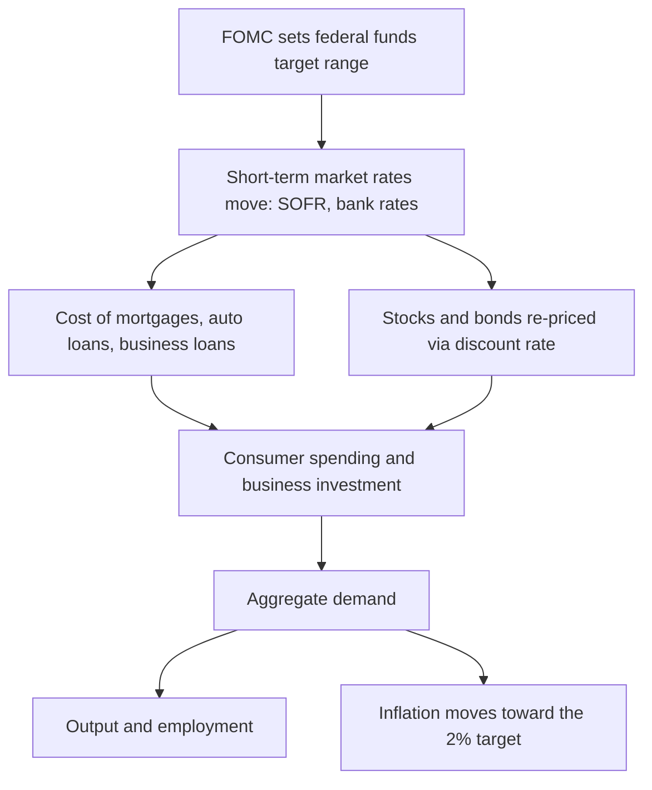
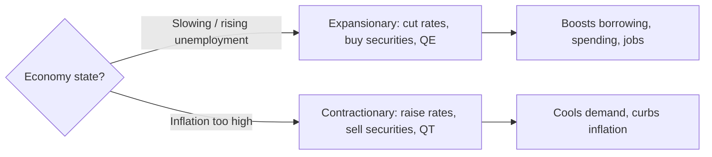

# Monetary Economics

## Introduction

Monetary economics studies **money** — how it is created, managed, and moved through an economy — and how the *supply* and *price* of money shape inflation, employment, output, and financial markets. At its core it asks a single question: when a central bank changes **interest rates** or the **money supply**, how does that ripple out into spending, prices, and asset values?

## What money is

Money is anything widely accepted as payment for goods and services. Economists say a thing counts as money when it performs three functions:

- **Medium of exchange** — it lets goods and services trade without bartering one good directly for another.
- **Store of value** — it holds purchasing power over time, so you can earn now and spend later.
- **Unit of account** — it gives a common yardstick for pricing everything.

The **money supply** is measured in tiers of decreasing liquidity:

- **M1** — the most liquid: physical cash and demand (checking) deposits.
- **M2** — all of M1 *plus* savings deposits, small time deposits (CDs), and other assets that convert to cash easily.

## Interest rates: the price of money

An interest rate is the cost of borrowing and the reward for lending. It sits at the center of monetary economics because it steers consumer spending, business investment, housing demand, and asset prices.

- **Rates rise →** borrowing is more expensive → spending and investment typically fall.
- **Rates fall →** borrowing is cheaper → spending and investment typically rise.

Rates also move **valuations**. A financial asset is worth the present value of its future cash flows,

$$PV = \sum_{t=1}^{T} \frac{CF_t}{(1+r)^t},$$

so a higher discount rate $r$ pushes present values — and therefore prices — *down*. This is why higher rates generally weigh on stocks and, mechanically, on bonds:


```chart
bond_price_yield()
```


## Inflation and the 2% target

**Inflation** is the rate at which the general price level rises over time. A low, stable rate is considered healthy: it greases spending and investment and lets wages and prices adjust smoothly. Excessive inflation is corrosive — it erodes purchasing power and injects uncertainty into every household and business plan.

The Federal Reserve targets **2%** inflation over the long run, measured by the **Personal Consumption Expenditures (PCE)** price index, a level it views as consistent with price stability and sustainable growth. Over long horizons, sustained money-supply growth in excess of real output growth is the dominant driver of inflation:


```chart
money_supply_inflation()
```


## The central bank and its toolkit

In the US, monetary policy is run by the **Federal Reserve**. Congress gave it a **dual mandate**: low, stable inflation (around 2%) *and* maximum sustainable employment. These goals can conflict — cooling inflation may cost jobs — and the Fed must judge which problem is more urgent.

Its primary instrument is the **federal funds rate**, the overnight rate at which banks lend reserves to one another. The Fed doesn't fix it directly; it sets a **target range** and steers the effective rate into that band with open market operations:


```ascii
  FOMC target range:
    upper bound  4.50% ─────────────────────────
                        effective fed funds ≈ 4.33%
    lower bound  4.25% ─────────────────────────
  Open market operations nudge the effective rate inside the band.
```


The **Federal Open Market Committee (FOMC)** meets eight times a year and votes to raise, lower, or hold the range. Other tools:

- **Open market operations (OMO)** — buying or selling government securities. Selling Treasuries drains cash from the public and shrinks the money supply; buying does the reverse.
- **Reserve requirements** — the share of deposits banks must hold rather than lend. The Fed cut these to **zero in March 2020**, making the tool largely dormant.
- **Quantitative easing / tightening (QE / QT)** — introduced after 2008. When short rates are already near zero, **QE** buys large amounts of *longer-term* securities to push long rates down and stimulate activity; **QT** shrinks the balance sheet and drains liquidity.
- **Forward guidance** — communicating future intentions. When the Fed signals "higher for longer," long-term rates often move *before* any actual rate change.

## How policy transmits to the economy

A change in the policy rate doesn't hit prices directly — it works through a chain economists call the **monetary transmission mechanism**:





Because these effects arrive with long and variable lags, policy is inherently forward-looking — the Fed acts on where it thinks inflation and employment are *heading*.

## Expansionary vs. contractionary policy

The same toolkit is pushed in opposite directions depending on where the economy sits in the **business cycle**:





- **Expansionary** (economy slowing): lower rates, buy securities, ease reserve requirements, QE — pump money in to encourage borrowing and spending.
- **Contractionary** (inflation too high): raise rates, sell securities, tighten, QT — pull money out to slow activity and relieve price pressure.


```chart
business_cycle()
```


## Why markets hang on the Fed

Because policy is **data-dependent**, investors dissect every major release for clues about the Fed's next move:

- **CPI** — consumer inflation. A hot print raises the odds of rate hikes.
- **Nonfarm Payrolls (NFP)** — monthly jobs data. Strong labor markets signal strength but can also stoke inflation.
- **FOMC statement** — parsed word-by-word for hints on the future rate path.
- **GDP** — the broadest gauge of growth.
- **Retail sales** — consumer spending, a large slice of output.

A single surprise in these numbers can move stocks, bonds, and currencies within seconds.

## The plumbing: repo, SOFR, and Treasuries

Beneath the policy rate sits the market that funds the financial system overnight:

- **Repo market** — institutions borrow cash overnight by selling Treasuries with a promise to buy them back slightly dearer. A Fed **repo** injects reserves (easing rates); a **reverse repo** drains them (supporting rates).
- **SOFR** — the **Secured Overnight Financing Rate**, the main US benchmark, computed from actual overnight repo transactions. It replaced LIBOR (which relied on bank estimates) and underpins trillions of dollars of loans and derivatives.
- **Treasury securities** — Bills (< 1 year), Notes (2–10 years), and Bonds (20–30 years), backed by the full faith and credit of the US. Considered "risk-free," their yields are the benchmark for pricing mortgages, corporate bonds, and much else.

## The yield curve

The **yield curve** plots Treasury yields across maturities. Normally it slopes **upward**: longer bonds pay more to compensate for time and uncertainty, reflecting expected growth and moderate inflation.


```chart
yield_curve()
```


An **inverted** curve — short rates above long rates — has historically preceded recessions. When investors expect the Fed to *cut* rates in a future slowdown, they buy long-term bonds now to lock in today's yields; that demand lifts long-bond prices and drags long yields *below* short yields. Because the curve aggregates the views of millions of participants, it's watched as one of the most reliable forward indicators.

## Key takeaways

- **Money** is defined by three functions — medium of exchange, store of value, unit of account — and measured in liquidity tiers (M1, M2).
- **Interest rates are the price of money**: they steer spending, investment, and, through the discount rate, asset valuations.
- The **Fed** pursues a dual mandate (2% inflation + maximum employment) mainly through the **federal funds rate**, backed by OMO, QE/QT, and forward guidance.
- Policy reaches prices through the **transmission mechanism** — rates → borrowing and asset prices → demand → output and inflation — with long, variable lags.
- Markets hang on **data releases** (CPI, NFP, FOMC, GDP) because policy is data-dependent, and read the **yield curve** as a signal of what's coming.

*Educational content, not investment advice.*
