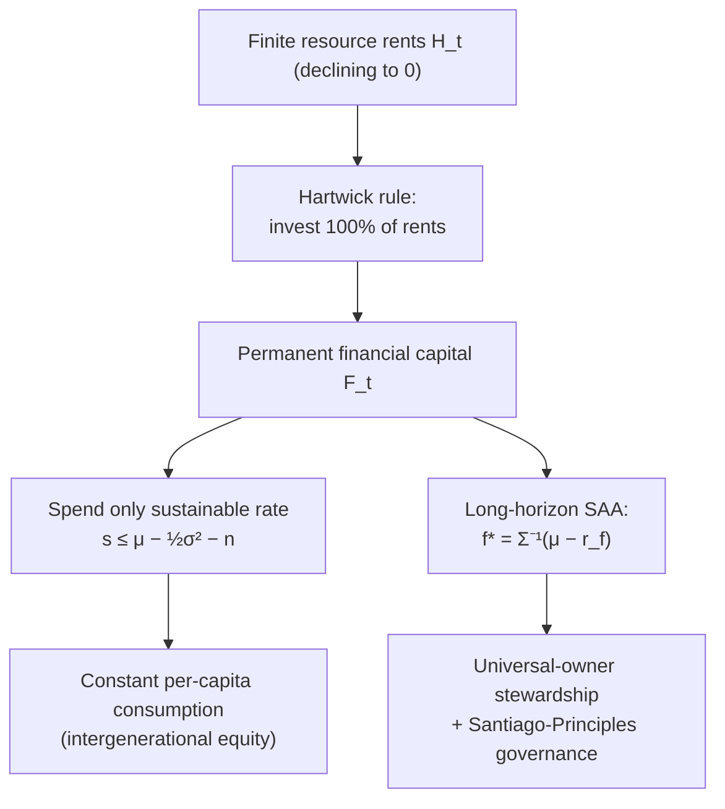

# Sovereign Wealth Funds: Permanent Income, Endowment Investing, and State Capital

A sovereign wealth fund is best understood not as a portfolio but as a **balance-sheet management problem for a nation**: it exists to transform one class of sovereign asset into another. For a commodity exporter, the fund converts an *exhaustible, undiversified, in-ground asset* (oil rents) into a *permanent, diversified, financial asset* whose payout can be smoothed across generations. Everything below — the savings rationale, the asset allocation, the spending rule, and the geopolitics — follows from that single transformation.

## 1. The intergenerational-savings / permanent-income rationale

### 1.1 The sovereign balance sheet

Write total sovereign wealth at time $0$ as the sum of financial assets already in the fund and the present value of remaining resource rents:

$$W_0 = F_0 + H_0, \qquad H_0 = \sum_{t=1}^{T}\frac{(p_t - \kappa_t)\,q_t}{(1+r)^{t}},$$

where $F_0$ is the fund's financial capital, $p_t$ the resource price, $\kappa_t$ the marginal extraction cost, $q_t$ the extracted quantity, $r$ the real discount rate, and $T$ the exhaustion date. $H_0$ is **human-made-in-nothing** — it is subsurface wealth that mechanically declines to zero as the resource is depleted ($H_T = 0$).

### 1.2 Permanent income and the Hartwick rule

Friedman's permanent-income logic says a prudent agent consumes the annuity value of *total* wealth, not current cash flow. Treating the sovereign as an infinitely-lived agent facing a constant real return $r$, the **permanent (sustainable) income** is the perpetuity annuity

$$c^\star = r\,W_0,$$

because consuming exactly the return leaves principal $W_0$ intact ($W_{t+1}=W_t(1+r)-c^\star = W_t$). The problem is that resource revenue is *front-loaded and finite* while $c^\star$ must be *level and perpetual*. Naively spending current rents $(p_t-\kappa_t)q_t$ makes consumption collapse the moment the wells run dry.

The **Hartwick rule** (1977) resolves this: invest *all* resource rents into reproducible (financial) capital, so that as the in-ground asset $H_t$ is drawn down, the fund $F_t$ rises one-for-one and total wealth $W_t = F_t + H_t$ is held constant. Constant $W$ under constant $r$ supports constant consumption $c^\star = rW$ — i.e. **intergenerational equity**. The SWF is the institutional vehicle that executes Hartwick's rule. This is precisely the discounting problem an SWF solves — converting a stream of finite future rents into a present financial stock:


```chart
dcf_discounting(r=0.10, g=0.05)
```


Norway's fiscal rule is Hartwick made operational: deposit *100%* of net petroleum cash flow into GPFG, and let the non-oil budget deficit draw only the fund's *expected real return* (the "handlingsregel," guided at 4% at inception and trimmed to ~3% in 2017). Spend the return, preserve the principal, and the depleting oil asset becomes a permanent endowment.

## 2. Sustainable spending under uncertainty (why 4% became 3%)

The perpetuity rule $c^\star = rW$ is a *deterministic* result. Returns are stochastic, and the correct object for a compounding pool is the **geometric**, not arithmetic, growth rate. Let the fund follow, with spending fraction $s$ of assets and i.i.d. gross real return $R_{t+1}$,

$$F_{t+1} = F_t(1+R_{t+1}) - sF_t = F_t\,(1 + R_{t+1} - s).$$

The almost-sure long-run growth rate of the fund is $\mathbb{E}\!\left[\log(1+R-s)\right]$. Expanding to second order about the mean, with $\mu=\mathbb{E}[R]$ and $\sigma^2=\operatorname{Var}(R)$,

$$g(s) \;=\; \mathbb{E}\!\left[\log(1+R-s)\right] \;\approx\; (\mu - s) \;-\; \tfrac{1}{2}\,\frac{\sigma^2}{(1+\mu-s)^2} \;\approx\; (\mu-s) - \tfrac{1}{2}\sigma^2 .$$

To keep **real wealth per capita** non-declining when population grows at rate $n$, require $g(s)\ge n$, i.e.

$$\boxed{\,s \;\le\; \mu - \tfrac{1}{2}\sigma^2 - n\,.}$$

Two lessons fall out. First, the sustainable spend is the *geometric* mean minus population growth, **strictly below** the arithmetic mean $\mu$: spending the full expected return $\mu$ slowly decapitalizes the fund because of the **volatility drag** $\tfrac12\sigma^2$ — the identical variance penalty that appears in the Kelly / growth-optimal problem. Second, as GPFG's equity share rose (higher $\mu$ *and* higher $\sigma^2$) and Norwegian expected real returns fell, the sustainable $s$ dropped — the analytic backdrop to cutting the guideline from 4% to 3%.

A Monte Carlo of the wealth process makes the dispersion concrete: a fixed spending rule produces a wide fan of real-terminal-wealth outcomes, and the *median* path — not the mean — is what a prudent trustee should target.


```chart
monte_carlo_paths()
```


## 3. Strategic asset allocation and the long horizon

### 3.1 Why can an SWF hold more risk?

The folk claim is "long horizon ⇒ hold more equities." Samuelson (1969) showed this is *false* under CRRA utility with i.i.d. returns: the optimal risky share is **horizon-independent** ("time diversification" is a fallacy in that model). So the real justifications must be structural, not mechanical:

- **No liability run.** Unlike a bank or a leveraged fund, an SWF has no depositors who can force liquidation into a crash. It can hold through drawdowns and harvest the equity and illiquidity premia that shorter-horizon investors must forgo.
- **Rebalancing is countercyclical.** A fixed-weight policy mechanically buys risk assets as they fall and sells as they rise — a negative-feedback, contrarian flow that both earns a rebalancing premium and (in aggregate) stabilizes markets.
- **Empirical horizon effects.** To the extent real returns mean-revert, the per-period variance of long-horizon returns grows sub-linearly, modestly raising the optimal risky share relative to the i.i.d. benchmark.

### 3.2 The growth-optimal / Merton benchmark

For a single risky asset in continuous time with $dS/S=\mu\,dt+\sigma\,dW$, the log-growth-maximizing (and Merton, for log utility) risky fraction is

$$f^\star = \frac{\mu - r_f}{\sigma^2},$$

generalizing in the multi-asset case to $\mathbf{f}^\star = \Sigma^{-1}(\boldsymbol\mu - r_f\mathbf{1})$. The message for SAA is the same as §2: allocation is governed by the **variance-adjusted** premium, and $\Sigma^{-1}$ penalizes redundant, correlated exposures — the formal content of "diversify." Because an SWF's *funding* asset (oil) is itself a bet on energy prices, optimal financial-portfolio construction should *hedge* the sovereign's residual commodity exposure — e.g. underweighting oil-correlated equities — a consideration GPFG has explicitly debated regarding oil-and-gas stocks.

## 4. The Norway "endowment model"

Norway's GPFG is often called an endowment model, but it is a **deliberate inversion** of the Yale/Swensen endowment model:

| | Yale (Swensen) | Norway (GPFG) |
|---|---|---|
| Core bet | Illiquidity + manager alpha | Low-cost global beta + governance |
| Assets | Heavy private equity, hedge funds, real assets | ~70% listed equity, ~30% fixed income + unlisted real estate/infra |
| Style | Active, concentrated manager selection | Near-index reference portfolio, small factor & active tilts |
| Cost | High (carry + fees) | ~0.05% of AUM |
| Edge | Access, selection skill | Scale, patience, transparency, ownership |

GPFG's differentiator is **scale as a strategy**. Holding on the order of ~1.5% of the world's listed equity, it is a *universal owner*: its returns depend on the performance of the entire market and, ultimately, the whole economy. A universal owner cannot diversify away *systematic* externalities — climate, governance failures, corruption — so it rationally invests in **active ownership** (voting, engagement) and **ethical exclusions** to protect the aggregate portfolio. This is beta-plus-stewardship, not alpha-hunting, and its transparency (every holding published; a mandate legislated by parliament; independence from the fiscal authority at Norges Bank Investment Management) is what makes the spend-the-return fiscal rule politically credible.

## 5. Market impact and the geopolitics of state capital

Large state capital raises concerns beyond ordinary market risk:

- **Price and flow impact.** A fund holding fraction $\phi$ of a market moves prices when it rebalances; naive execution of large sovereign flows can be destabilizing. Rule-based, countercyclical rebalancing (§3.1) is, by contrast, stabilizing — the empirical record for GPFG.
- **Non-commercial motives / national security.** State ownership of strategically sensitive assets invites the worry that stakes serve foreign-policy or mercantilist ends rather than returns. This is the rationale for inbound-investment screening regimes (e.g. CFIUS in the US), which scrutinize state-linked acquirers of critical infrastructure and technology.
- **Principal-agent and governance risk.** Weak transparency and politicized boards invite corruption and value destruction — the failure mode illustrated by the 1MDB scandal.

The industry's self-regulatory answer is the **Santiago Principles** (2008) — the *Generally Accepted Principles and Practices (GAPP)*, 24 voluntary principles produced by the IMF-convened International Working Group and now stewarded by the **International Forum of Sovereign Wealth Funds (IFSWF)**. Their thrust is a credible commitment that SWFs invest on **economic and financial grounds**, with sound governance, operational independence, and disclosure. Compliance and transparency remain heterogeneous — measured, imperfectly, by indices such as the Linaburg-Maduell Transparency Index — and the Principles are voluntary, so their force rests on reputational equilibrium rather than enforcement. The stakes rise with scale:


```chart
swf_sizes()
```


## 6. Summary of the analytics




## References and further reading

- International Working Group of Sovereign Wealth Funds (2008). *Sovereign Wealth Funds: Generally Accepted Principles and Practices — "Santiago Principles."* (IFSWF, ifswf.org.)
- Norges Bank Investment Management. *Government Pension Fund Global — Annual Reports* and the fund's *Strategy Plan* (nbim.no).
- Ang, A. (2014). *Asset Management: A Systematic Approach to Factor Investing.* Oxford University Press — esp. the GPFG case study and factor-based SAA.
- Hartwick, J. M. (1977). *Intergenerational Equity and the Investing of Rents from Exhaustible Resources.* American Economic Review, 67(5).
- Friedman, M. (1957). *A Theory of the Consumption Function.* Princeton University Press (permanent-income hypothesis).
- Samuelson, P. A. (1969). *Lifetime Portfolio Selection by Dynamic Stochastic Programming.* Review of Economics and Statistics.
- Merton, R. C. (1969). *Lifetime Portfolio Selection under Uncertainty.* Review of Economics and Statistics.
- Swensen, D. F. (2009). *Pioneering Portfolio Management* (the Yale endowment model, for contrast).
- Bernstein, S., Lerner, J., & Schoar, A. (2013). *The Investment Strategies of Sovereign Wealth Funds.* Journal of Economic Perspectives, 27(2).

*This is educational content, not investment advice.*
