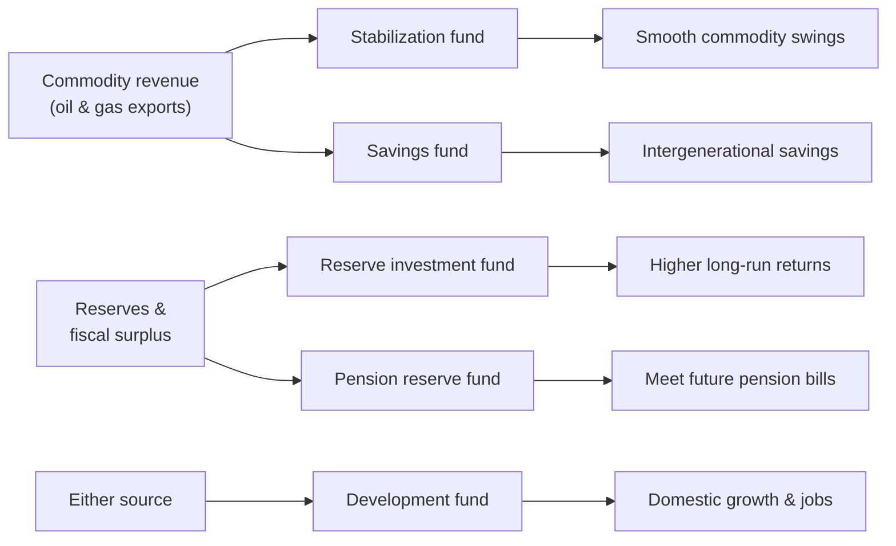

# Sovereign Wealth Funds

## Introduction

A **sovereign wealth fund (SWF)** is a state-owned investment pool that manages a nation's assets, typically to generate returns for the benefit of current or future citizens. Unlike central-bank reserves — which are held to stabilize the currency and manage short-term liquidity — SWFs are built for **long-horizon investing**. Their portfolios often span equities, government and corporate bonds, real estate, infrastructure, private equity, and other alternatives.

SWFs are funded from different sources depending on the country. Resource-rich nations channel export revenues from oil or natural gas into their funds. Nations with fewer natural resources instead fund their SWFs from **fiscal surpluses and foreign-exchange reserves**. That split — commodity vs. reserve — is the first thing to understand about any fund.

## Funding source → fund type → objective

Broadly, where the money *comes from* shapes what the fund is *for*:





## Why countries create SWFs

### Saving for future generations

Many countries hold valuable but **finite** natural resources. Since the oil and gas will eventually run out, governments channel part of the profit into **savings funds** so future citizens benefit too, rather than spending everything immediately. A related structure, the **pension reserve fund**, sets money aside to help meet future pension obligations.

### Economic stabilization

**Stabilization funds** protect economies that depend heavily on volatile commodity revenue. When a country leans on oil, gas, or other resources, government income swings wildly with world prices. In a boom year, excess revenue is stashed in the fund; in a downturn, the country draws on those savings to cushion the blow. The goal is to break the link between the commodity cycle and the government's spending.


```chart
business_cycle()
```


The idea is countercyclical: **save in the green years, spend in the red ones**, so public services don't have to lurch up and down with the price of a barrel of oil.

### Long-term returns

Countries with large FX reserves and budget surpluses may want returns above what traditional reserve assets (like short-dated government bonds) offer. **Reserve investment funds** spread capital across a broader opportunity set to earn higher long-run returns.

### Strategic economic development

**Development funds** invest in projects that grow the domestic economy. Where most traditional SWFs invest abroad, development funds invest at home — improving infrastructure, encouraging innovation, creating jobs, or supporting strategic industries.

## How SWFs operate

Most SWFs are professionally managed and behave like large institutional investors — pension funds or university endowments. Portfolios typically include equities, government and corporate bonds, real estate, infrastructure, private equity, and renewable-energy projects. Because their investment horizons are long, SWFs can **tolerate short-term volatility** in pursuit of higher long-run returns, since they rarely face the sudden redemptions that force other investors to sell at the wrong time.

The largest funds are enormous — several manage close to or above \$1 trillion:


```chart
swf_sizes()
```


## Examples

### Norway's Government Pension Fund Global (GPFG)

Widely considered the world's most successful SWF. Established in 1990 to save Norway's offshore oil-and-gas surplus for future generations, it is now one of the largest investment funds on Earth, holding stakes in thousands of companies across dozens of countries. It follows strict ethical guidelines and may **exclude** companies tied to serious human-rights violations, corruption, or major environmental damage. What distinguishes GPFG is its political independence, high transparency and public reporting, and a clear fiscal rule that limits the government to spending roughly **3% of the fund's value** per year over time — approximately its expected real return.

### Australian Government Future Fund

Established in 2006 to strengthen Australia's long-term finances, specifically to help meet future unfunded public-sector pension liabilities. It was seeded with budget surpluses and asset-sale proceeds. Its objective is to maximize long-term returns so that future taxpayers aren't saddled with large pension costs — showing that a country **without** large natural-resource revenue can still run a successful SWF.

### Ireland Strategic Investment Fund (ISIF)

Established in 2014, ISIF blends financial objectives with **domestic economic development**. Mandated to invest on a commercial basis while supporting Irish economic activity and employment, it invests at home rather than overseas — across infrastructure, housing, renewable energy, technology, and healthcare — aiming for long-term returns alongside innovation, jobs, and sustainable growth.

## Governance and transparency: the Santiago Principles

Because SWFs are large pools of *government* money invested in *private* markets, they raise a natural worry: are they investing commercially, or pursuing political goals? In 2008 the funds themselves answered by agreeing to the **Santiago Principles** — formally the *Generally Accepted Principles and Practices (GAPP)* — a voluntary set of 24 principles covering legal framework, governance, transparency, and accountability. The core commitment is that a fund's investment decisions be based on **economic and financial grounds**, insulated from short-term politics.

The principles are stewarded by the **International Forum of Sovereign Wealth Funds (IFSWF)**. Transparency still varies widely across funds — Norway publishes every holding, while some funds disclose very little — and independent measures like the Linaburg-Maduell Transparency Index attempt to score it.


```ascii
  Boom year        Fund grows        Bust year
  revenue ↑  --->  save surplus  --->  draw down
     │                 │                   │
     └── smooths the government's spending across the cycle ──┘
```


## Benefits

- **Intergenerational wealth preservation** — convert temporary income (a depleting resource) into permanent financial assets future generations can draw on.
- **Economic stability** — stabilization funds cushion downturns by funding the government when revenue falls.
- **Portfolio diversification** — investing across industries, assets, and countries reduces dependence on any single sector.
- **Higher long-term returns** — a long horizon lets funds hold higher-returning assets than plain reserves.
- **Support for national development** — infrastructure, technology, and renewable-energy investment promote growth.

## Concerns

- **Political interference** — governments may be tempted to use the fund for short-term political ends rather than long-term returns.
- **Market risk** — like all investors, SWFs lose money when markets fall.
- **Governance weakness** — poor transparency and weak oversight invite corruption or bad decisions.
- **Resource dependence** — for commodity-based funds, declining resources shrink future contributions.

## Key takeaways

- An SWF is a **state-owned, long-horizon** investment fund — distinct from central-bank reserves.
- Funding is either **commodity-based** (oil/gas exports) or **reserve-based** (surpluses/FX reserves), and the source shapes the fund's purpose.
- The main objectives are **stabilization**, **intergenerational savings** (incl. pensions), **higher reserve returns**, and **domestic development**.
- Norway's GPFG is the benchmark: transparent, ethically screened, and governed by a spend-only-the-return fiscal rule.
- Good **governance and transparency** — codified in the **Santiago Principles** — is what keeps a national fund commercial rather than political.

*This is educational content, not investment advice.*
