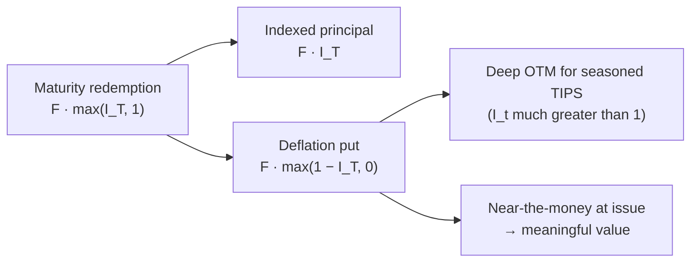

# TIPS: Real Cash Flows, the Fisher Relation, and the Breakeven Decomposition

## 1. Objects: nominal vs real term structures

Fix a probability space with a real pricing kernel (stochastic discount factor) $M_{t+1}>0$ that prices **real** payoffs, and let the price level be $\Pi_t$ with realized gross inflation $1+\pi_{t+1} = \Pi_{t+1}/\Pi_t$. Two riskless-in-their-own-numéraire instruments anchor everything:

- A **real** (indexed) zero paying one unit of consumption at $t+1$ has real price $e^{-r} = \mathbb{E}_t[M_{t+1}]$, defining the **real yield** $r$.
- A **nominal** zero paying one dollar at $t+1$ delivers real payoff $1/(1+\pi_{t+1})$, so its price implies the **nominal yield** $i$ through $e^{-i} = \mathbb{E}_t\!\left[M_{t+1}/(1+\pi_{t+1})\right]$.

TIPS are the securitized version of the real curve: a coupon bond whose principal is scaled by a CPI **index ratio** and whose redemption carries an embedded deflation option (§5).

## 2. The Fisher relation, derived

Consider an investor indifferent between the two zeros under **certainty** (or, equivalently, matching the deterministic parts). Investing one dollar of real wealth in the nominal bond returns $(1+i)$ dollars, whose real value is deflated by the price level:

$$1 + r \;=\; \frac{1+i}{1+\pi} \quad\Longrightarrow\quad \boxed{(1+i) = (1+r)(1+\pi)}.$$

Expanding,

$$i = r + \pi + r\pi \;\approx\; r + \pi,$$

the cross term $r\pi$ being second order (e.g. $r=\pi=0.03 \Rightarrow r\pi = 0.0009$). This is the **Fisher equation**: the nominal yield is the real yield plus compensation for inflation. TIPS let the investor *lock the left factor* $(1+r)$ and let the market supply $(1+\pi)$ ex post, whereas a nominal bond locks the product $(1+i)$ and leaves the investor exposed to realized $\pi$.


```chart
tips_vs_nominal()
```

The nominal bond's *real* return $\,(1+i)/(1+\pi)-1 \approx i-\pi\,$ falls one-for-one in realized inflation (red); the TIPS real return is pinned at $r$ (green) by construction.

## 3. TIPS cash flows and the CPI index ratio

Let $\text{CPI}_{\text{ref}}$ be the reference index at issuance and define the (daily-interpolated) index ratio

$$I_t = \frac{\text{CPI}_t}{\text{CPI}_{\text{ref}}}, \qquad P_t = F\, I_t,$$

with $F$ the original face. A semiannual coupon at fixed real rate $c$ pays the nominal amount $c\,P_{t} = c F I_{t}$; the value of the bond is the sum of inflation-indexed real cash flows discounted on the **real** curve. In real (deflated) terms the security is simply

$$V_0^{\text{real}} = \sum_{k=1}^{n} \frac{cF}{(1+r)^k} + \frac{F}{(1+r)^n},$$

i.e. a plain real annuity plus real principal — the CPI indexation cancels against the deflator, which is exactly why TIPS carry **real duration** and price off real yields. Sensitivity to the *real* yield is the usual

$$D_{\text{real}} = -\frac{1}{V}\frac{\partial V}{\partial r},$$

so TIPS still lose value when real rates rise even though inflation is fully hedged:


```chart
bond_price_yield()
```

## 4. Breakeven inflation ≈ expected inflation + risk premium

Define **breakeven inflation** as the nominal–real yield spread, $b \equiv i - r$. From §2's certainty case, $b = \pi + r\pi \approx \pi$: breakeven equals inflation. Under **uncertainty**, take $M$ and log inflation $\tilde\pi \equiv \ln(1+\pi)$ jointly log-normal, and write $m \equiv \ln M$. Using $\ln \mathbb{E}[e^{X}] = \mathbb{E}[X] + \tfrac12\operatorname{Var}(X)$ for Gaussian $X$:

$$r = -\ln \mathbb{E}[e^{m}] = -\Big(\mathbb{E}[m] + \tfrac12\operatorname{Var}(m)\Big),$$

$$i = -\ln \mathbb{E}[e^{\,m-\tilde\pi}] = -\Big(\mathbb{E}[m] - \mathbb{E}[\tilde\pi] + \tfrac12\operatorname{Var}(m) + \tfrac12\operatorname{Var}(\tilde\pi) - \operatorname{Cov}(m,\tilde\pi)\Big).$$

Subtracting,

$$\boxed{\,b = i - r = \underbrace{\mathbb{E}_t[\tilde\pi]}_{\text{expected inflation}} \;+\; \underbrace{\operatorname{Cov}(m,\tilde\pi)}_{\text{inflation risk premium (IRP)}} \;-\; \underbrace{\tfrac12\operatorname{Var}(\tilde\pi)}_{\text{convexity (Jensen)}}\,}$$

Interpretation:

- **Expected inflation** is the leading term — breakeven is a market-implied inflation forecast, which is why the Fed tracks it.
- **Inflation risk premium** $\operatorname{Cov}(m,\tilde\pi)$: nominal bonds pay off poorly (low real value) precisely when inflation is high; if those high-inflation states coincide with high marginal utility ($m$ high — "bad" states, e.g. stagflation), investors demand extra yield to hold nominal debt, lifting $i$ and hence $b$ **above** pure expected inflation. The sign is empirically regime-dependent: when inflation is *countercyclical* the IRP is positive; when inflation surprises are "good news" (demand-driven booms) it can turn negative.
- **Convexity** shaves a small $-\tfrac12\operatorname{Var}(\tilde\pi)$ from Jensen's inequality on $1/(1+\pi)$.
- **Liquidity.** Empirically add a TIPS **liquidity premium** $\ell>0$: TIPS trade less liquid than on-the-run nominals, biasing the *real* yield up by $\ell$ and thus biasing $b$ **down** by $\ell$. Net: $b \approx \mathbb{E}_t[\tilde\pi] + \text{IRP} - \tfrac12\operatorname{Var}(\tilde\pi) - \ell$.

So "breakeven ≈ expected inflation + inflation risk premium" is the first-order truth; the convexity and liquidity terms are the second-order corrections that make high-frequency breakevens an *imperfect* expectations proxy.

## 5. The deflation-floor as embedded optionality

At maturity a TIPS returns $F\max(I_T,\,1)$, not $F I_T$. Decompose:

$$F\max(I_T, 1) = F\,I_T + F\,\max(1 - I_T,\, 0).$$

The redemption is the indexed principal **plus a European put on the cumulative inflation index** $I_T$ struck at 1 — a floor that pays only under net deflation over the bond's life. Consequences:

- The floor has value $F\cdot \mathbb{E}^{\mathbb{Q}}\!\big[ e^{-\int r}\max(1-I_T,0)\big] \ge 0$, so a freshly issued TIPS (accrued $I \approx 1$, option near the money) is worth strictly more, all else equal, than a **seasoned** TIPS whose accrued index ratio $I_t \gg 1$ pushes the put deep out-of-the-money and nearly worthless.
- This creates a relative-value wedge between new and seasoned TIPS of identical maturity, and makes the floor most valuable exactly when it is most needed (deflation scares), i.e. it is *negatively* correlated with breakeven — a convexity the linear Fisher view misses.



## 6. Where the clean model breaks: the TIPS–Treasury puzzle

No-arbitrage says a nominal Treasury should be replicable by a TIPS plus an inflation swap that converts its real cash flows to nominal. Fleckenstein, Longstaff & Lustig (2014) show the replicating **"TIPS-Treasury" bond trades persistently cheap** to the identical-cash-flow nominal Treasury — mispricings of tens of basis points (up to ~\$20 per \$100 notional at the crisis peak), far too large and durable to be measurement error. The clean SDF framework of §4 assumes frictionless, integrated markets; reality violates that:

- **Liquidity / safety premium on nominals.** On-the-run nominal Treasuries carry a convenience yield (money-like collateral, flight-to-quality demand) that makes them *rich* — the mirror image of the TIPS liquidity discount $\ell$.
- **Slow-moving / limited arbitrage capital.** Capturing the trade requires shorting the rich nominal, holding the cheap TIPS, and paying inflation-swap fixed — a balance-sheet-intensive, negative-carry position that only specialized levered arbitrageurs run. Funding shocks (2008–09) widened, not closed, the gap.
- **Indexation lag & seasonality.** The ~2–3 month CPI publication lag and non-seasonally-adjusted indexation inject basis risk the idealized $I_t$ ignores.

The lesson mirrors every other real-market "arbitrage": the frictionless relation $b = i - r$ is a first-order anchor, and the residual is the price of liquidity, balance sheet, and slow capital.

## References & further reading

- Fisher, I. (1930). *The Theory of Interest.* Macmillan. (The Fisher relation $(1+i)=(1+r)(1+\pi)$.)
- Fleckenstein, M., Longstaff, F. A., & Lustig, H. (2014). *The TIPS–Treasury Bond Puzzle.* Journal of Finance, 69(5), 2151–2197.
- U.S. Department of the Treasury / TreasuryDirect. *Treasury Inflation-Protected Securities (TIPS)* offering documentation and index-ratio methodology.
- Grishchenko, O. V., & Huang, J. (2013). *The Inflation Risk Premium: Evidence from the TIPS Market.* Journal of Fixed Income.
- Campbell, J. Y., Shiller, R. J., & Viceira, L. M. (2009). *Understanding Inflation-Indexed Bond Markets.* Brookings Papers on Economic Activity.
- Gürkaynak, R. S., Sack, B., & Wright, J. H. (2010). *The TIPS Yield Curve and Inflation Compensation.* American Economic Journal: Macroeconomics.

*Educational content, not investment advice.*
