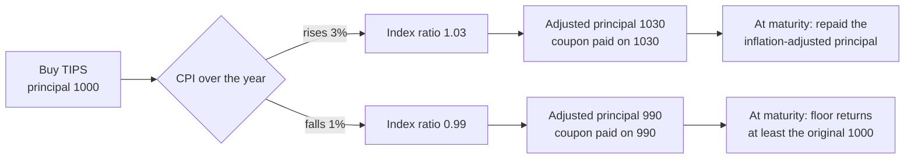
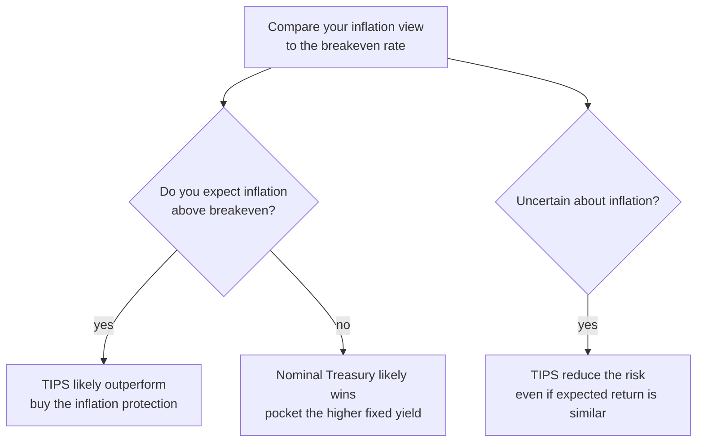

# Treasury Inflation-Protected Securities (TIPS)

## Introduction

When you buy a bond, one of the biggest risks you face is **inflation**. A bond may promise a fixed interest payment, but rising prices quietly erode the purchasing power of those payments. If you earn 4% on a bond while inflation runs at 5%, your **real return** — the return *after* inflation — is actually negative. You end the year with more dollars but less buying power.

To address this, the U.S. Treasury created **Treasury Inflation-Protected Securities (TIPS)**: government bonds engineered so that inflation can't silently eat your return.

## What are TIPS?

TIPS are bonds issued by the U.S. Department of the Treasury whose **principal** adjusts with the **Consumer Price Index (CPI)**, the standard measure of consumer inflation.

Unlike a traditional Treasury bond — where the principal (the amount repaid at maturity) stays fixed — a TIPS bond's principal **rises when inflation rises** and **falls when prices fall** (deflation). The coupon rate is fixed, but because it is applied to a moving principal, the dollar interest you receive moves with inflation too. The result: your investment tracks the cost of living instead of falling behind it.

## How TIPS work

TIPS have three moving parts.

### 1. Inflation-adjusted principal

Each day, the Treasury scales the principal by an **index ratio** — the current CPI relative to the CPI when the bond was issued:

$$\text{Index Ratio}_t = \frac{\text{CPI}_t}{\text{CPI}_{\text{ref}}}, \qquad P_t = P_0 \times \text{Index Ratio}_t$$

So if you buy \$1,000 of TIPS and inflation over the year is 3%, the index ratio is 1.03 and the adjusted principal becomes 1,000 × 1.03 = \$1,030. If prices instead fell 1%, the ratio would be 0.99 and the principal would drop to \$990.





### 2. Fixed coupon rate, moving dollar payments

TIPS pay a fixed coupon rate $c$, but on the *adjusted* principal, so the actual dollar payment is $C_t = c \times P_t$. With a 2% coupon on an original \$1,000:

- First payment (principal still \$1,000): 1,000 × 0.02 = \$20.
- After 3% inflation (principal \$1,030): 1,030 × 0.02 = \$20.60.

As inflation lifts the principal, the dollar coupons rise in lockstep.

### 3. Principal protection at maturity (the deflation floor)

At maturity you receive the inflation-adjusted principal — but if sustained deflation has dragged the adjusted principal *below* the original face value, the Treasury guarantees you get back **at least the original amount**. That floor is a valuable, one-sided safety net.


```ascii
  principal
   |                                ___----  inflation-adjusted principal
   |                      ___----'''
   |            ___----'''
   |  1000 ----'  . . . . . . . . . . . . .  <- original face (deflation floor)
   +--------------------------------------------> time
      buy                                    maturity
```


## Real yield, nominal yield, and breakeven inflation

The yield quoted on TIPS is a **real yield**: the return you keep *after* inflation. A conventional Treasury quotes a **nominal yield**, which bundles together the real return *and* compensation for expected inflation. The gap between the two is the market's inflation forecast:

$$\text{Breakeven Inflation} = \text{Nominal Treasury Yield} - \text{TIPS Real Yield}$$

For example, if a 10-year Treasury yields 4.5% and a 10-year TIPS yields 2.0%, the breakeven inflation rate is 4.5% − 2.0% = **2.5%**. The market is implying that inflation will average about 2.5% per year over the next decade.

That number is also the tipping point between the two bonds:

- If **actual** inflation comes in **above** 2.5%, TIPS win.
- If it comes in **below** 2.5%, the nominal Treasury wins.

The chart below makes the trade-off concrete: a nominal bond's real return slides down one-for-one as inflation rises, while the TIPS real return holds flat.


```chart
tips_vs_nominal()
```


## When TIPS beat nominal bonds

TIPS are essentially an inflation insurance policy. You give up some yield today (the real yield is lower than the nominal yield) in exchange for protection against a surprise. So the decision reduces to a single comparison:





Investors typically hold TIPS for three reasons: **inflation protection** (preserving purchasing power when prices climb), **diversification** (TIPS behave differently from stocks and nominal bonds, cutting a portfolio's inflation exposure), and **retirement planning** (retirees on fixed income are exactly the people most hurt by rising prices).

## Risks: TIPS are not risk-free

### Interest-rate risk

Like all bonds, TIPS lose market value when **real** interest rates rise — if you sell before maturity, you may get less than you paid. The inflation adjustment protects purchasing power, not the mark-to-market price. The usual inverse price–yield relationship still applies:


```chart
bond_price_yield()
```


### Deflation risk

The maturity floor protects your *original* principal, but during the life of the bond, sustained deflation lowers the adjusted principal and shrinks the dollar coupons you collect along the way.

### Tax drag ("phantom income")

In a taxable account, the annual inflation adjustment to principal is treated as taxable income **in the year it accrues** — even though you don't actually receive that cash until maturity. This "phantom income" can create a tax bill with no matching cash flow, which is why TIPS are often held in tax-advantaged accounts.

### Inflation-measurement risk

TIPS track the CPI, which may not match *your* personal inflation. If your spending is heavy in categories like healthcare or housing that rise faster than the overall index, the CPI adjustment can under-compensate you.

## TIPS in monetary policy

Because breakeven inflation is a live, market-priced forecast, TIPS give economists and central bankers a real-time read on **inflation expectations**. The Federal Reserve watches breakevens closely: if expectations climb sharply, the Fed may raise interest rates to cool demand before inflation becomes entrenched. Over the long run, expectations and realized inflation are anchored by the same forces — for instance, sustained money-supply growth:


```chart
money_supply_inflation()
```


## Key takeaways

- **TIPS index their principal to the CPI**, so both the repaid principal and the dollar coupons rise with inflation — protecting *real* purchasing power.
- **Real yield vs nominal yield:** TIPS quote a real yield; the gap to the nominal Treasury yield is **breakeven inflation**, the market's implied inflation forecast.
- **TIPS beat nominal bonds when realized inflation exceeds the breakeven**; below it, the higher-yielding nominal bond wins.
- **The deflation floor** guarantees at least the original face value at maturity — a one-sided protection.
- **Risks remain:** real-rate (interest-rate) risk if sold early, reduced payments during deflation, "phantom income" taxes, and CPI not matching your personal inflation.
- **Breakevens inform policy:** the Fed treats TIPS-implied expectations as a key input to interest-rate decisions.

*Educational content, not investment advice.*
