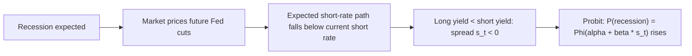

# Treasury Rates: Pricing, Duration, and the Term Structure

## 1. The pricing identity

A default-free coupon bond paying coupon $C$ at times $t = 1,\dots,n$ and face $F$ at $n$, discounted at a flat yield to maturity $y$, has present value

$$P(y) \;=\; \sum_{t=1}^{n} \frac{C}{(1+y)^t} \;+\; \frac{F}{(1+y)^n}.$$

The yield $y$ is defined *implicitly* as the internal rate of return that equates discounted cash flows to the observed market price. This is the object the market actually quotes; "the yield rose" is shorthand for "the $y$ that solves this equation, given a lower $P$, went up."

## 2. Why price and yield move inversely — a proof

Differentiate $P$ term by term. Each summand $C(1+y)^{-t}$ is strictly decreasing in $y$, and so is $F(1+y)^{-n}$:

$$\frac{dP}{dy} \;=\; -\sum_{t=1}^{n} \frac{tC}{(1+y)^{t+1}} \;-\; \frac{nF}{(1+y)^{n+1}} \;=\; -\frac{1}{1+y}\left[\sum_{t=1}^{n} \frac{tC}{(1+y)^{t}} + \frac{nF}{(1+y)^{n}}\right].$$

Every term inside the bracket is strictly positive for $y > -1$, so $dP/dy < 0$ **unconditionally**. Price is a strictly monotone-decreasing function of yield; the "seesaw" is not a heuristic but a theorem about a sum of decreasing functions. The graph is also convex, since (Section 4) $d^2P/dy^2 > 0$:


```chart
bond_price_yield()
```


## 3. Macaulay and modified duration

Rearrange the bracket in Section 2. Define the **Macaulay duration** as the present-value-weighted average time to receipt of cash flow:

$$D_{\text{mac}} \;=\; \frac{1}{P}\left[\sum_{t=1}^{n} t\cdot\frac{C}{(1+y)^{t}} + n\cdot\frac{F}{(1+y)^{n}}\right] \;=\; \frac{\sum_{t} t\,\cdot\,\mathrm{PV}(\text{CF}_t)}{\sum_{t}\mathrm{PV}(\text{CF}_t)}.$$

The price sensitivity in Section 2 is exactly $D_{\text{mac}}$ scaled by $1/(1+y)$. Define **modified duration** as the (negative) relative price sensitivity — the quantity the source article calls simply "duration":

$$\boxed{\,D_{\text{mod}} \;\equiv\; -\frac{1}{P}\frac{dP}{dy} \;=\; \frac{D_{\text{mac}}}{1+y}\,.}$$

To first order, therefore,

$$\frac{\Delta P}{P} \;\approx\; -\,D_{\text{mod}}\,\Delta y.$$

This is the "% price change ≈ −duration × yield change" rule. A 30-year bond with $D_{\text{mod}} \approx 20$ loses about 20% for a +100 bp move, matching the ~14% mark-to-market loss quoted for a +70 bp shock ($-20 \times 0.007 = -0.14$).

**Continuous-compounding note.** If instead $P = \sum_t C e^{-yt} + F e^{-yn}$, then $dP/dy = -\sum_t t\,\mathrm{PV} = -D_{\text{mac}}P$, so $D_{\text{mod}} = D_{\text{mac}}$ exactly — the $1/(1+y)$ factor is an artifact of discrete compounding.

## 4. Convexity: the second-order correction

Duration is a linear (tangent-line) approximation and systematically mis-prices large moves. Differentiate again:

$$\frac{d^2P}{dy^2} \;=\; \sum_{t=1}^{n} \frac{t(t+1)C}{(1+y)^{t+2}} \;+\; \frac{n(n+1)F}{(1+y)^{n+2}} \;>\; 0.$$

Define **convexity** $\mathcal{C} \equiv \dfrac{1}{P}\dfrac{d^2P}{dy^2} > 0$. The second-order Taylor expansion of the price–yield map gives

$$\frac{\Delta P}{P} \;\approx\; -\,D_{\text{mod}}\,\Delta y \;+\; \tfrac{1}{2}\,\mathcal{C}\,(\Delta y)^2.$$

Because $\mathcal{C} > 0$, the correction term is always positive: duration **overstates** the loss when yields rise and **understates** the gain when yields fall. Positive convexity is a feature the holder is paid to want — the actual 30-year loss for a +100 bp move is a bit less than the 20% duration estimate, and the actual gain for a −100 bp move is a bit more. This asymmetry is precisely the curvature visible in the price–yield plot above.

## 5. The term structure: expectations plus a term premium

The single-$y$ view collapses a whole curve of maturity-specific yields $y_n$. Under the **pure expectations hypothesis (EH)**, a long yield is the geometric average of expected future one-period rates, with no compensation for risk:

$$(1+y_n)^n \;=\; \prod_{k=0}^{n-1}\bigl(1 + \mathbb{E}_t[r_{t+k}]\bigr) \quad\Longrightarrow\quad y_n \;\approx\; \frac{1}{n}\sum_{k=0}^{n-1}\mathbb{E}_t[r_{t+k}].$$

Empirically the EH is rejected: investors require a maturity-dependent **term premium** $\phi_n$, so

$$y_n \;=\; \underbrace{\frac{1}{n}\sum_{k=0}^{n-1}\mathbb{E}_t[r_{t+k}]}_{\text{expected-rates path}} \;+\; \underbrace{\phi_n}_{\text{term premium}}.$$

The associated one-period **forward rate** implied by adjacent maturities is

$$1 + f_t^{(n)} \;=\; \frac{(1+y_n)^n}{(1+y_{n-1})^{n-1}},$$

which under EH equals $\mathbb{E}_t[r_{t+n-1}]$ up to the premium. This decomposition explains curve shape mechanically: a **normal** (upward) curve reflects expected steady short rates plus a positive $\phi_n$; an **inverted** curve requires the expected-rates path to fall enough to overwhelm $\phi_n$ — i.e. the market prices in future rate *cuts*.


```chart
yield_curve()
```


## 6. Inversion → recession: the empirical signal

If a downturn is expected, the market anticipates Fed easing, so $\mathbb{E}_t[r_{t+k}]$ for large $k$ drops below the current short rate and the spread $s_t = y_{\text{10y}} - y_{\text{3m}}$ turns negative. Estrella & Mishkin (1998) formalize this as a **probit** model for a recession indicator $y^{\text{rec}}_{t+h} \in \{0,1\}$ at horizon $h$ (typically 4 quarters):

$$\Pr\bigl(\text{recession in } [t, t+h]\bigr) \;=\; \Phi\!\left(\alpha + \beta\, s_t\right), \qquad \beta < 0,$$

where $\Phi$ is the standard normal CDF. Their finding: the term spread is the single best financial leading indicator at the four-quarter horizon, dominating stock returns and monetary aggregates. Every US recession since the 1960s was preceded by an inversion of the 10y–3m (or 10y–2y) spread, with lead times of roughly 6–18 months.


```chart
business_cycle()
```


Caveats that matter for a quant using this signal:

- **Time-varying term premium.** Campbell & Shiller (1991) show the spread predicts future short-rate changes with the "wrong" sign relative to the EH — the premium $\phi_n$ is itself time-varying and predictable, so a compressed or negative spread can reflect a low/negative premium rather than pure rate-cut expectations. QE-era premium suppression complicates the read.
- **False positives and small samples.** Roughly a dozen post-war recessions is a thin sample for calibrating $\Phi(\alpha + \beta s_t)$; confidence intervals on $h$ and on the threshold are wide.
- **Non-stationarity.** The relationship is a reduced-form correlation, not a structural law; regime shifts (r-star drift, changed Fed reaction functions) can move $\alpha, \beta$.
- **Real vs. nominal.** Decompose nominal yields into TIPS (real) yields plus breakeven inflation before attributing a move to growth vs. inflation expectations; an inversion driven by falling real yields differs economically from one driven by collapsing breakevens.





## 7. Synthesis

The inverse price–yield relationship, duration, and convexity are three orders of the same Taylor expansion of $P(y)$; the yield curve is the cross-maturity extension in which each $y_n$ carries an expected-rates path and a term premium. Yield moves are decompositions of shifts in expected real rates, expected inflation, and premia — and the inverted curve is the market's compressed forecast that the expected-rates path is about to fall. Treat the recession signal as a well-calibrated but reduced-form probability, not a deterministic law.

## References & further reading

- Fabozzi, F. J. *Bond Markets, Analysis, and Strategies.* (Duration, convexity, term structure — the standard practitioner text.)
- Macaulay, F. R. (1938). *Some Theoretical Problems Suggested by the Movements of Interest Rates, Bond Yields and Stock Prices.* NBER. (Origin of duration.)
- Estrella, A. & Mishkin, F. S. (1998). "Predicting U.S. Recessions: Financial Variables as Leading Indicators." *Review of Economics and Statistics*, 80(1), 45–61.
- Campbell, J. Y. & Shiller, R. J. (1991). "Yield Spreads and Interest Rate Movements: A Bird's Eye View." *Review of Economic Studies*, 58(3), 495–514.
- Cochrane, J. H. & Piazzesi, M. (2005). "Bond Risk Premia." *American Economic Review*, 95(1), 138–160. (Time-varying term premia.)
- Estrella, A. & Trubin, M. (2006). "The Yield Curve as a Leading Indicator: Some Practical Issues." *FRBNY Current Issues in Economics and Finance.*
