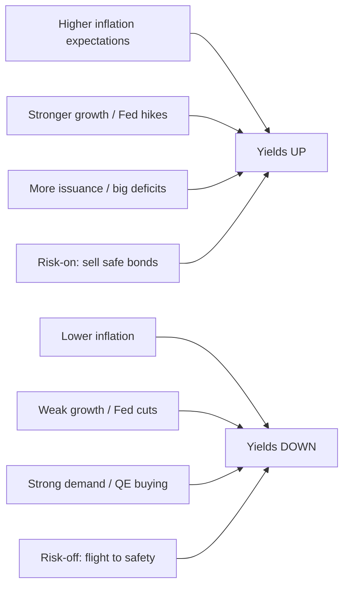
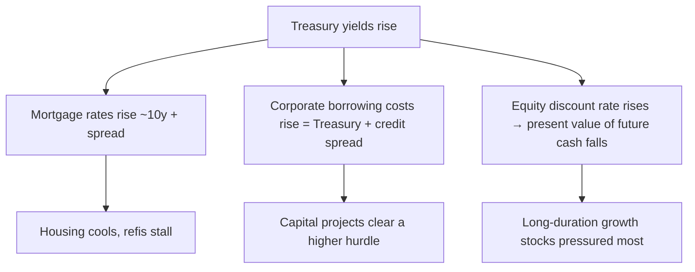

# Understanding Treasury Rates

## What Treasuries and yields are

A US Treasury security is a loan you make to the federal government. In return you receive scheduled **coupon** (interest) payments and, at maturity, your principal back. Because they carry the full faith and credit of the US government, Treasuries are treated as the **risk-free rate** — the base on which almost every other rate (mortgages, corporate bonds, auto loans) is priced as a spread.

The **yield** is the annual return you earn *relative to the price you pay today*. Roughly,

$$y \approx \frac{\text{annual coupon}}{\text{price}}.$$

That single fraction contains the most important idea in the bond market.

## The inverse relationship: price ↔ yield

Because the coupon is **fixed**, the only way the market can re-rate a bond is by moving its **price**. Price and yield are two ends of a seesaw.

Take a \$1,000 face-value bond paying a \$50 coupon (a 5% coupon):

- Buy it at face value: yield = \$50 / \$1,000 = 5.00%
- If the price falls to \$900: yield = \$50 / \$900 = 5.56%
- If the price rises to \$1,100: yield = \$50 / \$1,100 = 4.55%

When investors sell bonds, prices fall and yields rise; when they buy, prices rise and yields fall. Plotting price against yield for a real coupon bond shows the same story as a smooth, downward-sloping (convex) curve:


```chart
bond_price_yield()
```


This is also why **duration risk** matters: a long-maturity bond's price moves a lot for a small yield change. A 30-year Treasury has a duration near 20 years, so a 1% rise in yields costs its holder roughly a 20% mark-to-market loss.

## What moves Treasury yields

Yields are a market price, set by shifting expectations. The main drivers:

1. **Inflation expectations.** Coupons are fixed in nominal dollars, so higher expected inflation erodes their real value. Investors demand more yield to compensate. As a rule of thumb, real yield ≈ nominal yield − expected inflation: $r \approx y - \pi$.
2. **Economic growth.** Strong growth tends to raise inflation, lift corporate earnings (making stocks relatively more attractive than bonds), and invite Fed rate hikes — all of which push yields up.
3. **Federal Reserve policy.** The Fed sets only the overnight rate directly, but its rate path, forward guidance, and bond buying/selling (QE/QT) ripple across the curve.
4. **Supply and demand.** Large deficits mean more issuance and generally higher yields to attract buyers; strong demand from pensions, insurers, foreign central banks, or "safe-haven" flows pushes yields down.
5. **Global factors.** Treasuries trade in a world market — foreign yields, currency expectations, and geopolitics all feed in.





### Real vs. nominal returns

Because inflation is the silent tax on a fixed coupon, investors ultimately care about **real** (after-inflation) returns. Inflation-protected Treasuries (TIPS) adjust their principal with the price level, so they hold a positive real return even when inflation surprises higher — while a nominal bond's real return erodes one-for-one:


```chart
tips_vs_nominal()
```


The gap between nominal and TIPS yields — the **breakeven inflation rate** — is a clean market read on expected inflation.

## The yield curve

Plot Treasury yields against maturity (3-month out to 30-year) and you get the **yield curve**. Its shape is one of the most-watched signals in macro.


```chart
yield_curve()
```


```ascii
 yield
   |            ______  Normal  (long > short: growth + term premium)
   |        __/
   |     __/______________ Flat  (little difference: uncertainty)
   |    /       \______
   |   /               \____ Inverted (short > long: rate-cut / recession fears)
   +----------------------------------> maturity
     3M   2Y    5Y   10Y   30Y
```


- **Normal (upward-sloping).** Long yields exceed short yields; investors demand a **term premium** for locking money up longer. The typical healthy state.
- **Flat.** Little difference across maturities — the market is uncertain about the direction of growth and policy.
- **Inverted.** Short yields exceed long yields. This happens when investors expect the Fed to **cut** rates in the future, which usually means they expect the economy to weaken.

### Inversion as a recession signal

An inverted curve — most commonly measured as the 10-year yield minus the 3-month (or 2-year) yield turning negative — has preceded every US recession of the past half-century, typically by 6–18 months. The logic: to buy a low long-term yield today, investors must expect short rates (and growth) to fall sharply tomorrow.


```chart
business_cycle()
```


It is a *signal*, not a guarantee. False positives happen, and the lead time is variable, so the curve is best used alongside other indicators (credit spreads, TIPS breakevens, Fed-funds futures), not as a standalone forecast.

## How yields transmit to everything else

Because Treasuries are the risk-free base, a move in yields propagates outward:





A 30-year fixed mortgage typically prices ~150–200 basis points above the 10-year Treasury; a corporate bond prices at the Treasury yield plus a credit spread that widens with default risk. In a discounted-cash-flow model, a higher risk-free rate raises the discount rate and lowers the present value of future cash flows — which is why long-duration growth stocks fall more than near-earnings value stocks when yields climb.

## Key takeaways

- A Treasury is a loan to the government; its **yield** is the return relative to today's price, and it anchors nearly all other rates.
- Price and yield move **inversely** because the coupon is fixed — the only free variable is price.
- Yields are driven by inflation, growth, Fed policy, and bond supply/demand, in a global market.
- The **yield curve's** shape (normal / flat / inverted) signals the economy's outlook; **inversion** is a well-known but imperfect recession warning.
- Yield moves transmit to mortgages, corporate borrowing, and equity valuations — with long-duration assets most exposed.
- This is educational material, not investment advice.
