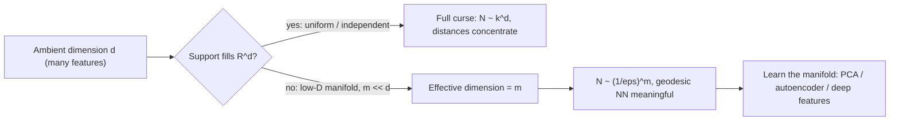

# The Curse of Dimensionality: Concentration, Sparsity, and the Manifold Escape

The phrase, coined by Bellman (1961) in the context of dynamic programming, names a family of geometric and statistical facts that all sharpen as the ambient dimension $d \to \infty$: volume concentrates in vanishingly thin shells, pairwise distances lose contrast, and the sample size required to fill space or estimate a density grows exponentially. We derive each precisely, then show why real data escapes the worst of it.

## 1. Boundary concentration in the hypercube

**Claim.** In the unit cube $[0,1]^d$, the fraction of volume within Euclidean-coordinate distance $\varepsilon$ of the boundary tends to 1 as $d \to \infty$.

**Derivation.** A point $x \in [0,1]^d$ is *interior* (at least $\varepsilon$ from every face) iff every coordinate lies in $[\varepsilon, 1-\varepsilon]$. That interior set is itself a cube of side $1 - 2\varepsilon$, so

$$\operatorname{Vol}(\text{interior}) = (1 - 2\varepsilon)^d, \qquad \operatorname{Vol}(\text{boundary shell}) = 1 - (1 - 2\varepsilon)^d.$$

For any fixed $\varepsilon \in (0, \tfrac12)$ we have $0 < 1 - 2\varepsilon < 1$, hence $(1-2\varepsilon)^d \to 0$ and the shell fraction $\to 1$ geometrically. With $\varepsilon = 0.05$ the interior retains $0.9^d$: about 60% at $d=5$, 12% at $d=20$, and $0.005$ at $d=100$. Almost every point of a high-dimensional cube is jammed against its surface.

```chart
curse_of_dimensionality()
```

An equivalent statement for the $\ell_2$ ball: the ratio of the volume of a radius-$(1-\varepsilon)$ ball to a radius-1 ball is $(1-\varepsilon)^d \to 0$, so all the mass of a uniform ball lives in an outer skin of thickness $O(1/d)$. The "middle" of a high-dimensional region is, measure-theoretically, empty.

### Gaussian annulus corollary

The same concentration afflicts the standard Gaussian $X \sim \mathcal N(0, I_d)$. Writing $\lVert X \rVert^2 = \sum_{j=1}^d X_j^2$, the summands are i.i.d. with mean 1 and variance 2, so $\mathbb E \lVert X \rVert^2 = d$ and $\operatorname{Var}\lVert X \rVert^2 = 2d$. By Chebyshev,

$$\mathbb P\!\left( \big| \lVert X \rVert^2 - d \big| \ge t \right) \le \frac{2d}{t^2},$$

so $\lVert X \rVert = \sqrt d \,\big(1 + O_p(d^{-1/2})\big)$. High-dimensional Gaussian mass sits in a thin **annulus** of radius $\sqrt d$, not at the mode at the origin — the density is maximal at a point where essentially no samples fall.

## 2. Distance concentration (Beyer et al., 1999)

**Setup.** Draw $n$ data points $X_1,\dots,X_n$ i.i.d. in $\mathbb R^d$ with i.i.d. coordinates, and a query $q$. Let $D_i = \lVert X_i - q \rVert$. Define the relative contrast $\rho_d = (D_{\max} - D_{\min})/D_{\min}$.

**Claim.** Under mild moment conditions, $\rho_d \xrightarrow{\;p\;} 0$; equivalently $D_{\max}/D_{\min} \to 1$. Nearest and farthest neighbors become indistinguishable.

**Derivation.** Take $q$ fixed and coordinates centered so $\mu := \mathbb E[(X_{ij}-q_j)^2] < \infty$ and $v := \operatorname{Var}\big[(X_{ij}-q_j)^2\big] < \infty$. Then

$$D_i^2 = \sum_{j=1}^d (X_{ij}-q_j)^2, \qquad \mathbb E[D_i^2] = d\mu, \qquad \operatorname{Var}(D_i^2) = d v.$$

The squared-distance coefficient of variation is

$$\frac{\sqrt{\operatorname{Var}(D_i^2)}}{\mathbb E[D_i^2]} = \frac{\sqrt{d v}}{d \mu} = \frac{1}{\sqrt d}\,\frac{\sqrt v}{\mu} \;\longrightarrow\; 0.$$

So $D_i^2 = d\mu\big(1 + O_p(d^{-1/2})\big)$ and, taking square roots, $D_i = \sqrt{d\mu}\,\big(1 + O_p(d^{-1/2})\big)$ for **every** $i$ simultaneously (the fixed $n$ distances share the same limit). The spread $D_{\max}-D_{\min}$ is $O_p(1)$ while $D_{\min}$ grows like $\sqrt{d\mu}$, hence $\rho_d = O_p(d^{-1/2}) \to 0$.

This is the Beyer–Goldstein–Ramakrishnan–Shaft theorem: whenever

$$\lim_{d\to\infty} \operatorname{Var}\!\left( \frac{\lVert X_d \rVert^p}{\mathbb E \lVert X_d \rVert^p} \right) = 0,$$

the ratio $D_{\max}/D_{\min} \to 1$ in probability. The i.i.d.-coordinate case above satisfies the hypothesis with $p=2$. Consequences: k-NN, kernel density estimation, radius-based clustering, and "find the most similar historical regime" all lose discriminative power, because the signal (contrast between points) shrinks as $d^{-1/2}$ while any measurement noise does not. Aggarwal, Hinneburg & Keim (2001) refine this, showing fractional $\ell_p$ norms ($p<1$) preserve contrast longer than Euclidean.

## 3. Exponential sample complexity

**Covering argument.** To approximate a Lipschitz function on $[0,1]^d$ to resolution $h$, tile the cube with axis-aligned cells of side $h$; there are $(1/h)^d$ of them, and controlling error in each requires at least one sample per cell:

$$N \;\gtrsim\; \left(\tfrac{1}{h}\right)^{d} \;=\; k^{d}, \qquad k = 1/h.$$

**Nearest-neighbor radius.** For $N$ uniform points in $[0,1]^d$, the expected distance to the nearest neighbor scales as

$$r_{\text{NN}}(N,d) \;\sim\; \left(\frac{1}{N}\right)^{1/d},$$

because a ball of radius $r$ has volume $\propto r^d$ and must contain $\approx 1$ of the $N$ points. To *shrink* that radius to a fixed $r$, you need $N \sim r^{-d}$ — exponential in $d$. Numerically, "10 samples per axis" ($k=10$) means $10^2$ points in 2-D but $10^{20}$ in 20-D, already exceeding any conceivable financial time series. This is the quantitative core of "great in-sample, hopeless live": with $D/N$ not small, the fitted model interpolates noise. As complexity crosses the bias–variance turning point, the generalization gap widens:

```chart
overfitting_curve()
```

Estimation-theoretic version: for nonparametric regression of a $\beta$-smooth function, the minimax $L_2$ rate is $N^{-\beta/(2\beta+d)}$ (Stone). The $d$ in the denominator is the curse — the rate degrades toward $O(1)$ as $d$ grows, so no estimator can converge quickly without extra structure.

## 4. The manifold escape hatch

The exponents above assume the data genuinely fills a $d$-dimensional set. Real data rarely does. Suppose the support is (near) a compact, smooth $m$-dimensional manifold $\mathcal M \subset \mathbb R^d$ with $m \ll d$ (the **manifold hypothesis**). Then the metric entropy is governed by the *intrinsic* dimension: the $\varepsilon$-covering number satisfies

$$N(\varepsilon, \mathcal M) \;\asymp\; \left(\tfrac{1}{\varepsilon}\right)^{m}, \qquad m = \dim \mathcal M,$$

so sample complexity and approximation rates scale with $m$, not $d$. Distances measured *along* the manifold (geodesics) retain contrast, which is why nonlinear dimensionality reduction (Isomap, LLE, autoencoders) and, more generally, deep networks that learn compositional low-dimensional features can beat the curse. The canonical picture is a 2-D sheet coiled inside $\mathbb R^3$:

```chart
manifold_swiss_roll()
```



Additional structural rescuers, each reducing the *effective* dimension: strong feature correlation (the covariance $\Sigma$ has few large eigenvalues, so PCA captures the variance in $\ll d$ components); sparsity of the true predictor (only $s \ll d$ coordinates matter, recoverable by $\ell_1$/Lasso with sample complexity $N \sim s\log d$ rather than $\exp(d)$); and smoothness priors that shrink the effective hypothesis class.

## 5. Where the intuition breaks — and design implications

- **Independence is a worst case.** The $k^d$ counting assumes independent, space-filling coordinates. Correlated features make the effective dimension the number of non-negligible eigenvalues of $\Sigma$, often far smaller. Report the participation ratio $\big(\sum_i \lambda_i\big)^2 / \sum_i \lambda_i^2$ as a cheap effective-dimension estimate.
- **The norm matters.** Concentration is stated for $\ell_2$; fractional norms and cosine similarity (direction rather than magnitude) partially restore contrast, which is why text/embedding pipelines favor cosine distance.
- **Selection bias compounds sparsity.** Searching a large feature pool and keeping the best inflates the in-sample edge (multiple-testing / deflated-Sharpe problem, López de Prado). In high $d$ this is severe because spurious high-contrast directions are abundant — always evaluate on deflated, out-of-sample, walk-forward estimates.
- **Practical guardrail.** Keep $D/N \lesssim 0.1$; prefer $N > 100D$. Reduce $d$ before you model (selection, PCA, factors, domain pruning), regularize (L1/L2/elastic net, tree-depth caps), and validate on time-ordered splits.

## References & further reading

- Bellman, R. (1961). *Adaptive Control Processes: A Guided Tour.* Princeton University Press. (Origin of the term.)
- Beyer, K., Goldstein, J., Ramakrishnan, R., & Shaft, U. (1999). *When Is "Nearest Neighbor" Meaningful?* ICDT. (Distance-concentration theorem.)
- Aggarwal, C. C., Hinneburg, A., & Keim, D. A. (2001). *On the Surprising Behavior of Distance Metrics in High Dimensional Space.* ICDT. (Fractional $\ell_p$ norms.)
- Hastie, T., Tibshirani, R., & Friedman, J. (2009). *The Elements of Statistical Learning*, 2nd ed., §2.5 "Local Methods in High Dimensions." Springer.
- Stone, C. J. (1982). *Optimal Global Rates of Convergence for Nonparametric Regression.* Annals of Statistics. (Minimax rate $N^{-\beta/(2\beta+d)}$.)
- Vershynin, R. (2018). *High-Dimensional Probability.* Cambridge University Press. (Concentration, Gaussian annulus.)
- Fefferman, C., Mitter, S., & Narayanan, H. (2016). *Testing the Manifold Hypothesis.* J. Amer. Math. Soc.
- López de Prado, M. (2018). *Advances in Financial Machine Learning.* Wiley. (Deflated Sharpe, feature importance under multiplicity.)
