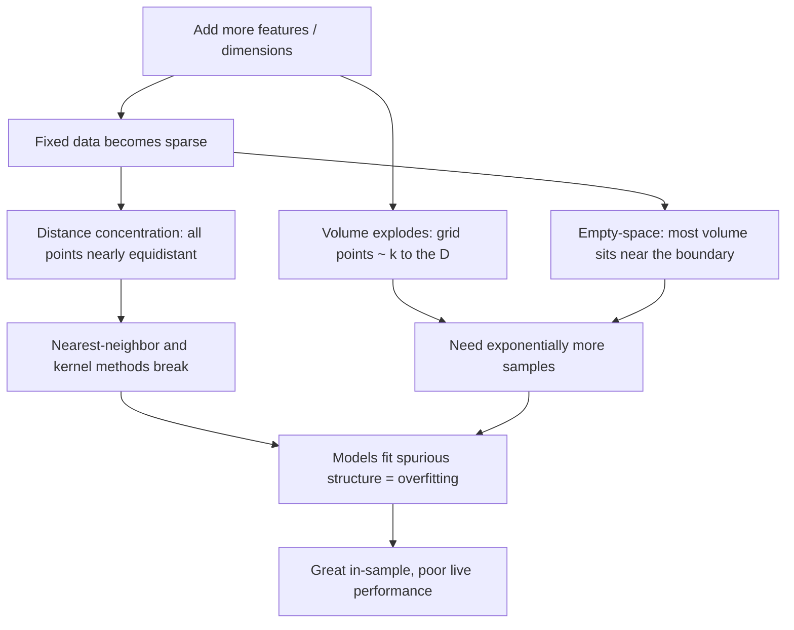
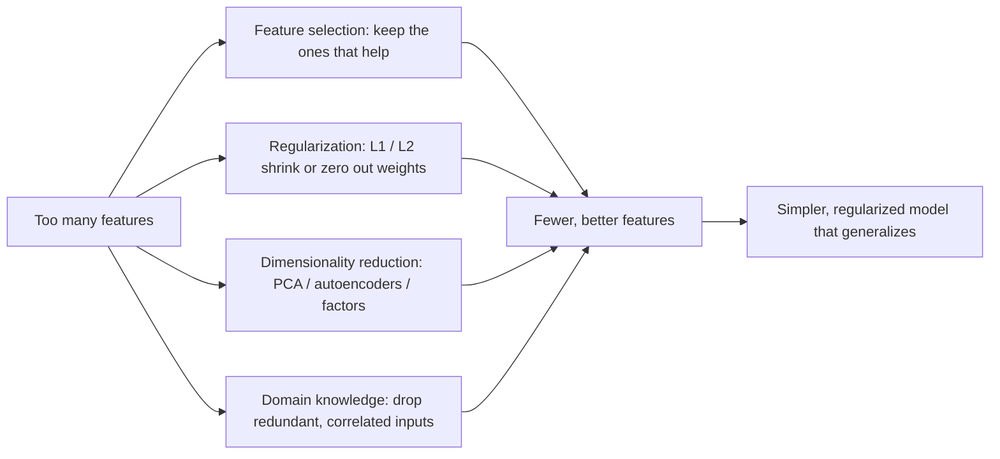

# The Curse of Dimensionality

The **curse of dimensionality** is a cluster of phenomena that make learning harder as the number of features (dimensions) grows. In trading it shows up as a counterintuitive rule: **more indicators do not mean better predictions — often the opposite.** As you add features, space explodes, your data turns sparse, distances stop being meaningful, and overfitting becomes almost inevitable.

**The core problem:** in high dimensions, any fixed dataset becomes a scattering of isolated points in a vast empty space, and models trained on it fit noise because there is nothing else to fit.

## The problem in plain terms

Suppose you have 1,000 historical days of data. That sounds like plenty, until you try to:

- Use 50 features — that is only about 20 samples *per* dimension.
- Find "similar" past days — in high dimensions almost every day looks equally different.
- Estimate a probability density — almost every region of the space has **zero** observations.

The result is forced overfitting: the data is simply too sparse to pin down anything real.

## What actually happens as dimensions grow

Three distinct effects compound each other.



### 1. Volume explosion

Consider a unit hypercube $[0,1]^D$. To cover just 10% of the range along *each* axis simultaneously, you occupy a fraction of the total volume equal to

$$\text{fraction of volume} = 0.1^{D}.$$

- 2D: 1% of the volume — 100 points give you 1% density.
- 5D: 0.001% of the volume — you would need 100,000 points.
- 10D: $10^{-10}$ of the volume — 100 billion points.
- 50D: essentially zero — around $10^{52}$ points.

With 1,000 samples in 50 dimensions, your data is unimaginably sparse.

### 2. Distance concentration

In high dimensions, the distances from a query point to *all* other points become nearly equal. The relative gap between the farthest and nearest neighbor collapses:

$$\frac{\text{dist}_{\max} - \text{dist}_{\min}}{\text{dist}_{\min}} \longrightarrow 0 \quad \text{as } D \to \infty.$$

Once every point is "about the same distance away," the phrase *nearest neighbor* loses meaning — and any method built on it (k-NN, kernels, clustering, similarity search for "market conditions like today") quietly stops working.

### 3. The empty-space phenomenon

Almost all of a high-dimensional region's volume sits in a thin shell near its boundary. For a hypercube, the fraction of volume lying within $\varepsilon$ of the surface is

$$1 - (1 - 2\varepsilon)^{D},$$

which races to 1 as $D$ grows. The chart below tracks that outer-shell fraction: past a handful of dimensions, virtually every random point lives on the edge, far from the "typical" center you imagined.

```chart
curse_of_dimensionality()
```

## Why models and validation struggle

**Overfitting becomes inevitable.** A flexible model (random forest, neural net, deep tree) will always find *some* rule that separates the training data — for example, "when RSI is between 47.3 and 48.1 AND the 20-day MA is rising AND volume is elevated." That pattern occurred three times historically, all before up-moves, and never recurs live. In high dimensions any finite sample *looks* structured even when it is pure noise. As model complexity rises past the sweet spot, training error keeps falling while validation error turns back up:

```chart
overfitting_curve()
```

**Cross-validation can lie to you.** Your train and test folds may both sit in unrepresentative corners of the space, while live data arrives in yet another region. You get a clean cross-validation score and terrible live performance. Time-aware, walk-forward validation — never training on the future — is the minimum defense:

```chart
walk_forward_cv()
```

## How much data would you actually need?

For smooth function approximation, required sample size grows roughly exponentially with dimension:

$$N \approx k^{D},$$

where $k$ is the samples wanted per dimension (5–10 is typical). With $k = 10$:

- 2 dimensions → 100 samples
- 5 dimensions → 100,000 samples
- 10 dimensions → 10 billion samples
- 20 dimensions → $10^{20}$ samples (more than the number of grains of sand on Earth)

You will never have this much data — the observable universe holds only about $10^{80}$ atoms. The practical lesson: keep the ratio of dimensions to samples small, roughly $D/N < 0.1$.

```ascii
  1,000 samples, spread thin:

   2 features   ####### #### ###### ####   (dense enough)
   8 features   #   #     #   #   #    #    (getting airy)
  50 features   #        #            #     (basically empty)
```

## Practical strategies to fight the curse

The escape route is always the same idea: **reduce the effective dimension** — either by removing features, constraining the model, or projecting onto a lower-dimensional structure.



**Feature selection** — keep only features that carry independent signal, and aim for $N > 10D$ at minimum, preferably $N > 100D$.

**Regularization** — penalize complexity so the model ignores irrelevant inputs. L1 (Lasso) drives coefficients to exactly zero, giving automatic feature selection; L2 (Ridge) shrinks them smoothly:

$$\text{Lasso: } \min_w \; \lVert y - Xw \rVert^2 + \lambda \sum_i |w_i|, \qquad \text{Ridge: } \min_w \; \lVert y - Xw \rVert^2 + \lambda \sum_i w_i^2.$$

```python
from sklearn.linear_model import ElasticNet
model = ElasticNet(alpha=0.01, l1_ratio=0.5)  # L1 + L2 together
model.fit(X, y)
```

**Dimensionality reduction** — project 50 features onto 10 principal components (PCA), a learned autoencoder, or a handful of economic factors (Fama–French, etc.).

**Domain knowledge** — do not feed the model both price and log-price, or RSI-14 and RSI-15; collapse correlated indicators into one.

**Simpler models** — in the high-dimension, low-sample regime, a regularized linear model or a shallow tree routinely beats a deep, flexible one.

## The blessing that saves us

The curse is not absolute, because real data is not uniformly scattered. It has structure: features are correlated (lowering the *effective* dimension), most features are irrelevant for any given prediction, the true function is usually smooth, and — crucially — data tends to lie on a low-dimensional **manifold** curled inside the high-dimensional space.

```chart
manifold_swiss_roll()
```

If a genuinely 2-D surface is embedded in a 100-D feature space, the sample complexity is governed by the *intrinsic* dimension (2), not the ambient one (100). This "blessing of non-uniformity" is exactly what deep learning, kernel methods, and PCA exploit.

## Detecting whether you are cursed

Warning signs: training accuracy far above test accuracy; performance that *degrades* as you add features; feature-importance rankings that reshuffle completely on retraining; and an inability to beat a simple 3-feature linear baseline. A quick diagnostic is to sweep the number of features and plot out-of-sample score — if it peaks at a low feature count and declines thereafter, the curse is biting.

## Key takeaways

- Adding dimensions makes volume explode, so a fixed dataset becomes hopelessly sparse.
- In high dimensions distances concentrate — nearest-neighbor and kernel methods lose meaning.
- Almost all volume sits near the boundary (the empty-space phenomenon), so "typical" points are all on the edge.
- Sample requirements grow roughly as $k^D$; you will never brute-force your way out with data.
- Fight back with feature selection, regularization (L1/L2), PCA/factor reduction, domain knowledge, and simpler models.
- The escape hatch is real structure: data usually lives on a low-dimensional manifold, so intrinsic dimension — not feature count — is what matters. Fewer, better features beat more, mediocre ones.
