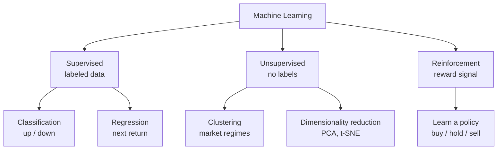
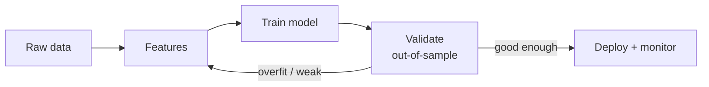

# Introduction to Machine Learning in Trading

## Overview

Machine learning (ML) lets a trading system **learn patterns from historical data** and make predictions about future markets, rather than following rules a human hard-codes by hand. The promise is real, but so is the danger: financial data is noisy, non-repeating, and ordered in time, so the naive ML workflow that works on cat photos will quietly deceive you. This article covers the core ideas — the three learning paradigms, feature engineering, honest validation, the right metrics, and the pitfalls that turn a beautiful backtest into a losing strategy.

## Types of Machine Learning

The three paradigms differ in *what the model is shown* and *what it is asked to produce*.



### 1. Supervised Learning

Used when you have historical data with **known outcomes** (labels):

- **Classification**: predict market direction (up/down).
- **Regression**: predict a numeric target such as the next return or price level.

Common algorithms: linear/logistic regression, random forests, gradient boosting, support vector machines, neural networks.

### 2. Unsupervised Learning

Used to discover **hidden structure** with no labels:

- **Clustering** (K-means): group similar market conditions or regimes.
- **Dimensionality reduction** (PCA, t-SNE): compress many correlated features into a few, cutting noise before modeling.

### 3. Reinforcement Learning

Learns a trading **policy** through trial and error against a reward (e.g. risk-adjusted P&L): Q-learning (value-based), policy-gradient methods (direct policy optimization), and actor-critic methods (both). Powerful in principle, but sample-hungry and easy to overfit to a single historical path.

## Feature Engineering

A model is only as good as the inputs — or *features* — you feed it. Feature engineering turns raw ticks into signals with predictive structure.

### Technical Indicators

Transform raw price into normalized, bounded signals. The Relative Strength Index and MACD are classics:

$$\text{RSI} = 100 - \frac{100}{1 + \frac{\text{Average Gain}}{\text{Average Loss}}}$$

$$\text{MACD} = \text{EMA}_{12} - \text{EMA}_{26}$$

### Market Microstructure Features

- Order-book imbalance (buy vs. sell pressure)
- Volume-weighted average price (VWAP)
- Bid-ask spread dynamics and trade-flow signs

### Alternative Data

- News and social-media sentiment
- Economic indicators and surprise indices
- Satellite imagery, shipping, card-spend, and other "alt-data"

## The Modeling Pipeline

Every honest ML strategy walks the same loop — and the arrow that matters most is the one back from validation.



## Overfitting: The Central Enemy

As you make a model more complex, its error on the **training** data keeps falling — it can eventually memorize the past perfectly. But error on **new** data first falls, then rises again, because the model starts fitting noise instead of signal. The gap between the two curves is overfitting.

```chart
overfitting_curve()
```

The low point of the red curve is the **sweet spot** — enough complexity to capture real structure (low *bias*), not so much that it chases noise (low *variance*). A model that looks flawless in-sample and mediocre out-of-sample is telling you it memorized rather than learned.

## Model Validation

### Time-Series Cross-Validation

Standard k-fold cross-validation shuffles rows and trains on some while testing on others. On time-ordered market data that is **cheating**: it lets the model learn from the future to predict the past. The fix is **walk-forward analysis** — always train on a past window and test on the window that comes *after* it.

```chart
walk_forward_cv()
```

```python
# Walk-forward analysis
for i in range(train_size, len(data) - test_size):
    train_data = data[i-train_size:i]
    test_data = data[i:i+test_size]
    model.fit(train_data)
    predictions = model.predict(test_data)
```

Each fold's blue training bar sits entirely before its amber test bar, so the model is only ever evaluated on genuinely unseen future data — the same order it will face live.

### Performance Metrics

Accuracy alone is misleading in trading; you care about *risk-adjusted* money.

- **Sharpe Ratio**: return per unit of volatility.
- **Maximum Drawdown**: largest peak-to-trough equity decline — the pain you must survive.
- **Information Ratio**: active return per unit of tracking error.

$$\text{Sharpe Ratio} = \frac{R_p - R_f}{\sigma_p}$$

where $R_p$ is portfolio return, $R_f$ the risk-free rate, and $\sigma_p$ the standard deviation of portfolio returns.

For a direction classifier, a raw accuracy number hides *which* mistakes you make — and not all errors cost the same. A confusion matrix separates them:

```chart
confusion_matrix_demo()
```

A "False Up" (you predicted up, price fell, you were long) can be far more expensive than a "False Down" (you missed a rally but lost nothing). Weight your metric by the P&L consequence of each cell, not just the count.

## Common Pitfalls

### 1. Data Snooping (Overfitting)

Testing hundreds of variants until one looks great fits the model to historical luck. Guard against it with genuine out-of-sample testing, proper walk-forward validation, and evaluation across multiple time periods and regimes.

### 2. Look-Ahead Bias

Using information that would not have been available at prediction time — e.g. a feature computed with the day's close to "predict" that same day, or a data revision published later. Lag every feature to the moment of decision and be careful with preprocessing that peeks across the train/test boundary.

### 3. Survivorship Bias

Backtesting only on securities that still exist today ignores the ones that went bankrupt or delisted, flattering returns. Include delisted names in the universe.

## Getting Started

1. **Data collection** — historical prices, volume, corporate actions, economic indicators; clean and point-in-time correct.
2. **Feature engineering** — technical indicators, returns and volatility, alternative features; all properly lagged.
3. **Model selection** — start simple (logistic/linear), compare a few algorithms, only then consider ensembles.
4. **Backtesting** — walk-forward validation, realistic transaction costs and slippage, and testing across different market regimes.

## Key Takeaways

- ML learns **patterns from data**; the three paradigms are supervised, unsupervised, and reinforcement learning.
- Features are the leverage point — technical indicators, microstructure, and alt-data — and must all be lagged to avoid peeking.
- **Overfitting** is the central enemy: minimize validation error, not training error.
- Never use plain k-fold on time series; use **walk-forward** so you never train on the future.
- Judge models on **risk-adjusted** metrics (Sharpe, drawdown) and on the P&L cost of each error, not raw accuracy.
- The three deadly biases are **data snooping**, **look-ahead**, and **survivorship** — design them out before you trust a backtest.
