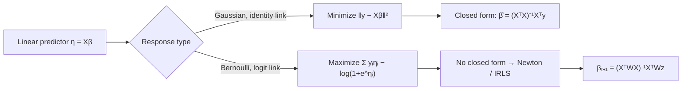

# Linear and Logistic Regression: Estimators, Derivations, and Failure Modes

Linear and logistic regression are the two canonical **generalized linear models (GLMs)**. Both posit a linear predictor $\eta = \mathbf{x}^\top\boldsymbol\beta$; they differ only in the link that maps $\eta$ to the conditional mean of the response — identity for the Gaussian case, logit for the Bernoulli case. This note derives both estimators from first principles, states the optimality that makes OLS special, explains why logistic regression has no closed form, and catalogues where the assumptions break on financial data.


## 1. The linear model in matrix form

Stack $n$ observations. With design matrix $\mathbf{X} \in \mathbb{R}^{n\times(p+1)}$ (a leading column of ones for the intercept), response $\mathbf{y}\in\mathbb{R}^n$, and coefficient vector $\boldsymbol\beta\in\mathbb{R}^{p+1}$,

$$\mathbf{y} = \mathbf{X}\boldsymbol\beta + \boldsymbol\varepsilon, \qquad \mathbb{E}[\boldsymbol\varepsilon\mid\mathbf{X}] = \mathbf{0}, \quad \operatorname{Var}(\boldsymbol\varepsilon\mid\mathbf{X}) = \sigma^2 \mathbf{I}_n.$$

The last two conditions — exogeneity and spherical errors (homoskedastic, uncorrelated) — are the Gauss–Markov conditions. Normality of $\boldsymbol\varepsilon$ is *not* required for OLS to be BLUE; it is required only for exact finite-sample $t$- and $F$-inference.


## 2. Derivation of the OLS normal equations

OLS chooses $\boldsymbol\beta$ to minimize the residual sum of squares

$$S(\boldsymbol\beta) = \lVert \mathbf{y} - \mathbf{X}\boldsymbol\beta \rVert_2^2 = (\mathbf{y} - \mathbf{X}\boldsymbol\beta)^\top(\mathbf{y} - \mathbf{X}\boldsymbol\beta) = \mathbf{y}^\top\mathbf{y} - 2\boldsymbol\beta^\top\mathbf{X}^\top\mathbf{y} + \boldsymbol\beta^\top\mathbf{X}^\top\mathbf{X}\boldsymbol\beta.$$

The cross term uses $\boldsymbol\beta^\top\mathbf{X}^\top\mathbf{y} = \mathbf{y}^\top\mathbf{X}\boldsymbol\beta$ (a scalar equals its transpose). Differentiate with respect to $\boldsymbol\beta$ using $\nabla_{\boldsymbol\beta}(\mathbf{a}^\top\boldsymbol\beta) = \mathbf{a}$ and $\nabla_{\boldsymbol\beta}(\boldsymbol\beta^\top\mathbf{A}\boldsymbol\beta) = 2\mathbf{A}\boldsymbol\beta$ for symmetric $\mathbf{A} = \mathbf{X}^\top\mathbf{X}$:

$$\nabla_{\boldsymbol\beta} S = -2\mathbf{X}^\top\mathbf{y} + 2\mathbf{X}^\top\mathbf{X}\boldsymbol\beta.$$

Setting the gradient to zero gives the **normal equations**

$$\mathbf{X}^\top\mathbf{X}\,\hat{\boldsymbol\beta} = \mathbf{X}^\top\mathbf{y} \;\Longrightarrow\; \boxed{\;\hat{\boldsymbol\beta} = (\mathbf{X}^\top\mathbf{X})^{-1}\mathbf{X}^\top\mathbf{y}\;}$$

provided $\mathbf{X}$ has full column rank so that $\mathbf{X}^\top\mathbf{X}\succ 0$ is invertible. The Hessian

$$\nabla^2_{\boldsymbol\beta} S = 2\mathbf{X}^\top\mathbf{X} \succeq 0$$

is positive semidefinite (positive definite under full rank), so $S$ is convex and the stationary point is the **unique global minimizer**.

**Geometry.** The fitted values are $\hat{\mathbf{y}} = \mathbf{X}\hat{\boldsymbol\beta} = \mathbf{H}\mathbf{y}$ with the **hat (projection) matrix** $\mathbf{H} = \mathbf{X}(\mathbf{X}^\top\mathbf{X})^{-1}\mathbf{X}^\top$, the orthogonal projector onto the column space of $\mathbf{X}$. The normal equations are equivalent to $\mathbf{X}^\top(\mathbf{y} - \hat{\mathbf{y}}) = \mathbf{0}$: the residual vector is orthogonal to every column of $\mathbf{X}$. OLS is literally the projection of $\mathbf{y}$ onto $\operatorname{col}(\mathbf{X})$.


```chart
linear_regression_fit()
```


**Variance decomposition and $R^2$.** Because $\mathbf{H}$ and $\mathbf{I}-\mathbf{H}$ are complementary orthogonal projectors, with a fitted intercept the Pythagorean identity $\text{SST} = \text{SSE} + \text{SSR}$ holds, giving

$$R^2 = 1 - \frac{\text{SSR}}{\text{SST}} = \frac{\text{SSE}}{\text{SST}}, \qquad R^2_{\text{adj}} = 1 - (1-R^2)\frac{n-1}{n-p-1}.$$

The adjustment penalizes dimensionality: $R^2$ is monotone non-decreasing in $p$, so only $R^2_{\text{adj}}$ can fall when a predictor fails to earn its degree of freedom.


## 3. Gauss–Markov: OLS is BLUE

**Unbiasedness.** Substituting $\mathbf{y} = \mathbf{X}\boldsymbol\beta + \boldsymbol\varepsilon$,

$$\hat{\boldsymbol\beta} = (\mathbf{X}^\top\mathbf{X})^{-1}\mathbf{X}^\top(\mathbf{X}\boldsymbol\beta + \boldsymbol\varepsilon) = \boldsymbol\beta + (\mathbf{X}^\top\mathbf{X})^{-1}\mathbf{X}^\top\boldsymbol\varepsilon, \quad\text{so}\quad \mathbb{E}[\hat{\boldsymbol\beta}\mid\mathbf{X}] = \boldsymbol\beta.$$

Its covariance is $\operatorname{Var}(\hat{\boldsymbol\beta}\mid\mathbf{X}) = \sigma^2(\mathbf{X}^\top\mathbf{X})^{-1}$.

**Gauss–Markov theorem.** Under the conditions in §1, the OLS estimator is **BLUE** — the Best (minimum-variance) Linear Unbiased Estimator. *Sketch:* let $\tilde{\boldsymbol\beta} = \mathbf{C}\mathbf{y}$ be any linear unbiased estimator, and write $\mathbf{C} = (\mathbf{X}^\top\mathbf{X})^{-1}\mathbf{X}^\top + \mathbf{D}$. Unbiasedness for all $\boldsymbol\beta$ forces $\mathbf{D}\mathbf{X} = \mathbf{0}$. Then

$$\operatorname{Var}(\tilde{\boldsymbol\beta}) = \sigma^2\mathbf{C}\mathbf{C}^\top = \sigma^2(\mathbf{X}^\top\mathbf{X})^{-1} + \sigma^2\mathbf{D}\mathbf{D}^\top = \operatorname{Var}(\hat{\boldsymbol\beta}) + \sigma^2\mathbf{D}\mathbf{D}^\top,$$

with the cross terms vanishing via $\mathbf{D}\mathbf{X}=\mathbf{0}$. Since $\mathbf{D}\mathbf{D}^\top \succeq 0$, any alternative has variance no smaller than OLS. Adding Gaussian errors upgrades OLS from BLUE to the fully efficient MLE attaining the Cramér–Rao bound.


## 4. Logistic regression: link, likelihood, and MLE

For a binary response $y_i \in \{0,1\}$, model $y_i \mid \mathbf{x}_i \sim \text{Bernoulli}(p_i)$ with the **logit link** making the log-odds linear:

$$\operatorname{logit}(p_i) = \log\frac{p_i}{1 - p_i} = \mathbf{x}_i^\top\boldsymbol\beta \;\Longleftrightarrow\; p_i = \sigma(\mathbf{x}_i^\top\boldsymbol\beta) = \frac{1}{1 + e^{-\mathbf{x}_i^\top\boldsymbol\beta}}.$$

The logit is the **canonical link** for the Bernoulli family, which is exactly why the score equations below take their clean form. The sigmoid maps the unbounded linear score into a valid probability, curing the range violation that would afflict a linear probability model.


```chart
logistic_sigmoid()
```


**Log-likelihood.** With independent observations the Bernoulli likelihood is $\prod_i p_i^{y_i}(1-p_i)^{1-y_i}$, so the log-likelihood is

$$\ell(\boldsymbol\beta) = \sum_{i=1}^{n}\Big[\, y_i\log p_i + (1 - y_i)\log(1 - p_i)\,\Big] = \sum_{i=1}^n \Big[\, y_i\,\mathbf{x}_i^\top\boldsymbol\beta - \log\!\big(1 + e^{\mathbf{x}_i^\top\boldsymbol\beta}\big)\Big].$$

Using $\sigma' = \sigma(1-\sigma)$, the **score** (gradient) and **Hessian** are

$$\nabla\ell(\boldsymbol\beta) = \sum_i (y_i - p_i)\,\mathbf{x}_i = \mathbf{X}^\top(\mathbf{y} - \mathbf{p}), \qquad \nabla^2\ell(\boldsymbol\beta) = -\sum_i p_i(1-p_i)\,\mathbf{x}_i\mathbf{x}_i^\top = -\mathbf{X}^\top\mathbf{W}\mathbf{X},$$

with $\mathbf{W} = \operatorname{diag}\big(p_i(1-p_i)\big) \succeq 0$. The Hessian is negative semidefinite, so $\ell$ is **concave** and the maximizer is unique (when it exists).

**Why no closed form.** Setting $\mathbf{X}^\top(\mathbf{y} - \mathbf{p}(\boldsymbol\beta)) = \mathbf{0}$ is transcendental: $\mathbf{p}$ depends on $\boldsymbol\beta$ through the nonlinear $\sigma(\cdot)$, so $\boldsymbol\beta$ cannot be isolated the way it can in the linear normal equations. Estimation is iterative. Newton–Raphson gives the update

$$\boldsymbol\beta^{(t+1)} = \boldsymbol\beta^{(t)} + (\mathbf{X}^\top\mathbf{W}\mathbf{X})^{-1}\mathbf{X}^\top(\mathbf{y} - \mathbf{p}) = (\mathbf{X}^\top\mathbf{W}\mathbf{X})^{-1}\mathbf{X}^\top\mathbf{W}\mathbf{z}, \quad \mathbf{z} = \mathbf{X}\boldsymbol\beta^{(t)} + \mathbf{W}^{-1}(\mathbf{y}-\mathbf{p}).$$

This is **Iteratively Reweighted Least Squares (IRLS)**: each step is a weighted OLS fit of the working response $\mathbf{z}$, weights $\mathbf{W}$ re-computed each iteration. Convergence is quadratic near the optimum by concavity. (Caveat: under **perfect separation** the MLE diverges to $\pm\infty$; regularization or Firth's penalized likelihood restores finiteness.)





## 5. Regularization

When $\mathbf{X}^\top\mathbf{X}$ is ill-conditioned (near-collinear predictors) or $p$ is large relative to $n$, unpenalized estimates have huge variance. Penalize the coefficient norm.

**Ridge ($\ell_2$).** Minimize $\lVert\mathbf{y}-\mathbf{X}\boldsymbol\beta\rVert^2 + \lambda\lVert\boldsymbol\beta\rVert_2^2$. The penalty restores strict convexity and yields a closed form even when $\mathbf{X}^\top\mathbf{X}$ is singular:

$$\hat{\boldsymbol\beta}_{\text{ridge}} = (\mathbf{X}^\top\mathbf{X} + \lambda\mathbf{I})^{-1}\mathbf{X}^\top\mathbf{y}.$$

Ridge trades a little bias for a large variance reduction — a direct lever on the bias–variance decomposition $\mathbb{E}\lVert\hat{\boldsymbol\beta}-\boldsymbol\beta\rVert^2 = \lVert\text{bias}\rVert^2 + \text{trace}(\operatorname{Var})$.

**Lasso ($\ell_1$).** Minimize $\lVert\mathbf{y}-\mathbf{X}\boldsymbol\beta\rVert^2 + \lambda\lVert\boldsymbol\beta\rVert_1$. The non-differentiable $\ell_1$ ball has corners on the axes, so the solution is **sparse** — it performs variable selection. No closed form; solved by coordinate descent or LARS. Both penalties carry over verbatim to logistic regression by adding the term to $-\ell(\boldsymbol\beta)$. Choosing $\lambda$ is the practical face of the U-shaped generalization curve:


```chart
overfitting_curve()
```


## 6. Assumptions and where they break on financial data

The estimators are optimal only under their assumptions, and financial data violates most of them.

- **Heteroskedasticity.** Volatility clusters (ARCH/GARCH), so $\operatorname{Var}(\varepsilon_i)$ is not constant. OLS stays unbiased but loses efficiency and its usual standard errors are wrong. Use **White / Newey–West (HAC)** covariance estimators, or GLS.
- **Autocorrelated, non-i.i.d. errors.** Overlapping-return windows and momentum induce serial correlation; independence fails. Standard errors understate uncertainty — the effective sample size is far below $n$.
- **Non-stationarity / regime change.** $\boldsymbol\beta$, $\mu$, and $\sigma$ drift across regimes. A model fit in a low-vol regime misprices in a crisis; rolling or state-dependent estimation is required.
- **Fat tails and outliers.** Returns are heavy-tailed (excess kurtosis), and the squared loss gives outliers quadratic leverage, so a single 1987- or 2020-style day can dominate $\hat{\boldsymbol\beta}$. Squared-error and Gaussian-MLE assumptions understate tail risk; consider robust (Huber) or quantile regression.
- **Multicollinearity.** Factor exposures are highly correlated, inflating $\operatorname{Var}(\hat\beta_j) \propto 1/(1-R_j^2)$ (variance inflation). Coefficients become unstable and sign-flip; ridge or dropping redundant factors helps.
- **Endogeneity / look-ahead & survivorship bias.** If a predictor correlates with $\varepsilon$ (omitted variables, using information not available at decision time, or a survivor-only universe), $\hat{\boldsymbol\beta}$ is biased and inconsistent. This is a data-construction failure no estimator repairs; instrument or fix the sampling.
- **Selection / multiplicity.** Searching many specifications inflates in-sample $R^2$ and apparent significance. Validate out-of-sample and deflate for the number of trials (López de Prado's deflated Sharpe).

The recurring lesson: linear and logistic regression are exceptionally well-behaved *under their conditions*, and the entire art on financial data is diagnosing which condition is failing and correcting the inference — not discarding the model.


## References & further reading

- Hastie, T., Tibshirani, R., & Friedman, J. (2009). *The Elements of Statistical Learning* (2nd ed.). Springer. — OLS geometry, ridge/lasso, logistic regression and IRLS.
- Greene, W. H. (2018). *Econometric Analysis* (8th ed.). Pearson. — Gauss–Markov, GLS, heteroskedasticity, endogeneity.
- Wooldridge, J. M. (2019). *Introductory Econometrics: A Modern Approach* (7th ed.). Cengage. — Assumptions, robust standard errors, panel and time-series pitfalls.
- Nelder, J. A., & Wedderburn, R. W. M. (1972). *Generalized Linear Models.* JRSS A. — Unifying GLM/link/IRLS framework.
- McCullagh, P., & Nelder, J. A. (1989). *Generalized Linear Models* (2nd ed.). Chapman & Hall.
- Tibshirani, R. (1996). *Regression Shrinkage and Selection via the Lasso.* JRSS B.
- López de Prado, M. (2018). *Advances in Financial Machine Learning.* Wiley. — Overfitting, multiplicity, and deflated performance in finance.

*This is educational material, not investment advice.*
