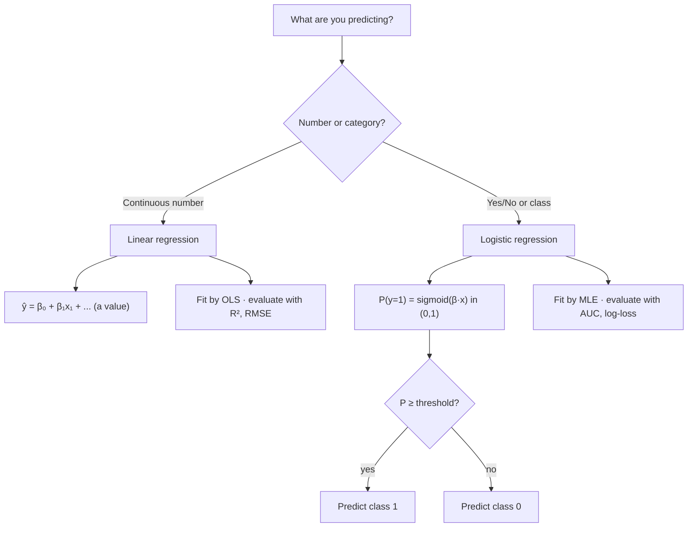

# Linear and Logistic Regression

## Introduction

Regression is the foundation of predictive modeling. Whether you are forecasting next quarter's revenue, estimating the probability that a borrower defaults, or measuring how interest rates move bond prices, regression gives you a mathematical framework for turning inputs into predictions.

The two workhorses split cleanly by **what kind of answer you want**:

- **Linear regression** predicts a *number*. "How does an extra year of education affect income?" It models a continuous outcome as a weighted sum of inputs — the best straight line through a cloud of points.
- **Logistic regression** predicts a *probability / class*. "Will this borrower default?" It squashes the same weighted sum into a value between 0 and 1 you can read as a probability.

Different jobs, one shared engine: both express an outcome as a linear combination of predictors.


## Linear Regression

Linear regression models the relationship between a continuous dependent variable and one or more independent variables, and finds the best-fitting straight line so you can predict future values.

### Simple linear regression

With a single predictor:

$$\hat{y} = \beta_0 + \beta_1 x_1 + \varepsilon$$

- $\hat{y}$ — predicted value of the dependent variable.
- $x_1$ — the predictor (independent variable).
- $\beta_1$ — the slope: how much $\hat{y}$ changes for each one-unit increase in $x_1$.
- $\beta_0$ — the intercept: the expected value of $\hat{y}$ when $x_1 = 0$.
- $\varepsilon$ — the error term (residual): the true $y$ minus the predicted $\hat{y}$. Residuals capture everything the model did not explain.

**Example.** To predict an employee's annual salary ($y$) from years of experience ($x$):

$$\text{Salary} = \beta_0 + \beta_1(\text{years of experience}) + \varepsilon$$

Suppose the fitted model is

$$\text{Salary} = 35{,}000 + 4{,}500 \times (\text{years of experience})$$

A new hire with zero experience is predicted to earn \$35,000 (the intercept), and each additional year adds \$4,500. So five years predicts \$35,000 + \$4,500 × 5 = \$57,500.

The fitted line and the residual gaps it minimizes look like this:


```chart
linear_regression_fit()
```


### Multiple linear regression

Real outcomes are rarely driven by one variable. Multiple linear regression adds predictors:

$$\hat{y} = \beta_0 + \beta_1 x_1 + \beta_2 x_2 + \cdots + \beta_n x_n + \varepsilon$$

Adding education to the salary model:

$$\text{Salary} = 20{,}000 + 4{,}500 \times (\text{experience}) + 2{,}800 \times (\text{education})$$

Now each coefficient is a *ceteris paribus* effect: 4,500 is the expected salary change per extra year of experience **holding education constant**. Controlling for the other variables is exactly why multiple regression isolates each predictor's own contribution.

### How the line is fitted: Ordinary Least Squares

The standard fitting method is **Ordinary Least Squares (OLS)**. It chooses the line that minimizes the **sum of squared residuals (SSR)** — the squared gaps between predicted and observed values:

$$\text{SSR} = \sum_i (y_i - \hat{y}_i)^2$$

Residuals are squared for two reasons: squaring stops positive and negative gaps from cancelling, and it penalizes large errors more than small ones.


```ascii
  y
   |        • observed y_i
   |        |
   |        | residual = y_i - ŷ_i   (OLS minimizes Σ residual²)
   |    ____●____ ŷ_i on the fitted line
   |   /
   +----------------------> x
```


### Evaluating model fit

**Mean Squared Error (MSE)** — the average squared gap:

$$\text{MSE} = \frac{1}{n}\sum_i (y_i - \hat{y}_i)^2$$

Lower is better. Its units are the *squared* units of $y$, so analysts often report the **Root MSE (RMSE)**, $\sqrt{\text{MSE}}$, which is back in the units of $y$.

**R² (coefficient of determination)** — the share of variance in $y$ the model explains:

$$R^2 = 1 - \frac{\text{SSR}}{\text{SST}}$$

where SST is the total sum of squares (variance of $y$ around its mean). $R^2$ runs from 0 to 1: an $R^2$ of 0.85 means the model explains 85% of the variation, leaving 15% unexplained. A caveat: adding *any* predictor never lowers $R^2$, even a useless one. **Adjusted $R^2$** penalizes extra predictors that do not earn their keep.

### Assumptions

OLS inference rests on several assumptions:

- **Linearity** between predictors and the outcome.
- **Independence** of observations.
- **Homoskedasticity** — constant variance of residuals.
- **Normally distributed** residuals (for exact small-sample inference).
- **Limited multicollinearity** among predictors.

Violations lead to biased or inefficient estimates and unreliable standard errors.

### Applications in trading

- **Beta estimation** — regress a stock's returns on market returns; the slope is the stock's beta (systematic risk).
- **Pairs trading** — regress one security on a correlated one; when the spread (residual) strays from its norm, you get a mean-reversion signal.
- **Yield-curve modeling** — regress bond yields on macro variables such as inflation expectations, growth, and policy rates.


## Logistic Regression

Logistic regression handles **classification**: predicting a category rather than a number, most often a binary outcome — 0/1, yes/no, default/no default.

Why not just use linear regression? A straight line can predict values below 0 or above 1, which are nonsense as probabilities. Logistic regression fixes this by passing the linear score through the **sigmoid**, guaranteeing an output in $(0, 1)$.

### The equation

$$P(y = 1) = \frac{1}{1 + e^{-(\beta_0 + \beta_1 x_1 + \cdots + \beta_n x_n)}}$$

Or compactly, $P = \dfrac{1}{1 + e^{-z}}$ with the linear score $z = \beta_0 + \beta_1 x_1 + \cdots + \beta_n x_n$. The function $\frac{1}{1+e^{-z}}$ is the **sigmoid (logistic) function**; it maps any real number into $(0, 1)$. The score $z$ is the **log-odds (logit)** of the outcome.


```chart
logistic_sigmoid()
```


A positive $\beta_j$ means raising $x_j$ increases the probability of the outcome; a negative $\beta_j$ decreases it. To turn a probability into a decision, apply a **threshold** (0.5 by default): predict class 1 when $P \ge 0.5$.

**Example.** Predict whether a loan applicant defaults ($y=1$) from debt-to-income ratio ($x_1$) and credit score ($x_2$):

$$P(\text{default}) = \frac{1}{1 + e^{-(3 + 2.5\,x_1 - 0.01\,x_2)}}$$

The signs make sense: higher debt-to-income raises default risk ($\beta_1 > 0$), a higher credit score lowers it ($\beta_2 < 0$). For $x_1 = 0.4$ and $x_2 = 680$:

$$z = 3 + 2.5(0.4) - 0.01(680) = 3 + 1.0 - 6.8 = -2.8$$

$$P(\text{default}) = \frac{1}{1 + e^{2.8}} = \frac{1}{1 + 16.44} \approx 0.057$$

A 5.7% default probability — relatively low risk, though not negligible.

### How it is fitted: Maximum Likelihood

There is no least-squares line here; the sigmoid is fitted by **Maximum Likelihood Estimation (MLE)**, which finds the coefficients that make the observed labels most probable. MLE maximizes the log-likelihood:

$$\ell(\beta) = \sum_i \left[ y_i \log(\hat{p}_i) + (1 - y_i)\log(1 - \hat{p}_i) \right]$$

where $\hat{p}_i$ is the predicted probability for observation $i$. When $y_i = 1$ the model is rewarded for a high $\hat{p}_i$; when $y_i = 0$ it is rewarded for a low one.

### Evaluating model fit

Because the output is a probability, the metrics differ from linear regression:

- **AUC-ROC** — the ROC curve plots the true-positive rate against the false-positive rate across thresholds; the area under it summarizes ranking skill. AUC = 1 is perfect, 0.5 is a coin flip. An AUC of 0.85 means the model ranks a random positive above a random negative 85% of the time.
- **Log-loss (binary cross-entropy)** — penalizes confident wrong predictions heavily.
- **Pseudo $R^2$** (e.g. McFadden's) — compares the fitted model's log-likelihood to a null (intercept-only) model. Values of 0.2–0.4 already indicate a strong fit.

A threshold turns probabilities into predicted classes, and a **confusion matrix** shows where the errors land — crucial because not every mistake costs the same:


```chart
confusion_matrix_demo()
```


### Assumptions

Similar in spirit to the linear case, with key differences:

- Independence of observations.
- A **linear relationship between predictors and the log-odds** (not the raw outcome).
- Limited multicollinearity.
- Sufficient sample size (roughly 10–15 events per predictor).
- No extreme outliers dominating the fit.

### Applications in trading

- **Credit scoring** — probability of default from borrower characteristics; the backbone of bank credit-risk models.
- **Fraud detection** — flag transactions as fraudulent from amount, location, merchant, and behavior.
- **Earnings-surprise prediction** — classify beat vs. miss from pre-announcement signals.


## Which model, and when?

The choice reduces to the shape of the answer you need:





Both share the same linear core $\beta_0 + \beta_1 x_1 + \cdots$; logistic regression simply wraps it in the sigmoid and reads the result as a probability.


## Key takeaways

- **Linear regression predicts a number; logistic regression predicts a probability/class.** Same linear core, different output layer.
- OLS fits the line by **minimizing the sum of squared residuals**; logistic regression is fit by **maximum likelihood** because the sigmoid gives no closed-form line.
- Evaluate linear fits with **MSE/RMSE and (adjusted) $R^2$**; evaluate classifiers with **AUC-ROC, log-loss, pseudo $R^2$**, and a confusion matrix.
- Both assume a **linear relationship** — with the outcome for linear regression, with the *log-odds* for logistic regression — plus independence and limited multicollinearity.
- Their strength is **interpretability**: coefficients have direct, testable meanings, which is why they remain first-line tools in quantitative finance.

*This is educational material, not investment advice.*
