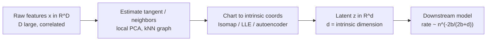

# The Manifold Hypothesis: Intrinsic Dimension and Why It Defeats the Curse

## 1. Definitions

**Smooth manifold.** A set $\mathcal{M} \subset \mathbb{R}^D$ is a $d$-dimensional $C^k$ manifold if every $x \in \mathcal{M}$ has a neighborhood $U$ and a diffeomorphism (chart) $\varphi : U \cap \mathcal{M} \to V \subseteq \mathbb{R}^d$. Locally, $\mathcal{M}$ *looks like* $\mathbb{R}^d$: near $x$ it is the graph of a smooth map over its tangent space $T_x\mathcal{M} \cong \mathbb{R}^d$. The number $d$ is the **intrinsic dimension**; the surrounding $D$ is the **ambient dimension**.

**The hypothesis.** The data measure $P$ concentrates on (a small tube around) such a manifold:

$$\operatorname{supp}(P) \subseteq \mathcal{M}_\delta := \{\, x \in \mathbb{R}^D : \operatorname{dist}(x, \mathcal{M}) \le \delta \,\}, \qquad d \ll D,$$

with $\delta$ small (measurement/idiosyncratic noise). The idealized statement $P(x)>0 \Leftrightarrow x\in\mathcal{M}$ is the $\delta \to 0$ limit.

**Reach (conditioning of the manifold).** A key regularity constant is the **reach** $\tau(\mathcal{M})$: the largest $r$ such that every point within distance $r$ of $\mathcal{M}$ has a unique nearest point on $\mathcal{M}$. Small reach $=$ high curvature or near-self-intersection; $1/\tau$ controls how hard the manifold is to estimate. Below we assume $\tau > 0$ (positive reach, bounded curvature).

**Why $D$ can be huge and still redundant (Whitney).** The Whitney embedding theorem says any smooth compact $d$-manifold embeds in $\mathbb{R}^{2d+1}$. So $D = 2d+1$ ambient coordinates already suffice to *hold* the manifold without self-crossing; any $D \gg 2d+1$ measured features (100 correlated indicators) are geometrically redundant descriptions of the same $d$ degrees of freedom.

## 2. The curse, precisely

Fix a bandwidth $\varepsilon$. To cover the unit cube $[0,1]^D$ with $\varepsilon$-balls requires $\Theta(\varepsilon^{-D})$ of them; equivalently, a fixed-resolution nonparametric estimate needs $n \gtrsim \varepsilon^{-D}$ samples. Two geometric facts make the ambient view hopeless:

- **Volume concentrates on the shell.** The fraction of $[0,1]^D$ within $\eta$ of the boundary is $1-(1-2\eta)^D \to 1$; in high $D$ essentially all points are extreme.
- **Distances concentrate.** For i.i.d. coordinates, $\dfrac{\max_j \lVert x - x_j\rVert - \min_j \lVert x - x_j\rVert}{\min_j \lVert x - x_j\rVert} \xrightarrow{P} 0$, so "nearest neighbor" loses meaning (Beyer et al. 1999).


```chart
curse_of_dimensionality()
```


A minimax restatement: estimating a $\beta$-Hölder regression function on the *full* $\mathbb{R}^D$ support has $L_2$ risk of order $n^{-2\beta/(2\beta + D)}$. With $D=100$ this rate is, for any realistic $n$, indistinguishable from no learning at all.

## 3. Derivation: intrinsic dimension is what actually costs you

The central quantitative payoff of the manifold hypothesis is that **sample complexity scales with $d$, not $D$.** Here is the covering-number argument.

**Covering number of a $d$-manifold.** Let $\mathcal{M}$ be a compact $d$-dimensional submanifold of $\mathbb{R}^D$ with reach $\tau>0$ and $d$-volume $V=\operatorname{vol}_d(\mathcal{M})$. For $\varepsilon < \tau$, a geodesic ball of radius $\varepsilon$ has volume comparable to a Euclidean $d$-ball,

$$\operatorname{vol}_d\big(B_{\mathcal{M}}(x,\varepsilon)\big) = \omega_d\,\varepsilon^{d}\big(1 + O(\varepsilon^2/\tau^2)\big), \qquad \omega_d = \frac{\pi^{d/2}}{\Gamma(d/2+1)}.$$

Take a maximal $\varepsilon$-separated set (a packing) $\{x_1,\dots,x_N\}\subset\mathcal{M}$. The half-radius balls $B_{\mathcal{M}}(x_i,\varepsilon/2)$ are disjoint and all lie in $\mathcal{M}$, so summing volumes gives

$$N \cdot \omega_d (\varepsilon/2)^d \big(1+o(1)\big) \le V \;\;\Longrightarrow\;\; N \;\le\; \frac{2^d V}{\omega_d}\,\varepsilon^{-d}.$$

A maximal packing is also a covering, hence the $\varepsilon$-covering number obeys

$$\boxed{\,\mathcal{N}(\mathcal{M},\varepsilon) \;\asymp\; \Big(\tfrac{1}{\varepsilon}\Big)^{d}\,}, \qquad \text{the constant depends on } V,\tau,d \text{ — } \textbf{not on } D.$$

**Consequence for learning.** Resolving a target to scale $\varepsilon$ needs on the order of one sample per covering ball, $n \gtrsim \varepsilon^{-d}$; inverting, the achievable resolution is $\varepsilon \asymp n^{-1/d}$. Carried through a bias–variance balance for a $\beta$-smooth function *along the manifold*, the minimax $L_2$ rate becomes

$$\inf_{\hat f}\ \sup_{f}\ \mathbb{E}\,\lVert \hat f - f\rVert_2^2 \;\asymp\; n^{-\frac{2\beta}{2\beta + d}},$$

with the **ambient $D$ absent from the exponent** (Bickel & Li 2007; Kpotufe 2011 for adaptive $k$-NN). Compare the two exponents:

$$\underbrace{n^{-\frac{2\beta}{2\beta+D}}}_{\text{ambient: hopeless, } D=100} \qquad\text{vs.}\qquad \underbrace{n^{-\frac{2\beta}{2\beta+d}}}_{\text{intrinsic: tractable, } d=8}.$$

That gap *is* the manifold hypothesis's explanation for why high-dimensional ML works: the estimator only pays for the intrinsic $d$. Local methods (k-NN, kernel smoothers, trees) adapt to $d$ automatically because their neighborhoods live on $\mathcal{M}$.

## 4. Recovering the manifold

Let $\{x_i\}\subset\mathbb{R}^D$ sample $\mathcal{M}$. The goal is a chart $\Phi:\mathbb{R}^D\!\to\!\mathbb{R}^d$ (and often an inverse) that preserves geometry.

- **PCA / local PCA.** Global PCA fits the best affine $d$-plane, exact only when $\mathcal{M}$ is linear. It approximates the tangent space $T_x\mathcal{M}$ locally; curvature is precisely the second-order term PCA discards, motivating nonlinear methods.
- **Isomap** (Tenenbaum, de Silva & Langford 2000). Build a $k$-NN graph, approximate **geodesic** distance $d_{\mathcal{M}}(x_i,x_j)$ by graph shortest paths, then classical MDS on that distance matrix. Recovers global low-$d$ coordinates when $\mathcal{M}$ is isometric to a convex subset of $\mathbb{R}^d$.
- **LLE** (Roweis & Saul 2000). Reconstruct each point from neighbors, $x_i \approx \sum_j W_{ij} x_j$, with weights invariant to rotation/translation/scaling; then find low-$d$ $\{y_i\}$ preserving the same weights by solving the sparse eigenproblem $\min_Y \sum_i \lVert y_i - \sum_j W_{ij} y_j\rVert^2$, i.e. the bottom eigenvectors of $(I-W)^{\top}(I-W)$.
- **t-SNE / UMAP** (van der Maaten & Hinton 2008; McInnes et al. 2018). Match neighbor distributions (heavy-tailed embedding) / fuzzy-simplicial topology. Superb for visualizing clusters and regimes in $2$–$3$D, but they **distort global geometry and densities** — read them as topology, not metric.
- **Autoencoders / representation learning** (Hinton & Salakhutdinov 2006; Bengio et al. 2013). Minimize $\mathbb{E}\lVert x - g_\theta(f_\theta(x))\rVert^2$ through a width-$d$ bottleneck; at optimum $g_\theta(\mathbb{R}^d)$ is a $d$-manifold best-fitting the data — a nonlinear PCA. Contractive/denoising penalties push the Jacobian $\partial f/\partial x$ to keep only tangent directions, so the learned latent aligns with $T_x\mathcal{M}$. The reconstruction error $\lVert x-\hat x\rVert^2$ is an off-manifold (anomaly) score.

The **manifold distribution hypothesis** (Bengio) refines the picture: each class occupies its own manifold, and a deep net's job is to progressively *disentangle and flatten* these sheets until a final linear layer separates them.


```chart
manifold_swiss_roll()
```



## 5. Estimating $d$ itself

The intrinsic dimension is a parameter to be inferred, not assumed:

- **Scree / cumulative variance (linear).** The elbow of $\sum_{i\le d}\lambda_i / \sum_i \lambda_i$; targets like 90% variance are heuristics, blind to curvature.
- **Levina–Bickel MLE (2004).** From the $k$ nearest-neighbor distances $T_j(x)$, treat neighbor counts as a Poisson process on $\mathcal{M}$; the local estimate is
$$\hat d(x) = \left[\frac{1}{k-1}\sum_{j=1}^{k-1}\log\frac{T_k(x)}{T_j(x)}\right]^{-1},$$
averaged over $x$. **Correlation dimension** (Grassberger–Procaccia) and **TwoNN** (Facco et al. 2017) are robust alternatives. All degrade when $\delta$ (noise) is comparable to $\tau$ (curvature scale), the regime where "dimension" stops being well defined.

## 6. Where the hypothesis breaks — especially in finance

- **Low signal-to-noise / thick tube.** Markets have $\delta$ not small: idiosyncratic noise inflates the support off the nominal $\mathcal{M}$, so the effective reach shrinks and $\hat d$ is biased upward. Pure-noise directions genuinely add dimension; if features are near-independent, no low-$d$ manifold exists and reduction cannot help.
- **Non-stationarity.** The manifold is a *time-varying* object $\mathcal{M}_t$: the tangent frame rotates and $d$ itself drifts across regimes (crisis vs. calm). A chart fit on 2020 mis-describes 2024. Remedies: rolling/online estimation, regime-conditional models, change-point detection on the latent.
- **Off-manifold events.** Dislocations, flash crashes, and adversarial inputs sit *off* $\mathcal{M}$; reconstruction error flags them but a model trained only on-manifold has no calibrated behavior there. Off-manifold is exactly where risk concentrates.
- **Testing the hypothesis.** It is falsifiable. Fefferman, Mitter & Narayanan (2016) give an algorithm — with sample complexity polynomial in $d$ and $1/\tau$ but *independent of $D$* — to test whether data lies within $\delta$ of some $d$-manifold of reach $\ge \tau$. Practically: does PCA/autoencoder reconstruction with a fraction of components beat the full representation out-of-sample? If not, you lack exploitable manifold structure.

## References & further reading

- Tenenbaum, J. B., de Silva, V., & Langford, J. C. (2000). *A Global Geometric Framework for Nonlinear Dimensionality Reduction* (Isomap). *Science*, 290.
- Roweis, S. T., & Saul, L. K. (2000). *Nonlinear Dimensionality Reduction by Locally Linear Embedding* (LLE). *Science*, 290.
- van der Maaten, L., & Hinton, G. (2008). *Visualizing Data using t-SNE.* *JMLR*.
- McInnes, L., Healy, J., & Melville, J. (2018). *UMAP: Uniform Manifold Approximation and Projection.* arXiv:1802.03426.
- Hinton, G., & Salakhutdinov, R. (2006). *Reducing the Dimensionality of Data with Neural Networks* (autoencoders). *Science*, 313.
- Bengio, Y., Courville, A., & Vincent, P. (2013). *Representation Learning: A Review and New Perspectives.* *IEEE TPAMI*.
- Levina, E., & Bickel, P. J. (2004). *Maximum Likelihood Estimation of Intrinsic Dimension.* *NeurIPS*.
- Bickel, P. J., & Li, B. (2007). *Local Polynomial Regression on Unknown Manifolds.* IMS Lecture Notes.
- Federer, H. (1959). *Curvature Measures* (reach). *Trans. AMS*.
- Fefferman, C., Mitter, S., & Narayanan, H. (2016). *Testing the Manifold Hypothesis.* *J. Amer. Math. Soc.*, 29.
- Beyer, K., Goldstein, J., Ramakrishnan, R., & Shaft, U. (1999). *When Is "Nearest Neighbor" Meaningful?* ICDT.
