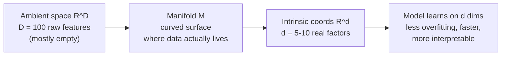

# The Manifold Hypothesis

## The idea

The **manifold hypothesis** states that real-world high-dimensional data — images, audio, market prices, order books, macro indicators — does not fill the enormous space of all possible values. Instead it lies on (or very close to) a much **lower-dimensional curved surface**, a *manifold*, embedded inside that high-dimensional space.

Formally, let $\mathcal{X} \subset \mathbb{R}^D$ be your feature space, where $D$ may be hundreds. The hypothesis says the data-generating density is supported on a thin set:

$$P(x) > 0 \ \text{ only when } \ x \in \mathcal{M},$$

where $\mathcal{M}$ is a $d$-dimensional manifold with $d \ll D$.

- $D$ = **ambient dimension** — the number of raw features (say, 100 technical indicators).
- $d$ = **intrinsic dimension** — the true degrees of freedom (maybe 5–10 fundamental factors).
- $\mathcal{M}$ = the actual "state space" of realistic conditions the world ever visits.

The point is not that your 100 numbers are wrong — it's that they are highly redundant. RSI and Stochastic move together; a dozen moving averages are near-copies; risk-on and risk-off assets are coupled. The knobs the world actually turns are few.

## Intrinsic vs. ambient dimension: the swiss roll

The classic picture is the **swiss roll**: a flat 2-D sheet rolled up so it *sits* in 3-D. Every point needs three coordinates $(x, y, z)$ to write down — that's the ambient dimension, $D = 3$. But you only need **two** numbers to say where you are *on the sheet*: how far along the roll, and how high up. That's the intrinsic dimension, $d = 2$.


```chart
manifold_swiss_roll()
```


Two points can be close in the ambient space (across a gap in the roll) yet far apart *along the surface*. The manifold's own **geodesic** distance — walking along the paper — is the one that carries meaning. Straight-line (Euclidean) distance through the empty ambient space is misleading. Good representations recover the intrinsic coordinates and throw the redundant ones away.


```ascii
   ambient 3-D (looks tangled)     the same data, unrolled (its true 2-D shape)
        .-~~~~-.                       +-------------------------+
      /  .--.   \                      | . . . . . . . . . . . . |
     |  /    \   |          =>         | . . . . . . . . . . . . |
     |  \    /   |                     | . . . . . . . . . . . . |
      \  '--'   /                      +-------------------------+
        '-~~~~-'                        two numbers locate any point
    three numbers per point
```

## Why this rescues us from the curse

Its evil twin is the **curse of dimensionality**: in a space of dimension $D$, volume explodes and data becomes hopelessly sparse. To cover a $D$-dimensional cube at a fixed resolution you need a number of samples that grows *exponentially in $D$*. Nearly all the volume piles up in the outer shell, "nearest" and "farthest" neighbors become nearly the same distance, and estimation collapses.


```chart
curse_of_dimensionality()
```


The manifold hypothesis is the escape hatch. If the data really lives on a $d$-dimensional manifold, then **sample complexity scales with the intrinsic $d$, not the ambient $D$.** You are not trying to fill a 100-dimensional cube; you are trying to cover a gently curved 8-dimensional surface. That is the difference between impossible and routine — and it is *why* machine learning works at all despite the curse.




## What it means for models

### Dimensionality reduction makes the manifold explicit

- **PCA** finds the best *linear* low-dimensional approximation, projecting onto the top $d$ directions of variance:

$$\mathbf{z} = \mathbf{W}^{\top}(\mathbf{x} - \boldsymbol{\mu}),$$

where $\mathbf{W}$ holds the top $d$ principal components. It's fast and interpretable, but only sees flat structure — it cannot unroll a curved swiss roll.

- **Nonlinear manifold learning** (Isomap, LLE) and **neighbor-embedding** methods (t-SNE, UMAP) *can* follow curvature. They preserve local neighborhoods, so a curved manifold gets flattened into honest low-dimensional coordinates — ideal for visualizing clusters and regimes in 2-D.

- **Autoencoders** learn the manifold with a neural bottleneck: an encoder compresses and a decoder reconstructs,

$$\mathbf{z} = f_{\text{enc}}(\mathbf{x}), \qquad \hat{\mathbf{x}} = f_{\text{dec}}(\mathbf{z}), \qquad \min \ \lVert \mathbf{x} - \hat{\mathbf{x}} \rVert^2.$$

If a narrow bottleneck of width $d$ can reconstruct the data, you've found a $d$-dimensional manifold. Points with large reconstruction error sit **off** the manifold — a natural anomaly / dislocation detector.

### Deep networks learn the manifold on their own

You rarely have to run manifold learning by hand. A deep net's hidden layers *implicitly* discover the surface: early layers project raw inputs onto the manifold, middle layers move along it, and the final layer reads off the answer. Layer by layer, the network "flattens and disentangles" the data so that the classes become linearly separable at the top. Residual connections, normalization, and contrastive objectives are all tricks for keeping activations on a well-behaved manifold.

## Where it breaks (the honest caveats)

- **Non-stationarity.** Financial manifolds *drift*. The surface learned in 2020 may not describe 2024 — use rolling windows, online updates, or regime-aware models.
- **Noise has no manifold.** Pure noise fills the ambient space; if your features are genuinely independent, reduction won't help. A quick test: if PCA with half the components does *worse* than all of them, you may not have strong manifold structure.
- **Over-reduction.** Compress too hard and you throw away signal, not just redundancy. Track explained variance (PCA) or reconstruction error (autoencoders); ~80–90% explained variance is a sane starting target.

## Key takeaways

- **Ambient $\ne$ intrinsic.** Data described by $D$ features usually varies in only $d \ll D$ real directions.
- **The manifold is the escape from the curse:** sample complexity tracks the intrinsic $d$, not the ambient $D$ — which is why ML works despite high-dimensional inputs.
- **Distance on the surface (geodesic) matters**, not straight-line distance through empty ambient space.
- **PCA (linear) → Isomap / LLE / UMAP (nonlinear) → autoencoders** are a ladder of tools that make the manifold explicit; deep nets learn it implicitly.
- **In markets, respect drift and noise:** the manifold is real but moving, so validate that reduction preserves signal, not just size.
