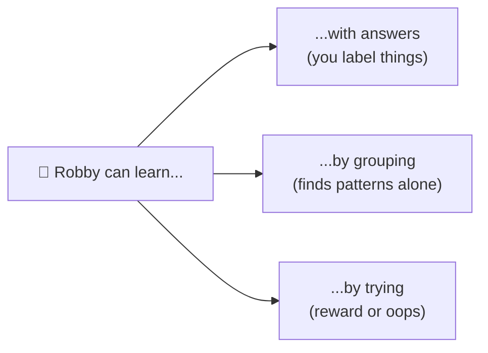

# The Robot That Learned Chores Three Ways 🤖

Meet **Robby**, your new helper robot. Robby is clever, but on day one it knows *nothing* about your messy room. So how does a robot actually **learn** to help?

It turns out there are three completely different ways to teach Robby — and grown-up scientists use the exact same three ways to teach real computers. The fancy name for this is **machine learning** (just "a computer getting better by practicing").


```comic
{
  "title": "Robby Learns to Help",
  "panels": [
    {"emoji": "🤖", "caption": "Meet Robby. It wants to help tidy your room, but doesn't know how yet.", "bubble": "Teach me!"},
    {"emoji": "🧦", "caption": "Way 1: you hold up toys and TELL Robby the answer — 'sock', 'car', 'block'.", "bubble": "This is a sock."},
    {"emoji": "✅", "caption": "Robby copies your answers and sorts a brand-new pile correctly. Learning from labels!"},
    {"emoji": "🧸", "caption": "Way 2: you dump the whole toy box and say NOTHING. Robby is on its own.", "bubble": "Hmm..."},
    {"emoji": "🔍", "caption": "Robby notices patterns by itself: round things here, soft things there. It found the groups!"},
    {"emoji": "🍽️", "caption": "Way 3: Robby just TRIES stuff. Stack the dishes and see what happens.", "bubble": "Let's try!"},
    {"emoji": "👍", "caption": "A neat stack earns a thumbs-up (a reward). A crash earns an 'oops'. Robby remembers."},
    {"emoji": "🏆", "caption": "Three ways to learn: with answers, by grouping, and by trying. Robby can help now!"}
  ]
}
```


## Way 1: Learning with answers (supervised)

This is like studying **flashcards that have the answer on the back**. You show Robby a sock and say "sock." You show a shirt and say "shirt." After enough flashcards, Robby can label socks and shirts it has *never seen before*.

Grown-ups call this **supervised learning** ("supervised" just means someone gave the answers). It comes in two flavors:
- Guessing a **number** — like "how many minutes until dinner?" (called *regression*).
- Guessing a **group** — like "sock or shirt?" (called *classification*).

## Way 2: Finding groups on its own (unsupervised)

Here nobody gives answers. You hand Robby a big pile and it hunts for patterns *by itself* — putting round toys in one heap and soft toys in another. It wasn't told the groups; it **discovered** them.

This is **unsupervised learning**. It's great for the question "what natural groups are hiding in here?" when even *you* don't know yet.

## Way 3: Learning by trying (reinforcement)

The last way is pure trial and error, like leveling up in a video game. Robby tries something, and the world gives it a **reward** (a thumbs-up) or a **penalty** (a crash). Do more of what earns rewards, less of what earns crashes. Slowly, Robby gets great at the chore.

This is **reinforcement learning** — learning from *scores*, not from someone whispering the answer.





## Which way is best?

None of them! It depends on what you have. Got answers to copy? Use Way 1. Just a big messy pile? Use Way 2. Only a game score to chase? Use Way 3. The real skill is **matching the way of learning to the problem in front of you** — and that's exactly what real machine-learning engineers do all day. 🧠
