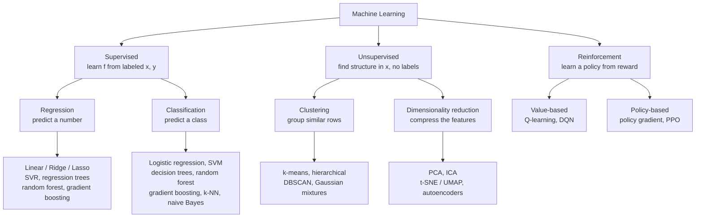
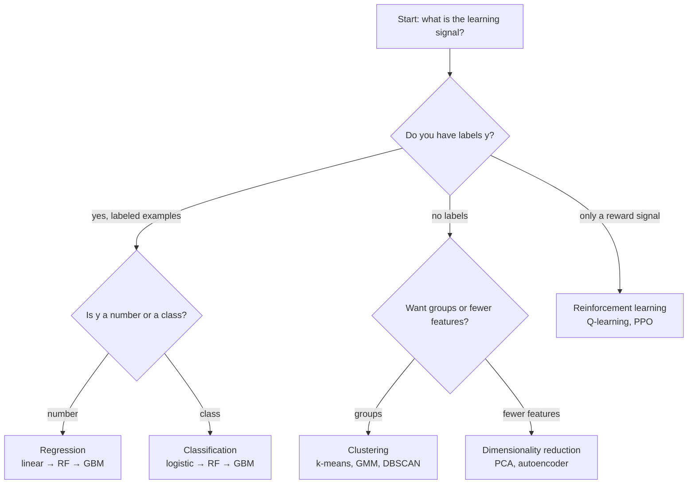

# Machine Learning Model Types

Understanding the main model families helps you reach for the right tool instead of the trendiest one. Every algorithm you have heard of — linear regression, random forests, XGBoost, neural nets, k-means, PPO — slots into one of **three learning paradigms**, defined by *what kind of signal the model learns from*:

- **Supervised** — you have labeled examples $(x, y)$ and learn a mapping $x \mapsto y$.
- **Unsupervised** — you have only $x$ and look for hidden structure.
- **Reinforcement** — you have no labels, only a *reward* signal, and learn a policy by acting.

This map is the whole article. Memorize it and most "which model?" questions answer themselves.





The three paradigms differ in the *shape of the data* they consume:


```ascii
   SUPERVISED           UNSUPERVISED            REINFORCEMENT
   x ───► y             x ───► ???              state ──action──► reward
   labels given         no labels; find         no labels; a score
   (copy the answer)    the hidden groups       to chase over time
```


## 1. Supervised learning

You have historical examples where the answer is known, and you fit a function to reproduce it out-of-sample. Two sub-types:

**Regression** predicts a continuous number (next-day return, volatility):

$$y = w_0 + w_1 x_1 + w_2 x_2 + \dots + w_n x_n$$

**Classification** predicts a discrete class (up/down, buy/hold/sell). Logistic regression squashes a linear score into a probability:

$$P(\text{up}) = \frac{1}{1 + e^{-(w_0 + w_1 x_1 + \dots + w_n x_n)}}$$

### The supervised toolkit (roughly, simplest to most flexible)

| Family | Example algorithms | Reach for it when… |
|---|---|---|
| **Linear** | Ridge, Lasso, logistic regression | you want speed, interpretability, and a baseline; data is high-dimensional but roughly linear |
| **Trees** | decision tree → random forest → gradient boosting (XGBoost, LightGBM, CatBoost) | relationships are nonlinear with feature interactions; tabular data of 1k–100k rows |
| **Kernel** | SVM / SVR (RBF kernel) | small-to-medium, high-dimensional data needing robust margins |
| **Instance** | k-nearest neighbors | simple nonlinear baseline; suffers in high dimensions |
| **Probabilistic** | naive Bayes | fast text-style baselines; weak on *correlated* financial features |
| **Neural nets** | MLP, and CNN/RNN/Transformer for images, text, sequences | 10,000+ samples or special data types, after simpler models are exhausted |

Classification quality is not one number. A **confusion matrix** shows *which* mistakes you make — and in trading a false "up" (you buy, it drops) costs very differently from a missed "up":


```chart
confusion_matrix_demo()
```


The universal enemy across every supervised family is **overfitting**: as model complexity grows, training error keeps falling while out-of-sample error turns back up. The gap is variance you cannot trade on.


```chart
overfitting_curve()
```


The practical progression: **start with a regularized linear model** (if its Sharpe already clears your bar, you may be done), then **random forest** (check whether nonlinearity helps), then **gradient boosting** (tune carefully — it overfits fast), and only then neural nets. Always regularize (L1/L2, depth limits, dropout) and validate walk-forward.

## 2. Unsupervised learning

No labels — you are mapping the structure of $x$ itself. Two sub-types:

**Clustering** partitions rows into groups (k-means, Gaussian mixtures, DBSCAN, hierarchical). In trading: discovering **market regimes** (calm vs. crisis), grouping assets by co-movement, or spotting outlier days.

**Dimensionality reduction** compresses many features into a few informative ones (PCA, ICA, autoencoders; t-SNE/UMAP for visualization). In trading: extracting **risk factors** from a wall of correlated signals, denoising a covariance matrix before optimization, or shrinking inputs before a supervised model. The intuition is the *manifold hypothesis* — high-dimensional data often lives on a low-dimensional surface:


```chart
manifold_swiss_roll()
```


Unsupervised methods rarely trade on their own; they **feed** the supervised stage (better features, cleaner covariances, regime labels).

## 3. Reinforcement learning

No answer key at all — an **agent** observes a *state*, takes an *action*, and receives a *reward*, learning a **policy** that maximizes cumulative reward over time. In trading terms: state = market and inventory, action = trade/hold, reward = risk-adjusted P&L net of costs. It shows up in **execution** (splitting a large order), **market making**, and **dynamic allocation**. Reward climbs as the agent learns, but with high variance:


```chart
rl_reward_curve()
```


RL is powerful and *dangerous* on markets: it is sample-hungry, and financial data is non-stationary and low signal-to-noise, so an agent easily learns to exploit backtest artifacts. Treat it as advanced, not a starting point.

## Picking the right family

Start from the signal you actually have, not the algorithm you want to use:





### Trading-specific tie-breakers

Once a family is chosen, three trading realities push you toward *simpler* models than a Kaggle leaderboard would:

- **Transaction costs.** More complex models often trade more. What you actually keep is
  $$\text{Net Sharpe} = \frac{\text{Gross Return} - \text{Costs}}{\text{Volatility}},$$
  and a lower-turnover simple model frequently wins on the *net* line.
- **Regime changes.** Markets are non-stationary; simpler models tend to generalize better across regimes. Use simple models for slow signals, complex ones only for fast signals you retrain often.
- **Interpretability.** Understanding *why* a model works helps you debug it, size it, and defend it to clients and regulators.

The rule of thumb from every desk: **use the simplest model that meets your performance target**, and always compare against a buy-and-hold baseline under walk-forward validation.

## Key takeaways

- Every model belongs to one of three paradigms: **supervised** (labels), **unsupervised** (structure), **reinforcement** (reward).
- Supervised splits into **regression** (predict a number) and **classification** (predict a class); climb complexity only when it earns out-of-sample.
- Unsupervised splits into **clustering** and **dimensionality reduction**, and usually *feeds* a supervised model rather than trading alone.
- Reinforcement learning optimizes a **policy** from reward — powerful for execution and allocation, but sample-hungry and easy to overfit on markets.
- Pick the family from the **signal you have**, then let costs, regime shifts, and interpretability bias you toward the simplest model that clears the bar.
