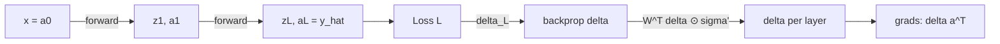

# Neural Networks: Forward Pass, Backpropagation, and Why Depth Works

## 1. The feedforward network as a composition of maps

A feedforward network with $L$ layers is a parameterized function $f_\theta : \mathbb{R}^{n_0} \to \mathbb{R}^{n_L}$ built by composing affine maps with a pointwise nonlinearity. Writing $a^{(0)} = x$ for the input, each layer $l = 1, \dots, L$ computes

$$z^{(l)} = W^{(l)} a^{(l-1)} + b^{(l)}, \qquad a^{(l)} = \sigma\!\left(z^{(l)}\right),$$

with $W^{(l)} \in \mathbb{R}^{n_l \times n_{l-1}}$, $b^{(l)} \in \mathbb{R}^{n_l}$, and $\sigma$ applied componentwise. The network output is $\hat{y} = a^{(L)}$, and the full map is the composition

$$f_\theta = \sigma \circ A^{(L)} \circ \sigma \circ A^{(L-1)} \circ \cdots \circ \sigma \circ A^{(1)}, \qquad A^{(l)}(u) = W^{(l)} u + b^{(l)}.$$

The parameters are $\theta = \{W^{(l)}, b^{(l)}\}_{l=1}^{L}$. Evaluating $f_\theta(x)$ in this order is the **forward pass**. Note that if $\sigma$ were linear, the composition would collapse to a single affine map — nonlinearity is what gives the family its expressive power.

## 2. Objective

Given data $\{(x^{(i)}, y^{(i)})\}_{i=1}^{N}$ and a per-example loss $\ell$, we minimize the empirical risk

$$\mathcal{L}(\theta) = \frac{1}{N}\sum_{i=1}^{N} \ell\!\left(f_\theta(x^{(i)}),\, y^{(i)}\right).$$

Two canonical choices:

- **Regression, squared error:** $\ell(\hat{y}, y) = \tfrac{1}{2}\lVert \hat{y} - y \rVert_2^2$.
- **Classification, cross-entropy** with a softmax output: $\ell(\hat{y}, y) = -\sum_k y_k \log \hat{y}_k$.

Because $\mathcal{L}$ is generally nonconvex in $\theta$, we optimize by (stochastic) gradient descent: $\theta \leftarrow \theta - \eta \, \nabla_\theta \mathcal{L}$. Everything hinges on computing $\nabla_\theta \mathcal{L}$ efficiently. Backpropagation is exactly the reverse-mode automatic differentiation of the composition in §1.

## 3. Deriving backpropagation via the chain rule

Fix one example and drop the superscript $i$; write $L = \ell(a^{(L)}, y)$. Define the **error signal** of layer $l$ as the gradient of the loss with respect to that layer's pre-activation,

$$\delta^{(l)} \;:=\; \frac{\partial L}{\partial z^{(l)}} \;\in\; \mathbb{R}^{n_l}.$$

**Output layer.** Since $a^{(L)} = \sigma(z^{(L)})$, the chain rule applied componentwise gives

$$\delta^{(L)}_j = \frac{\partial L}{\partial a^{(L)}_j}\,\frac{\partial a^{(L)}_j}{\partial z^{(L)}_j} = \frac{\partial L}{\partial a^{(L)}_j}\,\sigma'\!\left(z^{(L)}_j\right) \quad\Longrightarrow\quad \delta^{(L)} = \nabla_{a^{(L)}} L \,\odot\, \sigma'\!\left(z^{(L)}\right),$$

where $\odot$ is the Hadamard (elementwise) product. (For squared error, $\nabla_{a^{(L)}}L = a^{(L)} - y$; for softmax + cross-entropy the algebra collapses to the same clean form $\delta^{(L)} = a^{(L)} - y$.)

**Recursion.** The key step. The pre-activations of layer $l+1$ depend on those of layer $l$ only through $a^{(l)} = \sigma(z^{(l)})$:

$$z^{(l+1)}_k = \sum_{j} W^{(l+1)}_{kj}\, \sigma\!\left(z^{(l)}_j\right) + b^{(l+1)}_k.$$

Every path from $z^{(l)}_j$ to the loss passes through the coordinates $z^{(l+1)}_k$, so by the multivariate chain rule

$$\delta^{(l)}_j = \frac{\partial L}{\partial z^{(l)}_j} = \sum_k \frac{\partial L}{\partial z^{(l+1)}_k}\,\frac{\partial z^{(l+1)}_k}{\partial z^{(l)}_j} = \sum_k \delta^{(l+1)}_k \, W^{(l+1)}_{kj}\,\sigma'\!\left(z^{(l)}_j\right).$$

Collecting the $j$-components into a vector yields the **backpropagation recursion**:

$$\boxed{\;\delta^{(l)} = \left( W^{(l+1)\top} \delta^{(l+1)} \right) \odot \sigma'\!\left(z^{(l)}\right)\;}$$

**Parameter gradients.** Because $z^{(l)}_j = \sum_k W^{(l)}_{jk} a^{(l-1)}_k + b^{(l)}_j$, we have $\partial z^{(l)}_j / \partial W^{(l)}_{jk} = a^{(l-1)}_k$ and $\partial z^{(l)}_j/\partial b^{(l)}_j = 1$, so

$$\frac{\partial L}{\partial W^{(l)}} = \delta^{(l)} \, a^{(l-1)\top}, \qquad \frac{\partial L}{\partial b^{(l)}} = \delta^{(l)}.$$

The algorithm: one forward pass caching every $z^{(l)}, a^{(l)}$; then sweep $l = L \to 1$ propagating $\delta^{(l)}$ and reading off the gradients. Cost is $O(\text{forward pass})$ — a single backward sweep, not a separate perturbation per parameter. This $O(1)$-multiple-of-forward cost (Rumelhart–Hinton–Williams, 1986) is what made deep learning tractable.



## 4. Activations and their derivatives

The recursion multiplies by $\sigma'(z^{(l)})$ at every layer, so the choice of $\sigma$ governs how gradients flow.

```chart
activation_functions()
```

| Activation | $\sigma(z)$ | $\sigma'(z)$ | Note |
|---|---|---|---|
| Sigmoid | $1/(1+e^{-z})$ | $\sigma(z)(1-\sigma(z)) \le \tfrac14$ | saturates; gradient $\to 0$ in the tails |
| tanh | $\tanh(z)$ | $1-\tanh^2(z) \le 1$ | zero-centered, still saturates |
| ReLU | $\max(0,z)$ | $\mathbf{1}\{z>0\}$ | no positive saturation; can "die" at $z<0$ |
| Leaky ReLU | $\max(\alpha z, z)$ | $\mathbf{1}\{z>0\} + \alpha\,\mathbf{1}\{z\le0\}$ | keeps a gradient for $z<0$ |

## 5. The universal approximation theorem

Expressive power is guaranteed even at depth one. **Cybenko (1989)** proved that for any continuous sigmoidal $\sigma$, finite sums of the form $\sum_{j=1}^{m} c_j\, \sigma(w_j^\top x + b_j)$ are dense in $C(I_n)$ under the sup norm on the unit cube $I_n$: for any continuous $g$ and any $\varepsilon > 0$ there exist parameters and a width $m$ with

$$\sup_{x \in I_n} \left| g(x) - \sum_{j=1}^{m} c_j\, \sigma(w_j^\top x + b_j) \right| < \varepsilon.$$

**Hornik (1991)** generalized this: it is the multilayer architecture, not the specific activation, that grants universality — any nonconstant, bounded, continuous $\sigma$ works. The theorem is an **existence** result: it says a single wide hidden layer *can* represent $g$, but is silent on the required width (which can be exponential in the input dimension) and says nothing about whether gradient descent will *find* the weights. That gap is precisely why depth and optimization matter in practice.

## 6. Why depth helps

If one hidden layer is a universal approximator, why go deep? Because depth buys **parameter efficiency** for compositional functions. Two complementary results:

- **Region counting.** A ReLU network partitions input space into linear regions. The number of regions grows *polynomially* in width but *exponentially* in depth (Montúfar et al., 2014), so a deep net can express far more piecewise-linear complexity per parameter than a shallow one.
- **Separation theorems.** Telgarsky (2016) exhibits functions computable by a deep network that require *exponentially* more units to approximate with any shallow network. Compositional/hierarchical targets — exactly the structure of many perceptual and, arguably, market microstructure signals — are represented compactly by matching the architecture's depth to the problem's compositional depth.

## 7. Vanishing and exploding gradients

Unrolling the recursion in §3 across layers $l < L$ shows the error signal is a product of layer Jacobians:

$$\delta^{(l)} = \left(\prod_{k=l+1}^{L} D^{(k)}\, W^{(k)\top}\right)\!\bigg|_{\text{ordered}} \delta^{(L)}_{\text{seed}}, \qquad D^{(k)} = \operatorname{diag}\!\left(\sigma'(z^{(k)})\right).$$

The gradient magnitude scales roughly as $\prod_k \lVert D^{(k)} W^{(k)} \rVert$. If the typical factor is $< 1$ the signal **vanishes** exponentially in depth (early layers barely learn); if $> 1$ it **explodes**. Sigmoid makes this acute because $\sigma' \le \tfrac14$, so a $d$-layer stack attenuates by at least $4^{-d}$ even before the weight norms are counted. Mitigations, all reducing the deviation of each factor from $1$:

- **ReLU** activations: $\sigma' \in \{0,1\}$, so the diagonal factor is $1$ on the active path.
- **Variance-preserving initialization** (He / Xavier) sets $\mathbb{E}\lVert W^{(k)}\rVert$ near the isometry point.
- **Normalization** (batch/layer norm) and **residual connections** ($a^{(l)} = a^{(l-1)} + \mathcal{F}(a^{(l-1)})$) keep the Jacobian close to the identity, so products neither vanish nor explode.

## 8. Overfitting, capacity, and regularization

A network with enough parameters can interpolate the training set — driving training loss to zero while generalization degrades. The bias–variance tension:

```chart
overfitting_curve()
```

Regularizers constrain the effective capacity so the model learns signal, not noise:

- **$L^2$ weight decay:** add $\tfrac{\lambda}{2}\lVert \theta \rVert_2^2$ to $\mathcal{L}$; the gradient step gains a $-\eta\lambda\theta$ shrinkage term. Equivalent to a Gaussian prior on the weights (MAP estimation).
- **Dropout** (Srivastava et al., 2014): during training, zero each activation independently with probability $p$ and rescale by $1/(1-p)$. This injects multiplicative Bernoulli noise and approximates training an ensemble of $2^{n}$ subnetworks with shared weights, reducing co-adaptation.
- **Early stopping:** halt at the validation-loss minimum. Under a quadratic approximation of the loss, early stopping is *equivalent* to $L^2$ regularization with a penalty controlled by the number of steps times the learning rate — it caps how far weights travel from their (small) initialization.
- **Data augmentation / more data:** the cleanest fix — it lowers variance without adding bias.

## 9. The trading-specific failure modes

The optimization theory above assumes i.i.d. draws from a fixed distribution. Financial data violates both, so the binding constraints are *statistical*, not architectural:

- **Leakage.** Any feature that peeks at future information inflates in-sample performance and collapses live. This is a data-construction bug, not a model choice, and no regularizer fixes it.
- **Non-stationarity.** $\mu_t, \sigma_t$ and the feature–label relationship drift with regime; the i.i.d. premise behind SGD and behind a random train/test split both fail. Use strictly **time-ordered, walk-forward** evaluation.
- **Multiplicity / selection bias.** Searching over architectures, features, and hyperparameters and reporting the best is in-sample overfitting at the meta level; deflate performance for the number of trials (López de Prado, 2018).
- **Weak labels and costs.** A model can be well-calibrated and still unprofitable once turnover, spread, and slippage are charged. Evaluate the *strategy P&L net of costs*, and always benchmark against a linear baseline before accepting the added variance of a deep model.

The practical rule follows directly: if the network cannot beat a simple linear regression out-of-sample, the deficiency is in the data, labels, or evaluation — not the model capacity.

## References & further reading

- Rumelhart, D. E., Hinton, G. E., & Williams, R. J. (1986). *Learning representations by back-propagating errors.* Nature, 323, 533–536.
- Cybenko, G. (1989). *Approximation by superpositions of a sigmoidal function.* Mathematics of Control, Signals and Systems, 2, 303–314.
- Hornik, K. (1991). *Approximation capabilities of multilayer feedforward networks.* Neural Networks, 4(2), 251–257.
- Goodfellow, I., Bengio, Y., & Courville, A. (2016). *Deep Learning.* MIT Press.
- Srivastava, N., Hinton, G., Krizhevsky, A., Sutskever, I., & Salakhutdinov, R. (2014). *Dropout: A Simple Way to Prevent Neural Networks from Overfitting.* JMLR, 15, 1929–1958.
- Montúfar, G., Pascanu, R., Cho, K., & Bengio, Y. (2014). *On the Number of Linear Regions of Deep Neural Networks.* NeurIPS.
- Telgarsky, M. (2016). *Benefits of depth in neural networks.* COLT.
- López de Prado, M. (2018). *Advances in Financial Machine Learning.* Wiley (leakage, walk-forward, deflated metrics).
