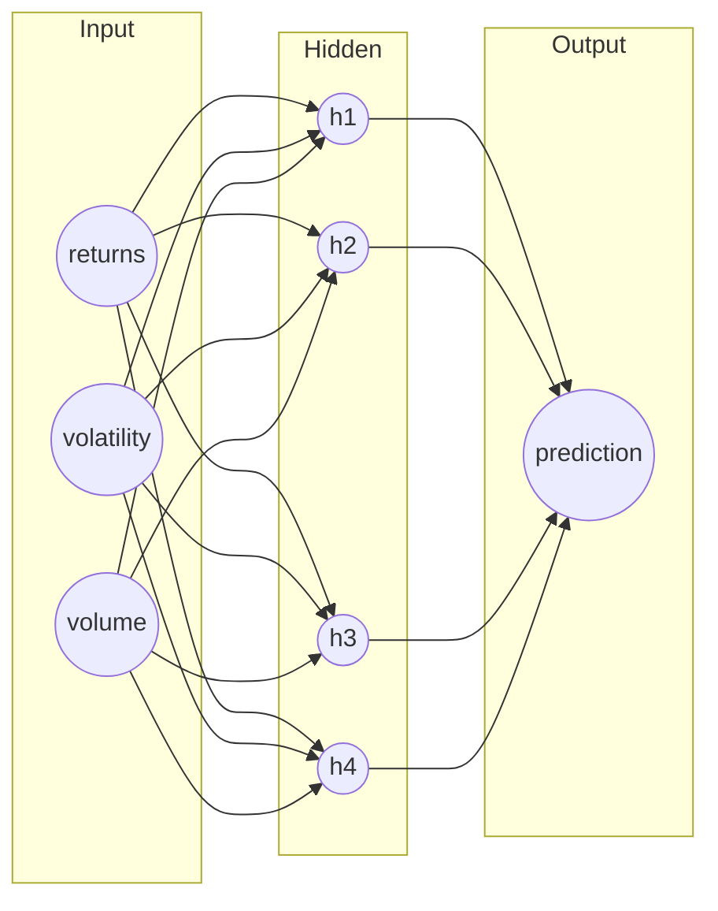
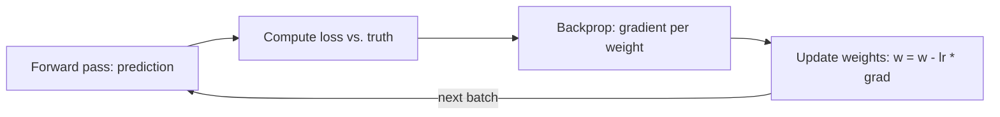

# Neural Networks in Trading (Foundations)

## Introduction

A neural network is a **function approximator**: it learns a mapping from inputs (features) to outputs (predictions). You feed it examples, and it adjusts itself until its guesses match the answers. In trading the network is rarely the hard part — the hard part is **data quality, leakage control, and honest evaluation**. This article covers how a network actually works, then how to use one without fooling yourself.

## The building block: a neuron

A single neuron does two small things. First it takes a **weighted sum** of its inputs plus a bias, then it passes that sum through a nonlinear **activation function**:

$$z = \sum_{i} w_i x_i + b, \qquad a = \sigma(z)$$

- $x_i$ are the inputs (features).
- $w_i$ are the **weights** — how much each input matters. These are what the network learns.
- $b$ is the **bias**, a nudge that shifts the whole sum up or down.
- $\sigma$ is the **activation function** that adds nonlinearity.

Without the activation, stacking neurons would just give you another linear model — a fancy weighted average. The activation is what lets a network bend, curve, and carve up the input space so it can represent **nonlinear** relationships.

```chart
activation_functions()
```

Common choices:

- **Sigmoid** squashes any number into $(0, 1)$ — historically popular, but it saturates (flattens) at the extremes, which slows learning.
- **tanh** is a rescaled sigmoid into $(-1, 1)$, centered at zero.
- **ReLU** ($\max(0, z)$) is the modern default in hidden layers: cheap, and it doesn't saturate for positive inputs, so gradients flow.
- **Leaky ReLU** lets a small slope through for negative inputs to avoid "dead" neurons.

## Stacking neurons into layers

Neurons are organized into **layers**. Each layer's outputs become the next layer's inputs. Information flows **input → hidden layer(s) → output** — this left-to-right sweep is the **forward pass**.



Early layers learn simple combinations of the raw features; later layers combine *those* into richer patterns. A network with one or more hidden layers between input and output is called a **multilayer perceptron (MLP)** — the standard default when your features are tabular.

## How a network learns

Learning means **adjusting the weights** so predictions get closer to the truth. The loop:

1. **Forward pass** — run the inputs through to get a prediction.
2. **Loss** — measure how wrong the prediction is with a loss function (e.g. squared error for a number, cross-entropy for a class).
3. **Backpropagation** — compute how much each weight contributed to the error (the gradient).
4. **Update** — nudge every weight a small step *against* its gradient: $w \leftarrow w - \eta \, \frac{\partial L}{\partial w}$, where $\eta$ is the learning rate.

Repeat over many batches and the loss falls. Nobody hand-codes "if RSI > 70 then...". The network discovers the useful combinations by repeatedly correcting its own mistakes.



## Underfitting vs. overfitting

More capacity (more neurons, more layers) lets a network fit more complex patterns — up to a point. Push too far and it starts memorizing **noise** that won't repeat.

```chart
overfitting_curve()
```

- **Underfitting:** the model is too simple (or under-trained). Both training and validation error stay high. Fix: more capacity, better features, more training.
- **Overfitting:** training error keeps dropping while validation error turns back **up**. The model has memorized the training set. Fix: more data, regularization (weight decay, **dropout**), or **early stopping** at the validation minimum.

The "sweet spot" is where validation error bottoms out. In markets — where the signal-to-noise ratio is brutal — the danger is almost always overfitting, not underfitting.

## What neural nets are (and aren't) good at

Good at:

- Combining many **weak signals** into one prediction.
- Learning **nonlinear** relationships a linear model can't.
- Handling **sequence** inputs (recent returns) with temporal models.

Not good at (common misconceptions):

- They do **not** conjure alpha from thin air.
- They do **not** fix a noisy label or a bad execution model.
- Bigger model **≠** better strategy — it often just means more overfitting.

## Applying this to trading without fooling yourself

The mechanics above are the easy 20%. The other 80% is process discipline. Key terms to respect:

- **Feature:** input signal (returns, realized volatility, moving averages, volume, microstructure stats).
- **Label / target:** what you predict (next-day return, direction, volatility, regime).
- **Leakage:** using future information — even accidentally — that won't exist in real time. This is the silent killer of trading models.
- **Stationarity:** the assumption that the data distribution stays similar over time. Markets routinely violate it.

Always evaluate with **time-based splits**, never random ones. Train on the past, test on the strictly later future:

```chart
walk_forward_cv()
```

A clean, maintainable first project:

1. **Pick one target** (e.g. predict next-day *volatility*, which is more predictable than return).
2. **Keep features boring** (returns, realized vol, moving averages, volume).
3. **Use walk-forward validation** (train on past, test on later).
4. **Compare to a baseline** — e.g. a simple linear regression. If you can't beat it out-of-sample, the network isn't earning its complexity.
5. **Add costs** (turnover, spread, slippage) *before* celebrating.

Also track **calibration**: when the model says 70% confidence, is it right about 70% of the time? And report **turnover and costs** on the actual strategy built from the predictions, not just classification accuracy.

## Key takeaways

- A neuron is a **weighted sum plus a nonlinear activation**; the activation is what makes the network nonlinear.
- **Layers** stack these blocks; the **forward pass** flows input → hidden → output.
- Learning = **adjusting weights** via backpropagation and gradient descent to shrink a loss.
- **Overfitting** (memorizing noise), not underfitting, is the main enemy in markets — control it with more data, regularization, dropout, and early stopping.
- The model is the easy part. **Data quality, leakage control, walk-forward evaluation, a baseline, and costs** decide whether it survives live.
