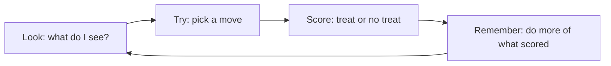

# Teaching a Robot to Trade Like Training a Puppy 🐶

Say you get a brand-new puppy and you want to teach it to sit. You can't just *tell* it the rules — the puppy has to **try stuff, see what happens, and learn**. That's exactly how a computer learns to trade money in the market. We call that computer an **agent**, and the way it learns is called **reinforcement learning**.

Here's the secret loop the puppy (and the computer) uses:

1. **Look around.** The puppy notices where it is, where your hand is, whether you have treats. The grown-up word is the **state** — everything you can see right now.
2. **Do something.** It picks a move: sit? bark? spin in a circle? That's the **action**.
3. **Get a score.** If it sits, it gets a treat. Yum! If it chews your shoe, no treat (and a frown). That treat-or-frown is the **reward** — the score it's chasing.
4. **Remember and repeat.** "Sitting made a treat happen — do that more!" A little smarter every day.


```comic
{
  "title": "Robo-Puppy Learns the Game",
  "panels": [
    {"emoji": "🐶", "caption": "Meet Robo-Puppy. We want to teach it a trick.", "bubble": "Let's learn!"},
    {"emoji": "👀", "caption": "First it LOOKS around: your hand, the room, the treat bag. That's the state."},
    {"emoji": "🤔", "caption": "Then it tries a move: sit? bark? spin? That's the action.", "bubble": "Hmm... this one?"},
    {"emoji": "🦴", "caption": "It sits — and gets a treat! The treat is the reward, its score."},
    {"emoji": "🧠", "caption": "It remembers: sitting made a treat happen. Do more of that!"},
    {"emoji": "🔁", "caption": "Look, try, score, remember, repeat — a little better every day."},
    {"emoji": "🎮", "caption": "A trading computer learns the SAME way: try a move, check the score, improve."},
    {"emoji": "🧭", "caption": "Sometimes use your best trick; sometimes try a new one. That's exploring!"}
  ]
}
```


## The two lessons that matter

**Lesson 1: chase the score, not the treat.** A puppy that only grabs the treat right in front of it might miss a whole bag of treats around the corner. The agent tries to win the **most points over time**, not just the biggest reward this second. In trading, a quick win today can lead to a giant loss tomorrow — so it thinks about the whole day, not one move.

**Lesson 2: explore vs. stick.** Imagine a video game where you found one move that scores okay. Do you keep spamming that move forever? If you never try anything new, you'll never find the *awesome* move that scores way more. But if you *only* try random new things, you never use what already works. Good players do a little of both. Computers call this **explore vs. exploit** — try new stuff sometimes, use your best move the rest of the time.





So an RL trading agent is really just Robo-Puppy with a calculator: it looks at the market, tries a buy or sell or wait, checks whether it made or lost pretend money, and slowly gets better by chasing a higher score. Try, fail, learn, repeat. 🏆
