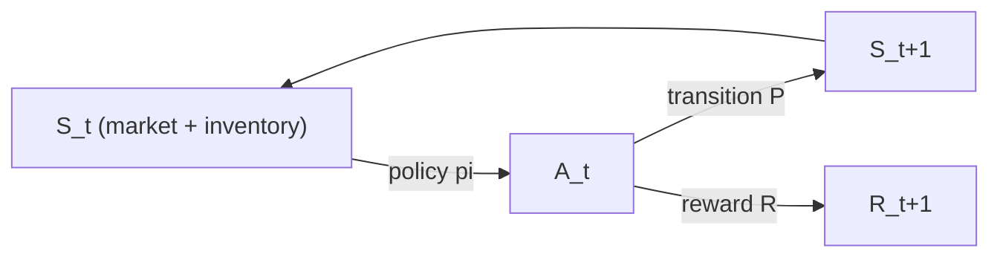

# Reinforcement Learning for Trading: MDPs, Bellman, and Why Markets Break the Assumptions

## 1. The Markov Decision Process

A finite-horizon or discounted RL problem is a **Markov Decision Process** (MDP), the tuple $(\mathcal{S}, \mathcal{A}, P, R, \gamma)$:

- $\mathcal{S}$ — state space (observed market + inventory + risk features).
- $\mathcal{A}$ — action space (target position, order, or hold).
- $P(s' \mid s,a)$ — transition kernel, the environment's dynamics.
- $R(s,a)$ — reward, with $r_{t+1}$ drawn given $(s_t,a_t)$; here, realized P&L net of costs and risk penalties.
- $\gamma \in [0,1)$ — discount factor.

The defining assumption is the **Markov property**: the transition and reward depend only on the current state, not the full history,

$$\mathbb{P}(S_{t+1}, R_{t+1} \mid S_t, A_t, S_{t-1}, A_{t-1}, \dots) = \mathbb{P}(S_{t+1}, R_{t+1} \mid S_t, A_t).$$

A **policy** $\pi(a \mid s)$ is a distribution over actions. The agent maximizes the expected **discounted return**

$$G_t = \sum_{k=0}^{\infty} \gamma^k R_{t+k+1}, \qquad J(\pi) = \mathbb{E}_{\pi}\!\left[ G_0 \right].$$

The discount $\gamma$ both guarantees convergence of the sum (for bounded rewards, $|G_t| \le R_{\max}/(1-\gamma)$) and encodes a finite economic horizon.





## 2. Value functions and the Bellman equations

Define the **state-value** and **action-value** (Q) functions under $\pi$:

$$V^{\pi}(s) = \mathbb{E}_{\pi}\!\left[ G_t \mid S_t = s \right], \qquad Q^{\pi}(s,a) = \mathbb{E}_{\pi}\!\left[ G_t \mid S_t = s, A_t = a \right].$$

**Bellman expectation equation.** Split the return into the immediate reward and the discounted continuation, $G_t = R_{t+1} + \gamma G_{t+1}$, and take conditional expectations. Using the tower property and the Markov property,

$$V^{\pi}(s) = \sum_{a} \pi(a \mid s) \sum_{s',\,r} P(s',r \mid s,a)\big[\, r + \gamma V^{\pi}(s') \,\big].$$

This is a linear fixed-point system. The associated operator $\mathcal{T}^{\pi}$ is a $\gamma$-contraction in the sup-norm: for any $U, V$,

$$\lVert \mathcal{T}^{\pi} U - \mathcal{T}^{\pi} V \rVert_\infty \le \gamma \lVert U - V \rVert_\infty,$$

so by the Banach fixed-point theorem $V^{\pi}$ exists and is unique.

**Bellman optimality.** The optimal value $V^\star = \max_\pi V^\pi$ and $Q^\star = \max_\pi Q^\pi$ satisfy

$$Q^{\star}(s,a) = \sum_{s',\,r} P(s',r \mid s,a)\Big[\, r + \gamma \max_{a'} Q^{\star}(s',a') \,\Big] =: (\mathcal{T}^{\star} Q^{\star})(s,a).$$

The greedy policy $\pi^\star(s) = \arg\max_a Q^\star(s,a)$ is optimal. $\mathcal{T}^\star$ is also a $\gamma$-contraction, which is what makes value iteration and Q-learning converge.

## 3. Deriving the Q-learning update

We want the fixed point $Q^\star = \mathcal{T}^\star Q^\star$, but we do **not** know $P$ or $R$ — we only see sampled transitions $(s_t, a_t, r_{t+1}, s_{t+1})$. Write the optimality condition as a root-finding problem. Define

$$F(Q)(s,a) = \mathbb{E}\!\left[\, R_{t+1} + \gamma \max_{a'} Q(S_{t+1},a') - Q(s,a) \,\Big|\, S_t=s, A_t=a \right] = (\mathcal{T}^\star Q)(s,a) - Q(s,a),$$

so $Q^\star$ is the zero of $F$. The quantity inside the expectation, evaluated at a single sample, is an **unbiased estimate** of $F(Q)(s,a)$:

$$\delta_t = \underbrace{r_{t+1} + \gamma \max_{a'} Q(s_{t+1}, a')}_{\text{TD target}} - Q(s_t, a_t) \qquad (\text{the TD error}),\qquad \mathbb{E}[\delta_t \mid s_t,a_t] = F(Q)(s_t,a_t).$$

**Robbins–Monro stochastic approximation** finds the root of $F(Q)=0$ from noisy samples by stepping in the direction of the sampled residual:

$$\boxed{\,Q(s_t,a_t) \leftarrow Q(s_t,a_t) + \alpha_t\Big[\, r_{t+1} + \gamma \max_{a'} Q(s_{t+1},a') - Q(s_t,a_t) \,\Big]\,}$$

This is exactly the **Q-learning** update (Watkins 1989; Watkins & Dayan 1992). It is *off-policy*: the $\max_{a'}$ bootstraps toward the greedy target regardless of the exploratory action actually taken. It converges with probability 1 to $Q^\star$ provided

1. every state–action pair is visited infinitely often, and
2. the step sizes satisfy the Robbins–Monro conditions $\displaystyle \sum_t \alpha_t = \infty$ and $\displaystyle \sum_t \alpha_t^2 < \infty$.

With function approximation (a neural $Q_\theta$, as in DQN) these guarantees are lost — the "deadly triad" of bootstrapping, off-policy sampling, and approximation can diverge — which is why practitioners add target networks, replay buffers, and double-Q corrections.

As training proceeds, the empirical return climbs toward its ceiling with high seed-to-seed variance:


```chart
rl_reward_curve()
```


## 4. Policy gradients (the direct alternative)

Value methods are indirect; **policy-gradient** methods parameterize $\pi_\theta(a\mid s)$ and ascend $J(\theta)=\mathbb{E}_{\pi_\theta}[G_0]$ directly. The **policy gradient theorem** states

$$\nabla_\theta J(\theta) = \mathbb{E}_{\pi_\theta}\!\left[ \sum_{t\ge 0} \nabla_\theta \log \pi_\theta(a_t \mid s_t)\, Q^{\pi_\theta}(s_t,a_t) \right].$$

*Sketch.* Write $J(\theta) = \sum_\tau P_\theta(\tau) G(\tau)$ over trajectories $\tau$. The **log-derivative trick** $\nabla_\theta P_\theta(\tau) = P_\theta(\tau)\nabla_\theta \log P_\theta(\tau)$ gives $\nabla_\theta J = \mathbb{E}_{\pi_\theta}[\nabla_\theta \log P_\theta(\tau)\, G(\tau)]$. Since $P_\theta(\tau) = \rho(s_0)\prod_t P(s_{t+1}\mid s_t,a_t)\,\pi_\theta(a_t\mid s_t)$, the dynamics terms have zero $\theta$-gradient and only the $\sum_t \nabla_\theta\log\pi_\theta(a_t\mid s_t)$ survives — no model of $P$ required. Replacing $G(\tau)$ by $Q^{\pi_\theta}$ and subtracting a state-baseline $b(s)$ (e.g. $V^{\pi_\theta}$) yields the **advantage** $A^{\pi} = Q^{\pi} - V^{\pi}$ and lower-variance actor–critic estimators. This is REINFORCE / A2C.

**Relevance to trading:** Moody & Saffell (2001) argue for *direct* reinforcement — differentiate a trading performance function (the differential Sharpe ratio) with respect to policy parameters via a recurrent policy — precisely to avoid the brittleness of learning a value function over noisy, non-stationary financial returns.

## 5. Exploration: the ε-greedy scheme

To satisfy "visit every $(s,a)$ infinitely often," the behavior policy must explore. The canonical choice is **ε-greedy**:

$$\pi(a \mid s) = \begin{cases} 1 - \epsilon + \dfrac{\epsilon}{|\mathcal{A}|}, & a = \arg\max_{a'} Q(s,a'),\\[2mm] \dfrac{\epsilon}{|\mathcal{A}|}, & \text{otherwise.}\end{cases}$$

Annealing $\epsilon_t \to 0$ at a rate that keeps exploration infinite but vanishing gives a **GLIE** policy (Greedy in the Limit with Infinite Exploration), under which tabular Q-learning and SARSA converge to $\pi^\star$. The exploration–exploitation tradeoff is formalized by regret: in the bandit sub-problem, no algorithm beats $\Omega(\log T)$ regret (Lai–Robbins), and ε-greedy with fixed $\epsilon$ incurs linear regret — hence UCB and Thompson sampling for the myopic case.

## 6. Why financial RL is genuinely hard

The MDP assumptions above are *violated* by markets, and each violation has teeth:

- **Partial observability.** The true state (order-flow, others' inventory, latent regime) is unobserved; you see a projection. The problem is a **POMDP**, and the Markov property fails on raw observations. The principled fix is to act on a belief state $b_t = \mathbb{P}(s_t \mid o_{1:t})$ or a learned recurrent summary — but the belief is itself model-dependent and hard to calibrate.

- **Non-stationarity.** $P$ and $R$ drift with regime, liquidity, and participant behavior, so there is no fixed $Q^\star$ to converge to; the target moves. A policy that is growth-optimal in one regime can be ruinous in the next. This breaks the i.i.d./stationarity premise that every convergence proof relies on.

- **Low signal-to-noise and heavy tails.** For daily returns the reward's standard deviation dwarfs its mean, so $\widehat{\nabla_\theta J}$ and $\widehat{\mathcal{T}^\star Q}$ have enormous variance; credit assignment over long horizons compounds it. Heavy tails mean a single episode can dominate the empirical objective.

- **Sim-to-real gap.** The backtest environment is a model. If fills ignore spread, slippage, and **market impact** (your own order does not move the simulated price), the agent learns to exploit fictional liquidity. Look-ahead leakage and reward hacking (uncapped leverage, turnover games) are failures of the *environment*, not the learner — RL will find every one.

- **Overfitting the backtest.** With high-capacity function approximators and one historical path, in-sample equity looks pristine and out-of-sample collapses. This is the deflated-Sharpe / multiple-testing problem (López de Prado): the more configurations you search, the higher the selection-inflated in-sample performance.


```chart
backtest_overfit()
```


**Practical consequence.** Evaluate walk-forward against honest baselines (buy-and-hold, MA filter, vol targeting) on **net-of-cost** returns, and prefer risk-sensitive objectives (differential Sharpe, drawdown-penalized reward, CVaR) so the policy's implicit utility matches the investor's. If you cannot state why the reward is correct and why the fills are realistic, the results will not survive live markets.

## References & further reading

- Sutton, R. S., & Barto, A. G. (2018). *Reinforcement Learning: An Introduction* (2nd ed.). MIT Press. — MDPs, Bellman equations, TD/Q-learning, policy gradients.
- Watkins, C. J. C. H. (1989). *Learning from Delayed Rewards*, PhD thesis; Watkins, C., & Dayan, P. (1992). *Q-learning.* Machine Learning 8(3–4). — the convergence proof.
- Moody, J., & Saffell, M. (2001). *Learning to Trade via Direct Reinforcement.* IEEE Trans. Neural Networks 12(4). — differential Sharpe, recurrent direct RL.
- Deng, Y., Bao, F., Kong, Y., Ren, Z., & Dai, Q. (2017). *Deep Direct Reinforcement Learning for Financial Signal Representation and Trading.* IEEE TNNLS 28(3).
- Mnih, V., et al. (2015). *Human-level control through deep reinforcement learning* (DQN). Nature 518. — function approximation, replay, target networks.
- López de Prado, M. (2018). *Advances in Financial Machine Learning.* — backtest overfitting, deflated Sharpe, non-i.i.d. pitfalls.
