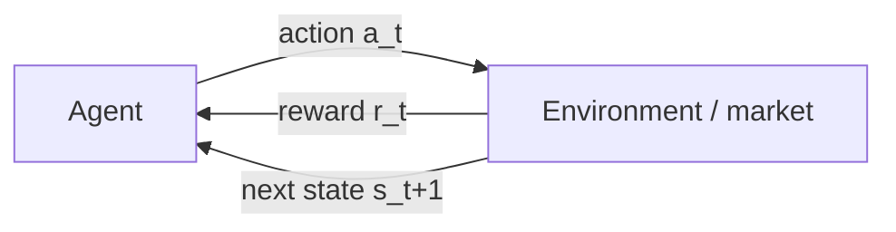
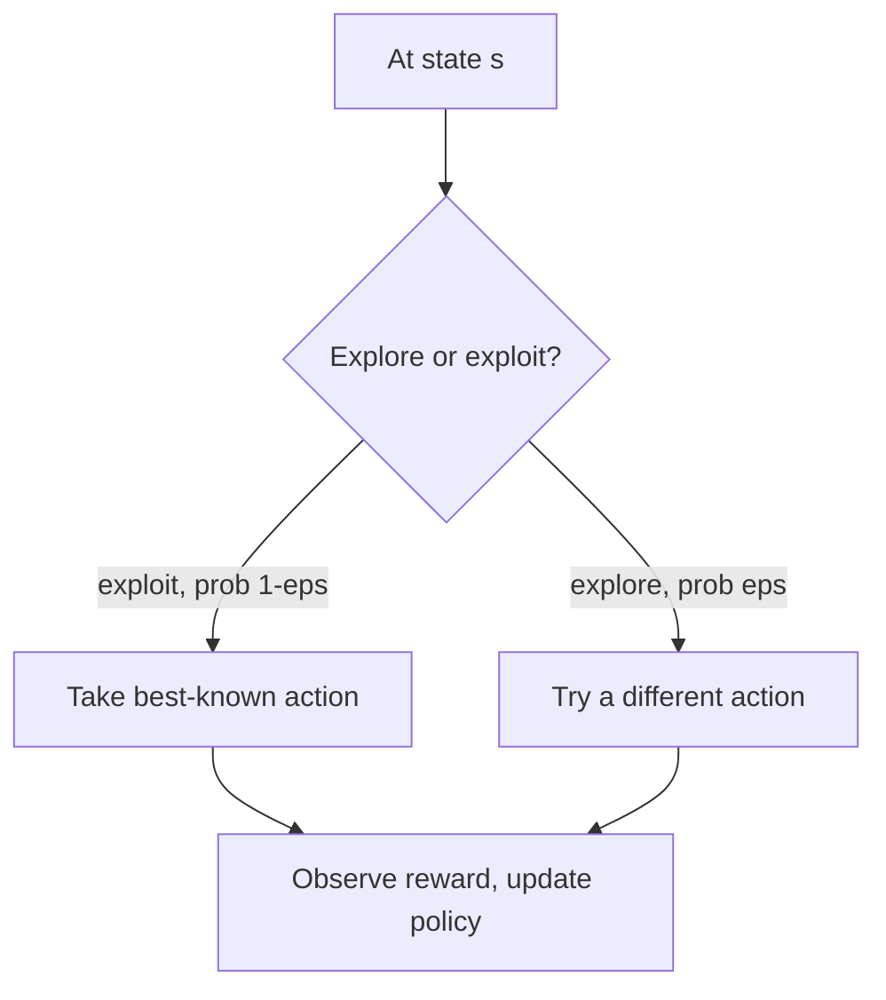

# Reinforcement-Learning Trading Agents

## Introduction

Reinforcement learning (RL) trains an **agent** to take actions in an environment so as to maximize a cumulative **reward**. Unlike supervised learning — which predicts a label and leaves the trading decision to you — RL optimizes the *decisions themselves*: buy, sell, hold, and how much. That directness is what makes it attractive for trading.

It is also what makes it dangerous. It is very easy to build an unrealistic market simulator and get results that look spectacular in a backtest and fall apart the moment they meet a live order book. Most of the craft in financial RL is not the algorithm — it is building an environment and a reward you can actually trust.

## The RL loop

At every step the agent observes a **state**, chooses an **action** according to its **policy**, and the environment returns a **reward** and the next state. That cycle repeats until the **episode** ends.





### Key terms

- **Agent** — the decision-maker (your model).
- **Environment** — the market simulation the agent interacts with.
- **State** ($s_t$) — what the agent observes: recent prices, indicators, current inventory, risk.
- **Action** ($a_t$) — what it can do: enter, exit, size a position, or do nothing.
- **Reward** ($r_t$) — the score it maximizes: P&L minus costs and risk penalties.
- **Policy** ($\pi$) — the rule mapping states to actions, $\pi(a \mid s)$. Learning *is* improving $\pi$.
- **Episode** — one run: a year of trading, or a single trade's lifecycle.

The agent's real objective is not the next reward but the **cumulative** (discounted) reward, $G_t = r_t + \gamma r_{t+1} + \gamma^2 r_{t+2} + \cdots$, with a discount factor $0 < \gamma \le 1$. A quick profit that invites a large loss later scores badly.

## A minimal trading setup

Keep the first environment small enough that you can explain every piece of it.

**State (keep it simple):**

- Recent returns (e.g., the last 20 days)
- A volatility estimate
- The current position (flat / long / short) and exposure

**Actions (avoid complexity at first):**

- $\{-1, 0, +1\}$ for short / flat / long, or a small discrete set of position sizes.

**Reward (be careful):**

$$r_t = \underbrace{\text{P\&L}_t}_{\text{mark-to-market}} - \underbrace{c\cdot|\Delta \text{position}_t|}_{\text{costs, turnover}} - \underbrace{\lambda \cdot \text{risk}_t}_{\text{penalty}}$$

Add penalties for high turnover, high leverage, and large drawdowns. The reward is where your risk preferences live — if it isn't in the reward, the agent won't respect it.


```ascii
  reward  =  P&L  -  (spread + commission + slippage)  -  risk penalty
              |            |                                  |
          the upside   what the market                   what YOU
                       actually charges                  care about
```


## Exploration vs. exploitation

An agent that always plays its current best action can get stuck on a mediocre strategy it never had reason to doubt. An agent that always tries something new never *uses* what it learned. Balancing the two — **exploration** (gather information) vs. **exploitation** (spend it) — is the central tension of RL.





With enough exploration and enough episodes, the average reward should climb and then plateau — though financial rewards are noisy, so the curve is a wide band, not a clean line:


```chart
rl_reward_curve()
```


## What can go wrong

RL will ruthlessly exploit any flaw in your environment. The failures are almost always about the *setup*, not the math:

- **Look-ahead leakage** — a future price sneaks into the state. The agent "learns" to trade on information it would not have had.
- **Unrealistic fills** — trades execute at the mid-price with no spread, slippage, or market impact. Real costs turn many "winners" into losers.
- **Reward hacking** — the agent finds a loophole in the reward: infinite leverage if you forgot to cap it, or churning to game a mis-specified bonus. It optimizes what you *wrote*, not what you *meant*.
- **Non-stationarity** — the market's dynamics drift. An agent that mastered "2021 crypto" can be ruinous in 2022. The rules of the game change underneath a fixed policy.
- **Overfitting the backtest** — with enough parameters the agent memorizes one historical path. It looks brilliant in-sample and unravels out-of-sample:


```chart
backtest_overfit()
```


## How to evaluate fairly

- **Compare to simple baselines** — buy-and-hold, a moving-average filter, volatility targeting. If the agent can't beat these *after costs*, it has learned nothing useful.
- **Use walk-forward evaluation** — always train on the past and test on a later, untouched window; never let the model see its test period.


```chart
walk_forward_cv(folds=5)
```


- **Report the full picture** — net returns after costs, drawdowns, turnover, and exposure time (how often it actually trades). A high return with a 60% drawdown is not a win.

## First-phase advice

Start with an environment you can fully explain and test. If you cannot describe *why the reward is correct* and *why the fills are realistic*, the RL results will not survive contact with live markets. Get the environment honest first; the learning algorithm is the easy part.

## Key takeaways

- RL optimizes trading *decisions* directly by maximizing cumulative reward through trial and error.
- The loop is agent → action → environment → reward + next state → repeat; the policy $\pi(a\mid s)$ is what you're improving.
- Reward design carries your risk preferences: P&L minus costs, turnover, leverage, and drawdown penalties.
- Balance exploration and exploitation, and expect a noisy, wide reward curve during training.
- The real risks are environment flaws — leakage, unrealistic fills, reward hacking, non-stationarity, and backtest overfitting — so validate walk-forward against honest baselines after costs.
