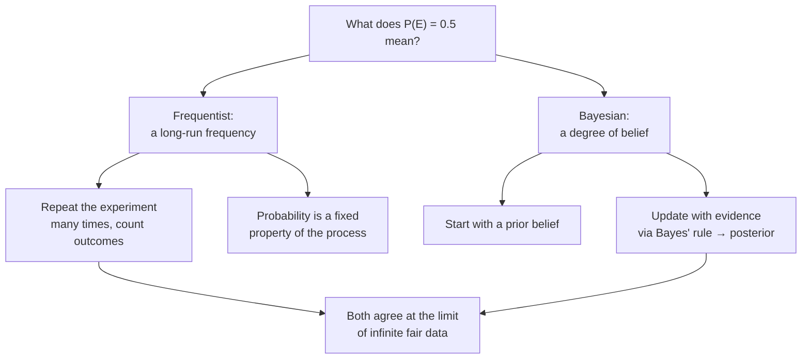

# Probability Basics: Bayesian & Frequentist Perspectives

## Introduction

Probability is the branch of mathematics that studies events and provides numerical descriptions of how likely they are to occur. In trading, probability lets us reason about the uncertainty present in the market, and a solid grasp of it leads to better-informed decisions.

We write a probability like this — for a 50% chance,

$$P(E) = 0.5$$

where:

- $E$ is the event,
- $P(\cdot)$ denotes the probability function,
- $0.5$ is the probability of the event occurring.

A probability is always a number between 0 and 1, where **0 means impossible** and **1 means certain**.

## Events and Probability

An **event** is a subset of the outcomes of an experiment, and an experiment is any process that produces an outcome. Flipping a coin is a good example:

- the flip itself is the **experiment**,
- the possible **outcomes** are heads or tails,
- an **event** could be "the coin lands on heads."

The full set of possible outcomes is the **sample space**, often written $\Omega$ (here $\Omega = \{\text{H}, \text{T}\}$). An event is any subset of $\Omega$.

For experiments with **equally likely** outcomes, probability is just counting:

$$P(E) = \frac{\text{number of favorable outcomes to } E}{\text{total number of possible outcomes}}$$

For a fair die, $P(\text{roll} = 4) = \tfrac{1}{6}$, and $P(\text{even}) = \tfrac{3}{6} = \tfrac{1}{2}$.

### Combining events

Set notation carries directly over to events:

- **Union** $A \cup B$ — at least one of $A$ or $B$ occurs.
- **Intersection** $A \cap B$ — both $A$ and $B$ occur.
- **Complement** $A'$ (also $\overline{A}$) — $A$ does **not** occur, so $P(\overline{A}) = 1 - P(A)$.

A useful identity ties them together (the inclusion–exclusion rule):

$$P(A \cup B) = P(A) + P(B) - P(A \cap B).$$

## Interpreting Probability

How we *interpret* that number depends on the statistical philosophy we adopt. The two most common are the **Frequentist** and **Bayesian** perspectives.



### Frequentist perspective

The Frequentist view defines probability as the **long-run frequency** of an event across many repeated, identical trials. For the coin, a frequentist says that if you flipped it an infinite number of times, roughly half the outcomes would be heads. A single flip landing on tails does not change the underlying probability — it is just one draw from the long-run distribution.

This "settling down" is the **law of large numbers** in action: the running fraction of heads jitters early on but converges to the true value as trials accumulate.

```chart
frequentist_convergence()
```

The strength of this view is objectivity — the probability is a fixed property of the process, not of the observer. Its weakness is that it struggles with **one-off, non-repeatable events**: "the probability this specific company defaults next year" has no natural sequence of identical trials to count.

### Bayesian perspective

The Bayesian view treats probability as a **degree of belief** and explicitly incorporates prior knowledge. Before the coin is flipped, a Bayesian says they are 50% certain it will land heads — a statement about their information, not about an infinite sequence of flips.

The engine is **Bayes' theorem**, which updates a *prior* belief into a *posterior* belief after seeing evidence $D$:

$$P(H \mid D) = \frac{P(D \mid H)\, P(H)}{P(D)}.$$

Suppose two bags of marbles: Bag 1 is half green, Bag 2 is 70% green. You pick a bag at random (prior 50/50) and draw one green marble. The green draw is more likely to have come from Bag 2, so your belief shifts toward it:

```chart
bayes_update(prior=(0.5, 0.5), likelihood=(0.5, 0.7), labels=("Bag 1", "Bag 2"))
```

The strength of this view is that it handles unique events and updates naturally as data arrives. Its weakness is **subjectivity**: the answer depends on the prior you choose, which can inject bias.

## Probability in Trading

Both models are worth knowing. Bayesian methods are often more intuitive — they let a trader encode prior knowledge and revise beliefs as fresh data lands — but they are sensitive to the choice of prior. Frequentist methods rest on long-run frequencies and fixed procedures, which are objective but less intuitive and awkward for short-term or one-off market events. In practice you draw on both, choosing the tool that fits the data at hand.

## Key takeaways

- **Probability lives in $[0, 1]$**: 0 is impossible, 1 is certain.
- An **event** is a subset of the **sample space** $\Omega$; for equally likely outcomes, $P(E) = \tfrac{\text{favorable}}{\text{total}}$.
- Combine events with **union**, **intersection**, and **complement** ($P(\overline{A}) = 1 - P(A)$).
- **Frequentist** = long-run frequency (objective, needs repeatable trials); the law of large numbers makes the frequency converge.
- **Bayesian** = degree of belief, updated from prior to posterior via **Bayes' theorem** (handles one-off events, but depends on the prior).
- Good practice uses **both**, matched to the problem.
