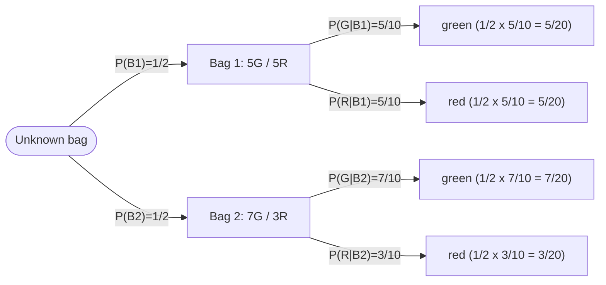

# Conditional Probability & Bayes' Theorem

## Introduction

Conditional probability is the probability of an event occurring **given that another event has already occurred**. It is what lets us do something essential: revise our estimates when new information shows up, instead of clinging to our first assumption.

We write it as:

$$P(A \mid B) \quad\text{or}\quad P_B(A)$$

Here $A$ is the event of interest and $B$ is the event known to have occurred. $P(A \mid B)$ is the probability of $A$ *given* $B$. By contrast, $P(E)$ is an **unconditional** (absolute) probability — it ignores the outcome of any other event.

## The conditional probability formula

$$P(A \mid B) = \frac{P(A \text{ and } B)}{P(B)}$$

where $P(A \text{ and } B)$ is the probability of both $A$ and $B$ occurring, and $P(B)$ is the probability of $B$. Intuitively, learning that $B$ happened shrinks the world down to just the outcomes inside $B$; we then ask what fraction of *that* smaller world also contains $A$.

```ascii
   All outcomes
  +------------------------------+
  |         B (known true)       |
  |   +----------------------+   |
  |   |        A and B       |   |   P(A|B) = area(A and B)
  |   |   ##############     |   |          -----------------
  |   |   ##############     |   |             area(B)
  |   +----------------------+   |
  |          A extends           |   Condition on B => the box B
  |          outside B too       |   becomes the whole universe.
  +------------------------------+
```

### Example: marbles in a bag

Say you have 10 marbles: 5 red, 3 blue, and 2 green. Let $R$ be the event of pulling a red marble, and let $B$ be the event of pulling a marble that is **not green**.

We know:

$$P(R) = \frac{5}{10} = 0.5 \qquad\text{and}\qquad P(B) = \frac{8}{10} = 0.8$$

If we already know the marble is *not green*, the conditional probability that it is red becomes:

$$P(R \mid B) = \frac{P(R \text{ and } B)}{P(B)} = \frac{5/10}{8/10} = \frac{5}{8} = 0.625$$

Knowing the marble is not green raised the chance it is red from $0.5$ to $0.625$ — every red marble is also "not green," so $P(R \text{ and } B) = P(R)$, and we simply renormalize by the smaller sample space.

### Application in trading

Conditional probability lets traders update the likelihood of a future price move as new market information arrives. "What is the probability of an up-day?" is a weaker question than "What is the probability of an up-day **given** that volume spiked and the trend is up?"

## Bayes' Theorem

Bayes' theorem is the engine of Bayesian thinking: a systematic rule for updating a probability when new evidence arrives.

$$P(A \mid B) = \frac{P(B \mid A)\cdot P(A)}{P(B)}$$

where

- $P(A \mid B)$ — the **posterior**: updated probability of $A$ given $B$,
- $P(B \mid A)$ — the **likelihood**: probability of the evidence $B$ if $A$ were true,
- $P(A)$ — the **prior**: probability of $A$ before seeing $B$,
- $P(B)$ — the probability of the evidence $B$ (the normalizer).

### Proof

We derive it straight from the definition of conditional probability. We have

$$(1)\quad P(A \mid B) = \frac{P(A \text{ and } B)}{P(B)} \qquad\qquad (2)\quad P(B \mid A) = \frac{P(B \text{ and } A)}{P(A)}.$$

The key observation is that $P(A \text{ and } B) = P(B \text{ and } A)$ — both describe the same situation, $A$ and $B$ happening together. Multiply both sides of (2) by $\dfrac{P(A)}{P(B)}$:

$$\frac{P(A)}{P(B)} \cdot P(B \mid A) = \frac{P(B \text{ and } A)}{P(A)} \cdot \frac{P(A)}{P(B)}$$

$$\frac{P(B \mid A)\cdot P(A)}{P(B)} = \frac{P(B \text{ and } A)}{P(B)} = P(A \mid B)$$

where the last equality follows from (1). $\square$

### Example: two bags of marbles

Now the payoff. Suppose there are two bags, $B_1$ and $B_2$:

- $B_1$ has **5 green** and **5 red** marbles,
- $B_2$ has **7 green** and **3 red** marbles.

You hold one of the two bags but do not know which, so your **prior** beliefs are even:

$$P(B_1) = \frac{1}{2} \qquad P(B_2) = \frac{1}{2}$$

The situation as a probability tree — first which bag, then which color you draw:



Now you pull a **green** marble, $G$. The probability of drawing green from a randomly chosen bag is the sum of the two green branches:

$$P(G) = \frac{5+7}{20} = \frac{12}{20}.$$

Apply Bayes' theorem to update each bag:

$$P(B_1 \mid G) = \frac{P(G \mid B_1)\cdot P(B_1)}{P(G)} = \frac{\frac{5}{10}\cdot \frac{1}{2}}{\frac{12}{20}} = \frac{5}{12} \approx 0.417$$

$$P(B_2 \mid G) = \frac{P(G \mid B_2)\cdot P(B_2)}{P(G)} = \frac{\frac{7}{10}\cdot \frac{1}{2}}{\frac{12}{20}} = \frac{7}{12} \approx 0.583$$

The single green marble tipped an even 50/50 prior into a **58.3%** chance you hold $B_2$ versus **41.7%** for $B_1$. Evidence that is *more consistent* with one hypothesis pulls belief toward it.

```chart
bayes_update(prior=(0.5, 0.5), likelihood=(0.5, 0.7), labels=("Bag 1", "Bag 2"))
```

The grey bars are the flat prior; the green bars are the posterior after the green draw. Note how the likelihood — how likely green is under each bag ($0.5$ vs $0.7$) — is what bends the belief.

### Application in trading

Bayes' theorem lets traders fold new evidence — price action, volume, macro data — into existing beliefs about market behavior in a disciplined way. By continuously updating probabilities as conditions change, a trader moves from a fixed opinion to an adaptive, risk-aware one. This is the foundation for building more robust models of price data: today's posterior becomes tomorrow's prior.

## Key takeaways

- **Conditioning shrinks the sample space.** $P(A \mid B) = P(A \text{ and } B) / P(B)$ restricts the world to $B$ and re-measures $A$ inside it.
- **Bayes' theorem flips the conditional**, turning $P(B \mid A)$ (easy to know) into $P(A \mid B)$ (what you want).
- **Prior → evidence → posterior.** The likelihood of the evidence under each hypothesis is what moves your belief.
- The two-bags update shows the mechanics: one green marble shifted an even prior to roughly **58% / 42%**.
- In markets, this is a recipe for updating views as data arrives — and today's posterior is tomorrow's prior.
