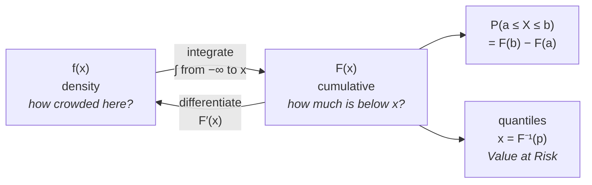

# Mean, Variance & Probability Densities

## Introduction

Quantitative trading models rest on statistics that describe how market data behaves. Rather than trying to predict exactly what the market will do next, traders estimate the *likelihood* of different outcomes and decide accordingly.

Four ideas do most of the work: the **mean**, the **variance**, the **probability density function**, and the **cumulative distribution function** that ties them together. The first two summarise a dataset in two numbers. The last two describe the entire shape it came from — and the CDF, in particular, is the object that actually answers the questions traders ask.

## Mean

The mean is the average value of a dataset, and is often read as the expected value of a variable. In trading it estimates the average return of an asset or strategy over a period:

$$
\mu = \frac{1}{n}\sum_{i=1}^{n} x_i
$$

where $x_i$ is each observation, $n$ the number of observations, and $\mu$ the mean.

### Example

A strategy produces daily returns of 0.01, −0.02, 0.03, 0.00, and 0.02. The mean is

$$
\mu = \frac{0.01 - 0.02 + 0.03 + 0.00 + 0.02}{5} = 0.008
$$

or 0.8% per day.

The mean summarises average performance but says nothing about consistency. Two strategies with the same average return can behave completely differently.

## Variance

Variance measures how far observations fall from the mean. Where the mean locates the centre, variance describes the spread around it:

$$
\sigma^2 = \frac{1}{n}\sum_{i=1}^{n}(x_i - \mu)^2
$$

In finance, variance is the standard measure of volatility: larger values mean more uncertain returns. A low-variance strategy stays near its average; a high-variance one swings widely on both sides. Investors generally prefer higher expected return at lower variance.

(When $\mu$ is estimated from the same sample rather than known, the divisor becomes $n-1$ — the quant tier derives why.)

## Mean versus variance

The two carry complementary information, and reading either alone misleads. The mean estimates the return you expect; the variance measures the uncertainty attached to it. Two strategies might both average 10% a year, but the one with lower variance is generally more reliable, because its outcomes cluster more tightly around that average.

This is why performance is almost never quoted as a return alone. Risk-adjusted measures like the Sharpe ratio exist precisely to combine the two into one number.

## Probability density functions

Asset returns are continuous rather than discrete: a return can be 0.0134 or 0.01341 or anything between. For continuous variables, asking for the probability of an exact value is not useful — it is zero. Instead we describe them with a **probability density function** (PDF), which says how probability is distributed across the range of possible values.

The probability that a random variable falls between $a$ and $b$ is the area under the density between those points:

$$
P(a \le X \le b) = \int_{a}^{b} f(x)\,dx
$$

A valid density must be nonnegative everywhere, and the total area under it must equal exactly 1. Height alone is not probability — **area** is. Regions where the curve is high are where outcomes cluster.

## The cumulative distribution function

Integrating the density from the far left up to a point gives the **cumulative distribution function**:

$$
F(x) = P(X \le x) = \int_{-\infty}^{x} f(t)\,dt
$$

This is the practical workhorse. Its properties follow directly from the definition:

- $F$ is **non-decreasing** — accumulating more area can never reduce the total.
- $F(-\infty) = 0$ and $F(+\infty) = 1$ — before everything, no probability; after everything, all of it.
- $f(x) = F'(x)$ — the density is the *rate* at which probability accumulates. Density and CDF are derivative and integral of one another.

And the reason it matters in practice:

$$
P(a \le X \le b) = F(b) - F(a)
$$

Any interval probability becomes a subtraction. No integration required at the point of use — which is why statistical software tabulates $F$, not $f$.



Running the CDF **backwards** answers the question risk managers actually ask. Rather than "what is the chance of losing more than 5%?", they ask "what loss is exceeded only 5% of the time?" That is the **quantile**, $F^{-1}(0.05)$, and it is exactly how Value at Risk is defined.

## Common distributions

Different distributions capture different kinds of behaviour. Each is just a particular shape of $f$ — and therefore a particular $F$. (The companion article on probability distributions treats these in more depth; here they illustrate the density/CDF machinery.)

### Normal

The familiar symmetric bell curve, concentrated near the mean with thin tails. Many financial models assume normal returns because it is mathematically convenient — closed-form results, and sums of normals stay normal. It is a reasonable first approximation, but real markets produce extreme moves far more often than it predicts.

```chart
normal_vs_fat_tail()
```

Both curves here have the same standard deviation. The fat-tailed one puts dramatically more probability in the extremes — which is the single most important caveat attached to the normal assumption in finance.

### Binomial

Models a fixed number of independent trials with two outcomes each — a winning or losing trade. Useful for the probability of achieving a given number of winners in a sample, and for judging whether a strategy's hit rate is distinguishable from luck.

```chart
binomial_pmf(n=10,p=0.55)
```

### Poisson

Counts events in a fixed interval rather than measuring their size. In finance it models relatively rare occurrences: volatility spikes, large price jumps, or bursts of order flow.

```chart
poisson_pmf(lam=3)
```

### Pareto

A heavy-tailed distribution in which extreme outcomes are far more likely than under a normal. This makes it well suited to tail-risk work, where the rare large move dominates the outcome.

```chart
pareto_pdf(alpha=1.5)
```

Note the shape: most of the mass sits near the left, but the tail decays slowly enough that enormous values remain realistic. That slow decay is the entire point, and it has a sharp consequence — for some Pareto tails the variance is not merely large but mathematically infinite, so "the volatility" is not a meaningful number at all.

## Application in trading

These pieces work as a system. The mean estimates expected return, the variance measures uncertainty around it, the density describes how probability is spread across outcomes, and the CDF converts that shape into the specific numbers a desk needs — interval probabilities, quantiles, and risk limits.

The shift in mindset is the real lesson. Rather than asking whether a stock will rise or fall, quantitative traders ask how likely each range of outcomes is and how much risk attaches to each. That probabilistic framing underlies most modern strategy design and risk management.

## Key takeaways

- The mean locates the centre of a dataset; the variance measures spread around it. Neither is interpretable without the other.
- For continuous variables, probability is the **area** under the density, not the height of it.
- A valid density is nonnegative and integrates to exactly 1.
- The CDF $F(x) = P(X \le x)$ is non-decreasing, runs from 0 to 1, and satisfies $f = F'$.
- Any interval probability is $F(b) - F(a)$, and inverting $F$ gives quantiles — the definition of Value at Risk.
- Normal, binomial, Poisson, and Pareto are different shapes of the same machinery; real returns are fatter-tailed than the normal, and some heavy tails have no finite variance at all.

*Educational content, not investment advice.*
