# Probability Distributions in Trading

## Introduction

A **probability distribution** describes how probability is assigned across the possible outcomes of an experiment. While earlier sections focused on the probability of individual events, distributions let us study uncertainty at a deeper level by examining how outcomes vary numerically.

So far we have analyzed events with binary outcomes — whether a coin lands heads or tails, or whether a marble drawn from a bag is red or blue. These questions ask *whether* something happens.

In trading, however, many important questions are not binary. Instead we care about quantities such as:

- how much a price moves
- how large a gain or loss is
- how frequently extreme outcomes occur

To answer these, we move from events to **random variables**, and from single probabilities to **probability distributions**.

---

## Random Variables and Distributions

A **random variable** assigns a numerical value to each possible outcome of an experiment.

For example:

- Let $X$ be the return of a stock over one day.
- Each possible market outcome corresponds to a numerical value of $X$, such as $-1.2\%$, $0.3\%$, or $2.1\%$.

A **probability distribution** then describes how likely each of these values is to occur. Rather than assigning probability to a single event, a distribution spreads probability across *all* possible values of a random variable. This lets us study not just whether outcomes occur, but how they are distributed across different magnitudes.

Distributions come in two families, which is the first thing to classify:

```mermaid
flowchart TD
  A[Probability distribution] --> B{Countable values<br/>or a continuous range?}
  B -->|Countable| C[Discrete]
  B -->|Continuous| D[Continuous]
  C --> C1[Binomial<br/>wins out of n trades]
  C --> C2[Poisson<br/>events per time window]
  D --> D1[Normal N&#40;μ, σ²&#41;<br/>textbook returns]
  D --> D2[Pareto<br/>heavy-tailed extremes]
```



---

## Mean vs. Variance

Two fundamental characteristics of any distribution are its **mean** and **variance**.

### Mean

The **mean**, also called the **expected value**, is the long-run average value of a random variable. For a random variable $X$ it is written:

$$
\mathbb{E}[X]
$$

In trading the mean is interpreted as:

- expected return
- average profit or loss per trade
- long-term strategy edge

A positive mean indicates that a strategy has a statistical advantage, even though individual outcomes vary.

### Variance

While the mean describes the center of a distribution, **variance** describes how spread out the outcomes are around that center. The variance of $X$ is defined as:

$$
\mathrm{Var}(X) = \mathbb{E}\big[(X - \mathbb{E}[X])^2\big]
$$

Variance measures the expected squared deviation from the mean. Its square root is the **standard deviation**, commonly used as a measure of volatility.

In trading, variance represents uncertainty, risk, and volatility of returns. Two strategies may have the *same* expected return but very different variances, and therefore very different risk profiles.

## Types of Probability Distributions

Probability distributions are generally classified into two categories:

- **discrete distributions**
- **continuous distributions**

The distinction depends on whether the random variable takes countable values or values from a continuous range.

## Discrete Distributions

Discrete distributions apply when a random variable can take on only specific, countable values.

### Binomial Distribution

The **binomial distribution** models the number of successes in a fixed number of independent trials, where each trial has the same probability of success.

If $X$ is the number of successes in $n$ trials with success probability $p$, then:

$$
P(X = k) = \binom{n}{k} p^k (1 - p)^{n - k}
$$

```chart
binomial_pmf(n=10, p=0.55)
```

In trading, the binomial distribution is often used to model:

- win/loss outcomes of trades
- hit rates of strategies
- streaks of winning or losing trades

This highlights an important idea: a high probability of winning does not necessarily imply profitability, since the *size* of wins and losses also matters.

### Poisson Distribution

The **Poisson distribution** models the number of events occurring in a fixed interval of time. If events occur at an average rate $\lambda$, then the probability of observing $k$ events is:

$$
P(X = k) = \frac{\lambda^k e^{-\lambda}}{k!}
$$

A notable property of the Poisson distribution is that its mean and variance are equal:

$$\mathbb{E}[X] = \mathrm{Var}(X) = \lambda$$

```chart
poisson_pmf(lam=3)
```

In trading, Poisson distributions are used to model:

- the number of trades in a given time period
- order arrivals in financial markets
- sudden price jumps driven by news or events

## Continuous Distributions

Continuous distributions apply when a random variable can take any value within a continuous interval. Many quantities in trading, such as returns and price changes, are modeled as continuous random variables.

## Probability Density Functions

For continuous random variables, probability is described using a **probability density function** (PDF), denoted $f(x)$.

A PDF satisfies the following properties:

- $f(x) \ge 0$ for all $x$
- the total area under the curve equals 1:

$$
\int_{-\infty}^{\infty} f(x)\,dx = 1
$$

Probabilities are obtained by integrating the density over an interval:

$$
P(a \le X \le b) = \int_a^b f(x)\,dx
$$

Note that for a continuous variable the probability of any single exact value is zero — only *ranges* carry probability, given by the area under the curve. In trading, PDFs are used to model distributions of returns, profit-and-loss outcomes, and price changes over time. They provide a quantitative way to reason about typical outcomes as well as rare, extreme events.

---

## Normal Distribution

The **normal distribution** is one of the most commonly used continuous distributions. It is symmetric and fully characterized by its mean $\mu$ and variance $\sigma^2$. A random variable $X$ that follows a normal distribution is written:

$$
X \sim \mathcal{N}(\mu, \sigma^2)
$$

In trading, the normal distribution is often used as a first approximation for short-term returns because of its mathematical simplicity. However, real market returns frequently exhibit **heavier tails** than the normal distribution predicts — extreme moves happen far more often than the bell curve implies.

```chart
normal_vs_fat_tail(nu=2)
```

The shaded region shows the mass a normal curve assigns to moves beyond $3\sigma$ versus a fat-tailed alternative. Under a normal model a $3\sigma$ day is a roughly once-per-year event; in real markets such days cluster far more frequently.

## Pareto Distribution

The **Pareto distribution** is an example of a heavy-tailed distribution, often used to model extreme outcomes. One form of its probability density function is:

$$
f(x) = \frac{\alpha\, x_m^{\alpha}}{x^{\alpha + 1}}, \quad x \ge x_m
$$

```chart
pareto_pdf(alpha=1.5)
```

In trading and finance, Pareto-like behavior appears in:

- market crashes
- large gains or losses
- wealth and return distributions

This distribution emphasizes that a small number of extreme events can dominate long-term outcomes — the "80/20" tail where the biggest moves account for most of the total gain or loss.

## Why Distributions Matter in Trading

Probability distributions allow traders to move beyond simple win-loss analysis. They are used to:

- evaluate risk and reward
- estimate drawdowns
- assess tail risk
- design position-sizing and risk-management rules

Rather than predicting individual outcomes, traders use distributions to understand the *range* of possible outcomes and their associated probabilities.

## Conclusion

Probability distributions provide a framework for understanding uncertainty in trading. By representing outcomes as random variables and studying how those outcomes are distributed, traders can reason more systematically about risk, variability, and long-term performance.

In practice, successful trading is not about eliminating uncertainty, but about understanding it well enough to manage risk and make consistent decisions over time.

## Key Takeaways

- A **random variable** turns outcomes into numbers; a **distribution** describes how likely each value is.
- The **mean** $\mathbb{E}[X]$ is a strategy's edge; the **variance** $\mathrm{Var}(X)$ is its risk. Equal means can hide very different risks.
- **Discrete** distributions (binomial, Poisson) count outcomes; **continuous** distributions (normal, Pareto) use a PDF whose total area is 1.
- The **normal** distribution is a convenient first approximation, but real returns have **fatter tails** than it predicts.
- **Heavy-tailed** models like the Pareto capture the reality that a few extreme events can dominate long-term results — so tail risk must be planned for, not assumed away.
