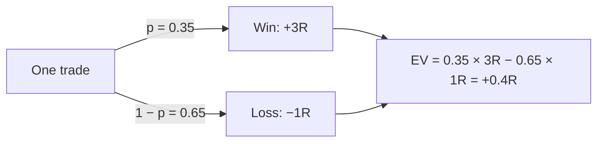
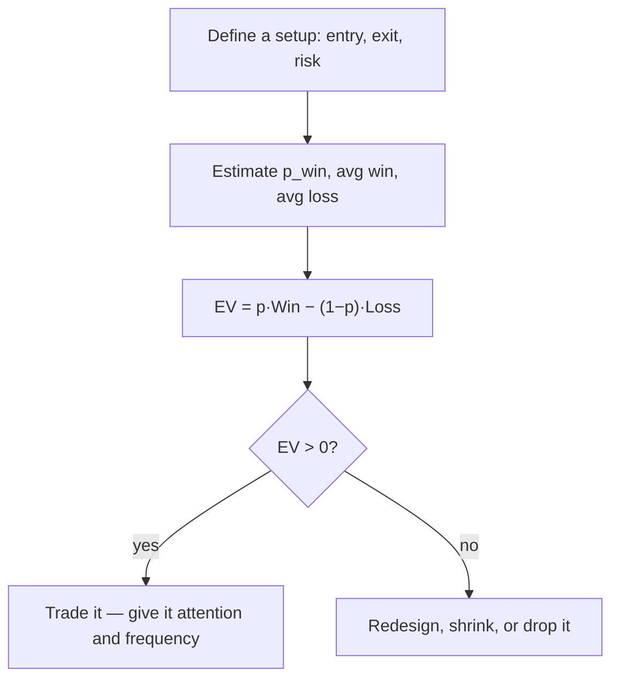

# Expected Value (E[X])

## What expected value answers

If you repeat the same uncertain decision under the same rules, expected value tells you the **average** gain or loss per repetition. Any single outcome may land far from it, but as you repeat, the running average converges toward the expected value. It is one of the most foundational ideas in probability, economics, and finance.

In trading it reframes how you judge a **setup** — a repeatable trade defined by fixed entry, exit, and risk rules. The question is never *"will the next trade win?"* It is *"does this setup make money across many trades?"* A setup has **positive expected value** if, over time, its winners more than offset its losers. If they don't, it loses money no matter how good individual trades feel.

## From outcomes to numbers: the random variable

To take an average, outcomes have to be numbers. A **random variable** assigns a number to each outcome of an uncertain process: a coin flip maps to 1 (heads) or 0 (tails), a die to 1–6, and a trade to, say, +2R for a win or −1R for a loss (where **R** = one unit of risk). Once outcomes are numeric, "average" becomes meaningful.

## The definition

For a discrete random variable taking values $R_i$ with probabilities $p_i$, expected value is the probability-weighted sum:

$$E[X] = \sum_i p_i \, R_i$$

Outcomes with higher probability get more weight. Simple as it looks, this formula captures the entire idea. For a two-outcome trade it specializes to:

$$EV = p(\text{win}) \cdot R(\text{win}) - p(\text{loss}) \cdot R(\text{loss})$$

**Positive EV → favorable over the long run. Negative EV → not, regardless of how often it wins.**

## A setup that loses more often — and still wins

Consider a setup that **loses \$100 on 55% of trades** and **wins \$150 on the other 45%**. It loses more often than it wins, yet:


```chart
expected_value_bars(outcomes=(-100, 150), probs=(0.55, 0.45))
```


Weighting each outcome by its chance: 0.55 × (−\$100) + 0.45 × (+\$150) = −\$55 + \$67.50 = **+\$12.50 per trade**. The rare-but-larger win carries the average above zero. Win rate alone told you nothing; the *combination* of win rate and payoff is what produced the edge.

## The win-rate trap

Suppose a setup wins 40% of the time, making 2R on winners and losing 1R on losers:

$$EV = 0.40 \cdot 2R - 0.60 \cdot 1R = 0.8R - 0.6R = +0.2R$$

On average it earns 0.2 units of risk per trade — even though it loses more often than it wins. Now compare two setups that feel very different:

- **Wins 70% of the time**, +1R on wins, −3R on losses:
$$EV = 0.70 \cdot 1R - 0.30 \cdot 3R = 0.7R - 0.9R = -0.2R \quad(\text{losing system})$$
- **Wins only 35% of the time**, +3R on wins, −1R on losses:
$$EV = 0.35 \cdot 3R - 0.65 \cdot 1R = 1.05R - 0.65R = +0.4R \quad(\text{winning system})$$

The low-win-rate setup feels worse — it loses two trades out of three — but it is mathematically superior. As a probability tree, the second setup is:





Three lessons fall out: you can lose more often than you win and still be profitable; the edge lives in win rate **and** payoff together, never one alone; and a high win rate by itself guarantees nothing. Amateurs chase accuracy — professionals chase expectation.

## Expected value ≠ probable value

A common mistake is reading E[X] as "what will most likely happen." It isn't. Take a trade with a **99% chance of losing \$1** and a **1% chance of winning \$200**:

$$E[X] = 0.99(-1) + 0.01(200) = -0.99 + 2.00 = +1.01$$


```ascii
  One trade almost always ends:   -$1     (99% of the time)
  ...and very rarely:             +$200   (1% of the time)
  Average over many trades:       +$1.01 per trade  <-- the edge
```


You will *usually* lose, yet the average outcome is positive. This same gap between the typical result and the average is why casinos, insurers, and some uncomfortable-but-profitable strategies all work. **Expected value is a decision tool, not a prediction tool** — it tells you whether a bet is favorable over time, not whether the next instance will pay.

## Edge per trade, and why frequency helps

Expected value per trade *is* your edge. A positive edge is small on any single trade, but the **law of large numbers** turns "small and positive" into "nearly certain" as the number of independent trades grows:


```chart
many_small_bets(edge=0.02)
```


A 2% edge per bet is almost a coin flip once; over hundreds of independent bets the probability of finishing ahead climbs toward certainty. This is why frequency matters: a genuine edge, repeated often enough, lets the law of large numbers work for you. (It also cuts the other way — a *negative* edge becomes near-certain ruin over many bets.)

## The decision, as a flow





In practice you don't need perfect probabilities — just honest estimates. Log trades by setup, and after a meaningful sample use the approximation $EV \approx \text{WinRate}\cdot\text{AvgWin} - (1-\text{WinRate})\cdot\text{AvgLoss}$. That is usually enough to see which setups actually pay.

## Linearity: why EV scales cleanly

Expected value is **linear**, which is what makes it a building block for whole portfolios:

$$E[X + Y] = E[X] + E[Y], \qquad E[c \cdot X] = c \cdot E[X]$$

Additivity lets you break a complex system into parts and analyze each independently, then sum. Scalar multiplication means position size scales the edge predictably: if a 1-lot trade has EV of +0.2R, a 10-lot trade has EV of +2R — no probabilities to recompute. Note the crucial caveat: **E[X] locates the center of outcomes but says nothing about their spread.** Two systems with identical EV can feel completely different because of variance, which is exactly why risk management (position sizing, stops) exists — to survive the variability around the average, not to replace it.

## Key takeaways

- **Expected value = the probability-weighted average outcome:** $E[X] = \sum_i p_i R_i$.
- A setup can **lose more often than it wins and still be profitable** — edge is win rate *and* payoff together.
- A high win rate guarantees nothing; a 70%-winner can bleed money while a 35%-winner compounds.
- **E[X] ≠ the most likely outcome.** It is a decision tool for the long run, not a prediction of the next trade.
- Edge per trade is small; the **law of large numbers** makes a real edge nearly certain over many independent trades.
- EV is **linear**, so it scales with size and adds across strategies — but it ignores variance, which is why risk management is a separate, necessary discipline.
