# Monte Carlo Risk Forecasting

## Introduction

Monte Carlo simulation is a simple idea with deep reach: instead of producing a single forecast, you **generate many "what could happen" return paths**, run your portfolio through each one, and then measure how it behaves across the whole set. The output is not one number but a *distribution* of outcomes.

It earns its keep when you care about **tail risk** — the rare but painful losses that a point forecast hides. An average return tells you nothing about how bad a bad day can get; a simulated distribution tells you exactly that.


```chart
monte_carlo_paths()
```


Each thin line above is one simulated future. Together they form a **cone** of possibilities: the median path down the middle, a shaded band for the typical range, and — crucially — a marker for the loss level you only breach a small fraction of the time.

## Key terms (plain language)

- **Scenario / path** — one simulated return history over your chosen horizon (e.g. 20 trading days).
- **Portfolio PnL** — profit and loss from your positions given a path of returns.
- **Drawdown** — how far your equity curve falls from a previous peak along a path.
- **Value-at-Risk (VaR)** — a loss threshold you exceed only $X\%$ of the time (e.g. 1% for 99% VaR).
- **Expected shortfall (ES)** — the *average* loss in the worst $X\%$ of outcomes, i.e. the tail beyond VaR.

VaR answers "how bad is a bad day at the edge?"; ES answers "and when it's that bad or worse, how bad on average?" ES is the more honest tail number because it looks *past* the threshold rather than stopping at it.


```ascii
   loss distribution (simulated PnL)

   count
     |            ______
     |          /        \
     |        /            \___
     |   ___/                  \____
     +--#############|-----------------> PnL
        \___worst 5%_/^
                     VaR (the threshold)
        \__ ES = average loss inside the worst 5% __/
```


## The workflow

The engine is a loop: sample a batch of futures, aggregate what each one did to the portfolio, then read the resulting distribution. More paths simply sharpen the picture.

```mermaid
flowchart TD
  A[Model the returns: means, vols, correlations] --> B[Sample one path of correlated returns]
  B --> C[Roll the portfolio forward: PnL, drawdown, margin]
  C --> D{Enough paths?}
  D -->|no, draw another| B
  D -->|yes| E[Aggregate into a distribution]
  E --> F[Extract VaR, ES, P&#40;breach limit&#41;, percentiles]
  F --> G[Explain: which assets & correlations drive the tail]
```





Step by step:

1. **Prepare inputs.** Clean historical returns, volatility estimates, and portfolio weights. Choose a correlation structure — a sample covariance matrix or a factor model.
2. **Generate paths.** Sample correlated returns (a common approach is a Cholesky factorization of the covariance matrix, which turns independent draws into correlated ones). Pick a horizon (1-day, 10-day, 1-month) and a number of simulations — often 10,000 or more.
3. **Aggregate portfolio PnL.** Convert each path into cumulative PnL, drawdown, margin utilization, and any other metric you monitor.
4. **Extract risk metrics.** Compute VaR and ES, the probability of breaching a risk limit, and the distribution of holding-period returns.
5. **Explain the results.** Identify what drives the tail losses — which assets and which correlations matter most when things go wrong.

## Reading the distribution: percentiles, VaR, ES

Once you have (say) 10,000 simulated end-of-horizon PnL values, the risk metrics are just **percentiles of that sample**:

- Sort the outcomes from worst to best.
- The 5th percentile is your **95% VaR** — you lose more than this only 5% of the time.
- Average everything at or below that percentile to get the **95% ES**.

No formula assumptions are needed to read the numbers off — that is the appeal. The assumptions live entirely in *how you generated the paths*.

## The fat-tail warning

The single biggest failure mode is feeding the simulator a **Gaussian (normal)** return model when real markets are **fat-tailed**. Under a normal model, a "5-sigma" crash is supposed to happen roughly once in ten thousand years; in real markets, moves like that show up every few years. Same-looking bell curve in the middle, radically different tails:


```chart
normal_vs_fat_tail(nu=2)
```


If your simulation draws from the blue curve while reality follows the red one, your VaR and ES will look reassuringly small right up until the day they are catastrophically wrong. Fat-tailed inputs (e.g. a Student-t model, or bootstrapping from historical shocks) push the tail mass back where it belongs.

## Why more paths help

Tail estimates are computed from the *rare* outcomes, so a few hundred paths leave them noisy — the 5% tail of 200 paths is only 10 samples. As you add simulations, the running estimate settles down (the same law-of-large-numbers behavior that stabilizes any average):


```chart
frequentist_convergence()
```


A practical rule: quote tail metrics with a sample size large enough that re-running the simulation with a new random seed barely moves the number.

## Common pitfalls

- **Assuming normal returns.** Real markets have fat tails; Monte Carlo can still help, but be honest about the limitation and prefer heavy-tailed inputs.
- **Using unstable correlations.** Correlations move toward 1 during a crisis — everything sells off together. Stress-test with elevated correlations, not just the calm-market covariance.
- **Ignoring leverage.** Risk is not just the return distribution; it is the return distribution *times exposure*. Leverage stretches both tails.
- **Too few simulations.** Tail estimates are noisy with only a few hundred paths. Use enough that the number is stable across seeds.
- **No sanity checks.** Compare your simulated volatility and correlations back to real history to confirm you are not simulating nonsense.

## Key takeaways

- Monte Carlo replaces a single forecast with a **distribution** of simulated futures, built for measuring tail risk.
- The loop is: **model returns → sample many correlated paths → aggregate PnL → read the distribution**.
- **VaR** is a tail percentile; **ES** is the average loss beyond it and is the more honest tail measure.
- The results are only as good as the inputs: **Gaussian assumptions, unstable correlations, and ignored leverage** all understate the tail.
- Run **enough paths** that your tail estimates are stable, and always sanity-check simulated stats against real history.

*This is educational content, not investment advice.*
