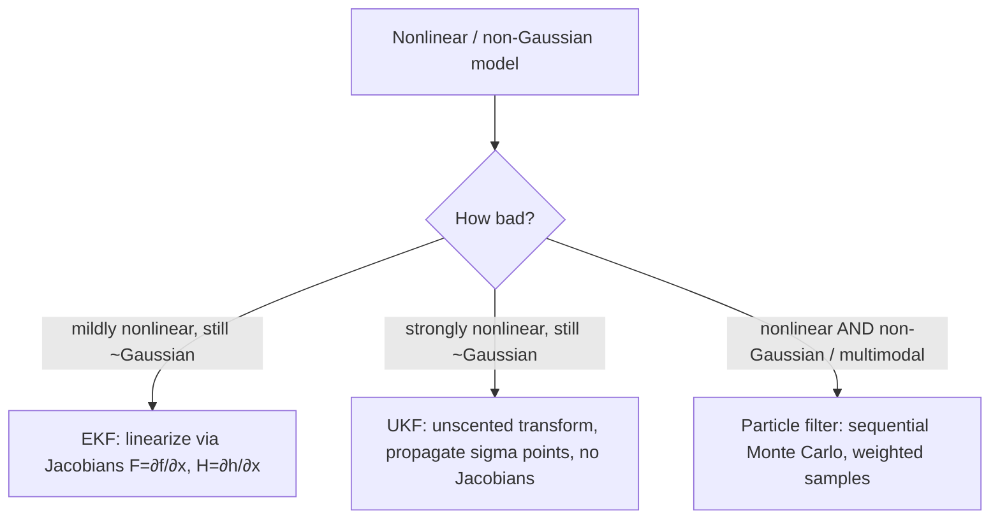

# State-Space Models & the Kalman Filter: Optimal Recursive Estimation

## 1. The linear-Gaussian state-space model

Let the hidden state $x_t \in \mathbb{R}^n$ evolve linearly with Gaussian shocks, observed through a linear-Gaussian channel:

$$
\begin{aligned}
x_t &= F_t\, x_{t-1} + B_t u_t + w_t, & w_t &\sim \mathcal{N}(0, Q_t),\\
z_t &= H_t\, x_t + v_t, & v_t &\sim \mathcal{N}(0, R_t),
\end{aligned}
$$

with $x_0 \sim \mathcal{N}(\hat{x}_0, P_0)$ and $\{w_t\}, \{v_t\}$ mutually independent, white, and independent of $x_0$. Here $F_t$ is the transition matrix, $H_t$ the observation (design) matrix, $u_t$ an optional exogenous control, and $Q_t, R_t$ the process- and observation-noise covariances. The **filtering problem** is to compute the posterior $p(x_t \mid z_{1:t})$ recursively.

Because the model is linear and Gaussian, every filtering and prediction density is Gaussian, so it is fully described by a mean and covariance:

$$p(x_t \mid z_{1:t}) = \mathcal{N}\!\big(\hat{x}_{t\mid t},\, P_{t\mid t}\big).$$

The Kalman filter is the pair of recursions that propagate $(\hat{x}, P)$ exactly.

## 2. The recursions

**Predict (time update).** Push the posterior through the dynamics:

$$
\begin{aligned}
\hat{x}_{t\mid t-1} &= F_t\,\hat{x}_{t-1\mid t-1} + B_t u_t, \\
P_{t\mid t-1} &= F_t\,P_{t-1\mid t-1}\,F_t^\top + Q_t.
\end{aligned}
$$

**Update (measurement update).** Fold in $z_t$ via the innovation $y_t$ and its covariance $S_t$:

$$
\begin{aligned}
y_t &= z_t - H_t\,\hat{x}_{t\mid t-1} && \text{(innovation / prediction error)},\\
S_t &= H_t\,P_{t\mid t-1}\,H_t^\top + R_t && \text{(innovation covariance)},\\
K_t &= P_{t\mid t-1}\,H_t^\top\,S_t^{-1} && \text{(Kalman gain)},\\
\hat{x}_{t\mid t} &= \hat{x}_{t\mid t-1} + K_t\,y_t,\\
P_{t\mid t} &= (I - K_t H_t)\,P_{t\mid t-1}.
\end{aligned}
$$

The gain $K_t$ interpolates between prediction and measurement. In the scalar $H=1$ case, $K_t = P^-/(P^- + R)$ — a trust dial in $[0,1)$: large predicted uncertainty $P^-$ or small $R$ pushes $K \to 1$ (believe the data); small $P^-$ or large $R$ pushes $K \to 0$ (believe the model).


```chart
kalman_filter_demo()
```


## 3. Deriving the gain as the MMSE / Bayesian posterior update

We give two derivations that meet at the same $K_t$: the **Gaussian-conditioning (MMSE)** route and the **information-form (posterior-precision)** route.

### 3a. MMSE via Gaussian conditioning

Drop the time subscript; condition on $z_{1:t-1}$ so the prior is $x \sim \mathcal{N}(\hat{x}^-, P^-)$ with $\hat{x}^- \equiv \hat{x}_{t\mid t-1}$, $P^- \equiv P_{t\mid t-1}$. With $z = Hx + v$, the pair $(x, z)$ is jointly Gaussian:

$$
\begin{bmatrix} x \\ z \end{bmatrix} \sim
\mathcal{N}\!\left(
\begin{bmatrix} \hat{x}^- \\ H\hat{x}^- \end{bmatrix},\;
\begin{bmatrix} P^- & P^- H^\top \\ H P^- & H P^- H^\top + R \end{bmatrix}
\right).
$$

The minimum-mean-square-error estimator is the conditional mean $\hat{x}^+ = \mathbb{E}[x \mid z]$, and for jointly Gaussian vectors this is exactly the linear conditional-expectation formula

$$
\mathbb{E}[x \mid z] = \mu_x + \Sigma_{xz}\Sigma_{zz}^{-1}(z - \mu_z)
= \hat{x}^- + \underbrace{P^- H^\top\big(H P^- H^\top + R\big)^{-1}}_{=\,K}\,(z - H\hat{x}^-).
$$

That identifies $K = P^- H^\top S^{-1}$. The conditional (posterior) covariance is the Schur complement

$$
P^+ = \Sigma_{xx} - \Sigma_{xz}\Sigma_{zz}^{-1}\Sigma_{zx}
     = P^- - P^- H^\top S^{-1} H P^- = (I - KH)P^-. \qquad\blacksquare
$$

Because the noise is Gaussian, the conditional mean **is** the full posterior mean, so the Kalman estimate is the *global* MMSE estimator among **all** measurable functions of the data — not merely among linear ones.

### 3b. Information (precision) form — "posterior precision = sum of precisions"

Write Bayes' rule for the update, $p(x\mid z) \propto p(z\mid x)\,p(x)$, and collect the quadratic forms in the exponent:

$$
-2\log p(x\mid z) \;\overset{c}{=}\; (x-\hat{x}^-)^\top (P^-)^{-1}(x-\hat{x}^-) + (z-Hx)^\top R^{-1}(z-Hx).
$$

This is quadratic in $x$, so the posterior is Gaussian; matching the $x^\top(\cdot)x$ and linear terms gives

$$
\boxed{\,(P^+)^{-1} = (P^-)^{-1} + H^\top R^{-1} H\,}, \qquad
(P^+)^{-1}\hat{x}^+ = (P^-)^{-1}\hat{x}^- + H^\top R^{-1} z.
$$

Posterior **precision is the sum of prior precision and the data precision** $H^\top R^{-1} H$ — the cleanest statement of what "an observation buys you." Applying the Sherman–Morrison–Woodbury identity to invert $(P^+)^{-1}$ recovers the gain form $K = P^- H^\top S^{-1}$ of §3a, confirming the two derivations coincide. The information form is preferable when $R$ is small (near-certain observations) or when fusing many sensors, since precisions simply add.

## 4. Optimality, and exactly what "optimal" means

- **Gaussian noise.** The filter returns the exact posterior; $\hat{x}_{t\mid t}$ is the MMSE (conditional-mean) estimator, optimal over all estimators.
- **Non-Gaussian noise, known first two moments.** The Kalman recursion is still the **best linear unbiased estimator** (linear-MMSE / BLUE) — the projection of $x_t$ onto the linear span of $z_{1:t}$ (Gauss–Markov / orthogonality principle). It is no longer globally optimal because nonlinear estimators can exploit higher moments.
- **Innovations are white.** Under a correctly specified model the innovation sequence $\{y_t\}$ is zero-mean, serially uncorrelated, with covariance $S_t$. This is both a *specification test* (whiten-and-check) and the basis for likelihood estimation below.

### Parameter estimation by prediction-error decomposition

$F, H, Q, R$ are rarely known. The Gaussian log-likelihood factorizes through the one-step-ahead innovations (Schweppe's **prediction-error decomposition**):

$$
\log L(\theta) = -\tfrac{1}{2}\sum_{t=1}^{T}\Big[\, d\log 2\pi + \log\lvert S_t(\theta)\rvert + y_t(\theta)^\top S_t(\theta)^{-1} y_t(\theta)\,\Big],
$$

which the filter produces as a by-product. Maximizing it (directly, or via EM treating $x_{1:T}$ as latent) yields MLEs of the hyperparameters — the standard workflow in Harvey (1989) and Durbin & Koopman (2012). For the full history one runs the **RTS smoother** ($p(x_t\mid z_{1:T})$) backward after the forward filter.

## 5. When linearity or Gaussianity fails: EKF, UKF, particle filters

Real dynamics $x_t = f(x_{t-1}) + w_t$, $z_t = h(x_t) + v_t$ are often nonlinear, and tails are often non-Gaussian.



- **EKF** linearizes $f, h$ around the running estimate using Jacobians, then applies the linear recursions. Cheap, but biased and divergent under strong curvature.
- **UKF** propagates a deterministic set of **sigma points** through the true nonlinearity and reconstructs mean/covariance — third-order accurate for the mean, no Jacobians, more robust than the EKF.
- **Particle filters** (sequential importance resampling) represent $p(x_t \mid z_{1:t})$ by weighted samples and target *arbitrary* nonlinear, non-Gaussian, multimodal posteriors at higher compute cost. When fat tails matter — and in markets they do — the Gaussian assumption behind the plain Kalman filter under-weights extreme innovations that a particle filter can represent directly:


```chart
normal_vs_fat_tail(nu=2)
```


## 6. Trading application: dynamic hedge ratio & pairs trading

Classical pairs trading fits a *static* hedge ratio $\beta$ by OLS on a rolling window: $y_t = \alpha + \beta x_t + \varepsilon_t$. But cointegrating relationships drift, and a fixed window forces a stale-vs-noisy trade-off. Cast the regression as a state-space model with a **time-varying coefficient** as the hidden state:

$$
\begin{aligned}
\text{state:} \quad & \beta_t = \beta_{t-1} + w_t, & w_t &\sim \mathcal{N}(0, Q) &&(\text{random-walk hedge ratio}),\\
\text{obs:} \quad & y_t = H_t\,\beta_t + v_t, & v_t &\sim \mathcal{N}(0, R), && H_t = x_t.
\end{aligned}
$$

Two moves make this fully practical:

1. **Track intercept and slope jointly.** Let the state be $\beta_t = (\alpha_t, b_t)^\top$ with $H_t = [\,1,\; x_t\,]$; the filter runs an *online, adaptive* regression that re-weights history through $Q/R$ rather than a hard window.
2. **Trade the innovation.** The one-step innovation $y_t = y_t^{\text{obs}} - H_t\hat\beta_{t\mid t-1}$ is precisely the model's live estimate of the spread's surprise, and $S_t$ is its predicted variance. The standardized innovation

$$
\tilde z_t = \frac{y_t}{\sqrt{S_t}}
$$

is a **self-calibrating z-score**: mean-revert when $\lvert \tilde z_t \rvert$ is large, size inversely to $\sqrt{S_t}$. Because $K_t$ is adaptive, the hedge ratio tightens when the relationship is stable and loosens when it breaks — a decisive edge over rolling-window OLS, and the standard Kalman construction popularized for pairs (Chan, 2013).

Beyond pairs: model latent **fair value** as a random-walk state to smooth microstructure noise before feeding returns to an ML model; model **realized volatility** as the state for real-time, filter-based position sizing; or let market-makers quote around a filtered inventory-adjusted fair value.

## 7. Practical cautions

- **Filter divergence.** If $R$ is set too small (over-trusting data) or $Q$ too small (over-trusting a rigid model), $P$ collapses and the filter stops listening; enforce symmetry/positive-definiteness with the **Joseph-form** covariance update or a square-root filter.
- **Look-ahead bias.** Use *filtered* ($z_{1:t}$) states for signals; the *smoothed* ($z_{1:T}$) states peek at the future and are for research/diagnostics only.
- **Non-stationarity and tails.** $Q, R$ estimated on calm data under-provision for regime shifts and fat tails — exactly the events that dominate P&L. Stress-test the noise budgets, or move to a heavy-tailed / particle formulation.

## References & further reading

- Kalman, R. E. (1960). *A New Approach to Linear Filtering and Prediction Problems.* Journal of Basic Engineering, 82(1), 35–45.
- Kalman, R. E., & Bucy, R. S. (1961). *New Results in Linear Filtering and Prediction Theory.*
- Harvey, A. C. (1989). *Forecasting, Structural Time Series Models and the Kalman Filter.* Cambridge University Press.
- Durbin, J., & Koopman, S. J. (2012). *Time Series Analysis by State Space Methods* (2nd ed.). Oxford University Press.
- Anderson, B. D. O., & Moore, J. B. (1979). *Optimal Filtering.* Prentice-Hall.
- Julier, S. J., & Uhlmann, J. K. (1997). *A New Extension of the Kalman Filter to Nonlinear Systems* (the UKF).
- Doucet, A., de Freitas, N., & Gordon, N. (2001). *Sequential Monte Carlo Methods in Practice* (particle filters).
- Chan, E. P. (2013). *Algorithmic Trading: Winning Strategies and Their Rationale* (Kalman-filter pairs trading).
