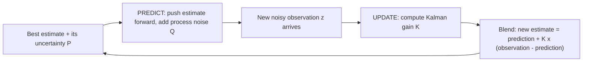

# State-Space Models & Kalman Filters

## The core idea: hidden truth vs. noisy reading

Almost every price you observe is a **noisy reading of something you actually care about but can't see directly**. The last trade price flickers around a calmer "fair value." A spread between two assets wanders around a slowly-drifting equilibrium. Realized volatility jitters around a true, latent level.

A **state-space model** makes that split explicit by tracking two different things:

- **State** — the hidden variable you want (fair value, a smooth spread, a drifting hedge ratio). You never see it directly.
- **Observation** — what you actually measure (last price, the raw spread), which equals the state plus measurement noise.

The **Kalman filter** is the recipe that recovers the state from a stream of noisy observations, updating its estimate one step at a time without ever re-reading the whole history.


```chart
kalman_filter_demo()
```


The green line is the hidden true level, the gray dots are the noisy observations you'd actually receive, and the blue line is the filter's estimate. Notice it never chases the dots — it glides through them.

## Two knobs: how much drifts, how much lies

The filter only needs two "noise budgets," and everything else follows:

- **Process noise (Q)** — how much the hidden state is allowed to *drift* each step. Large Q = "the truth moves a lot, so stay nimble."
- **Observation noise (R)** — how *unreliable* each measurement is (quote flicker, microstructure noise, bad ticks). Large R = "readings lie, so don't overreact to any one of them."

The ratio Q/R sets the filter's personality: a jumpy tracker that hugs every tick, or a sluggish one that barely moves. It is the same bias–variance trade-off you meet everywhere — smooth too little and you keep the noise, smooth too much and you lag the truth.

## The predict-then-update loop

The filter runs the same two-step cycle forever. **Predict** where the state should go next (and grow your uncertainty because time passed), then **update** by blending that prediction with the fresh observation.





In the **predict** step the estimate coasts forward and its uncertainty $P$ *grows* (you know less after time passes). In the **update** step, the new observation shrinks that uncertainty back down. The blend is deliberately partial — you move the estimate only *part* of the way toward the observation.

## The Kalman gain: a trust dial

That "part of the way" is controlled by the **Kalman gain** $K$ — the single most important quantity in the filter. In the scalar case it is

$$K = \frac{P^-}{P^- + R}$$

where $P^-$ is your predicted uncertainty about the state and $R$ is the observation noise. Read it as a **trust dial between 0 and 1**:

- $K \to 1$ (observation looks reliable relative to your uncertainty): **jump to the new reading.**
- $K \to 0$ (observation looks noisy, or you're already confident): **stick with your prediction.**

The new estimate is simply

$$\hat{x} = \hat{x}^- + K\,(z - \hat{x}^-)$$

the prediction $\hat{x}^-$ plus the gain times the **innovation** $z - \hat{x}^-$ (the surprise in the latest observation). Crucially, $K$ is *adaptive*: it is computed fresh each step from the current uncertainty, so the filter automatically trusts data more when it's unsure and less when it's confident.


```ascii
  R small (clean data)   ->  K near 1  ->  estimate tracks each tick closely
  R large (noisy data)   ->  K near 0  ->  estimate ignores flicker, stays smooth
```


## A close relative: hidden regimes

State-space models assume the hidden state moves *continuously*. When the hidden thing instead jumps between a few discrete **regimes** — bull, bear, choppy — the sibling tool is a Hidden Markov Model. Same philosophy (infer an unobserved state from noisy prices), different state space.


```chart
hmm_regimes()
```


## Building a simple filter

1. **Define the hidden signal.** e.g. a random-walk spread $x_t$: $x_t = x_{t-1} + w_t$.
2. **Specify the noise levels.** Pick $Q$ (how much the state may drift) and $R$ (how noisy the measurement is).
3. **Predict.** Project $x_t$ and its uncertainty one step ahead; uncertainty grows by $Q$.
4. **Update.** Compute the gain, then blend the prediction with the new observation.
5. **Repeat.** Store the filtered state — this becomes your clean series for signals or risk.

## Popular trading uses

- **Cointegration / pairs trading.** Filter the spread so its z-score reacts faster than a lagging rolling mean, and let the **hedge ratio itself be a state** that drifts over time instead of being re-fit on a fixed window.
- **Microstructure smoothing.** Strip quote flicker out of prices before feeding returns into a machine-learning model.
- **Adaptive volatility.** Treat realized volatility as the hidden state and size positions off the filtered level in real time.
- **Inventory / fair-value targeting.** Market makers model "fair value" as a state and quote around the filtered signal.

## Beginner tips

- Start with a **single variable** (one asset, one state) so you can eyeball raw vs. smoothed side by side.
- **Normalize inputs** — huge raw values make the covariance arithmetic unstable.
- **Log every parameter.** Risk and audit teams will ask exactly how the "magic smoothing" works, and $Q$, $R$, and the gain are the answer.

## Key takeaways

- A state-space model splits the world into a **hidden state** (what you want) and a **noisy observation** (what you measure).
- The Kalman filter recovers the state with an endless **predict → update** loop, carrying uncertainty forward and shrinking it with each reading.
- The **Kalman gain** is a trust dial: high when data is clean, low when data is noisy — and it is recomputed adaptively every step.
- The only real design choices are **Q** (state drift) and **R** (measurement noise); their ratio sets how smooth vs. responsive the filter is.
- In trading it powers **smoothed prices, dynamic hedge ratios, faster pairs-trading z-scores, and adaptive volatility.**
