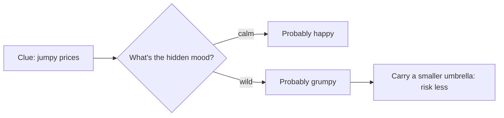

# The Market's Secret Moods 🌤️

Some mornings you wake up and the curtains are stuck shut. You *can't* see the sky. So how do you know whether to grab a raincoat or sunglasses?

You **guess**. You peek at the clues: if everyone outside is holding umbrellas, it's probably stormy. If they're licking ice cream in sunglasses, it's probably sunny. You never *see* the weather's "mood" directly — you read it from the stuff around you.

Markets do the exact same thing.


```comic
{
  "title": "Guess the Hidden Mood",
  "panels": [
    {"emoji": "🪟", "caption": "Your curtains are stuck shut. You can't see the sky at all.", "bubble": "Sunny or stormy?"},
    {"emoji": "👀", "caption": "But you CAN see clues: what people outside are carrying."},
    {"emoji": "☂️", "caption": "Everyone has umbrellas out. Best guess: it's STORMY.", "bubble": "Rain mood!"},
    {"emoji": "🕶️", "caption": "Next day it's sunglasses and ice cream. Best guess: SUNNY.", "bubble": "Sun mood!"},
    {"emoji": "🔁", "caption": "Moods are sticky: a sunny day usually stays sunny tomorrow."},
    {"emoji": "📈", "caption": "Markets have hidden moods too: happy, grumpy, or just boring."},
    {"emoji": "🔍", "caption": "Calm prices whisper 'happy'. Big scary jumps whisper 'grumpy'."},
    {"emoji": "🧭", "caption": "Guess the mood, then play it safe when it looks stormy."}
  ]
}
```


## Hidden moods you can't see

The weather has a few hidden moods:

- ☀️ **Sunny** — calm and nice.
- ⛈️ **Stormy** — wild and scary.

You can't see the mood itself. You only see **clues** — umbrellas, clouds, puddles — and make your best guess.

Markets have hidden moods too. Grown-ups call them **regimes**, but "moods" works just fine:

- 😀 **Happy (bull):** prices mostly drift up.
- 😟 **Grumpy (bear):** prices mostly slide down.
- 😐 **Boring (choppy):** prices wiggle sideways and go nowhere.

Nobody ever hangs up a sign that says "the market is grumpy today." You have to *guess the mood from the clues* — mostly from how jumpy the prices are. Steady little moves whisper "happy." Big, scary jumps whisper "grumpy and scared."





## Moods are sticky

Here's the neat part: moods don't flip every single second. A sunny day usually stays sunny tomorrow. A stormy week usually stays stormy for a while — then one day it switches.

Markets are sticky like that too. That "stickiness" — how likely today's mood sticks around tomorrow — is the secret ingredient a computer uses to guess the hidden mood from the clues.

## Why bother guessing?

Because you act differently in different moods! On a stormy day you don't plan a picnic. When the market looks grumpy and jumpy, smart traders carry a smaller "umbrella" — they risk less money and wait for the sun to come back.

The fancy name for a math machine that guesses hidden moods from clues is a **Hidden Markov Model**. Big words, simple idea: *you can't see the mood, so you read the clues and make your best guess.* 🌤️🔍
