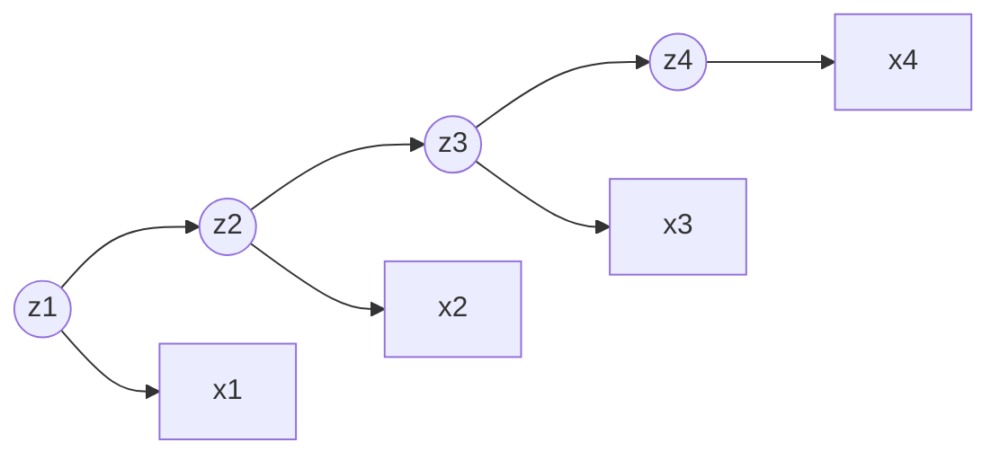
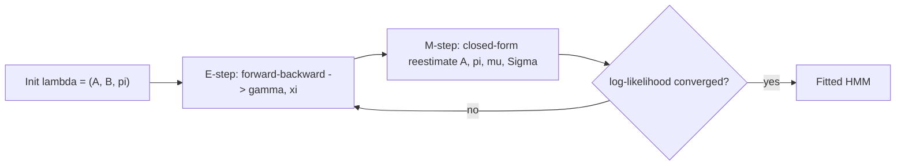

# Hidden Markov Models for Market Regimes: Formalism, Inference, and Failure Modes

## 1. The model

Let $\{z_t\}_{t=1}^{T}$ be a latent discrete-state Markov chain with $z_t \in \{1,\dots,K\}$, and let $\{x_t\}_{t=1}^{T}$ be the observations, $x_t \in \mathbb{R}^d$ (returns, realized volatility, or a joint vector). An HMM is the triple $\lambda = (A, B, \pi)$:

- **Initial distribution:** $\pi_i = P(z_1 = i)$, with $\sum_i \pi_i = 1$.
- **Transition matrix:** $A_{ij} = P(z_{t+1} = j \mid z_t = i)$, a row-stochastic $K \times K$ matrix ($\sum_j A_{ij} = 1$). Time-homogeneity is assumed.
- **Emission densities:** $b_i(x) = p(x_t = x \mid z_t = i)$. For return modelling the canonical choice is Gaussian, $b_i(x) = \mathcal{N}(x;\, \mu_i, \Sigma_i)$.

Two conditional-independence assumptions define the structure. The **Markov property** on the hidden chain, $P(z_t \mid z_{1:t-1}) = P(z_t \mid z_{t-1})$, and **observation independence**, $p(x_t \mid z_{1:T}, x_{-t}) = p(x_t \mid z_t)$. The directed graphical model is the chain:





These assumptions factorize the complete-data likelihood into

$$p(x_{1:T}, z_{1:T} \mid \lambda) = \pi_{z_1}\, b_{z_1}(x_1) \prod_{t=2}^{T} A_{z_{t-1} z_t}\, b_{z_t}(x_t).$$

Rabiner (1989) frames everything an HMM does as three problems: **evaluation** (likelihood of a sequence), **decoding** (most likely hidden path), and **learning** (parameter estimation).

## 2. Evaluation — the forward algorithm (derivation)

The likelihood marginalizes over all $K^T$ paths, $p(x_{1:T} \mid \lambda) = \sum_{z_{1:T}} p(x_{1:T}, z_{1:T} \mid \lambda)$, which is intractable by brute force. Define the **forward variable**

$$\alpha_t(i) := p(x_{1:t},\, z_t = i \mid \lambda).$$

*Initialization.* By definition $\alpha_1(i) = p(x_1, z_1 = i) = \pi_i\, b_i(x_1)$.

*Recursion.* Marginalize over the previous state and apply both independence assumptions:

$$
\begin{aligned}
\alpha_{t+1}(j) &= p(x_{1:t+1},\, z_{t+1}=j) = \sum_{i=1}^{K} p(x_{1:t+1},\, z_t=i,\, z_{t+1}=j)\\
&= \sum_{i=1}^{K} \underbrace{p(x_{1:t}, z_t=i)}_{\alpha_t(i)}\; \underbrace{P(z_{t+1}=j \mid z_t=i)}_{A_{ij}}\; \underbrace{p(x_{t+1} \mid z_{t+1}=j)}_{b_j(x_{t+1})}\\
&= \left[\sum_{i=1}^{K} \alpha_t(i)\, A_{ij}\right] b_j(x_{t+1}).
\end{aligned}
$$

The middle step uses $P(z_{t+1}=j \mid z_t=i, x_{1:t}) = A_{ij}$ (Markov) and $p(x_{t+1} \mid z_{t+1}=j, \text{past}) = b_j(x_{t+1})$ (emission independence).

*Termination.* $p(x_{1:T} \mid \lambda) = \sum_{i=1}^{K} \alpha_T(i)$.

This is $O(K^2 T)$ rather than $O(K^T)$. The symmetric **backward variable** $\beta_t(i) := p(x_{t+1:T} \mid z_t=i)$ satisfies $\beta_T(i)=1$ and

$$\beta_t(i) = \sum_{j=1}^{K} A_{ij}\, b_j(x_{t+1})\, \beta_{t+1}(j).$$

### Filtering vs. smoothing (this distinction is the whole backtest)

The **smoothed** posterior conditions on the entire sample:

$$\gamma_t(i) := P(z_t=i \mid x_{1:T}) = \frac{\alpha_t(i)\,\beta_t(i)}{\sum_{k} \alpha_t(k)\,\beta_t(k)}.$$

The **filtered** posterior conditions only on data up to $t$:

$$P(z_t=i \mid x_{1:t}) = \frac{\alpha_t(i)}{\sum_{k} \alpha_t(k)}.$$

A live or backtested decision at time $t$ **must** use the filtered quantity. The smoothed $\gamma_t(i)$ contains $\beta_t(i)$, which depends on $x_{t+1:T}$ — future information. Labelling history with $\gamma$ and then "trading" it is a textbook look-ahead leak (Section 5).

The pairwise smoothed posterior, needed for learning, is

$$\xi_t(i,j) := P(z_t=i, z_{t+1}=j \mid x_{1:T}) = \frac{\alpha_t(i)\, A_{ij}\, b_j(x_{t+1})\, \beta_{t+1}(j)}{p(x_{1:T} \mid \lambda)}.$$

## 3. Decoding — the Viterbi algorithm

The single most probable path, $z^\star_{1:T} = \arg\max_{z_{1:T}} P(z_{1:T} \mid x_{1:T})$, is *not* the sequence of per-step argmaxes of $\gamma_t$ (that can produce a path of probability zero if some transition is forbidden). Define the max-product recursion

$$\delta_t(i) := \max_{z_{1:t-1}} p(x_{1:t}, z_{1:t-1}, z_t=i),$$

with $\delta_1(i) = \pi_i b_i(x_1)$ and

$$\delta_{t+1}(j) = \Big[\max_{i}\, \delta_t(i)\, A_{ij}\Big]\, b_j(x_{t+1}), \qquad \psi_{t+1}(j) = \arg\max_{i}\, \delta_t(i)\, A_{ij}.$$

Terminate at $\arg\max_i \delta_T(i)$ and backtrack through $\psi$. In practice run it in log-space, $\log\delta_{t+1}(j) = \max_i[\log\delta_t(i) + \log A_{ij}] + \log b_j(x_{t+1})$, to avoid underflow.

## 4. Learning — Baum-Welch / EM (derivation sketch)

We want $\hat\lambda = \arg\max_\lambda p(x_{1:T} \mid \lambda)$. There is no closed form, so use expectation-maximization (Baum-Welch is EM specialized to HMMs). With latent $z$, EM iterates on the auxiliary function

$$Q(\lambda, \lambda^{\text{old}}) = \mathbb{E}_{z \sim p(\cdot \mid x, \lambda^{\text{old}})}\big[\log p(x_{1:T}, z_{1:T} \mid \lambda)\big].$$

By Jensen's inequality the log-likelihood increment is bounded below by the $Q$-increment,

$$\log p(x \mid \lambda) - \log p(x \mid \lambda^{\text{old}}) \;\ge\; Q(\lambda, \lambda^{\text{old}}) - Q(\lambda^{\text{old}}, \lambda^{\text{old}}),$$

so maximizing $Q$ never decreases the likelihood — EM ascends monotonically to a stationary point.

**E-step.** Compute $\gamma_t(i)$ and $\xi_t(i,j)$ under $\lambda^{\text{old}}$ via forward-backward.

**M-step.** Maximizing $Q$ subject to the stochastic constraints (Lagrange multipliers for the row sums) gives closed-form updates:

$$\hat\pi_i = \gamma_1(i), \qquad \hat A_{ij} = \frac{\sum_{t=1}^{T-1} \xi_t(i,j)}{\sum_{t=1}^{T-1} \gamma_t(i)}.$$

For **Gaussian emissions**, the M-step is a responsibility-weighted MLE:

$$\hat\mu_i = \frac{\sum_{t=1}^{T} \gamma_t(i)\, x_t}{\sum_{t=1}^{T} \gamma_t(i)}, \qquad \hat\Sigma_i = \frac{\sum_{t=1}^{T} \gamma_t(i)\,(x_t - \hat\mu_i)(x_t - \hat\mu_i)^\top}{\sum_{t=1}^{T} \gamma_t(i)}.$$

These are exactly the sufficient-statistic updates of a Gaussian mixture, with $\gamma_t(i)$ playing the role of the soft assignment. The loop:





Fitted on a return series, the model segments one price path into distinct hidden regimes:


```chart
hmm_regimes()
```


## 5. Where it breaks

**Look-ahead bias — two flavours.** (i) *Estimation leakage:* fitting $\lambda$ on the full sample and then labelling all of history uses future observations to explain the past. Backtests must re-estimate on an expanding or rolling window and use only filtered probabilities. (ii) *Smoothing leakage:* trading $\gamma_t$ instead of the filtered $P(z_t \mid x_{1:t})$. Both inflate in-sample regime accuracy and vanish out-of-sample.

**Gaussian emissions understate tails.** Returns are heavy-tailed and negatively skewed; a within-regime Gaussian assigns near-zero mass to the very moves that dominate P&L. The tail the Gaussian ignores versus a Student-$t$:


```chart
normal_vs_fat_tail(nu=2)
```

Remedies: Student-$t$ or mixture emissions, an explicit "stress/jump" state, or a GARCH-type conditional variance inside each regime. Otherwise a single crash gets absorbed into the calm regime and corrupts its $\hat\Sigma$.

**Non-identifiability and instability.**

- *Label switching:* regimes are identified only up to permutation; the "bull" index can swap between fits. Fix labels post hoc by ordering on $\hat\mu_i$ or $\hat\sigma_i$.
- *Local optima:* the likelihood surface is multimodal; EM is initialization-sensitive. Use multiple random restarts / k-means seeding and keep the best log-likelihood.
- *Choosing $K$:* penalize with BIC/AIC or out-of-sample likelihood. Excess states fragment into unstable micro-regimes.
- *Non-stationarity:* a time-homogeneous $A$ is a strong assumption; transition dynamics drift, so periodic refits or regime-switching models with time-varying transition probabilities (Diebold-Lee-Weinbach) may be needed.
- *Numerical underflow:* $\alpha_t$ decays geometrically; use the scaled forward-backward recursions or work in log-space.

**It is not a return forecaster.** The conditional mean $\hat\mu_i$ is small and statistically fragile relative to $\hat\sigma_i$. The robust signal is the *variance/covariance* structure, so HMMs earn their keep as **risk-context** tools — leverage scaling, stop tightening, strategy gating — not as directional predictors. This mirrors Hamilton's (1989) original Markov-switching model, where the value is characterizing expansions vs. contractions, not point-forecasting output.

## 6. Relation to continuous state-space models

The HMM is the discrete-state member of the state-space family. Its continuous-Gaussian analogue is the linear-Gaussian state-space model, where forward-backward becomes the **Kalman filter / RTS smoother** and the latent variable is a real vector rather than a categorical label. Same inference skeleton (predict-update, filter vs. smoother), different state space:


```chart
kalman_filter_demo()
```


## References & further reading

- Baum, L. E., Petrie, T., Soules, G., & Weiss, N. (1970). *A Maximization Technique Occurring in the Statistical Analysis of Probabilistic Functions of Markov Chains.* Ann. Math. Statist. 41(1). (The Baum-Welch algorithm.)
- Rabiner, L. R. (1989). *A Tutorial on Hidden Markov Models and Selected Applications in Speech Recognition.* Proc. IEEE 77(2). (The three-problems framing; forward-backward, Viterbi, Baum-Welch.)
- Viterbi, A. J. (1967). *Error Bounds for Convolutional Codes and an Asymptotically Optimum Decoding Algorithm.* IEEE Trans. Inf. Theory.
- Hamilton, J. D. (1989). *A New Approach to the Economic Analysis of Nonstationary Time Series and the Business Cycle.* Econometrica 57(2). (Markov regime-switching in economics/finance.)
- Dempster, A. P., Laird, N. M., & Rubin, D. B. (1977). *Maximum Likelihood from Incomplete Data via the EM Algorithm.* JRSS-B. (EM and the $Q$-function monotonicity.)
- Cappé, O., Moulines, E., & Rydén, T. (2005). *Inference in Hidden Markov Models.* Springer. (Rigorous, measure-theoretic treatment.)
- Bishop, C. M. (2006). *Pattern Recognition and Machine Learning*, Ch. 13. (Sum-product view of forward-backward.)
- Ang, A., & Timmermann, A. (2012). *Regime Changes and Financial Markets.* Annu. Rev. Financ. Econ. (Applications and cautions in finance.)
