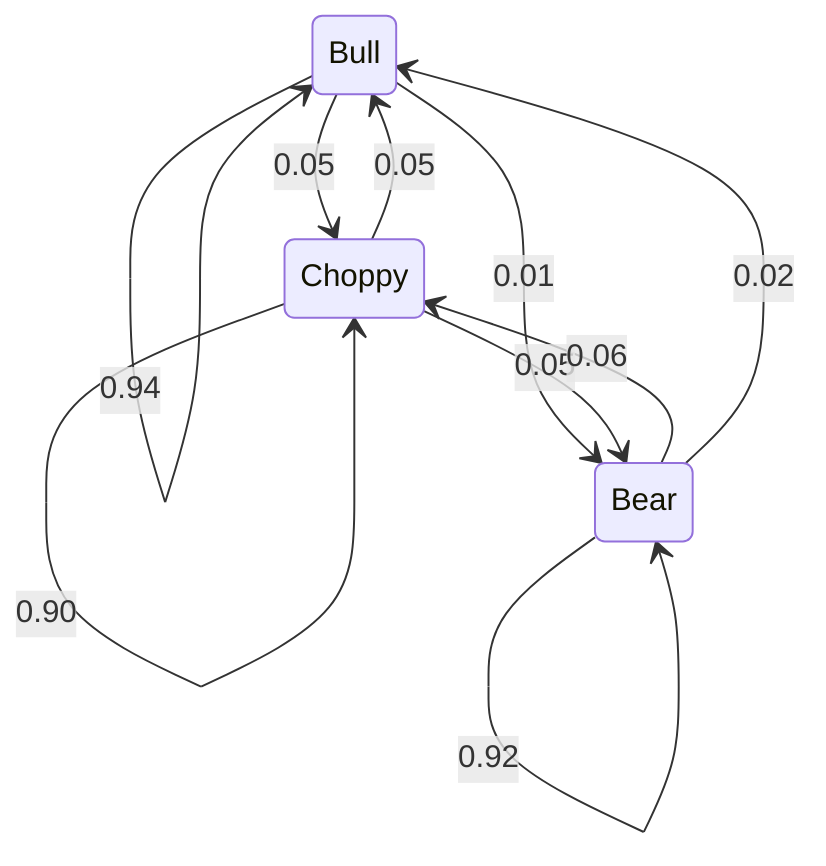
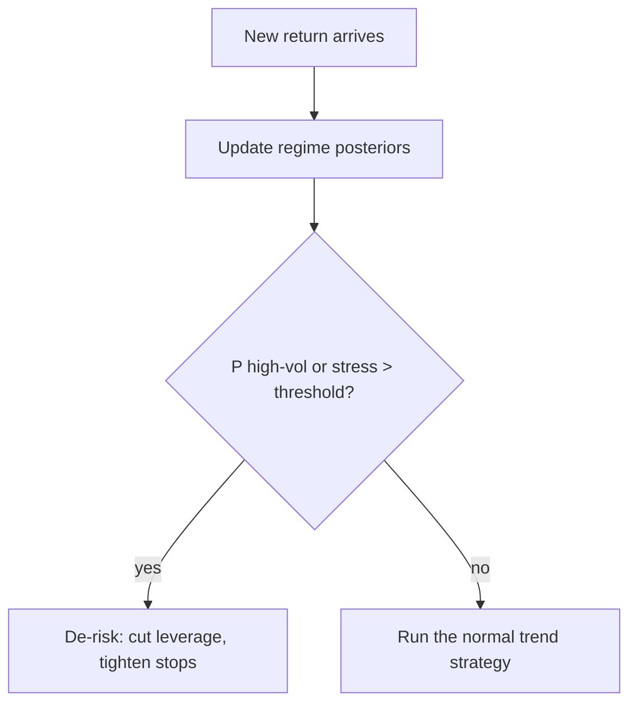

# Hidden Markov Models for Market Regimes

A Hidden Markov Model (HMM) assumes the market is always in one of a small number of **hidden regimes** — think *bull*, *bear*, and *choppy*, or simply *low-volatility* versus *high-volatility*. You never observe the regime directly. You observe prices and returns, and the HMM works backwards to estimate, for every day, the probability that the market was in each regime.

It turns a vague intuition — "volatility feels different lately" — into a concrete, updatable number.

## The core idea: two layers

Every HMM has two stacked layers. The top layer (the regime) is **hidden**; the bottom layer (returns, volatility, spreads) is **observed**. The hidden layer drives the observed one, but you only ever get to read the bottom row:


```ascii
 hidden:   [Bull] -> [Bull] -> [Choppy] -> [Bear] -> [Bear]   <- you CANNOT see this row
              |         |          |          |         |
              v         v          v          v         v
 observed:  +0.4%     +0.8%      -0.1%      -2.1%     -0.9%    <- returns you DO see
```


The whole game is inferring the top row from the bottom row.

## Key terms

- **Hidden state (regime):** the unobserved mode the market is in.
- **Observation:** what you actually measure — returns, realized volatility, spreads.
- **Transition probability:** the chance of moving from one regime to another between today and tomorrow.
- **Emission distribution:** how observations behave *inside* a given regime (e.g. returns are roughly Normal, but with a different mean and volatility per regime).
- **Posterior probability:** the probability you are in each regime *given the data you have seen*.

## The three moving parts

An HMM is fully specified by three ingredients:

1. **Initial distribution** $\pi$ — the probability of starting in each regime.
2. **Transition matrix** $A$ — where $A_{ij} = P(\text{tomorrow} = j \mid \text{today} = i)$. Because regimes are *sticky*, the diagonal entries are large: a bull market usually stays a bull market tomorrow.
3. **Emission distributions** — one per regime. A common choice is Gaussian: in regime $i$, returns are drawn from $\mathcal{N}(\mu_i, \sigma_i^2)$. The bear regime has a negative $\mu$ and a large $\sigma$; the choppy regime has $\mu \approx 0$ and small $\sigma$.

The transition matrix is easiest to picture as a state diagram. Notice how heavy the self-loops are — that stickiness is what lets the model tell a genuine regime apart from a one-day blip:





## Seeing regimes in a price path

Once fitted, the model paints every day with its most likely regime. One price series resolves into three coloured contexts — a bull drift, a bear slide, and a directionless choppy stretch:


```chart
hmm_regimes()
```


The emission distributions are where the model can quietly fail. Fitting a single Gaussian per regime assumes returns inside a regime are well-behaved, but real returns have **fat tails**: the rare, violent day lives far out where a Gaussian says it almost never should. If the model has no dedicated "stress" regime, those tail events get mis-attributed to the calm one:


```chart
normal_vs_fat_tail(nu=2)
```


### A sibling model

The HMM has a close cousin: the **Kalman filter**. Both recover a hidden state from noisy observations. The difference is that a Kalman filter tracks a *continuous* hidden level (like a slowly drifting "fair value"), whereas an HMM tracks a *discrete* hidden label (bull / bear / choppy). Same spirit — separate the signal from the noise:


```chart
kalman_filter_demo()
```


## Building a simple HMM

Following the recipe, an end-to-end model needs four decisions:

**1) Choose observations.** Common first choices: daily returns; realized volatility (rolling standard deviation); or both together as a 2-D observation.

**2) Choose the number of regimes.** Start with **2 or 3**. Two states: low-vol versus high-vol. Three states: calm / normal / stress. Too many states creates unstable "micro-regimes" that mean nothing out of sample.

**3) Fit the model.** The parameters — the transition matrix $A$ and each regime's emission parameters $(\mu_i, \sigma_i)$ — are learned from data by the **Baum-Welch** algorithm (an expectation-maximisation procedure). You give it the return series; it hands back $A$, $\pi$, and the emissions.

**4) Use the output.** Feed the posterior regime probabilities into rules, for example:

- "if $P(\text{high-vol}) > 0.7$, cut leverage in half"
- "if $P(\text{stress})$ is rising, tighten stop-losses and reduce position count"





## Common pitfalls

- **Regimes are model-dependent.** Different features (returns vs. volatility vs. spreads) produce different regimes. There is no single "true" regime labelling — only the one implied by your choices.
- **Emissions can be too thin.** Markets shift in ways a Gaussian emission cannot capture (fat tails, jumps). Consider heavier-tailed emissions or an explicit stress state.
- **An HMM is not a return predictor.** It is best used as a **risk and context** tool — sizing and de-risking — not as a crystal ball for tomorrow's direction.
- **Beware look-ahead.** For live trading, use only the *filtered* estimate (regime probability given data up to today). The prettier *smoothed* estimate peeks at future data and will flatter any backtest.

## Next step

Get a 2-state (low-vol / high-vol) model working end-to-end first. Then move to 3 states and add one simple rule: scale position size by the regime probability, rather than flipping strategies on and off completely.

## Key takeaways

- An HMM models a market as **hidden regimes** you infer from **observed** returns and volatility.
- It is defined by three parts: initial distribution $\pi$, a sticky transition matrix $A$, and per-regime **emission** distributions.
- Fit it with Baum-Welch, then read out **posterior** regime probabilities day by day.
- Use those probabilities to **adapt risk** (leverage, stops, sizing), not to predict direction.
- Watch for fat-tailed emissions, feature-dependent regimes, and **look-ahead bias** — use filtered, not smoothed, probabilities in live use.
