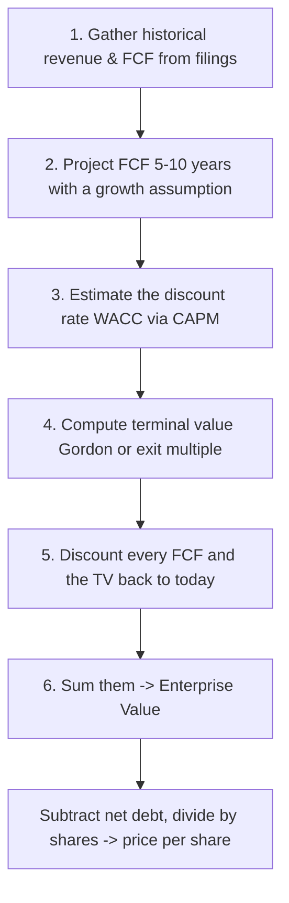

# The Discounted Cash Flow Model

## What is a DCF?

A **discounted cash flow (DCF)** model is an *intrinsic* valuation method: it values a company from its fundamentals — the cash it will generate — rather than from where its stock happens to trade today. In one line, a DCF measures the **present value of a company's future free cash flows**. The output is the company's **enterprise value (EV)**: the value of the whole business.

The engine underneath is a single idea — the time value of money — applied to a stream of projected cash flows.

## The time value of money

The foundation of every DCF is the saying, *"a dollar today is worth more than a dollar tomorrow."* Why?

Suppose a friend lends you \$1,000 at no interest, to be repaid in a year. Instead of leaving it idle, you buy a government bond yielding 5%. A year later you hand your friend back \$1,000 and keep the \$50 of interest. So \$1,000 today was worth the same as \$1,050 a year from now.

Run that backwards and you get **discounting**: to express next year's \$1,050 in today's dollars, divide by 1.05 to get \$1,000. The 5% you used is the **discount rate**. Pick a different opportunity — say the S&P 500 at ~7% — and the discount rate changes, and so does today's value of future cash.

## The building blocks

### Free cash flow (FCF)

A DCF usually projects **unlevered free cash flow (UFCF)** — the cash a business throws off from its core operations *before* paying any lenders. We use the unlevered figure because a DCF solves for enterprise value, which belongs to **both** debt and equity holders.

$$
UFCF = EBIT \times (1 - t) + DA - CapEx - \Delta NWC
$$

- **EBIT** — operating profit before interest and taxes
- **t** — tax rate
- **DA** — depreciation and amortization (non-cash, added back)
- **CapEx** — capital expenditures (cash spent on long-lived assets)
- **ΔNWC** — change in net working capital (current assets minus current liabilities)

### Discount rate (WACC)

Since a DCF discounts cash owed to both lenders and shareholders, the discount rate is the blended required return of both — the **weighted average cost of capital (WACC)**:

$$
WACC = r_d \cdot w_d + r_e \cdot w_e + r_p \cdot w_p
$$

where $r_d, r_e, r_p$ are the costs of debt, equity, and preferred stock, and $w_d, w_e, w_p$ are their weights in the capital structure. The cost of debt is roughly the interest rate the company pays. The cost of equity is estimated with the **capital asset pricing model (CAPM)**:

$$
r_e = r_f + \beta \cdot (r_m - r_f)
$$

- $r_f$ — risk-free rate
- $\beta$ — the stock's sensitivity to the market
- $(r_m - r_f)$ — the equity risk premium

### Terminal value

Companies are assumed to operate forever, but we can only sensibly project 5–10 years. The **terminal value (TV)** captures everything after the explicit forecast. Two standard methods:

$$
TV = EBITDA_n \times \text{Exit Multiple} \qquad\text{(exit-multiple method)}
$$

$$
TV = \frac{FCF_n \times (1 + g)}{r - g} \qquad\text{(Gordon growth method)}
$$

Here $g$ is a long-term growth rate — above inflation but below long-run GDP growth (a firm can't outgrow the whole economy forever). Use Gordon growth for stable, predictable businesses; use an exit multiple for high-growth firms where perpetual-growth assumptions are shaky.

## Putting it together

The full model is the sum of every discounted cash flow, plus the discounted terminal value:

$$
\text{DCF Value} = \sum_{t=1}^{n} \frac{FCF_t}{(1 + r)^t} + \frac{TV}{(1 + r)^n}
$$

The six steps, end to end:





Step 2 — the growth assumption — is where the real analysis lives. The market already prices in *its* expected growth; if you plug in the same numbers, your DCF will simply reproduce the market price. A DCF only signals "buy" or "sell" when your assumptions differ from consensus for a defensible reason — some edge in how you read the company or its industry.

Discounting turns big future cash flows into smaller present values. The bars below show projected FCF (future dollars) shrinking to their present value (today's dollars) as we move further out in time:


```chart
dcf_discounting(r=0.10, g=0.05)
```


## A worked mini-example — SampleCo Inc.

**Assumptions:** Revenue of \$100mm growing 8%/yr, a 25% EBITDA margin, a 21% tax rate, a 10% WACC, a 2.5% long-term growth rate, and 20mm shares outstanding.

**5-year unlevered FCF projection (\$mm):**

| | Year 1 | Year 2 | Year 3 | Year 4 | Year 5 |
|---|---|---|---|---|---|
| Revenue | 108 | 117 | 126 | 136 | 147 |
| EBITDA | 27 | 29 | 31 | 34 | 37 |
| Less: taxes | (6) | (6) | (7) | (7) | (8) |
| **Unlevered FCF** | **21** | **23** | **25** | **27** | **29** |
| **PV of FCF at 10%** | **19** | **19** | **19** | **18** | **18** |

**Terminal value (Gordon growth):**

$$
TV = \frac{FCF_5 \times (1 + g)}{WACC - g} = \frac{29 \times 1.025}{0.10 - 0.025} \approx 397
$$

Discounting that back five years: 397 ÷ (1.10 to the 5th) ≈ \$246mm.

**Valuation summary (\$mm):**

| | \$mm |
|---|---|
| Sum of PV of FCF | 93 |
| PV of terminal value | 246 |
| **Enterprise Value** | **≈ 340** |
| Shares outstanding (mm) | 20.0 |
| **Implied price per share** | **≈ \$16.99** |

SampleCo carries no debt, so its equity value equals its enterprise value. For a levered company you would first subtract **net debt** from EV to get equity value, *then* divide by shares:

$$
\text{Price Per Share} = \frac{EV - \text{Net Debt}}{\text{Shares Outstanding}}
$$

Notice the terminal value (\$246mm) is roughly **72%** of the whole valuation. That is typical — and it is exactly why a DCF is so sensitive to the terminal-value assumptions, as the sensitivity table shows.

**Sensitivity of price per share** (rows = WACC, columns = long-term growth $g$):

| WACC \ g | 1.0% | 2.0% | 3.0% | 4.0% |
|---|---|---|---|---|
| 8.0% | 19.19 | 21.73 | 25.28 | 30.61 |
| 9.0% | 16.71 | 18.54 | 20.99 | 24.42 |
| 10.0% | 14.79 | 16.16 | 17.93 | 20.29 |
| 11.0% | 13.25 | 14.31 | 15.64 | 17.34 |
| 12.0% | 11.99 | 12.83 | 13.86 | 15.14 |

A 4-percentage-point swing in either assumption moves the answer from about \$12 to about \$31 — a reminder that a DCF output is only as good as its inputs.

## How value and price relate

A DCF gives you **intrinsic value**. Market **price** wanders around that value, driven by sentiment — sometimes far above (a bubble), sometimes far below (a bargain) — before reverting. Value acts like a magnet:


```chart
price_value_convergence()
```


## Practical use and limitations

- **Long-term investors:** a DCF anchors a *fair value*, supports position sizing, and builds conviction to hold through volatility when price dips below your estimate of value.
- **Day traders:** treat a DCF as a contextual filter — *is this name fundamentally overextended?* — not a direct entry/exit trigger. Pair it with technical analysis.
- **Limitations:** the output is dominated by assumptions — growth rate, terminal value, and discount rate are all estimates. DCF struggles most for companies with volatile or inconsistent cash flows. It remains the most common intrinsic-valuation method precisely because, used honestly, it forces you to state what you actually believe about a business.

## Key takeaways

- A DCF values a company as the **present value of its future free cash flows**, and outputs enterprise value.
- The **discount rate (WACC)** converts future dollars into today's dollars; the cost of equity comes from **CAPM**.
- Project **unlevered FCF** for 5–10 years, then add a **terminal value** for everything after.
- **Terminal value usually dominates** the valuation, so the model is highly sensitive to $g$ and $r$.
- Enterprise value minus net debt, divided by shares, gives an intrinsic **price per share** — a fair-value anchor, not a trade signal by itself.

*Educational content, not investment advice.*
