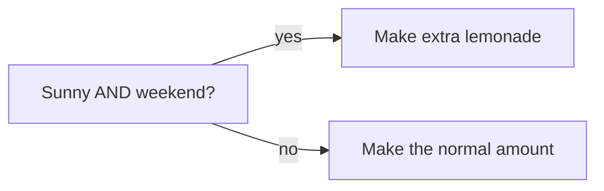

# The Robot That Always Follows the Rules 🤖

Imagine you run a lemonade stand. Some days you sell out in an hour. Other days you make way too much and it goes warm and flat. The big question is: **how do you know when to make EXTRA lemonade?**

There are two ways to decide. You can **guess with your gut** — "I just *feel* like today's a big day!" Or you can **write down a rule, test it, and follow it every time.** That second way is the secret behind something grown-ups call **quantitative trading** (or "quant" for short). It just means *making decisions with tested rules instead of feelings.*


```comic
{
  "title": "The Rule Robot",
  "panels": [
    {"emoji": "🍋", "caption": "You run a lemonade stand. Some days are packed, some are empty. When should you make EXTRA?", "bubble": "Hmm..."},
    {"emoji": "🤔", "caption": "Your friend guesses with her gut every day.", "bubble": "I FEEL lucky today!"},
    {"emoji": "✍️", "caption": "You try something smarter: you write down a RULE.", "bubble": "Sunny + weekend = make extra"},
    {"emoji": "📚", "caption": "You check your rule against a whole notebook of past days. Did sunny weekends really sell out?"},
    {"emoji": "✅", "caption": "Whoa — 9 out of 10 sunny weekends sold out! The rule has a real track record."},
    {"emoji": "🤖", "caption": "So you build a little robot that follows the rule every single day.", "bubble": "Rule says: make extra!"},
    {"emoji": "😌", "caption": "Grumpy days, tired days, excited days — the robot does the same careful thing. No feelings, no forgetting."},
    {"emoji": "🏆", "caption": "Write the rule. Test it on the past. Then let it run. That's quant trading!"}
  ]
}
```


## Why a robot beats a gut

Your gut is a great friend, but it has a problem: it changes with your mood. When you're excited you make too much lemonade. When you're grumpy you make too little. A **rule** doesn't have moods. It does the exact same thing every time — and that's what makes it something you can actually *test*.

Here's the whole idea in three steps:

1. **Write the rule down.** "If it's sunny AND a weekend, make extra." Now it's clear enough that a robot could do it.
2. **Test it on the past.** Look back at old days you already know the answer to. Did the rule work more often than not? If it flopped in the past, throw it away.
3. **Let it run.** If the rule earned its stripes, follow it every day — calmly, without arguing with it.





## One important warning

A tested rule is smart — but it's **not magic**. A rule that worked last summer might stop working if things change (maybe a new lemonade stand opens across the street!). So even the robot keeps checking: *is my rule still working?* If it stops, you fix it or make a new one.

That's really all quant trading is. Not a crystal ball, not a lucky feeling — just: **write down the rule, test it on the past, then let it run.** 🤖🍋
