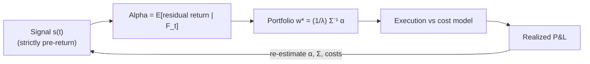

# Quantitative Trading: From Alpha to a Live Portfolio

Quantitative trading is the industrialization of a single object: a **forecast of residual return**, converted into positions, executed against a cost model, and continuously re-estimated. This note formalizes that pipeline, derives the statistics used to judge it (with attention to *estimation error*, which dominates practice), and marks the assumptions that break.

## 1. The pipeline, formally

Let asset $i$ at time $t$ have an excess return $r_{i,t}$. A **signal** (feature) $s_{i,t}$ is any $\mathcal{F}_t$-measurable quantity — crucially, measurable with information available *strictly before* the return it predicts (violating this is look-ahead bias). The **alpha** is the conditional forecast of the residual (market-/factor-neutralized) return,

$$\alpha_{i,t} = \mathbb{E}\!\left[\,\tilde r_{i,t+1} \mid \mathcal{F}_t\,\right], \qquad \tilde r = r - \beta^\top f,$$

where $f$ are the common factors and $\tilde r$ the residual. Given a covariance $\Sigma$ of residual returns and a risk-aversion $\lambda$, the mean–variance-optimal active weights solve

$$\mathbf{w}^\star = \arg\max_{\mathbf{w}} \;\mathbf{w}^\top\boldsymbol\alpha - \tfrac{\lambda}{2}\,\mathbf{w}^\top\Sigma\,\mathbf{w} \;\;\Longrightarrow\;\; \mathbf{w}^\star = \tfrac{1}{\lambda}\,\Sigma^{-1}\boldsymbol\alpha.$$

The maximal attainable (squared) information ratio of this portfolio is the quadratic form

$$\text{IR}^2 = \boldsymbol\alpha^\top \Sigma^{-1} \boldsymbol\alpha,$$

which is the multivariate generalization of "edge / risk." Everything downstream — sizing, execution, capacity — is about how much of this theoretical IR survives noise and frictions.





## 2. The Sharpe ratio and its estimation error (derivation)

The Sharpe ratio of a strategy with per-period excess return $r_t$ (i.i.d., mean $\mu$, variance $\sigma^2$) is $S = \mu/\sigma$. Practitioners never observe $S$; they observe the plug-in estimator $\hat S = \hat\mu/\hat\sigma$. Its sampling noise is the single most under-appreciated quantity in the field, so we derive it.

**Delta method.** Write $S = g(\mu, \sigma^2) = \mu\,(\sigma^2)^{-1/2}$. For i.i.d. returns with finite fourth moment, the sample moments are jointly asymptotically normal,

$$\sqrt{T}\begin{pmatrix}\hat\mu - \mu\\[2pt]\hat\sigma^2 - \sigma^2\end{pmatrix} \xrightarrow{d} \mathcal{N}\!\left(\mathbf 0,\; V\right),\qquad V = \begin{pmatrix}\sigma^2 & \mu_3\\[2pt]\mu_3 & \mu_4 - \sigma^4\end{pmatrix},$$

where $\mu_3, \mu_4$ are the third and fourth central moments. The gradient of $g$ is

$$\nabla g = \left(\frac{\partial S}{\partial \mu},\, \frac{\partial S}{\partial \sigma^2}\right) = \left(\frac{1}{\sigma},\; -\frac{\mu}{2\sigma^3}\right).$$

By the delta method $\sqrt{T}(\hat S - S) \xrightarrow{d} \mathcal N(0,\, \nabla g^\top V \nabla g)$. Under the Gaussian simplification $\mu_3 = 0,\ \mu_4 = 3\sigma^4$,

$$\nabla g^\top V \nabla g = \frac{1}{\sigma^2}\cdot\sigma^2 + \frac{\mu^2}{4\sigma^6}\cdot 2\sigma^4 = 1 + \frac{\mu^2}{2\sigma^2} = 1 + \tfrac{1}{2}S^2.$$

Hence

$$\boxed{\;\operatorname{Var}(\hat S) \approx \frac{1}{T}\left(1 + \tfrac{1}{2}S^2\right)\;}$$

(Lo, 2002). Two consequences bite hard. First, with $S=0$ the standard error is $\approx 1/\sqrt{T}$: over one year of daily data ($T\approx 252$) a *worthless* strategy still shows an annualized Sharpe of order $\sqrt{252}\cdot 1/\sqrt{252} = 1$ purely by chance. Second, the non-Gaussian terms $\mu_3, \mu_4$ *inflate* this variance for the fat-tailed, negatively-skewed return streams typical of real strategies, so the Gaussian formula is an optimistic lower bound.

## 3. The fundamental law of active management

How much IR can a strategy earn? Grinold's **fundamental law** decomposes it into skill and diversification:

$$\text{IR} \approx \text{IC}\cdot\sqrt{\text{BR}},$$

where the **information coefficient** IC is the cross-sectional correlation $\operatorname{corr}(\alpha_{i}, \tilde r_{i})$ between forecast and realized residual return, and the **breadth** BR is the number of *independent* bets per year.

**Heuristic derivation.** Model breadth as $N$ independent bets per period, each a standardized score $z_i$ with $\operatorname{corr}(z_i, \tilde r_i)=\text{IC}$. The refined forecast is $\alpha_i = \text{IC}\,\sigma\, z_i$ (regression of standardized return on score). Plugging into the achievable $\text{IR}^2 = \boldsymbol\alpha^\top\Sigma^{-1}\boldsymbol\alpha$ with independent unit-variance residuals gives, per period, $\text{IR}^2 \approx \sum_{i=1}^{N}\text{IC}^2 = N\,\text{IC}^2$, so $\text{IR}\approx \text{IC}\sqrt{N}$. Aggregating to an annual horizon replaces $N$ with annual breadth BR. The message is stark: a *tiny* per-bet skill compounds into a respectable IR only through **breadth**. An IC of 0.05 (explaining 0.25% of cross-sectional variance) needs $\text{BR}\approx 400$ independent bets to reach $\text{IR}=1$. This is why the same statistical edge becomes near-certain over many independent bets:


```chart
many_small_bets(edge=0.02)
```


The catch hidden in "independent": correlated bets inflate nominal breadth while adding little effective breadth, so $\Sigma^{-1}$ — not a raw count — is what actually governs IR.

## 4. Overfitting and multiple testing (the deflated Sharpe ratio)

Section 2 established that a single worthless strategy shows a noisy $\hat S$. Now search over $N$ candidate strategies and keep the best. The maximum of $N$ i.i.d. estimators with standard error $\hat\sigma_{\hat S}$ inherits the Gaussian extreme-value scaling

$$\mathbb{E}\!\left[\max_{1\le n\le N}\hat S_n\right] \approx \hat\sigma_{\hat S}\Big[(1-\gamma)\,\Phi^{-1}\!\big(1-\tfrac1N\big) + \gamma\,\Phi^{-1}\!\big(1-\tfrac1{Ne}\big)\Big] \sim \hat\sigma_{\hat S}\sqrt{2\ln N},$$

with $\gamma$ the Euler–Mascheroni constant (Bailey & López de Prado, 2014). Trying $N=1000$ null strategies yields a best in-sample Sharpe of roughly $\hat\sigma_{\hat S}\sqrt{2\ln 1000}\approx 3.7\,\hat\sigma_{\hat S}$ — an "excellent" backtest generated from pure noise. The **deflated Sharpe ratio** tests the observed $\hat S$ against exactly this multiple-testing benchmark (also correcting for skew, kurtosis, and sample length), reporting the probability the edge is real rather than the best draw from many trials. In-sample brilliance that evaporates out-of-sample is its signature:


```chart
backtest_overfit()
```


Operationally: track the *number of independent configurations tried* (the effective $N$), prefer walk-forward and combinatorial-purged cross-validation to a single hold-out, and deflate every reported Sharpe by the trials that produced it.

## 5. Transaction-cost-aware backtesting and capacity

A gross alpha is not a strategy; net alpha is. Let the strategy turn over a fraction $\tau$ of capital per period and let $c$ be the per-unit round-trip cost (commission + half-spread + slippage). Net expected return is

$$\alpha_{\text{net}} = \alpha_{\text{gross}} - c\,\tau,\qquad \text{SR}_{\text{net}} = \frac{\alpha_{\text{gross}} - c\,\tau}{\sigma}.$$

High-turnover signals (the ones that look best gross, because short-horizon predictability is strongest) are precisely the ones most exposed to $c\tau$. Costs are not a footnote; they routinely convert a positive gross edge into a negative net one:


```chart
slippage_costs()
```


**Capacity** adds a *convex* cost. Market impact scales sublinearly with participation — the widely-used square-root law gives per-trade impact $\approx Y\,\sigma\sqrt{Q/V}$ for order size $Q$, daily volume $V$, and a constant $Y=O(1)$. Since deployed capital $A$ pushes $Q\propto A$, cost per dollar grows like $\sqrt{A}$, so net alpha declines with size:

$$\alpha_{\text{net}}(A) \approx \alpha_{\text{gross}} - k\sqrt{A}.$$

The **capacity** is the AUM at which $\alpha_{\text{net}}(A)=0$, i.e. $A^\star \approx (\alpha_{\text{gross}}/k)^2$. Fast, high-IC signals typically have small $A^\star$; this is why the highest-Sharpe strategies (e.g. HFT market making) run comparatively modest capital, while low-Sharpe factor strategies absorb billions.

## 6. Where the model breaks

- **Non-stationarity.** $\mu, \sigma, \Sigma, \text{IC}$ all drift with regime; parameters fit in one regime are ruinous in another. The i.i.d. assumption underlying §2 fails, widening the true standard errors beyond the Gaussian formula.
- **Fat tails and skew.** Real return streams have $\mu_4 \gg 3\sigma^4$ and negative $\mu_3$; the Sharpe ratio (a two-moment summary) understates tail risk, and the delta-method variance is optimistic. Many "steady" strategies are short-volatility in disguise — they sell insurance and blow up in the tail.
- **Look-ahead & survivorship bias.** Point-in-time data hygiene is non-negotiable: restated fundamentals, index reconstitutions, and delisted names silently manufacture backtest alpha that never existed live.
- **Selection bias / multiplicity.** Per §4, the best backtest of many is upward-biased; naïve Sharpe reporting is a form of data dredging.
- **Crowding & alpha decay.** IC is not a constant of nature. As a signal is discovered and traded, its IC decays and its capacity shrinks; monitoring must treat the edge as a depreciating asset.

## References & further reading

- Grinold, R. C., & Kahn, R. N. (2000). *Active Portfolio Management* (2nd ed.). McGraw-Hill. (Fundamental law; IR, IC, breadth.)
- Sharpe, W. F. (1994). *The Sharpe Ratio.* Journal of Portfolio Management, 21(1).
- Lo, A. W. (2002). *The Statistics of Sharpe Ratios.* Financial Analysts Journal, 58(4). (Delta-method standard error.)
- López de Prado, M. (2018). *Advances in Financial Machine Learning.* Wiley. (Purged CV, backtest overfitting, feature importance.)
- Bailey, D. H., & López de Prado, M. (2014). *The Deflated Sharpe Ratio.* Journal of Portfolio Management, 40(5).
- Bailey, Borwein, López de Prado & Zhu (2014). *Pseudo-Mathematics and Financial Charlatanism.* Notices of the AMS. (Minimum backtest length under multiple testing.)
- Almgren, Thum, Hauptmann & Li (2005). *Direct Estimation of Equity Market Impact.* Risk. (Square-root impact law, capacity.)
