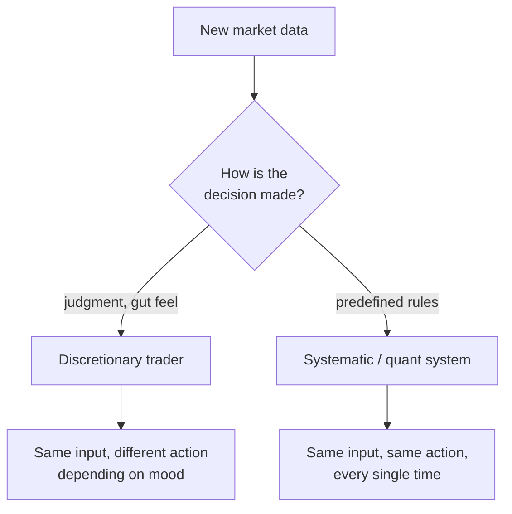
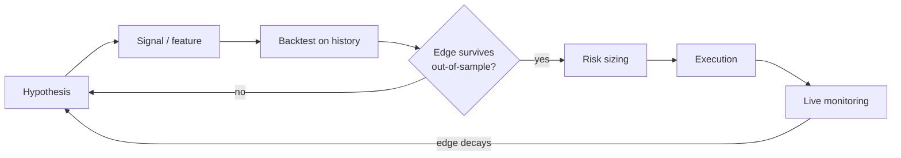

# Introduction to Quantitative Trading

## What quant trading actually is

**Quantitative trading** is a systematic, rules-based approach to markets: decisions come from mathematical models and statistical analysis rather than from human judgment on the day. The defining contrast is with **discretionary trading**, where a person weighs the situation and decides in the moment. A quant strategy is written down precisely enough that a computer can run it — and, crucially, precisely enough that you can *test* it on history before risking a cent.

That single property — the same inputs always produce the same action — is what makes everything else possible.





Rules-based execution buys you four things a discretionary trader struggles to get: it removes emotional bias, it makes historical performance measurable, it lets you predefine risk (position sizing and stops), and it scales — the same model can manage \$10,000 or \$10 million with the position sizes adjusted.

## Edge, not prediction

The most common misconception is that quants predict where the market is going. They mostly don't. Success does not require being right often; it requires a **statistical edge** — a positive expected value repeated over many trades.

Consider a system that wins only 40% of the time but whose average win is three times its average loss. Over 100 trades that expectation is:

(40 wins × \$3) − (60 losses × \$1) = +\$60

You are wrong more often than you are right and still make money. Formally, with win probability $p$, average win $W$, and average loss $L$ (both as positive "R" multiples of the risk), the expected profit per trade is

$$\mathbb{E}[\text{P\&L}] = p\,W - (1-p)\,L.$$

Any strategy with $\mathbb{E}[\text{P\&L}] > 0$ is worth trading — *if* you can size it so a losing streak doesn't ruin you. The distribution of individual trades often looks lopsided: many small losses, a few large wins, with the mean sitting just above zero.


```chart
win_loss_hist()
```


That small positive mean is "the edge." The entire job of quant research is to find edges that are real, and then to keep them alive after costs.

## The quant research workflow

Turning an idea into a live strategy follows a disciplined loop. Most ideas die somewhere in the middle of it — and that is the process working, not failing.





1. **Hypothesis.** Start from economics, market structure, or academic research. What inefficiency might this exploit, and *why* should it exist?
2. **Signal.** Turn the hypothesis into a concrete number computed from data — a moving-average crossover, a valuation ratio, a spread between two correlated assets.
3. **Backtest.** Replay the rules over history and measure performance: return, Sharpe ratio, maximum drawdown, win rate, profit factor.
4. **Out-of-sample validation.** Re-test on data you never touched during development. This is the honesty check that separates a genuine edge from a curve fit.
5. **Risk sizing.** Decide how much capital each signal gets, cap total portfolio risk, and set stops.
6. **Execution.** Route orders while controlling slippage and market impact — a great signal can be destroyed by sloppy fills.
7. **Monitoring.** Compare live results against the backtest. Edges decay as markets change and as other traders crowd in, so you watch for drift and retire strategies that stop working.

## Measuring an edge: the Sharpe ratio

Raw return is meaningless without the risk taken to get it. The standard yardstick is the **Sharpe ratio** — excess return per unit of volatility:

$$\text{SR} = \frac{\mathbb{E}[r] - r_f}{\sigma_r}.$$

Sharpe ratios are usually quoted annualized. If you measure daily returns, you scale by the square root of the number of trading days:

$$\text{SR}_{\text{annual}} = \sqrt{252}\;\text{SR}_{\text{daily}}.$$

As a rough industry feel: a long-run Sharpe near 1 is good, above 2 is excellent, and anything a backtest reports above 3–4 should make you *more* suspicious, not less — it usually signals a bug or overfitting rather than a goldmine.

## The number-one danger: overfitting

Given enough parameters and enough attempts, you can always find a rule that looks brilliant on past data. The catch is that it fit the *noise*, not a repeatable pattern — so it collapses the moment it meets new data.


```chart
backtest_overfit()
```


The blue in-sample curve is the seductive backtest; the red out-of-sample stretch is what actually happens live. The gap between them is the tax you pay for torturing history until it confesses. Defenses include holding out untouched data, walk-forward validation, penalizing complexity, and — most importantly — counting how many strategies you tried before you found "the good one." Testing 1,000 random rules and keeping the best guarantees an impressive-looking backtest even when *nothing* has an edge.

## What a real edge looks like

A genuine systematic strategy rarely produces a smooth ride. Many strategy families — momentum and trend-following especially — lose small amounts frequently and win big occasionally. The equity curve rises, but it is jagged and spends a lot of time in drawdown.


```chart
trend_equity_curve()
```


Sitting through those drawdowns without abandoning a tested rule is the discipline that systematic trading is designed to enforce. This is exactly where a rules-based system beats a discretionary one: the rule doesn't panic at the bottom.

## Common strategy families

- **Statistical arbitrage** (e.g. pairs trading): two historically cointegrated assets drift apart; you bet on the spread reverting. Risk: the relationship breaks permanently.
- **Market making**: continuously quote a bid and an ask and earn the spread across huge trade counts. Risk: adverse selection and inventory; demands very low latency.
- **Momentum**: buy recent winners, sell recent losers, rebalance periodically. Risk: sudden "momentum crashes" when trends reverse.
- **Mean reversion**: fade extreme moves back toward an average (e.g. buying the lower Bollinger Band). Risk: mistaking a permanent regime change for a temporary deviation.

Each exploits a different inefficiency, but the discipline is identical: form a hypothesis, quantify a signal, validate it honestly, and manage risk.

## Why most ideas fail

Markets are close to efficient, edges are small, and everyone is hunting the same ones. Between overfitting, transaction costs, regime changes, and crowding, the large majority of promising backtests never survive contact with live capital. Firms like Renaissance Technologies, Two Sigma, and D. E. Shaw succeeded not by finding one magic formula but by running this research loop with extreme rigor, thousands of times, and sizing each small edge carefully.

## Key takeaways

- Quant trading replaces in-the-moment judgment with **tested, rules-based decisions** — the same input always yields the same action.
- Profit comes from a positive-expected-value **edge over many trades**, not from predicting direction accurately.
- Judge performance by **risk-adjusted return** (Sharpe ratio), not raw return.
- The research loop is *hypothesis → signal → backtest → out-of-sample check → sizing → execution → monitoring*, and most ideas rightly die inside it.
- **Overfitting is the central enemy**: a backtest that looks too good usually is. Honest out-of-sample testing and counting your attempts are the antidotes.
- This is educational material, not investment advice.
