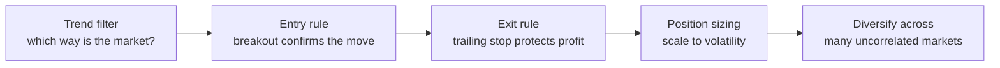

# Trend Following Systems

## Introduction

Trend following is a systematic trading approach that seeks to capture sustained price movements. Unlike methods that try to predict tops and bottoms, it focuses on **identifying an established trend and riding it**, while cutting losers quickly through disciplined exits. You give up the very start and the very end of every move in exchange for a rule you can actually follow.

## The Turtle Traders: proof that trading can be taught

In 1983, commodities trader **Richard Dennis** bet his partner William Eckhardt that trading was a teachable skill, not innate talent. To settle it, Dennis recruited 23 novices — from a professional gambler to a Dungeons & Dragons designer — and trained them for **two weeks**. They became known as the **Turtles**.

He handed them a complete, rule-based trend-following system:

- **Entry** on price breakouts — buy when price exceeds the highest high of the prior 20 or 55 days.
- **Position sizing** scaled to volatility (the $N$-value, essentially modern ATR-based sizing).
- **Exits** via trailing stops that lock in profit as the trend runs.
- **Risk control** capping loss at ~2% of capital per trade.

Over the next four years the Turtles collectively earned more than **\$175 million**, with several posting annual returns above 100%. The lesson wasn't a secret indicator — it was **discipline**: the most successful Turtles were simply the ones who followed the rules most faithfully, especially through losing streaks and across many **uncorrelated markets**.

## Core principle: enter late, exit late, on purpose

The goal is *not* to nail the exact turn. Traders wait for clear evidence a trend exists before committing, accepting that they will:

- **miss the initial move** while waiting for confirmation, and
- **give back some profit** at the end while waiting for a reversal signal.

The uncomfortable truth: **most trades lose.** Typically **60–70% of trend-following trades are losers**, because markets chop sideways, breakouts turn out false, and small wiggles hit stops before a real trend develops. The system survives because the **30–40% of trades that catch genuine trends win big enough** to more than pay for all the small losses.

> **The math in one line:** if 70% of trades lose ~\$100 each but 30% gain ~\$400 each, the system is profitable overall. Per 10 trades: $7(-\$100) + 3(+\$400) = -\$700 + \$1{,}200 = +\$500$.

That asymmetric payoff — a fat cluster of small losses and a thin tail of large wins — is the whole engine:

```chart
win_loss_hist()
```

## Building the system: four components

A complete trend-following system is a pipeline of four decisions:



### 1. Trend filter

The filter sets directional bias — long, short, or flat. It needn't be fancy; a **dual moving-average** system usually suffices. When the **50-day** MA crosses **above** the **200-day** MA (a "golden cross"), treat the market as an uptrend; a cross below (a "death cross") flags a downtrend.

```chart
ema_crossover(fast=50, slow=200)
```

### 2. Entry rules

The filter tells you *which direction* to look; the actual entry waits for a **breakout** that confirms momentum is on your side.

- **Long:** trend filter is up **AND** price breaks above the highest high of the past 50 days.
- **Short:** trend filter is down **AND** price breaks below the lowest low of the past 50 days.

### 3. Exit rules

Since we can't know a trend has ended until price turns against us, exits inevitably sacrifice a little profit. A **trailing stop** solves this: it ratchets up with favorable price action and exits when the market retraces a preset amount.

**Example:** trail the stop **3 ATR** below the highest price since entry. You stay in while the trend runs, and step out once it pulls back by that much:

```ascii
 price
   |                 peak since entry
   |                   ● . . . . . . .  <- stop trails 3·ATR below
   |               __/ \__
   |             _/       \___● exit (price retraced to the stop)
   |           _/
   |      ____/  entry (breakout)
   +---------------------------------------> time
```

### 4. Position sizing

Sizing converts a signal into a share/contract count, scaling **inversely to volatility** so every position risks a comparable amount:

$$\text{Position Size} = \frac{\text{Risk Amount}}{\text{ATR} \times \text{ATR Multiplier}}$$

**Worked example:** if a stock's ATR is \$5 and your maximum acceptable risk per trade is \$50, then

$$\text{Size} = \frac{\$50}{\$5} = 10 \text{ contracts}.$$

More volatile asset → wider expected swing → **smaller** position. This equalizes risk across very different instruments.

## Putting it together: the equity curve

Chain these components across many trades and the account value looks jagged but rises: a long series of **small losses and shallow drawdowns**, punctuated by a few **large winners** that lift the curve to new highs.

```chart
trend_equity_curve()
```

## The power of diversification

Trading many **uncorrelated** instruments is the single biggest lever on smoothness. Because different markets trend at different times, losses in one are offset by gains in another, and portfolio-wide volatility falls **even though each position's volatility is unchanged**. A system run across 10–20 uncorrelated markets holds a far smoother equity curve than the same rules on just 2–3:

```chart
diversification_smoothing()
```

## Practical considerations

**Risk management**

- Never risk more than 1–2% of capital on any single position.
- Monitor total **portfolio heat** (the sum of all open position risks), not just single trades.
- Re-size as volatility changes; hold discipline through inevitable drawdowns.

**Timeframe** — short-term (daily/intraday, many signals), medium (weekly), or long-term (monthly, fewer but larger moves). Match it to your capital and psychological tolerance for holding.

**Performance metrics**

- **Profit Factor** = gross profit ÷ gross loss — should exceed ~1.5.
- **Average Win / Average Loss ratio** — should typically exceed 2:1.
- **Maximum Drawdown** — the worst peak-to-trough decline.
- **Recovery Factor** = net profit ÷ maximum drawdown.

## A note on machine learning

Traditional filters use hard-coded indicators (moving-average crossovers, breakout channels). Machine learning can *augment* the trend filter rather than replace it — for example, a **Hidden Markov Model (HMM)** can label the market's latent regime (trending vs. choppy) and suppress trend signals during sideways chop, where whipsaw losses cluster. This is regime detection, not prediction of price: the underlying discipline — confirmed entries, trailing stops, volatility sizing, diversification — stays exactly the same.

## Key takeaways

- Trend following **rides established trends** instead of predicting turns; you deliberately miss the top and bottom.
- **Most trades lose** (60–70%); the system wins because a few large trend captures dwarf the many small losses.
- The four components are **trend filter → entry breakout → trailing-stop exit → volatility sizing**.
- **Diversifying across uncorrelated markets** smooths the equity curve without lowering per-market risk.
- Judge the system by **profit factor, win/loss ratio, and drawdown** — not by win rate.
