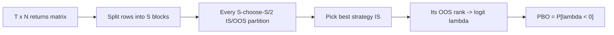
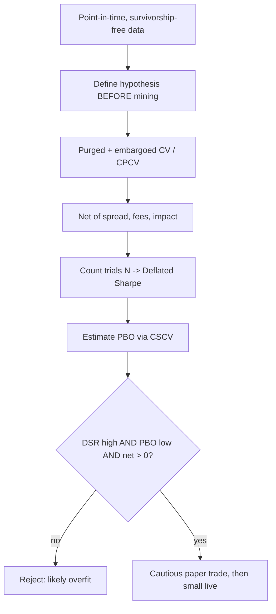

# Backtest Overfitting: Why In-Sample Sharpe Lies

## 1. The problem, stated properly

A backtest is an estimator of a strategy's out-of-sample performance functional. The failure mode that dominates quantitative finance is not a single biased run but **selection under multiplicity**: a researcher does not report one strategy, they report the *best* of many trials. Under that selection operator, the in-sample Sharpe ratio is an upward-biased estimator of the true Sharpe, and the bias grows with the number of configurations tried. This section makes that precise, then develops the deflated-Sharpe and probability-of-backtest-overfitting (PBO) corrections and the cross-validation machinery (purging, embargoing) that keeps the estimate honest.

Throughout, let a strategy produce per-period excess returns $\{r_t\}_{t=1}^T$ with sample mean $\hat\mu$ and sample standard deviation $\hat\sigma$, and define the estimated Sharpe ratio $\widehat{SR} = \hat\mu/\hat\sigma$ (per period; annualize by $\sqrt{f}$ for frequency $f$).

## 2. The sampling distribution of the Sharpe ratio

For i.i.d. returns, the delta method (Lo, 2002) gives the asymptotic variance of the Sharpe estimator:

$$\mathrm{Var}\big(\widehat{SR}\big) \approx \frac{1}{T}\left(1 + \tfrac{1}{2}SR^2\right).$$

With non-normal returns the correction involves skewness $\gamma_3$ and kurtosis $\gamma_4$ (Mertens; Bailey–López de Prado):

$$\mathrm{Var}\big(\widehat{SR}\big) \approx \frac{1}{T-1}\left(1 - \gamma_3\, SR + \frac{\gamma_4 - 1}{4}SR^2\right).$$

So a single backtest already has a wide confidence interval — at $T = 250$ trading days and $SR \approx 0$, the standard error of the *annualized* Sharpe is of order one. Two years of daily data cannot distinguish a Sharpe of 0 from a Sharpe of 1 at conventional significance. This is the substrate on which selection bias does its damage.

## 3. Derivation: in-sample Sharpe is biased up under selection

**Claim.** Suppose we run $N$ strategy configurations, all with *zero* true edge, and select the one with the highest backtest Sharpe. The selected Sharpe has strictly positive expectation that grows without bound in $N$.

**Setup.** Under the null $SR_n = 0$ for all $n$, and from §2 each estimator is approximately Gaussian, $\widehat{SR}_n \sim \mathcal{N}(0, V)$ with $V = \mathrm{Var}(\widehat{SR})$. Take the $N$ trials independent (the general case only rescales $N$ to an *effective* number of independent trials). Writing $\widehat{SR}_n = \sqrt{V}\,Z_n$ with $Z_n \overset{\text{iid}}{\sim} \mathcal{N}(0,1)$, selection returns

$$\widehat{SR}^\ast \;=\; \max_{1\le n\le N} \widehat{SR}_n \;=\; \sqrt{V}\,\max_{n} Z_n .$$

**Extreme-value asymptotics.** For $N$ i.i.d. standard normals,

$$\mathbb{E}\big[\max_n Z_n\big] \;=\; \sqrt{2\ln N}\,\big(1 + o(1)\big),$$

and more accurately, Bailey & López de Prado approximate the expected maximum by interpolating two quantiles with the Euler–Mascheroni constant $\gamma \approx 0.5772$:

$$\mathbb{E}\big[\max_n Z_n\big] \;\approx\; (1-\gamma)\,\Phi^{-1}\!\Big(1 - \tfrac{1}{N}\Big) \;+\; \gamma\,\Phi^{-1}\!\Big(1 - \tfrac{1}{N e}\Big).$$

**Conclusion.** Therefore

$$\mathbb{E}\big[\widehat{SR}^\ast\big] \;\approx\; \sqrt{V}\,\sqrt{2\ln N} \;>\; 0 \quad\text{even though every true } SR_n = 0.$$

The "best strategy" exhibits a Sharpe of order $\sqrt{V}\sqrt{2\ln N}$ purely from mining. Reporting $\widehat{SR}^\ast$ against the naive benchmark $SR_0 = 0$ therefore massively overstates significance: the correct null is not zero, it is the *expected maximum under multiplicity*. Concretely, with $N=1000$ trials, $\mathbb{E}[\max_n Z_n]\approx 3.2$, so a backtest Sharpe of "3 standard errors" is exactly what pure noise produces after a thousand tries.

The same phenomenon, drawn as an equity curve: a mined in-sample fit that reverts to a random walk once the data is new.


```chart
backtest_overfit()
```


And as the bias–variance U — the "best" configuration sits past the point where added complexity stops buying genuine edge:


```chart
overfitting_curve()
```


## 4. The Deflated Sharpe Ratio (DSR)

Bailey & López de Prado replace the zero benchmark with the selection-adjusted threshold. Let $\widehat{SR}_0$ be the **expected maximum Sharpe under the null**, obtained by feeding the cross-sectional dispersion of the trial Sharpes, $\sigma(\{\widehat{SR}_n\})$, into the extreme-value formula of §3:

$$\widehat{SR}_0 \;=\; \sigma\big(\{\widehat{SR}_n\}\big)\left[(1-\gamma)\,\Phi^{-1}\!\Big(1-\tfrac{1}{N}\Big) + \gamma\,\Phi^{-1}\!\Big(1-\tfrac{1}{Ne}\Big)\right].$$

The **Deflated Sharpe Ratio** is the probability that the observed Sharpe exceeds this benchmark, given the higher moments and sample length:

$$\mathrm{DSR} \;=\; \Phi\!\left(\frac{\big(\widehat{SR} - \widehat{SR}_0\big)\sqrt{T-1}}{\sqrt{\,1 - \gamma_3\,\widehat{SR} + \tfrac{\gamma_4 - 1}{4}\,\widehat{SR}^2\,}}\right).$$

DSR shrinks toward $0.5$ (no evidence) as (i) the number of trials $N$ rises, (ii) the track record $T$ shortens, (iii) returns are negatively skewed, or (iv) they are fat-tailed. It converts "a great backtest" into "a great backtest *adjusted for how hard you looked*." The practical obstacle is $N$: researchers rarely count their trials, and correlated variants make the *effective* $N$ smaller than the raw count — which motivates a resampling approach that needs no trial count at all.

## 5. Probability of Backtest Overfitting (PBO) via CSCV

Bailey, Borwein, López de Prado & Zhu define overfitting operationally: a procedure is overfit if the configuration selected as best **in-sample** tends to underperform the **median** out-of-sample. Combinatorially-Symmetric Cross-Validation (CSCV) estimates this without distributional assumptions:

1. Stack the $T\times N$ matrix of per-period returns for all $N$ trials.
2. Partition the $T$ rows into $S$ disjoint contiguous blocks ($S$ even).
3. For each of the $\binom{S}{S/2}$ ways to split blocks into an in-sample (IS) half and its complementary out-of-sample (OOS) half:
   - pick $n^\ast = \arg\max_n \widehat{SR}_n^{\,\mathrm{IS}}$;
   - find the OOS rank of $n^\ast$, and form its relative rank $\omega \in (0,1)$;
   - record the logit $\lambda = \ln\!\dfrac{\omega}{1-\omega}$.
4. Then

$$\mathrm{PBO} \;=\; \mathbb{P}\big[\lambda < 0\big] \;=\; \mathbb{P}\big[n^\ast \text{ ranks below the OOS median}\big],$$

estimated as the fraction of splits with $\lambda<0$. A well-specified research process has PBO near zero; PBO near $0.5$ means the in-sample winner is essentially a coin flip out-of-sample — the backtest carries no predictive content. The symmetry (every block serves in both IS and OOS across the split family) is what makes the estimate robust to which particular period you happened to hold out.





## 6. Purged and embargoed cross-validation

Standard $k$-fold CV assumes i.i.d. observations. Financial labels violate this: a label at time $t$ is often built from information over a horizon $[t, t+h]$ (e.g. a forward return, or a triple-barrier label), and features are built from *trailing* windows. Naively splitting then leaks information across the train/test boundary in two ways, both inflating measured performance.

- **Purging.** Remove from the training set every observation whose label-formation interval overlaps the interval spanned by the test set. Formally, drop train point $i$ if $[t_i, t_i + h_i]$ intersects any test interval $[t_j, t_j + h_j]$. This eliminates the overlap that would let the model "see" a test-period outcome through a shared window.
- **Embargoing.** Even after purging, serial correlation leaks across the boundary because features are trailing-windowed. Impose an **embargo**: additionally drop the first $h$ (or a fraction of the fold length) training observations *following* each test set, breaking the autocorrelation bridge.

The walk-forward scheme is the causal special case — train strictly on the past, test on the immediate future, roll forward — and it never trains on data later than the test window:


```chart
walk_forward_cv()
```


Combinatorial Purged CV (CPCV) generalizes walk-forward: it forms multiple purged-and-embargoed train/test paths, yielding many out-of-sample estimates instead of one, and hence a *distribution* of Sharpes rather than a point — the raw material PBO consumes.

## 7. Cost-aware evaluation

Selection bias inflates the *gross* Sharpe; costs then decide whether anything survives. Let $\tau$ be per-period turnover (fraction of capital traded) and $c$ the all-in cost per unit turnover (half-spread + commission + impact). Net return is

$$r_t^{\text{net}} \;=\; r_t^{\text{gross}} \;-\; c\,\tau_t, \qquad \widehat{SR}^{\text{net}} \;=\; \frac{\mathbb{E}[r^{\text{gross}}] - c\,\mathbb{E}[\tau]}{\sigma(r^{\text{net}})}.$$

The **break-even cost** $c^\ast = \mathbb{E}[r^{\text{gross}}]/\mathbb{E}[\tau]$ is often the single most diagnostic number in a backtest: if realistic costs approach $c^\ast$, the edge is illusory regardless of how clean the gross curve looks. Impact is typically modeled as concave in trade size, $\Delta \propto \sigma\,(v/V)^{\alpha}$ with $\alpha \in [1/2, 1]$ (participation $v/V$, volatility $\sigma$), so **capacity** and turnover are coupled: doubling capital more than doubles impact cost. High-turnover strategies are precisely those where an overfit gross edge is most easily manufactured and most quickly destroyed.


```chart
slippage_costs()
```


A further trap: costs interact with fat tails. Kelly-style sizing and Sharpe both assume finite, well-estimated variance; heavy tails make the realized cost of forced liquidation during a drawdown far larger than the Gaussian model implies.


```chart
normal_vs_fat_tail(nu=2)
```


## 8. A disciplined protocol



The through-line of every correction above is the same: an honest backtest reports performance *conditioned on the search that produced it*. The naive Sharpe ignores that conditioning; DSR, PBO, and purged CV restore it.

## References & further reading

- Bailey, D. H., & López de Prado, M. (2014). *The Deflated Sharpe Ratio: Correcting for Selection Bias, Backtest Overfitting, and Non-Normality.* Journal of Portfolio Management.
- Bailey, D. H., Borwein, J., López de Prado, M., & Zhu, Q. J. (2014/2017). *The Probability of Backtest Overfitting.* Journal of Computational Finance. (CSCV / PBO framework.)
- Bailey, D. H., Borwein, J., López de Prado, M., & Zhu, Q. J. (2014). *Pseudo-Mathematics and Financial Charlatanism: The Effects of Backtest Overfitting on Out-of-Sample Performance.* Notices of the AMS.
- López de Prado, M. (2018). *Advances in Financial Machine Learning.* Wiley. (Purged & embargoed CV, CPCV, feature-importance, meta-labeling.)
- Arnott, R., Harvey, C. R., & Markowitz, H. (2019). *A Backtesting Protocol in the Era of Machine Learning.* Journal of Financial Data Science.
- Harvey, C. R., & Liu, Y. (2015). *Backtesting.* Journal of Portfolio Management. (Haircut Sharpe under multiple testing.)
- Harvey, C. R., Liu, Y., & Zhu, H. (2016). *…and the Cross-Section of Expected Returns.* Review of Financial Studies. (Multiple-testing thresholds for factors.)
- Lo, A. W. (2002). *The Statistics of Sharpe Ratios.* Financial Analysts Journal.
