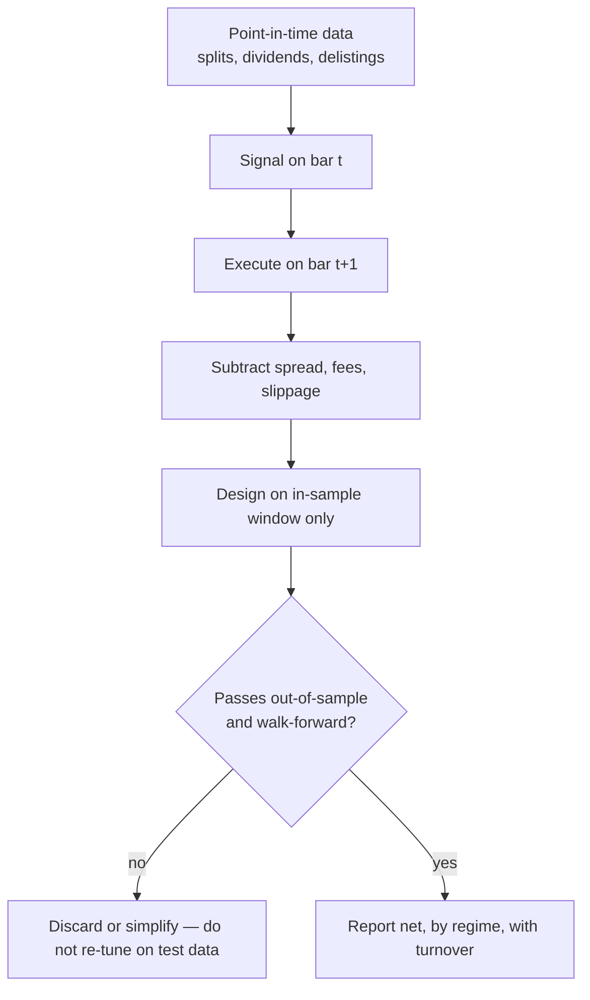

# Backtesting Basics (What New Quants Miss)

## Introduction

A **backtest** replays a trading rule over historical data to estimate how it *would have* performed. Done honestly, it is the cheapest way to reject a bad idea before risking capital. Done carelessly, it is a machine for generating beautiful equity curves that evaporate the moment real money is on the line.

The uncomfortable truth: backtests are easy to run and even easier to fool yourself with. The polish of a chart tells you nothing about whether the result is *real*. This article is a checklist of the failure modes that separate a believable backtest from a fantasy.

## What a backtest actually is

At each historical bar you (1) compute a **signal** from information available *at that instant*, (2) turn the signal into a **position**, (3) apply realistic **costs**, and (4) accumulate the resulting profit and loss into an **equity curve**. Every bias below is a leak somewhere in that loop — usually information from the future sneaking backward, or costs quietly going missing.

## The classic biases

### 1. Look-ahead bias

Using information in the backtest that was not available at the time. The signal computed on bar *t* must execute on bar *t+1* (or later), unless you can *prove* same-bar execution was possible. The most common leaks:

- Trading on a day's close using that same close (you don't know the close until the bar is over).
- Using a fundamental figure on its report date instead of its *release* date (earnings are known weeks after quarter-end).
- Restating or survivorship-adjusting data with values only finalized later.


```ascii
  bar t (compute)         bar t+1 (execute)
  ┌──────────┐            ┌──────────┐
  │  close   │ ─ signal ─▶│   open   │   built on t's close,
  └──────────┘            └──────────┘   TRADED at t+1's open
     ▲ legal: use only info sealed by end of bar t
     ✗ illegal: use bar t's close to trade bar t's close
```


### 2. Survivorship bias

Testing only the assets that *survived* to today — for example, running a strategy on the current index members. The delisted, merged, and bankrupt names are silently excluded, so your universe is pre-filtered for success. A "buy the dip" rule looks brilliant if the companies that dipped and never recovered were quietly removed from the data. Use a **point-in-time** universe that contains every asset that was tradable *on each historical date*, dead ones included.

### 3. Data-snooping / overfitting

Tuning rules to noise. If you try enough parameter combinations, some will fit the past perfectly by luck — and collapse out-of-sample. The in-sample curve soars; the live curve rolls over the instant the data is new.


```chart
backtest_overfit()
```


The more knobs you turn and the more variants you test, the more the "best" result reflects chance rather than edge. This is the bias–variance tradeoff in disguise: past a point, added complexity buys in-sample fit and *loses* out-of-sample performance.


```chart
overfitting_curve()
```


### 4. Ignoring costs and slippage

A gross edge is not a net edge. Every real trade pays the bid/ask spread, commissions, and market impact, and fills rarely land at the price you modeled (**slippage**). High-turnover strategies are the most fragile: a signal that looks profitable at zero cost can be underwater once realistic frictions are subtracted.


```chart
slippage_costs()
```


At minimum, model the bid/ask spread (or a proxy), fees/commissions, and some market-impact term — even a crude impact model beats assuming zero.

## Honest practices

The antidote to all four biases is disciplined validation on data the model never saw during design.

- **Out-of-sample testing.** Split history into a design set and a locked-away test set. You only get to look at the test set *once*, at the end. Every peek burns it.
- **Walk-forward validation.** Repeatedly train on a past window and test on the *next* window, then roll forward. Training data always precedes test data, so you never train on the future.


```chart
walk_forward_cv()
```


- **Report by regime.** Break performance out by bull/bear/high-volatility periods, not just the aggregate. A strategy that only worked in one regime is a bet on that regime repeating.
- **Track turnover.** High turnover usually means high costs and fragility; watch it as a first-class metric.

An honest workflow keeps design and evaluation strictly separated in time:





## The checklist

**Data integrity** — Are prices adjusted for splits and dividends? How are missing bars handled? Are you mixing trading calendars (crypto trades weekends, equities don't)?

**Time alignment** — Signal on bar *t* executes on bar *t+1*. Be explicit about when each feature (e.g. close-to-close returns) actually becomes available.

**Costs and slippage** — Include spread, fees, and a market-impact term. Zero cost is never the right default.

**Position sizing and risk** — Great signals fail with bad sizing. Use volatility scaling (ATR or realized vol) so risk stays stable across instruments, cap exposure and drawdown, and remember: a strategy that can blow up is not a strategy.

**Validation** — Train/validation/test or walk-forward; report by regime; track turnover.

## A simple "good enough" first backtest

Start minimal and *correct*, then add complexity only once the pipeline is trustworthy:

- Daily bars
- Next-day open execution (no same-bar peeking)
- Fixed spread + fee model
- One signal + one risk rule (e.g. volatility sizing)

Once this pipeline is correct, you can add complexity safely — never before.

## Key takeaways

- A backtest estimates *would-have* performance; its polish says nothing about whether the result is real.
- **Look-ahead bias** leaks future information backward — enforce a strict signal-on-*t*, execute-on-*t+1* rule.
- **Survivorship bias** hides the losers — use a point-in-time universe that includes delisted names.
- **Overfitting** fits noise — the in-sample curve is not evidence until it survives out-of-sample and walk-forward tests.
- **Costs and slippage** turn gross edges into net losses — model them, and watch turnover.
- The honest core is simple: design on data the model never saw, and only grade it once.
